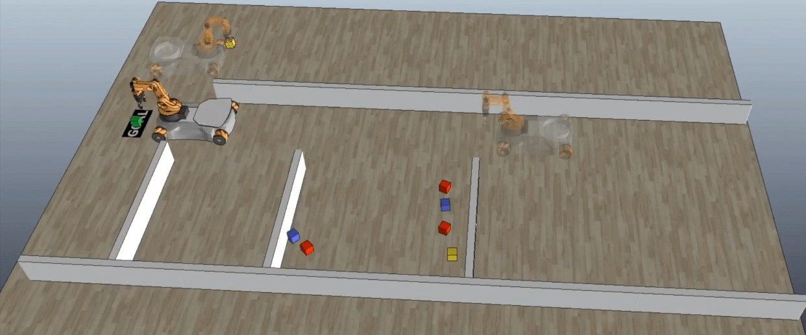
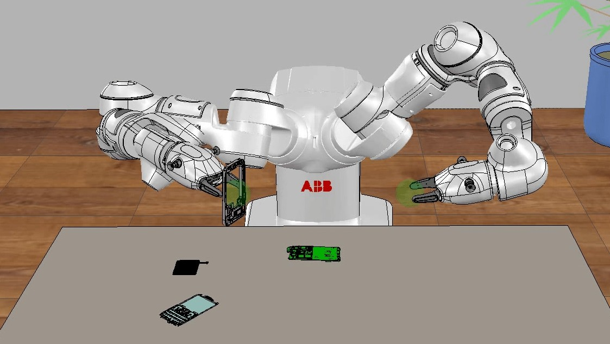

---
tip: translate by openai@2023-06-07 22:05:13
...
{width="1.0042825896762904in" height="0.12749890638670167in"}


See discussions, stats, and author profiles for this publication at: [https://www.researchgate.net/publication/319463746](https://www.researchgate.net/publication/319463746_Behavior_Trees_in_Robotics_and_AI_An_Introduction?enrichId=rgreq-02f2f10a6f0883ed7d7ed7c736dac00b-XXX&enrichSource=Y292ZXJQYWdlOzMxOTQ2Mzc0NjtBUzo1ODU5OTMwNDg1NTk2MTZAMTUxNjcyMzAzODE0Mg%3D%3D&el=1_x_2&_esc=publicationCoverPdf)

> 查看有关此出版物的讨论、统计信息和作者资料：[https://www.researchgate.net/publication/319463746](https://www.researchgate.net/publication/319463746_Behavior_Trees_in_Robotics_and_AI_An_Introduction?enrichId=rgreq-02f2f10a6f0883ed7d7ed7c736dac00b-XXX&enrichSource=Y292ZXJQYWdlOzMxOTQ2Mzc0NjtBUzo1ODU5OTMwNDg1NTk2MTZAMTUxNjcyMzAzODE0Mg%3D%3D&el=1_x_2&_esc=publicationCoverPdf)。


[Behavior Trees in Robotics and AI: An Introduction](https://www.researchgate.net/publication/319463746_Behavior_Trees_in_Robotics_and_AI_An_Introduction?enrichId=rgreq-02f2f10a6f0883ed7d7ed7c736dac00b-XXX&enrichSource=Y292ZXJQYWdlOzMxOTQ2Mzc0NjtBUzo1ODU5OTMwNDg1NTk2MTZAMTUxNjcyMzAzODE0Mg%3D%3D&el=1_x_3&_esc=publicationCoverPdf)

> 《机器人和人工智能中的行为树：一个介绍》

**Book** · July 2018

DOI: 10.1201/9780429489105

CITATIONS

243

READS

6,238

**2 authors:**

{width="0.2768722659667542in" height="0.2768722659667542in"}[Michele Colledanchise](https://www.researchgate.net/profile/Michele-Colledanchise?enrichId=rgreq-02f2f10a6f0883ed7d7ed7c736dac00b-XXX&enrichSource=Y292ZXJQYWdlOzMxOTQ2Mzc0NjtBUzo1ODU5OTMwNDg1NTk2MTZAMTUxNjcyMzAzODE0Mg%3D%3D&el=1_x_5&_esc=publicationCoverPdf) [Istituto Italiano di Tecnologia](https://www.researchgate.net/institution/Istituto-Italiano-di-Tecnologia?enrichId=rgreq-02f2f10a6f0883ed7d7ed7c736dac00b-XXX&enrichSource=Y292ZXJQYWdlOzMxOTQ2Mzc0NjtBUzo1ODU5OTMwNDg1NTk2MTZAMTUxNjcyMzAzODE0Mg%3D%3D&el=1_x_6&_esc=publicationCoverPdf)

**46** PUBLICATIONS **1,051** CITATIONS


[Petter Ogren](https://www.researchgate.net/profile/Petter-Ogren?enrichId=rgreq-02f2f10a6f0883ed7d7ed7c736dac00b-XXX&enrichSource=Y292ZXJQYWdlOzMxOTQ2Mzc0NjtBUzo1ODU5OTMwNDg1NTk2MTZAMTUxNjcyMzAzODE0Mg%3D%3D&el=1_x_5&_esc=publicationCoverPdf)

> 彼特·奥格伦（Petter Ogren）

{width="0.2768722659667542in" height="0.2768722659667542in"}[KTH Royal Institute of Technology](https://www.researchgate.net/institution/KTH-Royal-Institute-of-Technology?enrichId=rgreq-02f2f10a6f0883ed7d7ed7c736dac00b-XXX&enrichSource=Y292ZXJQYWdlOzMxOTQ2Mzc0NjtBUzo1ODU5OTMwNDg1NTk2MTZAMTUxNjcyMzAzODE0Mg%3D%3D&el=1_x_6&_esc=publicationCoverPdf)

**106** PUBLICATIONS **4,270** CITATIONS

**Some of the authors of this publication are also working on these related projects:**

Resilient Spacecraft Executive [View project](https://www.researchgate.net/project/Resilient-Spacecraft-Executive?enrichId=rgreq-02f2f10a6f0883ed7d7ed7c736dac00b-XXX&enrichSource=Y292ZXJQYWdlOzMxOTQ2Mzc0NjtBUzo1ODU5OTMwNDg1NTk2MTZAMTUxNjcyMzAzODE0Mg%3D%3D&el=1_x_9&_esc=publicationCoverPdf)


Handling Concurrency in Behavior Trees [View project](https://www.researchgate.net/project/Handling-Concurrency-in-Behavior-Trees?enrichId=rgreq-02f2f10a6f0883ed7d7ed7c736dac00b-XXX&enrichSource=Y292ZXJQYWdlOzMxOTQ2Mzc0NjtBUzo1ODU5OTMwNDg1NTk2MTZAMTUxNjcyMzAzODE0Mg%3D%3D&el=1_x_9&_esc=publicationCoverPdf)

> 处理行为树中的并发性[查看项目](https://www.researchgate.net/project/Handling-Concurrency-in-Behavior-Trees?enrichId=rgreq-02f2f10a6f0883ed7d7ed7c736dac00b-XXX&enrichSource=Y292ZXJQYWdlOzMxOTQ2Mzc0NjtBUzo1ODU5OTMwNDg1NTk2MTZAMTUxNjcyMzAzODE0Mg%3D%3D&el=1_x_9&_esc=publicationCoverPdf)


All content following this page was uploaded by [Michele Colledanchise](https://www.researchgate.net/profile/Michele-Colledanchise?enrichId=rgreq-02f2f10a6f0883ed7d7ed7c736dac00b-XXX&enrichSource=Y292ZXJQYWdlOzMxOTQ2Mzc0NjtBUzo1ODU5OTMwNDg1NTk2MTZAMTUxNjcyMzAzODE0Mg%3D%3D&el=1_x_10&_esc=publicationCoverPdf) on 23 January 2018.

> 所有在此页面后面的内容都是由[Michele Colledanchise](https://www.researchgate.net/profile/Michele-Colledanchise?enrichId=rgreq-02f2f10a6f0883ed7d7ed7c736dac00b-XXX&enrichSource=Y292ZXJQYWdlOzMxOTQ2Mzc0NjtBUzo1ODU5OTMwNDg1NTk2MTZAMTUxNjcyMzAzODE0Mg%3D%3D&el=1_x_10&_esc=publicationCoverPdf)于2018年1月23日上传的。

The user has requested enhancement of the downloaded file.

Michele Colledanchise and Petter O¨ gren

Behavior Trees in Robotics and AI

An Introduction

# Contents

1.  What are Behavior Trees? [3](#_bookmark4)

    1.  A Short History and Motivation of BTs [4](#a-short-history-and-motivation-of-bts)

    2.  What is wrong with FSMs? The Need for Reactiveness and

Modularity [5](#what-is-wrong-with-fsms-the-need-for-reactiveness-and-modularity)

3.  Classical Formulation of BTs [6](#classical-formulation-of-bts)

    1.  Execution Example of a BT [9](#execution-example-of-a-bt)

    2.  Control Flow Nodes with Memory [11](#_bookmark22)

4.  Creating a BT for Pac-Man from Scratch [12](#creating-a-bt-for-pac-man-from-scratch)

5.  Creating a BT for a Mobile Manipulator Robot [14](#creating-a-bt-for-a-mobile-manipulator-robot)

6.  Use of BTs in Robotics and AI [15](#use-of-bts-in-robotics-and-ai)

    1.  BTs in autonomous vehicles [16](#bts-in-autonomous-vehicles)

    2.  BTs in industrial robotics [18](#bts-in-industrial-robotics)

    3.  BTs in the Amazon Picking Challenge [20](#bts-in-the-amazon-picking-challenge)

    4.  BTs inside the social robot JIBO [21](#bts-inside-the-social-robot-jibo)

```{=html}
<!-- --
```
2.  How Behavior Trees Generalize and Relate to Earlier Ideas [23](#_bookmark56)

    1.  Finite State Machines [23](#finite-state-machines)

        1.  Advantages and disadvantages [24](#advantages-and-disadvantages)

    2.  Hierarchical Finite State Machines [24](#hierarchical-finite-state-machines)

        1.  Advantages and disadvantages [24](#advantages-and-disadvantages-1)

        2.  Creating a FSM that works like a BTs [29](#creating-a-fsm-that-works-like-a-bts)

        3.  Creating a BT that works like a FSM [32](#creating-a-bt-that-works-like-a-fsm)

    3.  Subsumption Architecture [32](#subsumption-architecture)

        1.  Advantages and disadvantages [33](#advantages-and-disadvantages-2)

        2.  How BTs Generalize the Subsumption Architecture [33](#how-bts-generalize-the-subsumption-architecture)

    4.  Teleo-Reactive programs [33](#teleo-reactive-programs)

        1.  Advantages and disadvantages [34](#advantages-and-disadvantages-3)

        2.  How BTs Generalize Teleo-Reactive Programs [35](#how-bts-generalize-teleo-reactive-programs)

    5.  Decision Trees [35](#decision-trees)

        1.  Advantages and disadvantages [36](#advantages-and-disadvantages-4)

        2.  How BTs Generalize Decision Trees [36](#how-bts-generalize-decision-trees)

I

II Contents

6.  Advantages and Disadvantages of Behavior Trees [37](#advantages-and-disadvantages-of-behavior-trees)

    1.  Advantages [37](#advantages)

    2.  Disadvantages [42](#disadvantages)

```{=html}
<!-- --
```
3.  Design principles [45](#_bookmark99)

    1.  Improving Readability using Explicit Success Conditions [45](#improving-readability-using-explicit-success-conditions)

    2.  Improving Reactivity using Implicit Sequences [46](#improving-reactivity-using-implicit-sequences)

    3.  Handling Different Cases using a Decision Tree Structure [47](#handling-different-cases-using-a-decision-tree-structure)

    4.  Improving Safety using Sequences [47](#improving-safety-using-sequences)

    5.  Creating Deliberative BTs using Backchaining [49](#creating-deliberative-bts-using-backchaining)

    6.  Creating Un-Reactive BTs using Memory Nodes [51](#creating-un-reactive-bts-using-memory-nodes)

    7.  Choosing the Proper Granularity of a BT [52](#choosing-the-proper-granularity-of-a-bt)

    8.  Putting it all together [53](#putting-it-all-together)

4.  Extensions of Behavior Trees [57](#_bookmark127)

    1.  Utility BTs [58](#utility-bts)

    2.  Stochastic BTs [58](#stochastic-bts)

    3.  Temporary Modification of BTs [59](#temporary-modification-of-bts)

    4.  Other extensions of BTs [61](#other-extensions-of-bts)

        1.  Dynamic Expansion of BTs [61](#dynamic-expansion-of-bts)

5.  Analysis of Efficiency, Safety, and Robustness [63](#_bookmark137)

    1.  Statespace Formulation of BTs [63](#statespace-formulation-of-bts)

    2.  Efficiency and Robustness [66](#efficiency-and-robustness)

    3.  Safety [70](#safety)

    4.  Examples [73](#examples)

        1.  Robustness and Efficiency [74](#robustness-and-efficiency)

        2.  Safety [77](#safety-1)

        3.  A More Complex BT [81](#a-more-complex-bt)

6.  Formal Analysis of How Behavior Trees Generalize Earlier Ideas [83](#_bookmark185)

    1.  How BTs Generalize Decision Trees [83](#how-bts-generalize-decision-trees-1)

    2.  How BTs Generalize the Subsumption Architecture [86](#how-bts-generalize-the-subsumption-architecture-1)

    3.  How BTs Generalize Sequential Behavior Compositions [88](#how-bts-generalize-sequential-behavior-compositions)

    4.  How BTs Generalize the Teleo-Reactive approach [89](#how-bts-generalize-the-teleo-reactive-approach)

        1.  Universal Teleo-Reactive programs and FTS BTs [91](#universal-teleo-reactive-programs-and-fts-bts)

7.  Behavior Trees and Automated Planning [93](#_bookmark208)

    1.  The Planning and Acting (PA-BT) approach [94](#the-planning-and-acting-pa-bt-approach)

        1.  Algorithm Overview [98](#algorithm-overview)

        2.  The Algorithm Steps in Detail [98](#the-algorithm-steps-in-detail)

        3.  Comments on the Algorithm [101](#comments-on-the-algorithm)

        4.  Algorithm Execution on Graphs [103](#algorithm-execution-on-graphs)

        5.  Algorithm Execution on an existing Example [104](#algorithm-execution-on-an-existing-example)

        6.  Reactiveness [111](#reactiveness)

        7.  Safety [112](#safety-2)

Contents III

8.  Fault Tolerance [113](#fault-tolerance)

9.  Complex Execution on Realistic Robots [114](#complex-execution-on-realistic-robots)

```{=html}
<!-- --
```
2.  Planning using A Behavior Language (ABL) [127](#planning-using-a-behavior-language-abl)

    1.  An ABL Agent [127](#an-abl-agent)

    2.  The ABL Planning Approach [130](#the-abl-planning-approach)

    3.  Brief Results of a Complex Execution in StarCraft [134](#brief-results-of-a-complex-execution-in-starcraft)

3.  Comparison between PA-BT and ABL [135](#comparison-between-pa-bt-and-abl)

```{=html}
<!-- --
```
8.  Behavior Trees and Machine Learning [137](#_bookmark293)

    1.  Genetic Programming Applied to BTs [137](#genetic-programming-applied-to-bts)

    2.  The GP-BT Approach [139](#the-gp-bt-approach)

        1.  Algorithm Overview [140](#algorithm-overview-1)

        2.  The Algorithm Steps in Detail [143](#the-algorithm-steps-in-detail-1)

        3.  Pruning of Ineffective Subtrees [144](#pruning-of-ineffective-subtrees)

        4.  Experimental Results [144](#experimental-results)

        5.  Other Approaches using GP applied to BTs [149](#other-approaches-using-gp-applied-to-bts)

    3.  Reinforcement Learning applied to BTs [149](#reinforcement-learning-applied-to-bts)

        1.  Summary of Q-Learning [150](#summary-of-q-learning)

        2.  The RL-BT Approach [150](#the-rl-bt-approach)

        3.  Experimental Results [151](#experimental-results-1)

    4.  Comparison between GP-BT and RL-BT [153](#comparison-between-gp-bt-and-rl-bt)

    5.  Learning from Demonstration applied to BTs [153](#learning-from-demonstration-applied-to-bts)

9.  Stochastic Behavior Trees [155](#_bookmark325)

    1.  Stochastic BTs [155](#stochastic-bts-1)

        1.  Markov Chains and Markov Processes [156](#markov-chains-and-markov-processes)

        2.  Formulation [159](#formulation)

    2.  Transforming a SBT into a DTMC [164](#transforming-a-sbt-into-a-dtmc)

        1.  Computing Transition Properties of the DTMC [166](#computing-transition-properties-of-the-dtmc)

    3.  Reliability of a SBT [169](#reliability-of-a-sbt)

        1.  Average sojourn time [169](#average-sojourn-time)

        2.  Mean Time To Fail and Mean Time To Succeed [170](#mean-time-to-fail-and-mean-time-to-succeed)

        3.  Probabilities Over Time [172](#probabilities-over-time)

        4.  Stochastic Execution Times [172](#stochastic-execution-times)

        5.  Deterministic Execution Times [173](#deterministic-execution-times)

    4.  Examples [175](#examples-1)

10. Concluding Remarks [187](#_bookmark389)

References [188](#references)

## Quotes on Behavior Trees


"I'm often asked why I chose to build the SDK with behavior trees instead of finite state machines. The answer is that behavior trees are a far more expressive tool to model behavior and control flow of autonomous agents." [^1^](#_bookmark0)

> 我经常被问到为什么我选择用行为树而不是有限状态机来构建SDK。答案是行为树是一个更为表达性强的工具，可以用来建模自主代理的行为和控制流程。[^1^](#_bookmark0)

Jonathan Ross Head of Jibo SDK


"There are a lot of different ways to create AI's, and I feel like I've tried pretty much all of them at one point or another, but ever since I started using behavior trees, I wouldn't want to do it any other way. I wish I could go back in time with this information and do some things differently." [^2^](#_bookmark1)

> 有很多不同的方式可以创建AI，我感觉自己几乎尝试过所有的方式，但是自从我开始使用行为树以来，我不想用其他方式做了。我希望我能够带着这些信息回到过去，做一些不同的事情。

Mike Weldon Disney, Pixar


"\[\...\]. Sure you could build the very same behaviors with a finite state machine (FSM). But anyone who has worked with this kind of technology in industry knows how fragile such logic gets as it grows. A finely tuned hierarchical FSM before a game ships is often a temperamental work of art not to be messed with!" [^3^](#_bookmark2)

> [\...]。当然，你可以使用有限状态机（FSM）构建相同的行为。但是，任何在行业中使用这种技术的人都知道，随着它的增长，这种逻辑会变得多么不稳定。在游戏发布之前，精心调整的分层FSM往往是一种不可更改的艺术品。

Alex J. Champandard Editor in Chief & Founder AiGameDev.com,

Senior AI Programmer Rockstar Games

"Behavior trees offer a good balance of supporting goal-oriented behaviors and reactivity." [^4^](#_bookmark3)

Daniel Broder Unreal Engine developer


"The main advantage \[of Behavior Trees\] is that individual behaviors can easily be reused in the context of another higher-level behavior, without needing to specify how they relate to subsequent behaviors", [\[2\].](#_bookmark391)

> 主要优势是行为树可以轻松地在另一个更高级别的行为中重复使用单个行为，而无需指定它们与后续行为之间的关系。

Andrew Bagnell et al. Carnegie Mellon University.

1 []{#_bookmark0 .anchor}<https://developers.jibo.com/blog/the-jibo-sdk-[]{#_bookmark1 .anchor}reaching-out-beyond-the-screen


2 [http://www.gamasutra.com/blogs/ChrisSimpson/20140717/221339/](http://www.gamasutra.com/blogs/ChrisSimpson/20140717/221339/Behavior_trees_for_AI_How_they_work.php) []{#_bookmark2 .anchor}[Behavior_trees_for_AI_How_they_work.php](http://www.gamasutra.com/blogs/ChrisSimpson/20140717/221339/Behavior_trees_for_AI_How_they_work.php)

> 行为树用于AI：它们是如何工作的？

行为树是一种可以用来控制AI的行为的方法。它们可以用来定义游戏中的NPC（非玩家角色）的行为，以及如何在游戏中做出反应。它们的目的是模拟人类的行为，以便NPC可以像玩家一样做出决定，而不是机械地执行一系列预定义的动作。本文将介绍行为树是如何工作的，以及它们如何用于AI。

3 []{#_bookmark3 .anchor}<http://aigamedev.com/open/article/fsm-age-is-over/


4 [https://forums.unrealengine.com/showthread.php?](https://forums.unrealengine.com/showthread.php?6016-Behavior-Trees-What-and-Why) [6016-Behavior-Trees-What-and-Why](https://forums.unrealengine.com/showthread.php?6016-Behavior-Trees-What-and-Why)

> 4 [https://forums.unrealengine.com/showthread.php?6016-Behavior-Trees-What-and-Why](https://forums.unrealengine.com/showthread.php?6016-Behavior-Trees-What-and-Why)

第4期：[行为树：什么是以及为什么](https://forums.unrealengine.com/showthread.php?6016-Behavior-Trees-What-and-Why)

[]{#_bookmark4 .anchor}**Chapter 1**

# What are Behavior Trees?


A Behavior Tree (BT) is a way to structure the switching between different tasks[^1^](#_bookmark5) in an autonomous agent, such as a robot or a virtual entity in a computer game. An example of a BT performing a pick and place task can be seen in Fig. [1.1a.](#_bookmark6) As will be explained, BTs are a very efficient way of creating complex systems that are both *modular* and *reactive*. These properties are crucial in many applications, which has led to the spread of BT from computer game programming to many branches of AI and Robotics.

> 行为树（BT）是一种结构化的方式，用于在自主代理（如机器人或计算机游戏中的虚拟实体）之间切换不同任务[^1^]（#_bookmark5）。 可以在[1.1a.]（#_bookmark6）中看到执行拾取和放置任务的BT的示例。 正如将要解释的，BT是创建复杂系统的非常有效的方法，这些系统既是*模块化*又是*反应性*的。 这些特性在许多应用中至关重要，这导致BT从计算机游戏编程传播到AI和机器人的许多分支。


In this book, we will first give an introduction to BTs, in the present chapter. Then, in Chapter [2](#_bookmark56) we describe how BTs relate to, and in many cases generalize, earlier switching structures, or control architectures as they are often called. These ideas are then used as a foundation for a set of efficient and easy to use design prin- ciples described in Chapter [3.](#_bookmark99) Then, in Chapter [4](#_bookmark127) we describe a set of important extensions to BTs. Properties such as safety, robustness, and efficiency are impor- tant for an autonomous system, and in Chapter [5](#_bookmark137) we describe a set of tools for for- mally analyzing these using a state space formulation of BTs. With the new analysis tools, we can formalize the descriptions of how BTs generalize earlier approaches in Chapter [6.](#_bookmark185) Then, we see how BTs can be automatically generated using planning, in Chapter [7](#_bookmark208) and learning, in Chapter [8.](#_bookmark293) Finally, we describe an extended set of tools to capture the behavior of Stochastic BTs, where the outcomes of actions are described by probabilities, in Chapter [9.](#_bookmark325) These tools enable the computation of both success probabilities and time to completion.

> 在本书中，我们将在本章中首先介绍BTs。然后，在第二章中，我们描述了BTs如何与较早的开关结构或经常被称为控制架构相关联，并在许多情况下概括这些结构。然后，在第三章中，我们介绍了一组有效且易于使用的设计原则。接下来，在第四章中，我们描述了一组重要的BTs扩展。安全性，鲁棒性和效率对于自主系统是重要的，在第五章中，我们描述了一组利用状态空间表示来分析这些特性的工具。有了新的分析工具，我们可以在第六章中形式化描述BTs如何概括先前的方法。然后，我们在第七章中看到BTs如何使用规划自动生成，在第八章中使用学习，最后，我们在第九章中描述了一组扩展工具，用于捕获随机BTs的行为，其中行动的结果由概率描述。这些工具可以计算成功概率和完成时间。


In this chapter, we will first tell a brief history of BTs in Section [1.1,](#a-short-history-and-motivation-of-bts) and explain the core benefits of BTs, in Section [1.2,](#what-is-wrong-with-fsms-the-need-for-reactiveness-and-modularity) then in Section [1.3](#classical-formulation-of-bts) we will describe how a BT works. Then, we will create a simple BT for the computer game Pac-Man in Section [1.4](#creating-a-bt-for-pac-man-from-scratch) and a more sophisticated BT for a mobile manipulator in Section [1.5.](#creating-a-bt-for-a-mobile-manipulator-robot) We finally describe the usage of BT in a number of applications in Section [1.6.](#use-of-bts-in-robotics-and-ai)

> 在本章中，我们将首先在[1.1]（#a-short-history-and-motivation-of-bts）节中简要介绍BTs的历史，然后在[1.2]（#what-is-wrong-with-fsms-the-need-for-reactiveness-and-modularity）节中解释BTs的核心优势，然后在[1.3]（#classical-formulation-of-bts）节中描述BTs是如何工作的。然后，我们将在[1.4]（#creating-a-bt-for-pac-man-from-scratch）节中为计算机游戏Pac-Man创建一个简单的BT，并在[1.5]（#creating-a-bt-for-a-mobile-manipulator-robot）节中为移动操纵机器人创建一个更复杂的BT。最后，我们将在[1.6]（#use-of-bts-in-robotics-and-ai）节中描述BT在许多应用中的使用。

1 []{#_bookmark5 .anchor}assuming that an activity can somehow be broken down into reusable sub-activities called *tasks*

sometimes also denoted *actions* or *control modes*

3

4 1 What are Behavior Trees?

(a) A high level BT carrying out a task consisting of first finding, then picking and finally placing a ball.

+--------------+---------+------------------------------+---------------+---------+--------------+
| Find Ball  |         |                              | Place Ball    |         |              |
+==============+=========+==============================+===============+=========+==============+
| Ball Close | **?** | ***→***                    |               | **?** | Grasp Ball |
|              |         |                            |               |         |              |
|              |         | Pick Ball                  |               |         |              |
|              |         |                            |               |         |              |
|              |         | Approach Ball Ball Grasped |               |         |              |
+--------------+---------+------------------------------+---------------+---------+--------------+


(b) The Action Pick Ball from the BT in Fig. [1.1a](#_bookmark6) is expanded into a sub-BT. The Ball is ap- proached until it is considered close, and then the Action grasp is executed until the ball is securely grasped.

> (b) 在图1.1a中，行动“从BT中拾取球”被扩展成一个子BT。将球接近，直到被认为靠近，然后执行抓取动作，直到球被牢牢抓住。

**Fig. 1.1:** Illustrations of a BT carrying out a pick and place task with different degrees of detail. The execution of a BT will be described in Section [1.3.](#classical-formulation-of-bts)

## A Short History and Motivation of BTs


BTs were developed in the computer game industry, as a tool to increase modularity in the control structures of Non-Player Characters (NPCs) [\[31,](#_bookmark421) [9,](#_bookmark399) [39,](#_bookmark429) [32,](#_bookmark422) [43,](#_bookmark433) [60\].](#_bookmark450) In this billion-dollar industry, modularity is a key property that enables reuse of code, incremental design of functionality, and efficient testing.

> 在计算机游戏行业，BTs被开发出来，作为一种工具，可以增加非玩家角色（NPCs）控制结构的模块化[\[31,](#_bookmark421) [9,](#_bookmark399) [39,](#_bookmark429) [32,](#_bookmark422) [43,](#_bookmark433) [60\].](#_bookmark450) 在这个价值数十亿美元的行业中，模块化是一个关键属性，可以实现代码的重用、功能的增量设计和有效的测试。


In games, the control structures of NPCs were often formulated in terms of Finite State Machines (FSMs). However, just as Petri Nets [\[48\]](#_bookmark437) provide an alternative to FSMs that supports design of *concurrent* systems, BTs provide an alternative view of FSMs that supports design of *modular* systems.

> 在游戏中，NPC的控制结构通常以有限状态机（FSM）的形式表达。然而，正如Petri Nets [\[48\]]（#_bookmark437）提供了一种支持设计*并发*系统的替代方案，BTs提供了一种支持设计*模块化*系统的替代视图。


Following the development in the industry, BTs have now also started to receive attention in academia [\[37,](#_bookmark427) [50,](#_bookmark440) [67,](#_bookmark457) [5,](#_bookmark395) [55,](#_bookmark445) [38,](#_bookmark428) [2,](#_bookmark391) [35,](#_bookmark425) [11,](#_bookmark401) [20,](#_bookmark410) [30,](#_bookmark420) [27\].](#_bookmark417)

> 随着行业的发展，BTs 现在也开始受到学术界的关注[37，50，67，5，55，38，2，35，11，20，30，27]。


At Carnegie Mellon University, BTs have been used extensively to do robotic manipulation [\[2,](#_bookmark391) [20\].](#_bookmark410) The fact that modularity is the key reason for using BTs is clear from the following quote from [\[2\]:](#_bookmark391) "The main advantage is that individual behaviors can easily be reused in the context of another higher-level behavior, without needing to specify how they relate to subsequent behaviors".

> 在卡内基梅隆大学，行为树被广泛用于进行机器人操纵[2,20]。模块化是使用行为树的关键原因，这一点从[2]中的以下引用中可以清楚地看出：“主要优点是，单个行为可以很容易地在另一个更高级行为的上下文中重复使用，而无需指定它们与后续行为的关系。”

2.  What is wrong with FSMs? The Need for Reactiveness and Modularity 5


BTs have also been used to enable non-experts to do robot programming of pick and place operations, due to their "modular, adaptable representation of a robotic task" [\[27\]](#_bookmark417) and allowed "end-users to visually create programs with the same amount of complexity and power as traditionally-written programs" [\[56\].](#_bookmark446) Furthermore, BTs have been proposed as a key component in brain surgery robotics due to their "flex- ibility, reusability, and simple syntax" [\[30\].](#_bookmark420)

> BTs也被用于使非专家能够进行机器人拾取和放置操作的编程，因为它们“模块化、可适应的机器人任务表示”[\[27\]](#_bookmark417)，并允许“最终用户以与传统编写程序相同的复杂度和功能进行可视化编程”[\[56\].](#_bookmark446)此外，由于其“灵活性、可重用性和简单的语法”[\[30\].](#_bookmark420)，BTs已被提出作为脑外科机器人的关键组成部分。

## What is wrong with FSMs? The Need for Reactiveness and Modularity


Many autonomous agents need to be both reactive and modular. By reactive we mean the ability to quickly and efficiently react to changes. We want a robot to slow down and avoid a collision if a human enters into its planned trajectory and we want a virtual game character to hide, flee, or fight, if made aware of an approaching enemy. By modular, we mean the degree to which a system's components may be separated into building blocks, and recombined [\[23\].](#_bookmark413) We want the agent to be mod- ular, to enable components to be developed, tested, and reused independently of one another. Since complexity grows with size, it is beneficial to be able to work with components one at a time, rather than the combined system.

> 许多自治代理需要具备反应性和模块化。反应性指的是快速有效地响应变化的能力。如果一个人进入机器人的规划轨迹，我们希望机器人能够减速并避免碰撞；如果虚拟游戏角色意识到有敌人接近，我们希望它能够躲藏、逃跑或战斗。模块化指的是系统组件可以分解为构建块并重新组合的程度[\[23\]。](#_bookmark413)我们希望代理具备模块化，以便能够单独开发、测试和重用组件。由于复杂性随着规模的增加而增加，因此能够一次处理单个组件而不是整个系统是有益的。


FSMs have long been the standard choice when designing a task switching struc- ture [\[59,](#_bookmark449) [45\],](#_bookmark435) and will be discussed in detail in Chapter [2.1,](#finite-state-machines) but here we make a short description of the unfortunate tradeoff between reactivity and modularity that is inherent in FSMs. This tradeoff can be understood in terms of the classical Goto- statement that was used in early programming languages. The Goto statement is an example of a so-called *one-way control transfer*, where the execution of a program jumps to another part of the code and continue executing from there. Instead of *one-way control transfers*, modern programming languages tend to rely on *two-way control transfers* embodied in e.g. function calls. Here, execution jumps to a par- ticular part of the code, executes it, and then returns to where the function call was made. The drawbacks of *one-way control transfers* were made explicit by Edsgar Dijkstra in his paper *Goto statement considered harmful* [\[15\],](#_bookmark405) where he states that "The Goto statement as it stands is just too primitive; it is too much an invitation to make a mess of one's program". Looking back at the state transitions in FSMs, we note that they are indeed *one-way control transfers*. This is where the tradeoff be- tween reactivity and modularity is created. For the system to be reactive, there needs to be many transitions between components, and many transitions means many *one- way control transfers* which, just as Dijkstra noted, harms modularity by being an "invitation to make a mess of one's program". If, for example, one component is removed, every transition to that component needs to be revised. As will be seen, BTs use *two-way control transfers*, governed by the internal nodes of the trees.

> FSM一直以来都是设计任务切换结构的标准选择[59，45]，将在第2.1节中详细讨论，但在这里我们简单地描述了FSM中固有的反应性和模块性之间的不利折衷。这种折衷可以从早期编程语言中使用的Goto语句来理解。Goto语句是所谓的“单向控制转移”的一个例子，其中程序的执行跳转到代码的另一部分，并从那里继续执行。现代编程语言不再依赖于例如函数调用等“双向控制转移”，而是跳转到特定的代码，执行它，然后返回函数调用的位置。Edsgar Dijkstra在他的论文“Goto语句被认为是有害的”[15]中明确指出了“单向控制转移”的缺点，他指出：“Goto语句本身太原始了，太容易让程序乱套。”回顾FSM中的状态转换，我们发现它们的确是“单向控制转移”。这就是反应性和模块性之间的折衷所在。为了使系统具有反应性，需要在组件之间进行许多转换，而许多转换意味着许多“单向控制转移”，正如Dijkstra所指出的，它们会通过“邀请乱套程序”来损害模块性。例如，如果移除一个组件，则需要修改每个到该组件的转换。正如将要看到的，BT使用“双向控制转移”，由树的内部节点控制。


Using BTs instead of FSMs to implement the task switching, allows us to de- scribe the desired behavior in modules as depicted in Figure [1.1a.](#_bookmark6) Note that in the

> 使用BTs而不是FSMs来实现任务切换，可以使我们以如图[1.1a.]所示的模块的形式描述所需的行为。请注意，在图[1.1a.]中，

next section we will describe how BTs work in detail, so these figures are just meant to give a first glimpse of BTs, rather than the whole picture.


A behavior is often composed of a sequence of sub-behaviors that are task inde- pendent, meaning that while creating one sub-behavior the designer does not need to know which sub-behavior will be performed next. Sub-behaviors can be designed recursively, adding more details as in Figure [1.1b.](#_bookmark6) BTs are executed in a particular way, which will be described in the following section, that allows the behavior to be carried out reactively. For example, the BT in Figure [1.1](#_bookmark6) executes the sub-behavior *Place Ball*, but also verifies that the ball is still at a known location and securely grasped. If, due to an external event, the ball slips out out of the grasp, then the robot will abort the sub-behavior *Place Ball* and will re-execute the sub-behavior *Pick Ball* or *Find Ball* according to the current situation.

> 行为通常由一系列无关任务的子行为组成，这意味着在创建一个子行为时，设计者不需要知道下一个将要执行的子行为是什么。子行为可以递归设计，像图1.1b中那样添加更多细节。BTs以特定的方式执行，这将在下一节中进行描述，以实现行为的反应性执行。例如，图1.1中的BT执行子行为“放球”，但同时也要验证球仍处于已知位置并且牢牢抓住。如果由于外部事件，球滑出抓握，则机器人将中止子行为“放球”，并根据当前情况重新执行子行为“拾球”或“寻找球”。

## Classical Formulation of BTs


At the core, BTs are built from a small set of simple components, just as many other powerful concepts, but throughout this book, we will see how this simple formalism can be used to create very rich structures, in terms of both applications and theory.

> 在核心上，BTs是由一小组简单的组件构建的，就像许多其他强大的概念一样，但是在本书中，我们将看到如何利用这种简单的形式主义来构建非常丰富的结构，无论是应用还是理论。


Formally speaking, a BT is a directed rooted tree where the internal nodes are called *control flow nodes* and leaf nodes are called *execution nodes*. For each con- nected node we use the common terminology of *parent* and *child*. The root is the node without parents; all other nodes have one parent. The control flow nodes have at least one child. Graphically, the children of a node are placed below it, as shown in Figures [1.2-1.4.](#_bookmark14)

> 正式地说，BT是一种有向根树，内部节点称为*控制流节点*，叶节点称为*执行节点*。对于每个连接节点，我们使用*父*和*子*的常见术语。根节点没有父节点；其他节点只有一个父节点。控制流节点至少有一个子节点。图形上，节点的子节点位于其下方，如图1.2-1.4所示。


A BT starts its execution from the root node that generates signals that allow the execution of a node called *ticks* with a given frequency, which are sent to its children. A node is executed if and only if it receives ticks. The child immediately returns *Running* to the parent, if its execution is under way, *Success* if it has achieved its goal, or *Failure* otherwise.

> 一个BT从根节点开始执行，根节点发出信号，允许以一定频率执行一个节点，称为*ticks*，这些信号被发送给它的子节点。一个节点只有在收到ticks时才会被执行。子节点立即向父节点返回*Running*，如果它的执行正在进行，*Success*如果它已经完成了它的目标，或*Failure*，否则。


In the classical formulation, there exist four categories of control flow nodes (Sequence, Fallback, Parallel, and Decorator) and two categories of execution nodes (Action and Condition). They are all explained below and summarized in Table [1.1.](#_bookmark18)

> 在经典的表述中，有四种控制流节点（序列、回退、并行和装饰器）和两种执行节点（动作和条件）。它们在下面都有解释，并汇总在表[1.1]中。


The Sequence node executes Algorithm [1,](#_bookmark12) which corresponds to routing the ticks to its children from the left until it finds a child that returns either *Failure* or *Running*, then it returns *Failure* or *Running* accordingly to its own parent. It returns *Success* if and only if all its children return *Success*. Note that when a child returns *Running* or *Failure*, the Sequence node does not route the ticks to the next child (if any). The symbol of the Sequence node is a box containing the label "*→*", shown in Figure [1.2.](#_bookmark11)

> 节点序列执行算法[1]，这对应于将滴答声从左边路由到它的子节点，直到找到一个返回*失败*或*运行*的子节点，然后根据它自己的父节点返回*失败*或*运行*。只有当所有的子节点都返回*成功*时，它才会返回*成功*。请注意，当子节点返回*运行*或*失败*时，序列节点不会将滴答声路由到下一个子节点（如果有的话）。序列节点的符号是一个包含标签“*→*”的框，如图1.2所示。


The Fallback node[^2^](#_bookmark10) executes Algorithm [2,](#_bookmark15) which corresponds to routing the ticks to its children from the left until it finds a child that returns either *Success* or *Run-*

> 回退节点[^2^]（#_bookmark10）执行算法[2]（#_bookmark15），该算法对应于从左边将刻度路由到其子节点，直到找到一个子节点返回*成功*或*运行*。

2 []{#_bookmark10 .anchor}Fallback nodes are sometimes also called *selector* or *priority selector* nodes.

[]{#_bookmark11 .anchor}*· · ·*

**Fig. 1.2:** Graphical representation of a Sequence node with *N* children.

**Algorithm 1:** Pseudocode of a Sequence node with *N* children

**1 for** *i →* 1 **to** *N* **do**

**2** *childStatus →* Tick(*child(i)*)

**3 if** *childStatus* = *Running* **then**

**4 return** *Running*

**5 else if** *childStatus* = *Failure* **then**

**6 return** *Failure*

**7 return** *Success*

*ning*, then it []{#_bookmark12 .anchor}returns *Success* or *Running* accordingly to its own parent. It returns *Failure* if and only if all its children return *Failure*. Note that when a child returns *Running* or *Success*, the Fallback node does not route the ticks to the next child (if any). The symbol of the the Fallback node is a box containing the label "?", shown in Figure [1.3.](#_bookmark13)

[]{#_bookmark13 .anchor}*· · ·*

**Fig. 1.3:** Graphical representation of a Fallback node with *N* children.


The Parallel node executes Algorithm [3,](#_bookmark16) which corresponds to routing the ticks to all its children and it returns *Success* if *M* children return *Success*, it returns *Failure*

> 平行节点执行算法[3]（#_bookmark16），该算法将刻度路由到所有的子节点，如果有M个子节点返回成功，就返回成功，否则返回失败。


if *N −M* + 1 children return *Failure*, and it returns *Running* otherwise, where *N* is the number of children and *M ≤ N* is a user defined threshold. The symbol of the the Parallel node is a box containing the label "⇒", shown in Figure [1.4.](#_bookmark14)

> 如果有*N-M*+1个子节点返回失败，则返回运行，其中*N*是子节点的数量，*M≤N*是用户定义的阈值。并行节点的符号是一个含有标签“⇒”的框，如图1.4所示。

When it receives ticks, an Action node executes a command. It returns *Success* if


the action is correctly completed or *Failure* if the action has failed. While the action is ongoing it returns *Running*. An Action node is shown in Figure [1.5a.](#_bookmark17)

> 如果动作成功完成，则返回*成功*，如果动作失败，则返回*失败*。当动作正在进行时，它会返回*运行*。图1.5a中显示了一个动作节点。

**Algorithm 2:** Pseudocode of a Fallback node with *N* children

**1 for** *i →* 1 **to** *N* **do**

**2** *childStatus →* Tick(*child(i)*)

**3 if** *childStatus* = *Running* **then**

**4 return** *Running*

**5 else if** *childStatus* = *Success* **then**

**6 return** *Success*

**7 return** *Failure*

[[]{#_bookmark15 .anchor}]{#_bookmark14 .anchor}*· · ·*

**Fig. 1.4:** Graphical representation of a Parallel node with *N* children.

**Algorithm 3:** Pseudocode of a Parallel node with *N* children and success threshold *M*

**1 for** *i →* 1 **to** *N* **do**

**2** *childStatus*(i) *→* Tick(*child(i)*)

**3 if** *Σi*:*childStatus*(*i*)=*Success*1 *≥ M* **then**

**4 return** *Success*

**5 else if** *Σi*:*childStatus*(*i*)=*Failure*1 *\N −M* **then**

**6 return** *Failure*

**7 return** *Running*

[[]{#_bookmark17 .anchor}]{#_bookmark16 .anchor}**Policy**

(a) Action node. The la- bel describes the action per- formed.

(b) Condition node. The label describes the condition veri- fied.

(c) Decorator node. The la- bel describes the user defined policy.

**Fig. 1.5:** Graphical representation of Action (a), Condition (b), and Decorator (c) node.


When it receives ticks, a Condition node checks a proposition. It returns *Success* or *Failure* depending on if the proposition holds or not. Note that a Condition node never returns a status of *Running*. A Condition node is shown in Figure [1.5b.](#_bookmark17)

> 当它收到刻度时，条件节点会检查一个命题。根据命题是否成立，它会返回*成功*或*失败*。注意，条件节点永远不会返回*运行*状态。条件节点如图1.5b所示。


The Decorator node is a control flow node with a single child that manipulates the return status of its child according to a user-defined rule and also selectively

> 装饰节点是一个具有单个子节点的控制流节点，根据用户定义的规则操纵其子节点的返回状态，并且可以有选择地执行。


ticks the child according to some predefined rule. For example, an *invert* decorator inverts the *Success*/*Failure* status of the child; a *max-N-tries* decorator only lets its child fail *N* times, then always returns *Failure* without ticking the child; a *max-T- sec* decorator lets the child run for *T* seconds then, if the child is still Running, the Decorator returns *Failure* without ticking the child. The symbol of the Decorator is a rhombus, as in Figure [1.5c.](#_bookmark17)

> 根据一些预定义的规则来滴答儿童。例如，一个*invert*装饰器会反转孩子的*成功*/*失败*状态；一个*max-N-tries*装饰器只允许孩子失败*N*次，然后总是返回*失败*而不滴答孩子；一个*max-T-sec*装饰器让孩子运行*T*秒，然后，如果孩子仍在运行，装饰器会返回*失败*而不滴答孩子。装饰器的符号是一个菱形，如图[1.5c.](#_bookmark17)所示。


+-----------------------------------------+--------------+---------+-----+-----------------------------+------------------------------+--------------------------------+

> +-----------------------------------------+--------------+---------+-----+-----------------------------+------------------------------+--------------------------------+

+-----------------------------------------+--------------+---------+-----+-----------------------------+------------------------------+--------------------------------+

├───────────────────────────────────────┼──────────────┼─────────┼─────┼─────────────────────────────┼──────────────────────────────┼───────────────────────────────┤
│                                       │              │         │     │                             │                              │                               │
│                                       │              │         │     │                             │                              │                               │
│                                       │              │         │     │                             │                              │                               │
│                                       │              │         │     │                             │                              │                               │
│                                       │              │         │     │                             │                              │                               │
│                                       │              │         │     │                             │                              │                               │
│                                       │              │         │     │                             │                              │                               │
└───────────────────────────────────────┴──────────────┴─────────┴─────┴─────────────────────────────┴──────────────────────────────┴───────────────────────────────┘

┌───────────────────────────────────────┬──────────────┬─────────┬─────┬─────────────────────────────┬──────────────────────────────┬───────────────────────────────┐
│                                       │              │         │     │                             │                              │                               │
│                                       │              │         │     │                             │                              │                               │
│                                       │              │         │     │                             │                              │                               │
│                                       │              │         │     │                             │                              │                               │
│                                       │              │         │     │                             │                              │                               │
│                                       │              │         │     │                             │                              │                               │
│                                       │              │         │     │                             │                              │                               │
└───────────────────────────────────────┴──────────────┴─────────┴─────┴─────────────────────────────┴──────────────────────────────┴───────────────────────────────┘

┌───────────────────────────────────────┬──────────────┬─────────┬─────┬─────────────────────────────┬──────────────────────────────┬───────────────────────────────┐
│                                       │              │         │     │                             │                              │                               │
│                                       │              │         │     │                             │                              │                               │
│                                       │              │         │     │                             │                              │                               │
│                                       │              │         │     │                             │                              │                               │
│                                       │              │         │     │                             │                              │                               │
│                                       │              │         │     │                             │                              │                               │
│                                       │              │         │     │                             │                              │                               │
└───────────────────────────────────────┴──────────────┴─────────┴─────┴─────────────────────────────┴──────────────────────────────┴───────────────────────────────┘

┌───────────────────────────────────────┬──────────────┬─────────┬─────┬─────────────────────────────┬──────────────────────────────┬───────────────────────────────┐
│                                       │              │         │     │                             │                              │                               │
│                                       │              │         │     │                             │                              │                               │
│                                       │              │         │     │                             │                              │                               │
│                                       │              │         │     │                             │                              │                               │
│                                       │              │         │     │                             │                              │                               │
│                                       │              │         │     │                             │                              │                               │
│                                       │              │         │     │                             │                              │                               │
└───────────────────────────────────────┴──────────────┴─────────┴─────┴─────────────────────────────┴──────────────────────────────┴───────────────────────────────┘

┌───────────────────────────────────────┬──────────────┬─────────┬─────┬─────────────────────────────┬──────────────────────────────┬───────────────────────────────┐
│                                       │              │         │     │                             │                              │                               │
│                                       │              │         │     │                             │                              │                               │
│                                       │              │         │     │                             │                              │                               │
│                                       │              │         │     │                             │                              │                               │
│                                       │              │         │     │                             │                              │                               │
│                                       │              │         │     │                             │                              │                               │
│                                       │              │         │     │                             │                              │                               │
└───────────────────────────────────────┴──────────────┴─────────┴─────┴─────────────────────────────┴──────────────────────────────┴───────────────────────────────┘

┌───────────────────────────────────────┬──────────────┬─────────┬─────┬─────────────────────────────┬──────────────────────────────┬───────────────────────────────┐
│                                       │              │         │     │                             │                              │                               │
│                                       │              │         │     │                             │                              │                               │
│                                       │              │         │     │                             │                              │                               │
│                                       │              │         │     │                             │                              │                               │
│                                       │              │         │     │                             │                              │                               │
│                                       │              │         │     │                             │                              │                               │
│                                       │              │         │     │                             │                              │                               │
└───────────────────────────────────────┴──────────────┴─────────┴─────┴─────────────────────────────┴──────────────────────────────┴───────────────────────────────┘

┌───────────────────────────────────────┬──────────────┬─────────┬─────┬─────────────────────────────┬──────────────────────────────┬───────────────────────────────┐
│                                       │              │         │     │                             │                              │                               │
│                                       │              │         │     │                             │                              │                               │
│                                       │              │         │     │                             │                              │                               │
│                                       │              │         │     │                             │                              │                               │
│                                       │              │         │     │                             │                              │                               │
│                                       │              │         │     │                             │                              │                               │
│                                       │              │         │     │                             │                              │                               │
└───────────────────────────────────────┴──────────────┴─────────┴─────┴─────────────────────────────┴──────────────────────────────┴───────────────────────────────┘

┌───────────────────────────────────────┬──────────────┬─────────┬─────┬─────────────────────────────┬──────────────────────────────┬───────────────────────────────┐
│                                       │              │         │     │                             │                              │                               │
│                                       │              │         │     │                             │                              │                               │
│                                       │              │         │     │                             │                              │                               │
│                                       │              │         │     │                             │                              │                               │
│                                       │              │         │     │                             │                              │                               │
│                                       │              │         │     │                             │                              │                               │
│                                       │              │         │     │                             │                              │                               │
└───────────────────────────────────────┴──────────────┴─────────┴─────┴─────────────────────────────┴──────────────────────────────┴───────────────────────────────┘

┌───────────────────────────────────────┬──────────────┬─────────┬─────┬─────────────────────────────┬──────────────────────────────┬───────────────────────────────┐
│                                       │              │         │     │                             │                              │                               │
│
| []{#_bookmark18 .anchor}**Node type** | **Symbol** |         |     | **Succeeds**              | **Fails**                  | **Running**                  |

+=========================================+==============+=========+=====+=============================+==============================+================================+

> +=========================================+==============+=========+=====+=============================+==============================+================================+

+=========================================+==============+=========+=====+=============================+==============================+================================+
| Fallback                              |              | ?       |     | If one child succeeds     | If all children fail       | If one child returns Running |

+-----------------------------------------+--------------+---------+-----+-----------------------------+------------------------------+--------------------------------+

> +-----------------------------------------+--------------+---------+-----+-----------------------------+------------------------------+--------------------------------+

+-----------------------------------------+--------------+---------+-----+-----------------------------+------------------------------+--------------------------------+

┼─────────────────────────────────────────┼──────────────┼─────────┼────┼─────────────────────────────┼──────────────────────────────┼───────────────────────────────┤
| Sequence                              |              | *→*     |     | If all children succeed   | If one child fails         | If one child returns Running |

+-----------------------------------------+--------------+---------+-----+-----------------------------+------------------------------+--------------------------------+

> +-----------------------------------------+--------------+---------+-----+-----------------------------+------------------------------+--------------------------------+

+-----------------------------------------+--------------+---------+-----+-----------------------------+------------------------------+--------------------------------+

┼───────────────────────────────────────┼──────────────┼─────────┼────┼─────────────────────────────┼──────────────────────────────┼───────────────────────────────┤
| Parallel                              |              | ⇒       |     | If *≥ M* children succeed | If *\N −M* children fail | else                         |

+-----------------------------------------+--------------+---------+-----+-----------------------------+------------------------------+--------------------------------+

> +-----------------------------------------+--------------+---------+-----+-----------------------------+------------------------------+--------------------------------+

+-----------------------------------------+--------------+---------+-----+-----------------------------+------------------------------+--------------------------------+

├───────────────────────────────────────┼──────────────┼─────────┼────┼─────────────────────────────┼──────────────────────────────┼────────────────────────────────┤
| Action                                |              | *,*text | *,* | Upon completion           | If impossible to complete  | During completion            |

+-----------------------------------------+--------------+---------+-----+-----------------------------+------------------------------+--------------------------------+

> +-----------------------------------------+--------------+---------+-----+-----------------------------+------------------------------+--------------------------------+

+-----------------------------------------+--------------+---------+-----+-----------------------------+------------------------------+--------------------------------+

┼─────────────────────────────────────────┼──────────────┼─────────┼────┼─────────────────────────────┼──────────────────────────────┼───────────────────────────────┤
| Condition                             |              | *z*text | *r* | If true                   | If false                   | Never                        |

+-----------------------------------------+--------------+---------+-----+-----------------------------+------------------------------+--------------------------------+

> +-----------------------------------------+--------------+---------+-----+-----------------------------+------------------------------+--------------------------------+

+-----------------------------------------+--------------+---------+-----+-----------------------------+------------------------------+--------------------------------+

│ 线条                                     │ 线条类型      │ 颜色    │ 宽度 │ 起始点的 x 坐标              │ 起始点的 y 坐标              │ 终点的 x 坐标                │
+-----------------------------------------+--------------+---------+-----+-----------------------------+------------------------------+--------------------------------+

│ 线条                                     │ 线条类型      │ 颜色    │ 宽度 │ 起始点的 x 坐标              │ 起始点的 y 坐标              │ 终点的 x 坐标                │
+-----------------------------------------+--------------+---------+-----+-----------------------------+------------------------------+--------------------------------+
| Decorator                             | ♦          |         |     | Custom                    | Custom                     | Custom                       |

+-----------------------------------------+--------------+---------+-----+-----------------------------+------------------------------+--------------------------------+

> +-----------------------------------------+--------------+---------+-----+-----------------------------+------------------------------+--------------------------------+

+-----------------------------------------+--------------+---------+-----+-----------------------------+------------------------------+--------------------------------+

├───────────────────────────────────────┼──────────────┼─────────┼────┼─────────────────────────────┼──────────────────────────────┼───────────────────────────────┤

│                                       │              │         │    │                             │                              │                                │

│                                       │              │         │    │                             │                              │                                │

│                                       │              │         │    │                             │                              │                                │

│                                       │              │         │    │ 操作                          │ 结果                          │ 备注                            │

├───────────────────────────────────────┼──────────────┼─────────┼────┼─────────────────────────────┼──────────────────────────────┼───────────────────────────────┤

│                                       │              │         │    │                             │                              │                                │

│                                       │              │         │    │                             │                              │                                │

└───────────────────────────────────────┴──────────────┴─────────┴────┴─────────────────────────────┴──────────────────────────────┴───────────────────────────────┘

├───────────────────────────────────────┼──────────────┼─────────┼────┼─────────────────────────────┼──────────────────────────────┼───────────────────────────────┤

│                                       │              │         │    │ 执行操作                       │ 操作成功                       │                                │

└───────────────────────────────────────┴──────────────┴─────────┴────┴─────────────────────────────┴──────────────────────────────┴───────────────────────────────┘

├───────────────────────────────────────┼──────────────┼─────────┼────┼─────────────────────────────┼──────────────────────────────┼───────────────────────────────┤

│                                       │              │         │    │ 执行操作                       │ 操作失败                       │                                │

└───────────────────────────────────────┴──────────────┴─────────┴────┴─────────────────────────────┴──────────────────────────────┴───────────────────────────────┘

├───────────────────────────────────────┼──────────────┼─────────┼────┼─────────────────────────────┼──────────────────────────────┼───────────────────────────────┤

│                                       │              │         │    │ 执行操作                       │ 操作成功                       │ 备注                            │

└───────────────────────────────────────┴──────────────┴─────────┴────┴─────────────────────────────┴──────────────────────────────┴───────────────────────────────┘

├───────────────────────────────────────┼──────────────┼─────────┼────┼─────────────────────────────┼──────────────────────────────┼───────────────────────────────┤

│                                       │              │         │    │ 执行操作                       │ 操作失败                       │ 备注                            │

└───────────────────────────────────────┴──────────────┴─────────┴────┴─────────────────────────────┴──────────────────────────────┴───────────────────────────────┘

├───────────────────────────────────────┼──────────────┼─────────┼────┼─────────────────────────────┼──────────────────────────────┼───────────────────────────────┤

│                                       │              │         │    │                             │                              │                                │

└───────────────────────────────────────┴──────────────┴─────────┴────┴─────────────────────────────┴──────────────────────────────┴───────────────────────────────┘

├───────────────────────────────────────┼──────────────┼─────────┼────┼─────────────────────────────┼──────────────────────────────┼───────────────────────────────┤

│                                       │              │         │    │ 执行操作                       │ 操作成功                       │ 备注                            │

└───────────────────────────────────────┴──────────────┴─────────┴────┴─────────────────────────────┴──────────────────────────────┴───────────────────────────────┘

├───────────────────────────────────────┼──────────────┼─────────┼────┼─────────────────────────────┼──────────────────────────────┼───────────────────────────────┤

│                                       │              │         │    │ 执行操作                       │ 操作失败                       │ 备注                            │

└───────────────────────────────────────┴──────────────┴─────────┴────┴─────────────────────────────┴──────────────────────────────┴───────────────────────────────┘

├───────────────────────────────────────┼──────────────┼─────────┼────┼─────────────────────────────┼──────────────────────────────┼───────────────────────────────┤

│                                       │              │         │    │                             │                              │                                │

└───────────────────────────────────────┴──────────────┴─────────┴────┴─────────────────────────────┴──────────────────────────────┴───────────────────────────────┘

├───────────────────────────────────────┼──────────────┼─────────┼────┼─────────────────────────────┼──────────────────────────────┼───────────────────────────────┤

│                                       │              │         │    │ 执行操作                       │ 操作成功                       │ 备注                            │

└───────────────────────────────────────┴──────────────┴─────────┴────┴─────────────────────────────┴──────────────────────────────┴───────────────────────────────┘

├───────────────────────────────────────┼──────────────┼─────────┼────┼─────────────────────────────┼──────────────────────────────┼───────────────────────────────┤

│                                       │              │         │    │ 执行操作                       │ 操作失败                       │ 备注                            │

└───────────────────────────────────────┴──────────────┴─────────┴────┴─────────────────────────────┴──────────────────────────────┴───────────────────────────────┘

├───────────────────────────────────────┼──────────────┼─────────┼────┼─────────────────────────────┼──────────────────────────────┼───────────────────────────────┤

│                                       │              │         │    │                             │                              │                                │

└───────────────────────────────────────┴──────────────┴─────────┴────┴─────────────────────────────┴──────────────────────────────┴───────────────────────────────┘

├───────────────────────────────────────┼──────────────┼─────────┼────┼─────────────────────────────┼──────────────────────────────┼───────────────────────────────┤

│                                       │              │         │    │ 执行操作                       │ 操作成功                       │ 备注                            │

└───────────────────────────────────────┴──────────────┴─────────┴────┴─────────────────────────────┴──────────────────────────────┴───────────────────────────────┘

├───────────────────────────────────────┼──────────────┼─────────┼────┼─────────────────────────────┼──────────────────────────────┼───────────────────────────────┤

│                                       │              │         │    │ 执行操作                       │ 操作失败                       │ 备注                            │

└───────────────────────────────────────┴──────────────┴─────────┴────┴─────────────────────────────┴──────────────────────────────┴───────────────────────────────┘

├───────────────────────────────────────┼──────────────┼─────────┼────┼────────

**Table 1.1:** The node types of a BT.

### *Execution Example of a BT*


Consider the BT in Figure [1.6](#_bookmark20) designed to make an agent look for a ball, approach it, grasp it, proceed to a bin, and place the ball in the bin. This example will illustrate the execution of the BT, including the reactivity when another (external) agent takes the ball from the first agent, making it switch to looking for the ball and approaching it again. When the execution starts, the ticks traverse the BT reaching the condition node *Ball Found*. The agent does not know the ball position hence the condition node returns *Failure* and the ticks reach the Action *Find Ball*, which returns *Running* (see Figure [1.7a).](#_bookmark21) While executing this action, the agent sees the ball with the camera. In this new situation the agent knows the ball position. Hence the condition node *Ball Found* now returns *Success* resulting in the ticks no longer reaching the Action node *Find Ball* and the action is preempted. The ticks continue exploring the tree, and reach the condition node *Ball Close*, which returns *Failure* (the ball is far away) and then reach the Action node *Approach Ball*, which returns *Running* (see Figure [1.7b).](#_bookmark21) Then the agent eventually reaches the ball, picks it up and goes towards the bin (see Figure [1.7c).](#_bookmark21) When an external agent moves the ball from the hand of the first agent to the floor (where the ball is visible), the condition node *Ball Found* returns *Success* while the condition node *Ball Close* returns *Failure*. In this situation the ticks no longer reach the Action *Approach Bin* (which is preempted) and they instead reach the Action *Approach Ball* (see Figure [1.7d).](#_bookmark21)

> 考虑图1.6中的行为树，旨在让一个代理寻找一个球，靠近它，抓住它，然后前往一个箱子，并将球放入箱子中。这个例子将说明行为树的执行，包括当另一个（外部）代理从第一个代理手中拿走球时的反应，使其切换回寻找球并再次靠近它。当执行开始时，滴答声会穿过行为树，到达条件节点“Ball Found”。代理不知道球的位置，因此条件节点返回“Failure”，滴答声到达动作“Find Ball”，返回“Running”（见图1.7a）。在执行此操作时，代理会通过摄像头看到球。在这种新情况下，代理知道球的位置。因此，条件节点“Ball Found”现在返回“Success”，因此滴答声不再到达动作节点“Find Ball”，而该动作被抢占。滴答声继续探索树，到达条件节点“Ball Close”，它返回“Failure”（球离得很远），然后到达动作节点“Approach Ball”，返回“Running”（见图1.7b）。然后，代理最终到达球，拿起它，然后朝着箱子走去（见图1.7c）。当外部代理将球从第一个代理的手中移动到地板（球可见）时，条件节点“Ball Found”返回“Success”，而条件节点“Ball Close”返回“Failure”。在这种情况下，滴答声不再到达动作“Approach Bin”（被抢占），而是到达动作“Approach Ball”（见图1.7d）。

[]{#_bookmark22 .anchor}

**Fig. 1.6:** BT encoding the behavior of Example [2.1.](#_bookmark94)

[]{#_bookmark21 .anchor}***RUNNING***


a.  Ticks' traversal when the robot is searching the ball.

***RUNNING***


b.  Ticks' traversal while the robot is approaching the ball.

***RUNNING***


c.  Ticks' traversal while the robot is approaching the bin.

***RUNNING***


d.  Ticks' traversal while the robot is approaching the ball again (because it was removed from the hand).

**Fig. 1.7:** Visualization of the ticks' traversal in the different situations, as explained in Sec- tion [1.3.1.](#execution-example-of-a-bt)

### *Control Flow Nodes with Memory*


As seen in the example above, to provide reactivity the control flow nodes Sequence and Fallback keep sending ticks to the children to the left of a running child, in order to verify whether a child has to be re-executed and the current one has to be preempted. However, sometimes the user knows that a child, once executed, does not need to be re-executed.

> 如上例所示，为了提供反应性，控制流节点Sequence和Fallback不断向运行中的子节点左侧发送ticks，以验证是否需要重新执行子节点并取消当前节点。但是，有时用户知道一旦执行，就不需要再次执行子节点。


Nodes with memory [\[43\]](#_bookmark433) have been introduced to enable the designer to avoid the unwanted re-execution of some nodes. Control flow nodes with memory always remember whether a child has returned *Success* or *Failure*, avoiding the re-execution of the child until the whole Sequence or Fallback finishes in either *Success* or *Fail- ure*. In this book, nodes with memory are graphically represented with the addition of the symbol "*∗*" (e.g. a Sequence node with memory is graphically represented by a box with a "*→^∗^*"). The memory is cleared when the parent node returns either *Success* or *Failure*, so that at the next activation all children are considered. Note however that every execution of a control flow node with memory can be obtained with a non-memory BT using some auxiliary conditions as shown in Figure [1.8.](#_bookmark23) Hence nodes with memory can be considered to be syntactic sugar.

> 记忆节点[\[43\]](#_bookmark433)被引入以使设计者避免不必要的重复执行某些节点。具有记忆功能的控制流节点总是记住子节点的成功或失败，从而避免在整个序列或回退完成为成功或失败之前重新执行子节点。在本书中，具有记忆功能的节点通过添加“*∗*”符号进行图形表示（例如，具有记忆功能的序列节点由带有“→^∗^”的框图形表示）。父节点返回成功或失败时清除记忆，因此在下一次激活时，所有子节点都被视为。但是，请注意，可以使用一些辅助条件如图1.8所示获得具有记忆功能的控制流节点的每次执行。因此，可以将具有记忆功能的节点视为语法糖。

(a) Sequence composition with memory.

(b) BT that emulates the execution of the Sequence com- position with memory using nodes without memory.

**Fig. 1.8:** Relation between memory and memory-less BT nodes.

*Remark 1.1.* Some BT implementations, such as the one described in [\[43\],](#_bookmark433) do not include the *Running* return status. Instead, they let each Action run until it returns *Failure* or *Success*. We denote these BTs as *non-reactive*, since they do not allow actions other than the currently active one to react to changes. This is a significant limitation on non-reactive BTs, which was also noted in [\[43\].](#_bookmark433) A non-reactive BT can be seen as a BT with only memory nodes.

As reactivity is one of the key strengths of BTs, the non-reactive BTs are of limited use.

## Creating a BT for Pac-Man from Scratch


In this section we create a set of BTs of increasing complexity for playing the game Pac-Man. The source code of all the examples is publicly available and editable.[^3^](#_bookmark27) We use a clone of the Namco's Pac-Man computer game depicted in Figure [1.9](#_bookmark25)[^4^](#_bookmark28).

> 在本节中，我们创建一组逐渐增加复杂性的BT来玩家Pac-Man游戏。所有示例的源代码都是公开可用和可编辑的[^3^](#_bookmark27)。我们使用Namco的Pac-Man电脑游戏的克隆，如图[1.9](#_bookmark25)[^4^](#_bookmark28)所示。


In the testbed, a BT controls the agent, Pac-Man, through a maze containing two ghosts, a large number of pills, including two so-called power pills. The goal of the game is to consume all the pills, without being eaten by the ghosts. The power pills are such that, if eaten, Pac-Man receives temporary super powers, and is able to eat the ghosts. After a given time the effect of the power pill wears off, and the ghosts can again eat Pac-Man. When a ghost is eaten, it returns to the center box where it is regenerated and becomes dangerous again. Edible ghosts change color, and then flash to signal when they are about to become dangerous again.

> 在测试台上，BT控制代理Pac-Man通过一个包含两个鬼魂、大量药丸（其中包括两个所谓的强力药丸）的迷宫。游戏的目标是吃掉所有药丸，而不被鬼魂吃掉。强力药丸会让Pac-Man拥有暂时的超级力量，可以吃掉鬼魂。在一段时间后，强力药丸的效果消失，鬼魂又会再次吃掉Pac-Man。当鬼魂被吃掉时，它会回到中心盒子重新生成，又变得危险起来。可食用的鬼魂会变色，然后闪烁以提示它们即将变得危险。

{width="4.535311679790026in" height="1.98375in"}

[]{#_bookmark25 .anchor}**Fig. 1.9:** The game Pac-Man for which we will design a BT. There exists maps of different com- plexity.


The simplest behavior is to let Pac-Man ignore the ghosts and just focus on eating pills. This is done using a greedy action *Eat Pills* as in Figure [1.10.](#_bookmark26)

> 最简单的行为是让Pac-Man忽略鬼魂，只专注于吃药丸。 这是通过使用贪婪动作* Eat Pills*来完成的，如图1.10所示。

**Fig. 1.10:** BT for the simplest non-random behavior, *Eat Pills*, which maximizes the number of pills eaten in the next time step.

3 [[]{#_bookmark28 .anchor}]{#_bookmark27 .anchor}<https://btirai.github.io/

4 The software was developed at UC Berkeley for educational purposes. More information avail- able at: <http://ai.berkeley.edu/project_overview.html

4.  Creating a BT for Pac-Man from Scratch 13


The simple behavior described above ignores the ghosts. To take them into ac- count, we can extend the previous behavior by adding an *Avoid Ghosts* Action to be executed whenever the condition *Ghost Close* is true. This Action will greedily maximize the distance to all ghosts. The new Action and condition can be added to the BT as depicted in Fig. [1.11.](#_bookmark29) The resulting BT will switch between Eat Pills and Avoid Ghost depending on whether Ghost Close returns Success or Failure.

> 上述简单行为忽略了幽灵。为了考虑它们，我们可以通过添加一个*避免幽灵*动作来扩展先前的行为，该动作在*Ghost Close*条件为真时被执行。这个动作将贪心地最大化与所有幽灵的距离。新的动作和条件可以添加到BT中，如图1.11所示。由此产生的BT将根据Ghost Close返回成功或失败来在吃药片和避开幽灵之间切换。

**Fig. 1.11:** If a Ghost is Close, the BT will execute the Action Avoid Ghost, else it will run Eat Pills.


The next extension we make is to take the power pills into account. When Pac- Man eats a Power pill, the ghosts are edible, and we would like to chase them, instead of avoiding them. To do this we add the condition *Ghost Scared* and the Ac- tion *Chase Ghost* to the BT, as shown in Fig. [1.12.](#_bookmark30) *Chase Ghost* greedily minimizes the distance to the closest edible ghost. Note that we only start chasing the ghost if it is close, otherwise we continue eating pills. Note also that all extensions are modular, without the need to rewire the previous BT.

> 下一个扩展我们做的是考虑到能量药丸。当Pac-Man吃了一个能量药丸时，鬼魂变得可食用，我们想追逐它们，而不是避开它们。为此，我们在BT中添加了*Ghost Scared*条件和*Chase Ghost*动作，如图1.12所示。*Chase Ghost*贪婪地最小化到最近可食用ghost的距离。请注意，我们只有在ghost靠近时才开始追逐它，否则我们继续吃药丸。还要注意，所有扩展都是模块化的，无需重新连接以前的BT。

**Fig. 1.12:** BT for the Combative Behavior


With this incremental design, we have created a basic AI for playing Pac-Man, but what if we want to make a world class Pac-Man AI? You could add additional nodes to the BT, such as moving towards the Power pills when being chased, and stop chasing ghosts when they are blinking and soon will transform into normal ghosts. However, much of the fine details of Pac-Man lies in considerations of the Maze geometry, choosing paths that avoid dead ends and possible capture by mul- tiple ghosts. Such spatial analysis is probably best done inside the actions, e.g., making Avoid Ghosts take dead ends and ghost positions into account. The question of what functionality to address in the BT structure, and what to take care of inside the actions is open, and must be decided on a case to case basis, as discussed in Section [3.7.](#choosing-the-proper-granularity-of-a-bt)

> 随着这种增量式设计，我们为玩家Pac-Man创建了一个基本的AI，但如果我们想制作一个世界级的Pac-Man AI呢？您可以向BT中添加其他节点，例如在被追逐时朝向动力药丸行进，并在幽灵闪烁并即将变成正常幽灵时停止追赶它们。然而，Pac-Man的大部分细节都在考虑迷宫几何、避免死路和可能被多个幽灵捕获的路径的情况下。这种空间分析可能最好在动作中完成，例如，使Avoid Ghosts考虑死路和幽灵位置。在BT结构中应该处理哪些功能，以及在动作中应该如何处理，这是一个开放的问题，必须根据具体情况决定，如[3.7]节中所述。

## Creating a BT for a Mobile Manipulator Robot

{width="4.579166666666667in" height="2.234166666666667in"}

[]{#_bookmark32 .anchor}**Fig. 1.13:** The Mobile Manipulator for which we will design a BT.


In this section, we create a set of BTs of increasing complexity for controlling a mobile manipulator. The source code of all the examples is publicly available and editable.[^5^](#_bookmark33) We use a custom-made testbed created in the V-REP robot simulator depicted in Figure [1.13.](#_bookmark32)

> 在本节中，我们创建一组越来越复杂的BT来控制移动机械手。所有示例的源代码都是公开可编辑的[^5^]（#_bookmark33）。我们使用在V-REP机器人模拟器中创建的自定义测试台，如图1.13所示。（#_bookmark32）


In the testbed, a BT controls a mobile manipulator robot, a youBot, on a flat surface. In the scenario, several colored cubes are lying on a flat surface. The goal is to move the green cube to the goal area while avoiding the other cubes. The youBot's grippers are such that the robot is able to pick and place the cubes if the robot is close enough.

> 在测试台上，BT控制一个移动机械手机器人youBot在一个平面表面上。在这个场景中，几个彩色的立方体放在一个平面表面上。目标是将绿色的立方体移动到目标区域，同时避免其他立方体。youBot的夹具使得机器人能够拾取和放置立方体，如果机器人足够接近。

5 []{#_bookmark33 .anchor}<https://btirai.github.io/


The simplest possible BT is to check the goal condition *Green Cube on Goal*. If this condition is satisfied (i.e. the cube is on the goal) the task is done, if it is not satisfied the robot needs to *place the cube* onto the goal area. To correctly execute the Action *Place Cube*, two conditions need to hold: the robot *is holding the green cube* and the robot *is close to the goal area*. The behavior described so far can be encoded in the BT in Figure [1.14.](#_bookmark34) This BT is able to place the green cube on the goal area if and only if the robot is close to the goal area with the green cube grasped.

> 最简单的行为树是检查目标条件*绿色方块在目标上*。如果这个条件满足（即方块在目标上），任务就完成了，如果不满足，机器人需要*把方块放到目标区域*。要正确执行动作*放置方块*，需要满足两个条件：机器人*正在抓住绿色方块*，机器人*靠近目标区域*。到目前为止描述的行为可以在图[1.14]中编码。该BT能够将绿色方块放置在目标区域上，前提是机器人抓住绿色方块并靠近目标区域。

**Fig. 1.14:** BT for the simple Scenario.


Now, thanks to the modularity of BTs, we can separately design the BTs needed to satisfy the two lower conditions in Fig. [1.14,](#_bookmark34) i.e., the BT needed to grasp the green cube and the BT needed to reach the goal area. To grasp the green cube, the robot needs to have the *hand free* and be *close to the cube*. If it is not close, it approaches as long as a collision free trajectory exists. This behavior is encoded in the BT in Figure [1.15a.](#_bookmark36) To reach the goal area we let the robot simply *Move To the Goal* as long as a *collision free trajectory exists*. This behavior is encoded in the BT in Figure [1.15b.](#_bookmark36)

> 现在，由于行为树的模块化，我们可以单独设计行为树来满足图1.14中的两个较低的条件，即抓取绿色立方体所需的行为树和到达目标区域所需的行为树。为了抓取绿色立方体，机器人需要把手空闲并且接近立方体。如果它不接近，只要存在无碰撞轨迹，它就会接近。这种行为被编码在图1.15a中的行为树中。为了到达目标区域，我们让机器人只要存在无碰撞轨迹就简单地“移动到目标”。这种行为被编码在图1.15b中的行为树中。


Now we can extend the simple BT in Fig. [1.14](#_bookmark34) above by replacing the two lower conditions in Fig. [1.14](#_bookmark34) with the two BTs in Fig. [1.15.](#_bookmark36) The result can be seen in Fig. [1.16.](#_bookmark38) Using this design, the robot is able to place the green cube in the goal area as long as there exists a collision free trajectory to the green cube and to the goal area.

> 现在，我们可以通过用图1.15中的两个BT替换图1.14中的两个下层条件来扩展简单的BT。结果可以在图1.16中看到。使用这种设计，只要存在到绿色立方体和目标区域的无碰撞轨迹，机器人就能将绿色立方体放置在目标区域中。


We can continue to incrementally build the BT in this way to handle more sit- uations, for instance removing obstructing objects to ensure that a *collision free trajectory exists*, and dropping things in the hand to be able to pick the green cube up.

> 我们可以继续按照这种方式逐步构建BT，以处理更多情况，例如移除阻碍物以确保存在无碰撞轨迹，以及在手中放下物体以便能够拿起绿色立方体。

## Use of BTs in Robotics and AI


In this section we describe the use of BTs in a set of real robot applications and projects, spanning from autonomous driving to industrial robotics.

> 在本节中，我们描述了BTs在一系列真实机器人应用和项目中的使用，从自动驾驶到工业机器人。

(a) A BT that picks the green cube.

(b) A BT that reaches the goal region.

**Fig. 1.15:** Illustrations of a BT carrying out the subtasks of picking the green cube and reaching the goal area

### *BTs in autonomous vehicles*


There is no standard control architecture for autonomous vehicles, however review- ing the architectures used to address the DARPA Grand Challenge, a competition for autonomous vehicles, we note that most teams employed FSMs designed and developed exactly for that challenge [\[71,](#_bookmark461) [72\].](#_bookmark462) Some of them used a [HFSM\[45\]](#_bookmark435) de- composing the mission task in multiple subtasks in a hierarchy. As discussed in Section [1.2](#what-is-wrong-with-fsms-the-need-for-reactiveness-and-modularity) there is reason to believe that using BTs instead of FSMs would be beneficial for autonomous driving applications.

> 没有标准的自动驾驶车辆控制架构，但是检查用于解决DARPA大挑战（一项自动驾驶车辆比赛）的架构时，我们注意到大多数团队都使用专门为该挑战设计和开发的FSM[71，72]。其中一些使用HFSM[45]将任务任务分解为层次结构中的多个子任务。正如在第1.2节中所讨论的，有理由相信使用BT代替FSM对自动驾驶应用有益。


iQmatic is a Scania-led project that aims at developing a fully autonomous heavy truck for goods transport, mining, and other industrial applications. The vehicle's software has to be reusable, maintainable and easy to develop. For these reasons, the iQmatic's developers chose BTs as the control architecture for the project. BTs are appreciated in iQmatic for their human readability, supporting the design and

> iQmatic是一个由斯堪尼亚牵头的项目，旨在开发一种用于货物运输、采矿和其他工业应用的全自动重型卡车。该车辆的软件必须可重复使用、可维护、易于开发。出于这些原因，iQmatic的开发人员选择BT作为该项目的控制架构。BT在iQmatic中受到赞赏，因为它们具有人类可读性，支持设计和开发。

**Fig. 1.16:** Final BT resulting from the aggregation of the BTs in Figs. [1.14-1.15](#_bookmark36)

{width="4.625in" height="3.0833333333333335in"}

[]{#_bookmark39 .anchor}**Fig. 1.17:** Trucks running the Scania iQmatic's software.[^6^](#_bookmark40)


development of early prototypes; and their maintainability, making the editing task easier. Figure [1.17](#_bookmark39) shows two trucks used in the iQmatic project.

> 开发早期原型，以及它们的可维护性，使编辑任务变得更容易。 图1.17显示了iQmatic项目中使用的两辆卡车。

6 []{#_bookmark40 .anchor}Picture courtesy of Scania.com

### *BTs in industrial robotics*


Industrial robots usually operate in structured environments and their control ar- chitecture is designed for a single specific task. Hence classical architectures such as FSMs or Petri Nets [\[48\]](#_bookmark437) have found successful applications in the last decades. However, future generations of collaborative industrial robots, so-called cobots, will operate in less structured environments and collaborate closely with humans. Sev- eral research projects explore this research direction.

> 工业机器人通常在有结构的环境中运行，其控制架构被设计用于单一特定任务。因此，最近几十年来，状态机或Petri网络等经典架构取得了成功应用。然而，未来一代协作工业机器人，即所谓的协作机器人，将在结构较少的环境中运行，并与人类密切合作。多个研究项目正在探索这一研究方向。

{width="4.426666666666667in" height="2.4899989063867016in"}

[]{#_bookmark42 .anchor}**Fig. 1.18:** Experimental platform of the CoSTAR project.[^7^](#_bookmark43)


CoSTAR [\[56\]](#_bookmark446) is a project that aims at developing a software framework that con- tains tools for industrial applications that involve human cooperation. The use cases include non trained operators composing task plans, and training robots to perform complex behaviors. BTs have found successful applications in this project as they simplify the composition of subtasks. The order in which the subtasks are executed is independent from the subtask implementation; this enables easy composition of trees and the iterative composition of larger and larger trees. Figure [1.18](#_bookmark42) shows one of the robotic platforms of the project.

> CoSTAR[\[56\]](#_bookmark446)是一个旨在开发一个软件框架的项目，其中包含用于涉及人类合作的工业应用的工具。用例包括未经训练的操作员组成任务计划，以及训练机器人执行复杂行为。BTs在这个项目中取得了成功的应用，因为它们简化了子任务的组合。执行子任务的顺序与子任务实现无关；这使得树的简单组合和较大树的迭代组合成为可能。图1.18显示了该项目的一个机器人平台。


SARAFun[^8^](#_bookmark44) is a project that aims at developing a robot-programming framework that enables a non-expert user to program an assembly task from scratch on a robot in less than a day. It takes advantages of state of the art techniques in sensory and cognitive abilities, robot control, and planning.

> SARAFun[^8^](#_bookmark44) 是一个旨在开发一个机器人编程框架的项目，使非专家用户能够在一天之内从头开始编程机器人的装配任务。它利用最先进的传感器和认知能力、机器人控制和规划技术。

7 [[]{#_bookmark44 .anchor}]{#_bookmark43 .anchor}Picture courtesy of <http://cpaxton.github.io/

8 [http://h2020sarafun.eu](http://h2020sarafun.eu/)

{width="4.536137357830271in" height="2.548228346456693in"}

[]{#_bookmark45 .anchor}**Fig. 1.19:** Experimental platform of the SARAFun project.[^9^](#_bookmark47)


BTs are used to execute the generic actions learned or planned. For the purpose of this project, the control architecture must be human readable, enable code reuse, and modular. BTs have created advantages also during the development stage, when the code written by different partners had to be integrated. Figure [1.19](#_bookmark45) shows an ABB Yumi robot used in the SARAFun testbed.

> BTs用于执行学习或计划的通用操作。为了实现该项目，控制架构必须具有人类可读性，实现代码重用和模块化。在开发阶段，当由不同合作伙伴编写的代码必须整合时，BTs也带来了优势。图1.19显示了在SARAFun测试台中使用的ABB Yumi机器人。

{width="4.182707786526684in" height="1.9585411198600176in"}

[]{#_bookmark46 .anchor}**Fig. 1.20:** Intera's BT (left) and simulation environment (right).[^10^](#_bookmark48)


9 []{#_bookmark47 .anchor}Setup located at CERTH, Thessaloniki, Greece. Picture courtesy of Angeliki Topalidou- K[]{#_bookmark48 .anchor}yniazopoulou.

> 设置位于希腊塞萨洛尼基的CERTH，图片由Angeliki Topalidou-Kyniazopoulou提供。

10 Picture courtesy of <http://www.rethinkrobotics.com/intera/


Rethink Robotics released its software platform Intera in 2017, with BTs at the "heart of the design". Intera claims to be a "first-of-its-kind software platform that connects everything from a single robot controller, extending the smart, flexible power of Rethink Robotics' Sawyer to the entire work cell and simplifying automa- tion with unparalleled ease of deployment."[^11^](#_bookmark50) It is designed with the goal of creating the world's fastest-to-deploy robot and fundamentally changing the concepts of in- tegration, making it drastically easier and affordable.

> Rethink Robotics於2017年推出其軟件平台Intera，以“設計的核心”的BTs為特色。 Intera聲稱是“第一個從單個機器人控制器連接一切的軟件平台，將Rethink Robotics的Sawyer智能、靈活的能力延伸到整個工作單元，從而以前所未有的易部署性簡化自動化”[^11^]。它的設計目標是創造世界上部署速度最快的機器人，並從根本上改變集成的概念，使其更加容易和可負擔。


Intera's BT defines the Sequence of tasks the robot will perform. The tree can be created manually or trained by demonstration. Users can inspect any portion of the BT and make adjustments. The Intera interface (see Figure [1.20)](#_bookmark46) also includes a simulated robot, so a user can run simulations while the program executes the BT. BTs are appreciated in this context because the train-by-demonstration framework builds a BT that is easily inspectable and modifiable.[^12^](#_bookmark51)

> Intera的BT定义了机器人将执行的任务序列。树可以手动创建或通过演示进行培训。用户可以检查BT的任何部分并进行调整。Intera界面（参见图1.20）还包括一个模拟机器人，因此用户可以在程序执行BT时运行模拟。在这种情况下，人们欣赏BT，因为演示框架建立了一个易于检查和修改的BT。

### *BTs in the Amazon Picking Challenge*

{width="4.133332239720035in" height="3.1in"}

**Fig. 1.21:** The KTH entry in the Amazon Picking Challenge at ICRA 2015.


11 []{#_bookmark50 .anchor}[http://www.rethinkrobotics.com/news-item/](http://www.rethinkrobotics.com/news-item/rethink-robotics-releases-) []{#_bookmark51 .anchor}[rethink-robotics-releases-](http://www.rethinkrobotics.com/news-item/rethink-robotics-releases-) intera-5-new-approach-automation/

> 重新思考机器人发布Intera 5：新的自动化方法

12 <http://twimage.net/rodney-brooks-743452002


The Amazon Picking Challenge (APC) is an international robot competition. Robots need to autonomously retrieve a wide range of products from a shelf and put them into a container. The challenge was conceived with the purpose of strength- ening the ties between industrial and academic robotic research, promoting shared solutions to some open problems in unstructured automation. Over thirty companies and research laboratories from different continents competed in the APC's prelimi- nary phases. The best performing teams earned the right to compete at the finals and the source codes of the finalists were made publicly available. [^13^](#_bookmark53)

> 阿里塔拾取挑战（APC）是一项国际机器人竞赛。机器人需要自主从货架上取出各种产品并放入容器中。该挑战的目的是加强工业界和学术界机器人研究的联系，促进解决非结构化自动化的一些公开问题的共同解决方案。来自不同大洲的三十多家公司和研究实验室参加了APC的初步阶段。表现最佳的团队赢得了参加决赛的资格，决赛选手的源代码也被公开发布。


The KTH entry in the final challenge used BTs in both 2015 and 2016. BTs were appreciated for their modularity and code reusability, which allowed the integration of different functionalities developed by programmers with different background and coding styles. In 2015, the KTH entry got the best result out of the four teams competing with PR2 robots.

> KTH在最终挑战中使用BTs在2015和2016年都得到认可。BTs以其模块化和代码可重用性而受到赞赏，这使得不同背景和编码风格的程序员开发的不同功能可以整合在一起。2015年，KTH的参赛队伍在四支使用PR2机器人的参赛队伍中获得了最佳成绩。

### *BTs inside the social robot JIBO*


JIBO is a social robot that can recognize faces and voices, tell jokes, play games, and share information. It is intended to be used in homes, providing the functionality of a tablet, but with an interface relying on speech and video instead of a touch screen. JIBO has been featured in Time Magazine's Best Inventions of 2017.[^14^](#_bookmark54) BTs are a fundamental part of the software architecture of JIBO[^15^](#_bookmark55), including an open SDK inviting external contributors to develop new skills for the robot.

> JIBO是一款能够识别面孔和声音、讲笑话、玩游戏和分享信息的社交机器人。它旨在用于家庭，提供平板电脑的功能，但界面以语音和视频而不是触摸屏为基础。JIBO曾被《时代》杂志评为2017年最佳发明。[^14^](#_bookmark54)BTs是JIBO软件架构的基础组成部分，[^15^](#_bookmark55)包括一个开放的SDK，邀请外部贡献者为机器人开发新技能。

13 [[]{#_bookmark54 .anchor}]{#_bookmark53 .anchor}<https://github.com/amazon-picking-challenge

14 []{#_bookmark55 .anchor}<http://time.com/5023212/best-inventions-of-2017/

15 <https://developers.jibo.com/docs/behavior-trees.html

{width="4.166666666666667in" height="2.775in"}

**Fig. 1.22:** The JIBO social robot has an SDK based on BTs.

[]{#_bookmark56 .anchor}**Chapter 2**

# How Behavior Trees Generalize and Relate to Earlier Ideas


In this chapter, we describe how BTs relate to, and often generalize, a number of well known control architectures including FSMs (Section [2.1),](#finite-state-machines) the Subsumption Architecture (Section [2.3),](#subsumption-architecture) the Teleo-Reactive Approach (Section [2.4)](#teleo-reactive-programs) and Decision Trees (Section [2.5).](#decision-trees) We also present advantages and disadvantages of each approach. Finally, we list a set of advantages and disadvantages of BTs [(2.6).](#advantages-and-disadvantages-of-behavior-trees) Some of the results of this chapter were previously published in the journal paper [\[13\].](#_bookmark403)

> 在本章中，我们描述了BTs如何与众多熟知的控制架构（包括有限状态机（第2.1节），汇集架构（第2.3节），电话反应方法（第2.4节）和决策树（第2.5节））相关联，并且通常有更广泛的适用性。我们还提出了每种方法的优缺点。最后，我们列出了BTs的优缺点（2.6）。本章的部分结果先前发表在期刊论文[13]中。

## Finite State Machines


A FSM is one of the most basic mathematical models of computation. The FSM consists of a set of states, transitions and events, as illustrated in Fig. [2.1](#_bookmark58) showing an example of a FSM designed to carry out a grab-and-throw task. Note that the discus- sion here is valid for all control architectures based on FSMs, including Mealy [\[46\]](#_bookmark436) and Moore [\[41\]](#_bookmark431) machines.

> 一个有限状态机（FSM）是计算机最基本的数学模型之一。FSM由一组状态、转换和事件组成，如图2.1所示，显示了一个用于执行抓取和投掷任务的FSM的示例。请注意，这里的讨论对于所有基于FSM的控制架构都是有效的，包括Mealy[46]和Moore[41]机器。

**Fig. 2.1:** Graphical representation of a FSM designed to carry out a simple grab-and-throw task. The initial state has a thicker border, and events names are given next to the corresponding transi- tion arrows.

23

### *Advantages and disadvantages*

FSMs are widely used due to their three main advantages:

-   Very common structure, used in many different parts of computer science.

-   Intuitive and easy to understand.

-   Easy to implement.


However, the drawbacks of FSMs gives rise to problems when the system mod- elled grows in complexity and number of states, as described briefly in Section [1.2.](#what-is-wrong-with-fsms-the-need-for-reactiveness-and-modularity) In particular we have the following drawbacks

> 然而，FSM的缺点会导致系统复杂性和状态数量增加时出现问题，如[1.2.]（#what-is-wrong-with-fsms-the-need-for-reactiveness-and-modularity）中所简要描述的。特别是我们有以下缺点。


-   Reactivity/Modularity tradeoff. A reactive system needs many transitions, and every transition corresponds to a Goto statement, see Section [1.2.](#what-is-wrong-with-fsms-the-need-for-reactiveness-and-modularity) In particular, the transitions give rise to the problems below:

> 可反应性/模块化折衷。一个反应性系统需要许多转换，每个转换对应一个Goto语句，请参见[1.2.](#what-is-wrong-with-fsms-the-need-for-reactiveness-and-modularity)部分。特别是，转换带来以下问题：

    -   Maintainability: Adding or removing states requires the re-evaluation a poten- tially large number of transitions and internal states of the FSM. This makes FSMs highly susceptible to human design errors and impractical from an au- tomated design perspective.

    -   Scalability: FSMs with many states and many transitions between them are hard to modify, for both humans and computers.

    -   Reusability: The transitions between states may depend on internal variables, making it unpractical to reuse the same sub-FSM in multiple projects.

## Hierarchical Finite State Machines


Hierarchical FSMs (HFSMs), also known as State Charts [\[29\],](#_bookmark419) where developed to alleviate some of the disadvantages of FSMs. In a HFSM, a state can in turn contain one or more substates. A state containing two or more states is called a *superstate*. In a HFSM, a *generalized transition* is a transition between superstates. General- ized transitions can reduce the number of transitions by connecting two superstates rather than connecting a larger number of substates individually. Each superstate has one substate identified as the starting state, executing whenever a transition to the superstate occurs. Figure [2.2](#_bookmark62) shows an example of a HFSM for a computer game character.

> 分层状态机（HFSM），也称为状态图[\[29\],]（#_bookmark419），旨在缓解状态机的一些缺点。在HFSM中，一个状态可以又包含一个或多个子状态。一个包含两个或多个状态的状态称为超状态。在HFSM中，泛化转换是超状态之间的转换。泛化转换可以通过连接两个超状态而不是单独连接更多子状态来减少转换的数量。每个超状态都有一个作为起始状态的子状态，每当发生转换到超状态时就会执行。图2.2显示了一个电脑游戏角色的HFSM的示例。

### *Advantages and disadvantages*

The main advantages of HFSMs are:

2.  Hierarchical Finite State Machines 25


**Fig. 2.2:** Example of a HFSM controlling a NPC of a combat game. *Patrol*, *Use Rifle*, and *Use Handgun* are superstates.


-   Increased Modularity: it is possible to separate the tasks in subtasks. However these subtasks often still depend on each other through state-dependent transi- tions.

> 增加模块化：可以将任务分解为子任务。然而，这些子任务通常仍然通过状态依赖的转换相互依赖。


-   Behavior inheritance: The state nesting in HFSMs allows so-called *behavior in- heritance*. Behavior inheritance allows substates to inherit behaviors from the su- perstate; for example, in the HFSM depicted in Figure [2.2,](#_bookmark62) while in the substates inside *Use Handgun*, the character holds the weapon using one hand whereas while in the substates inside *Use Rifle*, the character holds the weapon using two hands. Thus, there is no need for the sub states to specify this property, instead, it is inherited from the superstate.

> 行为继承：HFSM中的状态嵌套允许所谓的行为继承。行为继承允许子状态从父状态继承行为；例如，在图2.2所示的HFSM中，在*Use Handgun*内的子状态中，角色使用一只手拿着武器，而在*Use Rifle*内的子状态中，角色使用两只手拿着武器。因此，子状态无需指定此属性，而是从父状态继承的。

The main disadvantages of HFSMs are:


-   Maintainability: Adding or removing states is still hard. A long sequence of ac- tions, with the possibility of going back in the sequence and re-execute a task that was undone by external agents (e.g. the environment), still requires a fully connected subgraph.

> 可维护性：添加或删除状态仍然很困难。一系列动作，有可能回到该序列并重新执行由外部代理（例如环境）取消的任务，仍然需要一个完全连接的子图。


-   Manually created hierarchy: Although HFSMs were conceived as a hierarchical version of FSMs, the hierarchy has to be user defined and editing such a hierarchy can be difficult. The hierarchy resolves some problems, but a reactive HFSM still results in some sub graphs being fully connected with many possible transitions, see Fig. [2.3.](#_bookmark63)

> 尽管HFSM被构想成FSM的层次化版本，但层次结构必须由用户定义，编辑这样的层次结构可能会很困难。层次结构解决了一些问题，但反应性HFSM仍然会导致一些子图完全连接，有许多可能的转换，请参见图2.3。


From a theoretical standpoint, every execution described by a BT can be de- scribed by a FSM and vice-versa [\[55,](#_bookmark445) [38\].](#_bookmark428) However, due to the number of transitions, using a FSM as a control architecture is unpractical for some applications as shown in Chapter [1.](#_bookmark4) Moreover, a potential problem is that a FSM does not assume that the conditions triggering the outgoing transitions from the same state are mutually ex- clusive. When implemented, the conditions are checked regularly in discrete time, hence there exists a non-zero probability that two or more conditions hold simulta- neously after one cycle. To solve this problem we need to redefine some transitions, as done in the FSM in Figure [2.22,](#_bookmark96) making the propositions of the outgoing tran- sitions mutually exclusive. A FSM of this format is impractical to design for both humans and computers. Manually adding and removing behaviors is prone to errors. After adding a new state, each existing transition must be re-evaluated (possibly re- moved or replaced) and new transitions from/to the new state must be evaluated as well. A high number of transitions make any automated process to analyze or synthesize FSMs computationally expensive.

> 从理论上讲，由BT描述的每一次执行都可以由FSM描述，反之亦然[55,38]。然而，由于转换的数量，使用FSM作为控制架构对某些应用来说是不实用的，如第1章所示。此外，一个潜在的问题是FSM不假设从同一状态触发的输出转换是互斥的。在实施时，这些条件会定期检查，因此在一个周期之后存在两个或多个条件同时成立的非零可能性。为了解决这个问题，我们需要重新定义一些转换，就像图2.22中所做的那样，使输出转换的命题是互斥的。对于人类和计算机来说，这种格式的FSM是不切实际的。手动添加和删除行为容易出错。添加新状态后，必须重新评估每个现有转换（可能被删除或替换），并评估新状态之间的新转换。大量转换使任何自动分析或合成FSM的过程在计算上都非常昂贵。


HFSMs is the most similar control architecture to BTs in terms of purpose and use. To compare BTs with HFSMs we use the following complex example. Consider the HFSM shown in Figure [2.3](#_bookmark63) describing the behavior of a humanoid robot. We can describe the same functionality using the BT shown in Figure [2.4.](#_bookmark64) Note that we have used the standard notation [\[29\]](#_bookmark419) of HFSMs to denote two activities running in parallel with a dashed line as separation. One important difference is that, in HFSMs, each layer in the hierarchy needs to be added explicitly, whereas in BTs every subtree can be seen as a module of its own, with the same interface as an atomic action.

> HFSMs是与BTs在目的和使用方面最相似的控制架构。为了比较BTs和HFSMs，我们使用以下复杂示例。考虑图2.3中所示的描述人形机器人行为的HFSM。我们可以使用图2.4中所示的BT来描述相同的功能。请注意，我们已经使用HFSMs的标准符号[\[29\]](#_bookmark419)来表示并行运行的两个活动，其中虚线用作分隔符。一个重要的区别是，在HFSMs中，层次结构中的每一层都必须明确添加，而在BTs中，每个子树都可以看作是具有与原子动作相同的接口的模块。


In the HFSM shown in Figure [2.3,](#_bookmark63) a proposition needs to be given for each tran- sition, and to improve readability we have numbered these propositions from *C*1 to *C*10. In the top layer of the HFSM we have the sub-HFSMs of *Self Protection* and *Perform Activites*. Inside the latter we have two parallel sub-HFSMs. One is han- dling the user interaction, while the larger one contains a complete directed graph handling the switching between the different activities. Finally, *Play Ball Game* is yet another sub-HFSM with the ball tracking running in parallel with another com- plete directed graph, handling the reactive switching between *Approach Ball*, *Grasp Ball*, and *Throw Ball*.

> 在图2.3中给出的高阶状态机中，每个转换需要给出一个命题，为了提高可读性，我们将这些命题编号为C1到C10。在高阶状态机的顶层，我们有自我保护和执行活动的子高阶状态机。在后者中，有两个并行的子高阶状态机。一个处理用户交互，而另一个包含一个完整的有向图，用于处理不同活动之间的切换。最后，玩球游戏是另一个子高阶状态机，球跟踪运行在另一个完整的有向图的并行中，处理*接近球*、*抓球*和*投球*之间的反应性切换。


It is clear from the two figures how modularity is handled by the HFSM. The explicitly defined sub-HFSM encapsulates *Self Protection*, *Perform Activities* and *Play Ball Game*. However, inside these sub-HFSMs, the transition structure is a

> 从这两幅图中可以清楚地看出HFSM如何处理模块化。明确定义的子HFSM封装了*自我保护*，*执行活动*和*玩球游戏*。但是，在这些子HFSM内，转换结构是一个简化的。

complete directed graph, with *n*(*n −* 1) transitions that need to be maintained (*n* being the number of nodes).

[]{#_bookmark63 .anchor}

**Fig. 2.3:** A HFSM description of the BT in Figure [2.4.](#_bookmark64) The transition conditions are shown at the end of each arrow to indicate the direction of the transition. Note how the complexity of the transitions *within* each layer of the HFSM grows with the number of nodes. The conditions labels are: *C*1 = Activity Sit, *C*2 = Not Know What to Do, *C*3 = Activity Stand Up, *C*4 = Activity Sleep, *C*5 = Activity Ball Game, *C*6 = Ball Close, *C*7 = Ball Grasped,

*C*8 = New User Suggestion, *C*9 = Activity Sit, *C*10 = Bumper Pressed.

[]{#_bookmark64 .anchor}

**Fig. 2.4:** A BT that combines some capabilities of a humanoid robot in an interactive and modular way. Note how atomic actions can easily be replaced by more complex sub-BTs.

### *Creating a FSM that works like a BTs*


As described in Chapter [1,](#_bookmark4) each BT returns *Success*, *Running* or *Failure*. Imagine we have a state in a FSM that has 3 transitions, corresponding to these 3 return statements. Adding a Tick source that collect the return transitions and transfer the execution back into the state, as depicted in Figure [2.5,](#_bookmark66) we have a structure that resembles a BT.

> 根据第1章的描述，每个行为树返回*成功*、*运行*或*失败*。假设我们在状态机中有3个转换，对应这3个返回语句。添加一个Tick源，收集返回转换并将执行转移回状态，如图2.5所示，我们拥有一个类似行为树的结构。


**Fig. 2.5:** An FSM behaving like a BT, made up of a single normal state, three out transitions Success (S), Running (R) and Failure (F), and a Tick source.


We can now compose such FSM states using both Fallback and Sequence con- structs. The FSM corresponding to the Fallback example in Figure [2.6](#_bookmark67) would then look like the one shown in Figure [2.7.](#_bookmark68)

> 我们现在可以使用Fallback和Sequence构造来组合这些FSM状态。图2.6中Fallback的示例对应的FSM将如图2.7所示。

**Fig. 2.6:** A Fallback is used to create an *Enter Building* BT. The back door option is only tried if the front door option fails.


Similarly, the FSM corresponding to the sequence example in Figure [2.8](#_bookmark69) would then look like the one shown in Figure [2.9,](#_bookmark70) and a two level BT, such as the one in Figure [2.10](#_bookmark71) would look like Figure [2.11.](#_bookmark72)

> 相似地，FSM对应于图2.8中的序列示例将看起来像图2.9所示，而像图2.10中的两级BT将看起来像图2.11。


A few observations can be made from the above examples. First, it is perfectly possible to design FSMs with a structure taken from BTs. Second, considering that a BT with 2 levels corresponds to the FSM in Figure [2.11,](#_bookmark72) a BT with 5 levels, such as the one in Figure [2.12](#_bookmark73) would correspond to a somewhat complex FSM.

> 从上面的例子可以得出几个观察结论。首先，可以从行为树中设计出状态机的结构是完全可行的。其次，考虑到行为树2级对应图2.11中的状态机，行为树5级，如图2.12中的，将对应于一个相对复杂的状态机。


Third, and more importantly, the *modularity* of the BT construct is illustrated in Figures [2.5-2.11.](#_bookmark72) Figure [2.11](#_bookmark72) might be complex, but that complexity is encapsu-

> 第三，更重要的是，BT构造的模块化在图[2.5-2.11]中得到了证明。图[2.11]可能很复杂，但这种复杂性被封装在了模块中。


**Fig. 2.7:** A FSM corresponding to the Fallback BT in Figure [2.6.](#_bookmark67) Note how the second state is only executed if the first fails.

**Fig. 2.8:** A Sequence is used to to create an *Enter Through Front Door* BT. Passing the door is only tried if the opening action succeeds.


**Fig. 2.9:** An FSM corresponding to the Sequence BT in Figure [2.8.](#_bookmark69) Note how the second state is only executed if the first succeeds.

lated in a box with a single in-transition and three out-transitions, just as the box in Figure [2.5.](#_bookmark66)

**Fig. 2.10:** The two BTs in Figures [2.6](#_bookmark67) and [2.8](#_bookmark69) are combined to larger BT. If e.g. the robot opens the front door, but does not manage to pass through it, it will try the back door.


**Fig. 2.11:** An FSM corresponding to the BT in Figure [2.10.](#_bookmark71)

**Fig. 2.12:** Combining the BTs above and some additional Actions, we get a flexible BT for entering a building and performing some task.


Fourth, as was mentioned in Section [1.2,](#what-is-wrong-with-fsms-the-need-for-reactiveness-and-modularity) the decision of what to do after a given sub-BT returns is always decided on the parent level of that BT. The sub-BT is ticked, and returns *Success*, *Running* or *Failure* and the parent level decides whether to tick the next child, or return something to its own parent. Thus, the BT ticking and returning of a sub-BT is similar to a *function call* in a piece of source code, just as described in Section [1.2.](#what-is-wrong-with-fsms-the-need-for-reactiveness-and-modularity) A function call in Java, C++, or Python moves execution to another piece of the source code, but then returns the execution to the line right below the function call. What to do next is decided by the piece of code that made the function call, not the function itself. As discussed, this is quite different from standard FSMs where the decision of what to do next is decided by the state being transitioned to, in a way that resembles the Goto statement.

> 第四，正如在[1.2节](#what-is-wrong-with-fsms-the-need-for-reactiveness-and-modularity)中提到的，给定子BT返回后要做什么的决定总是由该BT的父级决定的。子BT会被滴答，并返回*成功*、*运行*或*失败*，父级决定是否滴答下一个子级，或者向自己的父级返回某些东西。因此，BT滴答和子BT返回与[1.2节](#what-is-wrong-with-fsms-the-need-for-reactiveness-and-modularity)中描述的Java、C++或Python源代码中的*函数调用*相似，函数调用会将执行移动到另一段源代码，但会将执行返回到函数调用下面的行。接下来要做什么由发起函数调用的代码决定，而不是函数本身。正如讨论的那样，这与标准FSM有很大不同，其中决定接下来要做什么的决定由要转换到的状态决定，从某种程度上来说，这类似于Goto语句。

### *Creating a BT that works like a FSM*


If you have a FSM design and want to convert it to a BT, the most straight forward way is to create a *State Variable* available to all parts of the BT and then list all the states of the FSM and their corresponding transitions and actions as shown in Figure [2.13.](#_bookmark75)

> 如果您有一个FSM设计，并希望将其转换为BT，最直接的方法是创建一个可供BT的所有部分使用的*状态变量*，然后列出FSM的所有状态及其相应的转换和操作，如图[2.13]所示。

**Fig. 2.13:** Example of a straightforward translation of a FSM to a BT using a global *State Variable*.

## Subsumption Architecture


The Subsumption Architecture [\[6\]](#_bookmark396) is heavily associated with the behavior-based robotic architecture, which was very popular in the late 1980s and 90s. This archi- tecture has been widely influential in autonomous robotics and elsewhere in real- time AI and has found a number of successful applications [\[7\].](#_bookmark397) The basic idea of the Subsumpion Architecture is to have several controllers, each one implementing a task, running in parallel. Each controller is allowed to output both its actuation commands and a binary value that signifies if it wants to control the robot or not. The controllers are ordered according to some priority (usually user defined), and the highest priority controller, out of the ones that want to control the robot, is given access to the actuators. Thus, a controller with a higher priority is able to subsume a lower level one. Figure [2.14](#_bookmark77) shows an example of a Subsumption Architecture.

> 认知架构[\[6\]]（#_bookmark396）与行为基础机器人架构密切相关，该架构在20世纪80年代和90年代非常流行。这种架构在自主机器人领域和实时人工智能领域受到了广泛的影响，并取得了许多成功的应用[\[7\]。](#_bookmark397)认知架构的基本思想是并行运行几个控制器，每个控制器实现一项任务。每个控制器都可以输出它的控制命令和一个二进制值，表示它是否想控制机器人。控制器按一定的优先级排序（通常由用户定义），最高优先级的控制器，如果想控制机器人，就可以访问执行器。因此，优先级较高的控制器可以支配较低级别的控制器。图2.14显示了认知架构的一个示例。


**Fig. 2.14:** Example of Subsumption Architecture composed by three controllers. The controller *Stop if Overheated* subsumes the controller *Recharge if Needed*, which subsumes the controller *Do Other Tasks*.

2.  Teleo-Reactive programs 33

    1.  ### *Advantages and disadvantages*

The Subsumption Architecture has many practical advantages, in particular:

-   Easy development: The Subsumption Architecture is naturally well suited for iterative development and testing.

-   Modularity: The Subsumption Architecture connects limited, task-specific ac- tions.


-   Hierarchy: The controllers are hierarchically ordered, which makes it possible to define high priority behaviors (e.g. safety guarantees) that override others.

> 控制器按照层次结构排列，这使得可以定义具有较高优先级的行为（例如安全保证）来覆盖其他行为。

The main disadvantages of the Subsumption Architecture are:

-   Scalability: Designing complex action selection through a distributed system of inhibition and suppression can be hard.

-   Maintainability: Due to the lack of structure, the consequences of adding or re- moving controllers can be hard to estimate.

### *How BTs Generalize the Subsumption* Architecture


There is a straightforward mapping from a Subsumption Architecture design to a BT using a Fallback node. If each controller in the Subsumption Architecture is turned into a BT Action, returning running if the binary output indicates that it wants to run and Failure the rest of the time, a standard Fallback composition will create an equivalent BT. As an example we see that the structure in Fig. [2.14](#_bookmark77) is represented by the BT in Fig. [2.15.](#_bookmark80) A more formal argument using a state space representation of BTs will be given in Section [6.2.](#how-bts-generalize-the-subsumption-architecture-1)

> 有一种直接的映射，可以将层级架构设计转换为使用回退节点的行为树。如果每个层级架构中的控制器被转换为行为树的动作，并且如果二进制输出表明它想要运行，则返回运行，其余时间返回失败，那么标准的回退组合将创建等效的行为树。例如，我们可以看到图2.14中的结构被图2.15中的行为树表示。在第6.2节中，将使用行为树的状态空间表示法提供更为正式的证明。

**Fig. 2.15:** A BT version of the subsumption example in Figure [2.14.](#_bookmark77)

## Teleo-Reactive programs


Teleo-Reactive (TR) programs were introduced by Nils Nilsson [\[51\]](#_bookmark441) at Stanford University in 1994 to allow engineers to define the behavior of a robotics system

> 由尼尔森（Nils Nilsson）[\[51\]](#_bookmark441)于1994年在斯坦福大学推出Teleo-Reactive（TR）程序，以便工程师能够定义机器人系统的行为。


that had to achieve specific goals while being responsive to changes in the environ- ment. A TR program is composed of a set of prioritized condition-action rules that directs the agent towards a goal state (hence the term *teleo*) while monitoring the environmental changes (hence the term *reactive*). In its simplest form, a TR program is described by a list of condition-action rules as the following:

> TR程序是一组优先排列的条件-行动规则，它指导代理朝着目标状态前进（因此称为*teleo*），同时监控环境的变化（因此称为*反应*）。在其最简单的形式中，TR程序由以下条件-行动规则列表描述：

*c*~1~ *→ a*~1~ *c*~2~ *→ a*~2~

*· · ·*

*c~m~ → a~m~*


where the *c~i~* are conditions and *a~i~* are actions. The condition-action rules list is scanned from the top until it finds a condition that holds, then the corresponding action is executed. In a TR program, actions are usually *durative* rather than dis- crete. A durative action is one that continues indefinitely in time, e.g. the Action *move forwards* is a durative action, whereas the action *take one step* is discrete. In a TR program, a durative action is executed as long as its corresponding condition remains the one with the highest priority among the ones that hold. When the high- est priority condition that holds changes, the action executed changes accordingly. Thus, the conditions must be evaluated continuously so that the action associated with the current highest priority condition that holds, is always the one being exe- cuted. A running action terminates when its corresponding condition ceases to hold or when another condition with higher priority takes precedence. Figure [2.16](#_bookmark82) shows an example of a TR program for navigating in a obstacle free environment.

> 在条件-行动规则列表中，从上到下扫描，直到找到满足条件的，然后执行相应的行动。在TR程序中，行动通常是持续性的而不是离散的。持续性行动是指一直持续到时间的行动，例如行动“向前移动”是一个持续性行动，而行动“走一步”是离散的。在TR程序中，只要满足其相应条件的优先级最高，就会一直执行持续性行动。当最高优先级的满足条件发生变化时，执行的行动也会相应地发生变化。因此，必须不断评估条件，以便始终执行与当前优先级最高的满足条件相关联的行动。一个正在运行的行动在其相应条件不再满足或另一个优先级更高的条件取代时终止。图2.16显示了一个TR程序在无障碍环境中导航的示例。

[]{#_bookmark82 .anchor}Equal(pos,goal) *→* Idle

Heading Towards (goal) *→* Go Forwards

(else) *→* Rotate

**Fig. 2.16:** Example of teleoreactive program carrying out a navigation task. If the robot is in the goal position, the action performed is *Idle* (no actions executed). Otherwise if it is heading towards the goal, the action performed is *Go Forwards*. Otherwise, the robot performs the action *Rotate*.


TR programs have been extended in several directions, including integrating TR programs with automatic planning and machine learning [\[4,](#_bookmark394) [73\],](#_bookmark463) removing redun- dant parts of a TR program [\[47\],](#_bookmark438) and using TR programs to play robot soccer [\[26\].](#_bookmark416)

> TR程序已经在几个方面进行了扩展，包括将TR程序与自动规划和机器学习相结合[\[4,](#_bookmark394) [73\],](#_bookmark463) 去除TR程序的冗余部分[\[47\],](#_bookmark438) 以及使用TR程序来玩机器人足球[\[26\].](#_bookmark416)

### *Advantages and disadvantages*

The main advantages of a TR program are:

5.  Decision Trees 35

-   Reactive execution: TR programs enable reactive executions by continually mon- itoring the conditions and aborting actions when needed.

-   Intuitive structure: The list of condition-action rules is intuitive to design for small problems.

The main disadvantages of a TR program are:


-   Maintainability: Due to its structure (a long list of rules), adding or removing condition-action rules is prone to cause errors when a TR program has to encode a complex system. In those cases, a TR program takes the shape of a long list.

> 可维护性：由于其结构（一长串规则），在编码复杂系统时，添加或删除条件-动作规则容易引起错误。在这些情况下，TR程序的形式是一长串。

-   Failure handling: To enable failure handling, a TR program needs to have a con- dition that checks if an action fails.

    2.  ### *How BTs Generalize Teleo-Reactive Programs*

**Fig. 2.17:** The BT that is analogous to a given TR.


The core idea of continuously checking conditions and applying the correspond- ing rules can be captured using a Fallback node and pairs of conditions and actions. Thus, a general TR program can be represented in the BT of Fig. [2.17.](#_bookmark85) A more for- mal argument using a state space representation of BTs will be given in Section [6.4.](#how-bts-generalize-the-teleo-reactive-approach)

> 核心思想是不断检查条件并应用相应的规则，可以使用Fallback节点和条件-动作对来表示。因此，一个通用的TR程序可以用图2.17中的BT来表示。在第6.4节中，将使用BT的状态空间表示法来给出更正式的论证。

## Decision Trees


A Decision Tree is a directed tree that represents a list of nested if-then clauses used to derive decisions [\[65\].](#_bookmark455) Leaf nodes describe decisions, conclusions, or actions to be carried out, whereas non-leaf nodes describe predicates to be evaluated. Figure [2.18](#_bookmark87) shows a Decision Tree where according to some conditions, a robot will decide what to do.

> 决策树是一个有向树，它表示一系列嵌套的if-then子句，用于推导决策[\[65\]](#_bookmark455)。叶节点描述决策、结论或要执行的操作，而非叶节点描述要评估的谓词。图2.18显示了一棵决策树，根据一些条件，机器人将决定要做什么。

**Fig. 2.18:** Example of a Decision Tree executing a generic robotic task. The predicate are evaluated traversing the tree in a top-down fashion.

### *Advantages and disadvantages*

The main advantages of a Decision Tree are:


-   Modularity: The Decision Tree structure is modular, in the sense that a subtree can be developed independently from the rest of the Decision Tree, and added where suitable.

> 决策树结构具有模块化，也就是说可以独立于决策树的其他部分开发一个子树，并在适当的位置添加。

-   Hierarchy: Decision Tree's structure is hierarchical, in the sense that predicates are evaluated in a top-down fashion.

-   Intuitive structure: It is straightforward to design and understand Decision Trees. The main disadvantages of a Decision Tree are:

-   No information flow out from the nodes, making failure handling very difficult

### *How BTs Generalize Decision Trees*


A general Decision Tree can be converted into a BT using the mapping shown in Fig. [2.19.](#_bookmark90) By converting the predicate to a condition, letting the leaves be Action nodes always returning Running, we can map each decision node of the Decision Tree to a small BT. Applying the mapping to the Decision Tree of Fig. [2.18](#_bookmark87) we get the BT of Fig. [2.20.](#_bookmark91) A more formal argument using a state space representation of BTs will be given in Section [6.1.](#how-bts-generalize-decision-trees-1) Note that this structure requires actions always returning Running, reflecting the drawback of Decision Trees that no information flows out of the actions.

> 一个普通的决策树可以通过图[2.19]中显示的映射转换成BT。通过将谓词转换为条件，将叶子节点设置为总是返回Running的动作节点，我们可以将决策树的每个决策节点映射到一个小型BT。将此映射应用于图[2.18]中的决策树，我们得到图[2.20]的BT。第6.1节将使用BT的状态空间表示法提供更正式的论证。请注意，此结构需要总是返回Running的动作，反映了决策树的缺点，即没有信息从动作流出。

**Fig. 2.19:** The basic building blocks of Decision Trees are 'If \... then \... else \...' statements (left), and those can be created in BTs as illustrated above (right).

**Fig. 2.20:** A BT that is equivalent to the Decision Tree in Figure [2.18.](#_bookmark87)

## Advantages and Disadvantages of Behavior Trees


Having looked at how BTs relate to a set of existing control architectures we will now take a step back and list a number of advantages and disadvantages of BTs.

> 看完BTs如何与一组现有控制架构相关联之后，我们现在退后一步，列出BTs的优缺点。

### *Advantages*


As described in Section [1.2](#what-is-wrong-with-fsms-the-need-for-reactiveness-and-modularity) many advantages stem from BTs being both modular and reactive. Below we list a set of advantages of BTs.

> 根据[1.2](#what-is-wrong-with-fsms-the-need-for-reactiveness-and-modularity)节所述，行为树的优势来自它的模块化和反应性。下面我们列出一些行为树的优势。


Modular: By modular, we mean the degree to which a system's components may be separated into building blocks, and recombined [\[23\].](#_bookmark413) A modular system can

> 模块化：我们所说的模块化是指系统的组件可以被分解为构建块，并重新组合[\[23\]]的程度。一个模块化的系统可以


be designed, implemented, tested and reused one module at a time. The benefits of modularity thus increases, the more complex a system is, by enabling a divide and conquer approach when designing, implementing and testing.

> 模块化的好处随着系统变得越复杂而增加，通过在设计、实现和测试时采用分而治之的方法，一次设计、实现、测试和重复使用一个模块。


BTs are modular, since each subtree of a BT can be seen as a module in the above sense, with a standard interface given by the return statuses. Thus, BTs are modular on all scales ranging from the topmost subtrees to all the leaves of the tree.

> 树形结构是模块化的，因为树形结构的每个子树都可以看作上述意义上的一个模块，其具有由返回状态提供的标准接口。因此，树形结构在从最顶层的子树到树的所有叶子的所有尺度上都是模块化的。


Hierarchical organization: If a control architecture contains several levels of de- cision making it is hierarchical. The possibility of designing and analyzing struc- tures on different hierarchical levels is important for both humans and computers, as it enables e.g., iterative refinement and extensions of a plan, see Section [3.5.](#creating-deliberative-bts-using-backchaining) BTs are hierarchical, since each level of a BT automatically defines a level in the hierarchy.

> 等级组织：如果一个控制架构包含几个决策层次，那么它就是分层的。设计和分析不同层次结构的可能性对于人类和计算机都很重要，因为它可以实现例如迭代改进和计划的扩展，请参见第[3.5]节（#creating-deliberative-bts-using-backchaining）BT是分层的，因为BT的每个层次自动定义了层次结构中的一个层次。


Reusable code: Having reusable code is very important in any large, complex, long-term project. The ability to reuse designs relies on the ability to build larger things from smaller parts, and on the independence of the input and output of those parts from their use in the project. To enable reuse of code, each module must interface the control architecture in a clear and well-defined fashion.

> 可重用代码：在任何大型、复杂、长期项目中，拥有可重用代码非常重要。重用设计的能力依赖于从小部件构建更大的东西的能力，以及这些部件的输入和输出与其在项目中的使用的独立性。为了实现代码的重用，每个模块都必须以清晰和明确的方式与控制架构进行接口。


BTs enable reusable code, since given the proper implementation, any subtree can be reused in multiple places of a BT. Furthermore, when writing the code of a leaf node, the developer needs to just take care of returning the correct return status which is universally predefined as either *Running*, *Success*, or *Failure*. Unlike FSMs and HFSMs, where the outgoing transitions require knowledge about the next state, in BTs leaf nodes are developed disregarding which node is going to be executed next. Hence, the BT logic is independent from the leaf node executions and viceversa.

> BTs可以重用代码，因为给定正确的实现，任何子树都可以在BT的多个位置重用。此外，在编写叶节点的代码时，开发人员只需要注意返回正确的返回状态，该状态通常被预定义为*Running*、*Success*或*Failure*。与FSMs和HFSMs不同，其中出口转换需要了解下一个状态，在BTs中，叶节点的开发与下一个要执行的节点无关。因此，BT逻辑与叶节点执行独立，反之亦然。


Reactivity: By reactive we mean the ability to quickly and efficiently react to changes. For unstructured environments, where outcomes of actions are not cer- tain and the state of the world is constantly changed by external actors, plans that were created offline and then executed in an open loop fashion are often likely to fail.

> 反应性：我们所说的反应性是指能够快速有效地对变化做出反应的能力。对于非结构化的环境，行动的结果不确定，世界状态经常受到外部演员的改变，离线创建的计划然后以开环方式执行往往很可能失败。


BTs are reactive, since the continual generation of ticks and their tree traversal result in a closed loop execution. Actions are executed and aborted according to the ticks' traversal, which depends on the leaf nodes' return statuses. Leaf nodes are tightly connected with the environment (e.g. condition nodes evaluate the overall system properties and Action nodes return *Failure*/*Success* if the action failed/succeeded). Thus, BTs are highly responsive to changes in the environ- ment.

> 行为树是反应性的，因为不断产生的节点和树的遍历结果导致闭环执行。根据节点的遍历，行为会被执行或中止，这取决于叶节点的返回状态。叶节点与环境紧密相连（例如，条件节点评估整个系统属性，行动节点如果行动失败/成功，则返回*失败*/*成功*）。因此，行为树对环境的变化非常敏感。


Human readable: A readable structure is desirable for reducing the cost of devel- opment and debugging, especially when the task is human designed. The struc- ture should remain readable even for large systems. Human readability requires a coherent and compact structure.

> 人类可读的结构有利于降低开发和调试的成本，尤其是当任务是由人类设计的时候。即使是大型系统，结构也应该保持可读性。人类可读性要求一个连贯而紧凑的结构。

BTs are human readable due to their tree structure and modularity.

Expressive: A control architecture must be sufficiently expressive to encode a large variety of behaviors.


BTs are at least as expressive as FSMs, see Section [2.1,](#finite-state-machines) the Subsumption Archi- tecture, see Section [2.3,](#subsumption-architecture) Teleo-Reactive programs, see Section [2.4,](#teleo-reactive-programs) and Decision Trees, see Section [2.5.](#decision-trees)

> BTs至少和FSMs一样具有表达力，参见[2.1节](#有限状态机)，包容结构，参见[2.3节](#包容结构)，电话反应程序，参见[2.4节](#电话反应程序)以及决策树，参见[2.5节](#决策树)。


Suitable for analysis: Safety critical robot applications often require an analysis of qualitative and quantitative system properties. These properties include: safety, in the sense of avoiding irreversible undesired behaviors; robustness, in the sense of a large domain of operation; efficiency, in the sense of time to completion; reliability, in the sense of success probability; and composability, in the sense of analyzing whether properties are preserved over compositions of subtasks.

> 适合分析：安全关键机器人应用经常需要分析定性和定量的系统属性。这些属性包括：安全，即避免不可逆的期望行为；鲁棒性，即大范围的操作；效率，即完成时间；可靠性，即成功概率；可组合性，即分析子任务组合时属性是否保持不变。

BTs have tools available to evaluate such system properties, see Chapters [5](#_bookmark137) and [9.](#_bookmark325)


Suitable for automatic synthesis: In some problem instances, it is preferable that the action ordering of a task, or a policy, is automatically synthesized using task- planning or machine learning techniques. The control architecture can influence the efficiency of such synthesis techniques (e.g. a FSM with a large number of transitions can drastically deteriorate the speed of an algorithm that has to con- sider all the possible paths in the FSMs).

> 在某些问题实例中，最好使用任务规划或机器学习技术自动综合任务或策略的行动排序。控制架构可以影响此类综合技术的效率（例如，具有大量转换的有限状态机可能会严重降低必须考虑FSM中所有可能路径的算法的速度）。


BTs are suitable for automatic synthesis in terms of both planning, see Sec- tion [3.5](#creating-deliberative-bts-using-backchaining) and in more detail Chapter [7](#_bookmark208) and learning, see Chapter [8.](#_bookmark293)

> BTs 适合用于自动综合，无论是规划（参见第3.5节）和更详细的第7章，以及学习（参见第8章）。

To illustrate the advantages listed above, we consider the following simple ex- []{#_bookmark94 .anchor}ample.

*Example 2.1.* A robot is tasked to find a ball, pick it up, and place it into a bin. If the robot fails to complete the task, it should go to a safe position and wait for a human operator. After picking up the ball (Figure [2.21a),](#_bookmark95) the robot moves towards the bin (Figure [2.21b).](#_bookmark95) While moving towards the bin, an external entity takes the ball from the robot's gripper (Figure [2.21c)](#_bookmark95) and immediately throws it in front of the robot, where it can be seen (Figure [2.21d).](#_bookmark95) The robot aborts the execution of moving and it starts to approach the ball again.

{width="2.097813867016623in" height="1.515832239720035in"} {width="2.097813867016623in" height="1.515832239720035in"}

[]{#_bookmark95 .anchor}**(a)** The robot is picking up the ball. **(b)** The robot moves toward the bin (far

away from the robot) with the ball in the hand.

{width="2.095363079615048in" height="1.5140616797900261in"} {width="2.097813867016623in" height="1.515832239720035in"}

(c) An external entity (a human) takes the ball from the robot gripper.

(d) The robot approaches the ball in the new location.

**Fig. 2.21:** Execution stages of Example [2.1.](#_bookmark94)

[]{#_bookmark96 .anchor}

**Fig. 2.22:** FSM modeling the robot's behavior in Example [2.1.](#_bookmark94) The initial state has a thicker border.


In this example, the robot does not simply execute a pick-and-place task. It *con- tinually* monitors the progress of the actions, stops whenever needed, skips planned actions, decides the actions to execute, and responds to exogenous events. In order to execute some actions, the robot might need to inject new actions into the plan (e.g. the robot might need to empty the bin before placing the ball). Hence the task requires a control architecture suitable for extensions. These extensions might be human made (e.g. the robot asks the operator to update the current action policy) re- quiring an architecture to be *human readable*, or automated (e.g. using model-based reasoning) requiring an architecture to be *suitable for automatic synthesis*. In either case, to be able to easily extend and modify the action policy, its representation must be *modular*. In addition, new actions may subsume existing ones whenever needed (e.g. *empty the bin if it is full* must be executed before *place the ball)*. This requires a *hierarchical* representation of the policy. Moreover there might be multiple dif- ferent ways of carrying out a task (e.g. picking the ball using the left hand or the right hand). The robot must be able to decide which option is the best, requiring the architecture to be *suitable for analysis*. Finally, once the policy is designed, it is desirable that it can be *reused* in other contexts.

> 在这个例子中，机器人不仅仅执行拾取和放置任务。它会不断地监控动作的进展，在需要时停止，跳过计划中的动作，决定要执行的动作，并对外部事件做出反应。为了执行某些动作，机器人可能需要将新动作注入计划中（例如，机器人可能需要在放置球之前先清空箱子）。因此，任务需要一个适合扩展的控制架构。这些扩展可能是人为的（例如，机器人要求操作员更新当前的动作策略），需要一个*人类可读*的架构，或者是自动的（例如，使用基于模型的推理），需要一个*适合自动合成*的架构。无论哪种情况，为了能够轻松地扩展和修改动作策略，其表示必须是*模块化*的。此外，新的动作可能会在需要时替代现有的动作（例如，*如果箱子满了，就把它清空*必须在*放置球*之前执行）。这需要一个*分层*的策略表示。此外，可能有多种不同的方法来完成任务（例如，用左手或右手拿球）。机器人必须能够决定哪种选择是最好的，需要架构具有*适合分析*的能力。最后，一旦策略设计完成，最好能够在其他上下文中*重复使用*它。


Most control architectures lack one or more of the properties described above. Take as an example a FSM modeling the behavior of the robot in Example [2.1,](#_bookmark94) depicted in Figure [2.22.](#_bookmark96) As can be seen, even for this simple example the FSM gets fairly complex with many transitions.

> 大多数控制架构缺少上述描述的一个或多个属性。以示例[2.1]中图[2.22]所示的机器人行为的FSM为例。如可以看到，即使对于这个简单的例子，FSM也变得相当复杂，有很多转换。

### *Disadvantages*

In this section we describe some disadvantages of BTs.


The BT engine can be complex to implement. The implementation of the BT en- gine can get complicated using single threaded sequential programming. To guar- antee the full functionality of BTs, the tick's generation and traversal should be executed in parallel with the action execution. However the BT engine only needs to be implemented once, it can be reused, and several BT engines are available as off the shelf software libraries.[^1^](#_bookmark98)

> BT引擎的实现可能很复杂。使用单线程顺序编程实现BT引擎可能会变得复杂。为了保证BT的完整功能，tick的生成和遍历应该与动作执行并行执行。然而，BT引擎只需要实现一次，它可以被重复使用，而且有几个BT引擎可以作为现成的软件库使用。[^1^](#_bookmark98)


Checking all the conditions can be expensive. A BT needs to check several con- ditions to implement the closed-loop task execution. In some applications this checking is expensive or even infeasible. In those cases a closed-loop execution (using any architecture) presents more costs than advantages. However, it is still possible to design an open-loop task execution using BTs with memory nodes, see Section [1.3.2.](#_bookmark22)

> 检查所有条件可能会很贵。BT需要检查几个条件来实现闭环任务执行。在某些应用中，这种检查可能是昂贵的甚至是不可行的。在这种情况下，使用任何体系结构的闭环执行会比优势更加昂贵。但是，仍然可以使用具有记忆节点的BT设计开环任务执行，参见[1.3.2]。

1 []{#_bookmark98 .anchor}C++ library: <https://github.com/miccol/Behavior-TreeROS library: <http://wiki.ros.org/behavior_tree

python library: <https://github.com/futureneer/beetree

4.  Advantages and Disadvantages of Behavior Trees 43


Sometimes a feed-forward execution is just fine. In applications where the robot operates in a very structured environment, predictable in space and time, BTs do not have any advantages over simpler architectures.

> 有时候，前馈执行就足够了。在机器人在一个非常有结构的环境中操作，空间和时间可预测的情况下，行为树没有任何优势优于更简单的架构。


BTs are different from FSMs. BTs, despite being easy to understand, require a new mindset when designing a solution. The execution of BTs is not focused on states but on conditions and the switching is not event driven but tick driven. The ideas presented in this book, and in particular the design principles of Chapter [3,](#_bookmark99) are intended to support the design of efficient BTs.

> BTs和FSMs不同。尽管BTs易于理解，但在设计解决方案时需要一种新的思维方式。BTs的执行不集中于状态，而是集中于条件，并且切换不是基于事件驱动的，而是基于tick驱动的。本书介绍的思想，特别是第三章的设计原则，旨在支持有效的BTs设计。


BT tools are less mature. Although there is software for developing BTs, it is still far behind the amount and maturity of the software available for e.g. FSMs.

> BT 工具不够成熟。尽管有软件可以用于开发BT，但它仍远远落后于可用于FSM等的软件数量和成熟度。

[]{#_bookmark99 .anchor}**Chapter 3**

# Design principles


BTs are fairly easy to understand and use, but to make full use of their potential it can be good to be aware of a set of design principles that can be used in different situations. In this chapter, we will describe these principles using a number of ex- amples. First, in Section [3.1,](#improving-readability-using-explicit-success-conditions) we will describe the benefit of using explicit success conditions in sequences, then, in Section [3.2,](#improving-reactivity-using-implicit-sequences) we describe how the reactivity of a BT can be increased by creating implicit sequences, using Fallback nodes. In Sec- tion [3.3,](#handling-different-cases-using-a-decision-tree-structure) we show how BTs can be designed in a way that is similar to Decision Trees. Then, in Section [3.4,](#improving-safety-using-sequences) we show how safety can be improved using sequences. Backchaining is an idea used in automated planning, and in Section [3.5](#creating-deliberative-bts-using-backchaining) we show how it can be used to create deliberative, goal directed, BTs. Memory nodes and granularity of BTs is discussed in Sections [3.6](#creating-un-reactive-bts-using-memory-nodes) and [3.7.](#choosing-the-proper-granularity-of-a-bt) Finally, we show how easily all these principles can be combined at different levels of a BT in Section [3.8.](#putting-it-all-together)

> BTs相对来说容易理解和使用，但要充分利用它们的潜力，最好了解一套可以用于不同情况的设计原则。在本章中，我们将使用多个示例来描述这些原则。首先，在[3.1]（#提高可读性，使用明确的成功条件）节中，我们将描述使用明确的成功条件在序列中的好处，然后，在[3.2]（#提高反应性，使用隐式序列）节中，我们将描述如何通过使用Fallback节点创建隐式序列来提高BT的反应性。在[3.3]（#使用决策树结构处理不同情况）节中，我们展示了如何以类似于决策树的方式设计BT。然后，在[3.4]（#使用序列提高安全性）节中，我们展示了如何使用序列来提高安全性。Backchaining是一种在自动规划中使用的思想，在[3.5]（#使用Backchaining创建审议BT）节中，我们展示了如何使用它来创建审议，目标导向的BT。[3.6]（#使用存储器节点创建非反应BT）和[3.7]（#选择BT的适当粒度）节中讨论了存储器节点和BT的粒度。最后，在[3.8]（#将这一切放在一起）节中，我们展示了如何在不同层次的BT中轻松结合所有这些原则。

## Improving Readability using Explicit Success Conditions


One advantage of BTs is that the switching structure is clearly shown in the graph- ical representation of the tree. However, one thing that is not shown is the details regarding when the individual actions return Success and Failure.

> 一个行为树的优势是在其图形表示中清楚地展示了切换结构。但是没有展示的是关于何时个体行为返回成功和失败的细节。

**Fig. 3.1:** Simple Sequence

45


Consider the sequence in Figure [3.1.](#_bookmark101) One can assume that Unlock Door returns Success when it has unlocked the door, but what if it is called when the door is already unlocked? Depending on the implementation it might either return Suc- cess immediately, or actually try to unlock the door again, with the possibility of returning Failure if the key cannot be turned further. A similar uncertainty holds regarding the implementation of Open Door (what if the door is already open?) and Pass through Door. To address this problem, and remove uncertainties regarding the implementation, explicit Success conditions can be included in the BT.

> 考虑图3.1中的序列。可以假设，当解锁门成功时，Unlock Door会返回Success，但是如果门已经解锁了呢？根据实现方式，可能会立即返回Success，也可能会尝试再次解锁门，如果无法继续转动钥匙，则可能返回Failure。对于Open Door（如果门已经打开了呢？）和Pass through Door，也有同样的不确定性。为了解决这个问题，并去除关于实现的不确定性，可以在BT中包含明确的Success条件。

**Fig. 3.2:** Sequence with explicit success conditions. Note how each action is paired with a condition through a Fallback node, making the success condition of the pair explicit.


In Figure [3.2,](#_bookmark102) the BT from Figure [3.1](#_bookmark101) has been extended to include explicit suc- cess conditions. These conditions are added in a pair with the corresponding action using a Fallback node. Now, if the door is already unlocked and open, the two first conditions of Figure [3.2](#_bookmark102) will return Success, the third will return Failure, and the agent will proceed to execute the action Pass through Door.

> 在图3.2中，从图3.1中的BT已经扩展到包括明确的成功条件。这些条件是使用Fallback节点配对添加到相应操作中的。现在，如果门已经解锁并打开，图3.2中的前两个条件将返回成功，第三个将返回失败，代理将继续执行通过门的操作。

## Improving Reactivity using Implicit Sequences


It turns out that we can improve the reactivity of the BT in Figure [3.2](#_bookmark102) even further, using the fact that BTs generalize the Teleo-Reactive approach, see Section [2.4.2.](#how-bts-generalize-teleo-reactive-programs) Consider the case when the agent has already passed the door, but the door is closed behind it. The BT in Figure [3.2](#_bookmark102) would then proceed to unlock the door, open it, and then notice that it had already passed it and return Success.

> 结果我们可以进一步提高图[3.2](#_bookmark102)中的BT的反应性，利用BT概括了Teleo-Reactive方法的事实，参见[2.4.2.](#how-bts-generalize-teleo-reactive-programs)。考虑当代理人已经通过门，但门在它身后关闭的情况。图[3.2](#_bookmark102)中的BT将解锁门，打开门，然后注意到它已经通过它，并返回成功。

**Fig. 3.3:** An Implicit Sequence is constructed using a Fallback node, reversing the order of the actions and pairing them with appropriate preconditions.

4.  Improving Safety using Sequences 47


The key observation needed to improve reactivity is to realize that the goal is to get through the door, and that the other actions are just means to get to that goal. In the BT in Figure [3.3](#_bookmark104) we have reversed the order of the actions in order the check the goal state first. We then changed fallbacks to sequences and vice versa, and finally changed the conditions. Now, instead of checking outcomes, or success conditions as we did in Figure [3.2,](#_bookmark102) we check preconditions, conditions needed to execute the corresponding actions, in Figure [3.3.](#_bookmark104) First the BT checks if the agent has passed the door, if so it returns Success. If not, it proceeds to check if the door is open, and if so passes through it. If neither of the previous conditions are satisfied, it checks if the door is unlocked, and if so starts to open it. As a final check, if nothing else returns Success, it checks if it has the key to the door. If it does, it tries to open it, if not it returns Failure.

> 观察到提高反应性所需的关键是要意识到目标是通过门，而其他行动只是达到这一目标的手段。在图3.3中的行为树中，我们已经反转了行动的顺序，以便首先检查目标状态。然后，我们更改了回退为序列和反之亦然，最后更改了条件。现在，我们不再像在图3.2中那样检查结果或成功条件，而是在图3.3中检查前提条件，即执行相应操作所需的条件。行为树首先检查代理是否已经通过了门，如果是，则返回成功。如果不是，它将继续检查门是否已经打开，如果是，则通过它。如果前面的条件都不满足，它将检查门是否已解锁，如果是，则开始打开它。最后，如果没有其他内容返回成功，它将检查它是否有门的钥匙。如果有，它会尝试打开它，如果没有，它将返回失败。


The use of implicit sequences is particularly important in cases where the agent needs to undo some of its own actions, such as closing a door after passing it. A systematic way of creating implicit sequences is to use back chaining, as described in Section [3.5.](#creating-deliberative-bts-using-backchaining)

> 使用隐式序列尤其重要，特别是在代理需要撤销自己的一些行动的情况下，比如在通过门后关闭门。创建隐式序列的一种系统方法是使用反向链接，如[3.5.](#creating-deliberative-bts-using-backchaining)节所述。

## Handling Different Cases using a Decision Tree Structure


Sometimes, a reactive switching policy can be easily described in terms of a set of cases, much like a Decision Tree. Then, the fact that BTs generalize Decision Trees can be exploited, see Section [2.5.2.](#how-bts-generalize-decision-trees)

> 有时，反应式切换策略可以很容易地用一组情况来描述，就像决策树一样。然后，可以利用BTs概括决策树，参见[2.5.2]节。


A simple Pac-Man example can be found in Figure [3.4.](#_bookmark107) The cases are separated by the two conditions *Ghost Close* and *Ghost Scared*. If no ghost is close, Pac-Man continues to eat pills. If a ghost is close, the BT checks the second condition, *Ghost Scared*, which turns true if Pac-Man eats a Power Pill. If the ghost is scared, Pac- Man chases it, if not, Pac-Man avoids the Ghost.

> 一个简单的Pac-Man示例可以在图3.4中找到。情况由两种条件*Ghost Close*和*Ghost Scared*分开。如果没有鬼靠近，Pac-Man将继续吃药丸。如果有鬼靠近，BT将检查第二个条件*Ghost Scared*，如果Pac-Man吃了一个力量药丸，它就会变成真的。如果鬼害怕了，Pac-Man就会追逐它，如果没有，Pac-Man就会避开鬼。

## Improving Safety using Sequences


In some agents, in particular robots capable of performing irreversible actions such as falling down stairs or damaging equipment, it is very important to be able to guarantee that some situations will never occur. These unwanted situations might be as simple as failing to reach the recharging station before running out of battery, or as serious as falling down a staircase and hurting someone.

> 在某些代理人中，特别是能够执行不可逆转行动（如掉下楼梯或损坏设备）的机器人中，能够保证某些情况永远不会发生是非常重要的。这些不想要的情况可能很简单，比如在电池耗尽之前没有到达充电站，或者是像掉下楼梯并伤害他人这样严重的情况。


A Sequence node can be used to guarantee safety, as shown in Figure [3.5.](#_bookmark108) Look- ing closer at the BT in Figure [3.5](#_bookmark108) we see that it will probably lead to an unwanted chattering behavior. It will recharge until it reaches just over 20% and then start do- ing Main Task, but the stop as soon as the battery is back at 20%, and possibly end

> 序列节点可以用来保证安全，如图3.5所示。仔细观察图3.5中的行为树，我们可以发现它可能会导致不必要的重复行为。它会一直充电，直到电池电量超过20%，然后开始执行主任务，但是一旦电池电量回到20%，它就会停止，可能会结束。

**Fig. 3.4:** Simple Pac-Man example using a Decision Tree structure.

**Fig. 3.5:** A BT that is guaranteed not to run out of batteries, as long as Main Task keeps the robot close enough to the recharging station so that 20% of battery will be enough to travel back.


up chattering i.e. quickly switching between the two tasks. The solution is to make sure that once recharging, the robot waits until the battery is back at 100%. This can be achieved by the BT in Fig [3.6.](#_bookmark109)

> 快速在两个任务之间来回切换。解决方案是确保一旦充电，机器人等待电池回到100％。这可以通过图3.6中的BT来实现。

**Fig. 3.6:** By changing the condition in Fig. [3.5](#_bookmark108) the robot now keeps recharging until the Battery level reaches 100%.

5.  Creating Deliberative BTs using Backchaining 49

## Creating Deliberative BTs using Backchaining


BTs can also be used to create deliberative agents, where the actions are carried out in order to reach a specific goal. We will use an example to see how this is done. Imagine we want the agent to end up inside a house. To make that goal explicit, we create the trivial BT in Figure [3.7,](#_bookmark111) with just a single condition checking if the goal is achieved or not.

> 可以使用BT来创建审议代理，其中的行为是为了达到特定的目标而进行的。我们将使用一个例子来看看这是如何实现的。假设我们希望代理最终进入一所房子。为了明确这一目标，我们在图[3.7]中创建了一个只有一个检查目标是否达到的条件的简单BT。

[]{#_bookmark111 .anchor}**Fig. 3.7:** A BT composed of a single condition checking if the goal is achieved.


Now imagine we have a set of small BTs such as the ones in Figures [3.8](#_bookmark112) and [3.9,](#_bookmark113) each on the format of the general Postcondition-Precondition-Action (PPA) BT in Figure [3.11.](#_bookmark116)

> 现在想象一下，我们有一组小型的行为树，如图3.8和3.9中的行为树，它们的格式都是按照图3.11中的一般后置条件-前置条件-行为（PPA）行为树的格式。

**Fig. 3.8:** PPA for achieving the postcondition Is Inside House. If the postcondition is not satisfied already, the BT checks the precondition Door is Open, if so it executes the action Go Inside.


If we have such a set, be can work our way backwards from the goal (backchain- ing) by replacing preconditions with PPAs having the corresponding postcondition. Thus replacing the single condition in Figure [3.7](#_bookmark111) with the PPA of Figure [3.8](#_bookmark112) we get Figure [3.8](#_bookmark112) again, since we started with a single condition. More interestingly, if we replace the precondition Door is Open in Figure [3.8](#_bookmark112) with the PPA of Figure [3.9](#_bookmark113) we get the BT of Figure [3.10](#_bookmark114)

> 如果我们有这样一个集合，我们可以从目标（反链）开始，用具有相应后置条件的PPA替换前提条件。因此，将图[3.7]中的单个条件替换为图[3.8]的PPA，我们得到图[3.8]，因为我们从单个条件开始。更有趣的是，如果我们用图[3.9]中的PPA替换图[3.8]中的前提条件Door is Open，我们得到图[3.10]中的BT。


Thus we can iteratively build a deliberative BT by applying Algorithm [4.](#_bookmark115) Look- ing at the BT in Figure [3.10](#_bookmark114) we note that it first checks if the agent *Is Inside House*, if so it returns Success. If not it checks if *Door is Open*, and if it is, it proceeds to *Go Inside*. If not it checks if *Door is Unlocked* and correspondingly executes *Open Door*. Else it checks if *Door is Weak*, and it *Has Crowbar* and proceeds to *Brake Door Open* if that is the case. Else it returns Failure. If an action is executed it might either succeed, which will result in a new condition being satisfied and another ac- tion being executed until the task is finished, or it might fail. If *Go Inside* fails, the

> 因此，我们可以迭代地通过应用算法[4.]（＃_bookmark115）来构建一个审议BT，看看图[3.10]（＃_bookmark114）中的BT，我们注意到它首先检查代理人*是否在家里*，如果是，它会返回成功。如果不是，它会检查*门是否开着*，如果是，就继续*进去*。如果不是，它会检查*门是否解锁*，并相应地执行*开门*。否则，它会检查*门是否虚弱*，它*有撬棍*，如果是这种情况，就继续*打开门*。否则，它会返回失败。如果执行了一个动作，它可能会成功，这将导致满足新条件并执行另一个动作，直到任务完成，或者它可能会失败。如果*进去*失败，

**Fig. 3.9:** PPA for achieving the postcondition Door is Open. If the postcondition is not satisfied, the BT checks the first precondition Door is Unlocked, if so it executes the action Open Door, if not it checks the second set of preconditions, starting with Has Crowbar, if so it checks Door is Weak, if both are satisfied it executes Brake Door Open.

**Algorithm 4:** Pseudocode of Backchaining Algorithm

**Data:** Set of Goal Conditions *C~i~*, and a set of PPAs

**Result:** A reactive BT working to achieve the *C~i~*s

**1** Replace all *C~i~* with PPAs having *C~i~* as postcondition;

**2 while** *the BT returns Failure when ticked* **do**

**3** replace one of the preconditions returning Failure (inside a PPA) with another complete PPA having the corresponding condition as postcondition, and therefore including at leaves one action to achieve the failing condition ;

**Fig. 3.10:** The result of replacing *Door is Open* in Figure [3.8](#_bookmark112) with the PPA of Figure [3.9.](#_bookmark113)

whole BT returns Failure, but if *Open Door* fails, the conditions *Door is Weak* and

*Has Crowbar* are checked.


In general, we let the PPA have the form of Figure [3.11,](#_bookmark116) with one postcondition *C* that can be achieved by either one of a set of actions *A~i~*, each of these action are combined in a sequence with its corresponding list of preconditions *C~i~ ~j~*, and these action precondition sequences are fallbacks for achieving the same objective. We see that from an efficiency point of view it makes sense to put actions that are most

> 一般来说，我们让PPA具有图3.11的形式，其中有一个后置条件C，可以通过一组动作Ai中的任意一个来实现，这些动作与其相应的前置条件列表Ci j组合在一起，这些动作前置条件序列可以实现同样的目标。从效率的角度来看，将最有效的动作放在最前面是有意义的。

6.  Creating Un-Reactive BTs using Memory Nodes 51

**Fig. 3.11:** General format of a PPA BT. The Postcondition *C* can be achieved by either one of actions *A*~1~ or *A*~2~, which have Preconditions *C*~1*i*~ and *C*~2*i*~ respectively.


likely to succeed first (to avoid unnecessary failures) and check preconditions that are most likely to fail first (to quickly move on to the next fallback option).

> 可能性较大的先成功（以避免不必要的失败），并检查可能性较大的先失败的前置条件（以便迅速转向下一个回退选项）。

## Creating Un-Reactive BTs using Memory Nodes


As mentioned in Section [1.3.2,](#_bookmark22) sometimes a child, once executed, does not need to be re-executed for the whole execution of a task. Control flow nodes with mem- ory are used to simplify the design of a BT avoiding the unwanted re-execution of some nodes. The use of nodes with memory is advised exclusively for those cases where there is no unexpected event that will undo the execution of the subtree in a composition with memory, as in the example below.

> 根据[1.3.2节](#_bookmark22)所述，有时一个子节点执行后，整个任务的执行过程中不需要重复执行。使用具有内存的控制流节点可以简化行为树的设计，从而避免不必要的重复执行某些节点。仅在没有意外事件可以撤销具有内存的组合中子树的执行时，才建议使用具有内存的节点，如下面的示例所示。


Consider the behavior of an industrial manipulator in a production line that has to *pick*, *move*, and *place* objects. The robot's actions are carried out in a fixed workspace, with high precision. Human operators make sure that nothing on the line changes. If they need a change in the line, the software is manually updated accordingly. In this example the robot operates in a structured environment that is fully predictable in space and time. In this case we can disregard any unexpected change enabling us to describe the desired behavior by a Sequence with memory of pick and place as in Figure [3.12.](#_bookmark118) In this scenario, after picking we can be sure that the object does not slips out of the robot's grippers. Hence while the robot is moving the object, the BT does not need to check if the object is still picked.

> 考虑在生产线上一个工业机器人的行为，它必须*拾取*、*移动*和*放置*物体。机器人的行动是在一个固定的工作空间内进行，精度很高。人类操作者确保生产线上没有任何变化。如果需要改变生产线，软件会被手动更新。在这个例子中，机器人在一个结构化的环境中操作，在空间和时间上是完全可预测的。在这种情况下，我们可以忽略任何意外的变化，从而可以通过带有拾取和放置记忆的序列来描述所需的行为，如图[3.12.](#_bookmark118)所示。在这种情况下，拾取后，我们可以确保物体不会从机器人的夹具中滑出。因此，当机器人移动物体时，BT不需要检查物体是否仍被拾取。

**Fig. 3.12:** Example of a Un-Reactive Sequence composition of the behaviors pick, move, and place.

## Choosing the Proper Granularity of a BT


In any modular design, we need to decide the granularity of the modules. In a BT framework, this is translated into the choice of what to represent as a leaf node (single action or condition) and what to represent as a BT. The following two cases can be considered.

> 在任何模块化设计中，我们需要决定模块的粒度。在BT框架中，这被翻译为选择将什么表示为叶节点（单个动作或条件）以及将什么表示为BT。可以考虑以下两种情况。


-   It makes sense to encode the behavior in a single leaf when the potential subparts of the behavior are always used and executed in this particular combination.

> 这种情况下，当行为的潜在子部分总是以这种特定组合使用和执行时，将其编码为一个叶子是有意义的。


-   It makes sense to encode a behavior as a sub-BT, braking it up into conditions, actions and flow control nodes, when the subparts are likely to be usable in other combinations in other parts of the BT, and when the reactivity of BTs can be used to re-execute parts of the behavior when needed.

> 这种情况下，将行为编码为子行为树很有意义，将其分解为条件、动作和流程控制节点，当这些子部分可能在行为树的其他部分中以其他组合方式使用时，以及当行为树的反应性可用于在需要时重新执行行为的部分时，就很有用了。


Consider the BT in Figure [3.13](#_bookmark120) describing the behavior of a humanoid robot. The actions *sit* and *stand* cannot be divided into meaningful sub-behaviors.

> 考虑描述人形机器人行为的图3.13中的行为树。动作*坐*和*站*不能被分解为有意义的子行为。


**Fig. 3.13:** Robot activity manager


Consider an assembly task for an industrial robot that coexists in a semi- structured environment with human workers. The tasks to perform are *pick object*, *assemble object*, and *place object*. A closed-loop execution of this task can be rep- resented with the BT in Figure [3.14.](#_bookmark121) Note that the BT can reactively handle unex- pected changes, possibly produced by the human worker in the line, such as when

> 考虑一个工业机器人在半结构环境中的装配任务，要执行的任务是*拾取物体*，*装配物体*和*放置物体*。这项任务的闭环执行可以用图3.14中的行为树表示。注意，行为树可以反应性地处理意外的变化，可能是由生产线中的人类工作者造成的，例如当...


the worker picks up an object that the robot is trying to reach, or the object slipping out of the robot gripper while the robot is moving it, etc. If we had instead chosen to aggregate the actions *pick object*, *assemble object*, and *place object* into a single action we would lose reactiveness when, for example, the robot has to re-pick an assembled object that slipped out from the robot's grippers. With a single action the robot would try to re-assemble an already assembled object.

> 工人拾起机器人正试图触及的物体，或机器人移动物体时物体从机器人夹具滑出等。如果我们选择将动作“拾取物体”，“组装物体”和“放置物体”聚合成一个动作，当例如机器人必须重新拾取已经组装的物体从机器人夹具滑出时，我们将失去反应性。如果只有一个动作，机器人会试图重新组装已经组装的物体。

**Fig. 3.14:** Closed loop example


The advice above should give the designer an idea on how to reach a balanced BT that is neither too *fine grained* nor too *compact*. A fine grained BT might be unreasonably complex. While a compact BT may risk being not sufficiently reac- tive, by executing too many operations in a feed-forward fashion, losing one main advantage of BTs.

> 以上建议应该给设计师一个想法，如何达到一个平衡的行为树，既不太细粒度，也不太紧凑。细粒度的行为树可能过于复杂。而紧凑的行为树可能会冒险太多前馈操作，从而失去行为树的主要优势之一。

## Putting it all together

**Fig. 3.15:** Implicit sequence design of the activities of a burglar.


In this section, we will show how the modularity of BTs make it very straight- forward to combine the design principles described in this chapter at different levels of a BT. Image we are designing the AI for a game character making a living as a burglar. Its daily live could be filled with stealing and spending money, as de- scribed in the BT of Figure [3.15.](#_bookmark123) Note that we have used the Implicit Sequence design principle from Section [3.2.](#improving-reactivity-using-implicit-sequences) The intended progression is driving around until

> 在本节中，我们将展示BT的模块化如何使得将本章中描述的设计原则在BT的不同层次上结合变得非常直接。假设我们正在设计一个游戏角色的AI，它作为窃贼谋生。它的日常生活可以充满偷窃和花钱，如[3.15]图所示。请注意，我们已经使用了[3.2]节中的隐式序列设计原则。所预期的进展是驾驶直到……

a promising house is found, enter the house and find indications of money nearby, steal the money and then leave the house to spend the money.

**Fig. 3.16:** If the escape (or fight) action is efficient enough, this sequence construction will guar- antee that the burglar is never caught.


Performing the actions described above, the burglar is also interested in not bee- ing captured by the police. Therefore we might design a BT handling when to es- cape, and when to fight the cops trying to catch it. This might be considered a safety issue, and we can use the design principle for improving safety using sequences, as described in Section [3.4](#improving-safety-using-sequences) above. The result might look like the BT in Figure [3.16.](#_bookmark124) If cops are nearby the burglar will first try to escape, and if that fails fight. If anytime during the fight, the escape option is viable, the burglar will switch to escaping.

> 执行上述操作，窃贼也有兴趣不被警察抓住。因此，我们可以设计一个行为树，用于处理何时逃跑，何时与试图抓住它的警察战斗。这可能被认为是一个安全问题，我们可以使用在[3.4]（#improving-safety-using-sequences）节中描述的改进安全性的序列设计原则。结果可能如[3.16]（#_bookmark124）图所示。如果警察附近，窃贼将首先尝试逃跑，如果失败，就会战斗。如果在战斗中随时可以逃跑，窃贼将切换到逃跑。

**Fig. 3.17:** Using backchaining, a BT of desired complexity can be created to get a burglar into a house, this is the same as Figure [3.10.](#_bookmark114)


We saw in Section [3.5](#creating-deliberative-bts-using-backchaining) how backchaining could be used to create a BT of the desired complexity for achieving a goal. That same BT is shown here in Figure [3.17](#_bookmark125) for reference.

> 我们在第3.5节中看到，如何使用回溯法来创建达到目标所需的复杂度的行为树。 同样的行为树在图3.17中给出了一个参考。


Now, the modularity of BTs enable us to combine all these BTs, created with dif- ferent design principles, into a single, more complex BT, as shown in Figure [3.18.](#_bookmark126) Note that the reactivity of all parts is maintained, and the switches between differ- ent sub-BTs happen just the way they should, for example from Drive Around, to Braking a Door Open (when finding a house), to Fighting Cops (when the police arrives and escape is impossible) and then Stealing Money (when police officers are defeated). We will come back to this example in the next chapter on BT extensions.

> 现在，行为树的模块化使我们能够将所有这些使用不同设计原则创建的行为树组合成一个更复杂的行为树，如图3.18所示。请注意，所有部分的反应性都保持不变，并且在不同子行为树之间的切换正如它们应该的那样进行，例如从“绕道”到“打开门”（当找到一栋房子时），再到“与警察战斗”（当警察到达而逃跑不可能时），然后到“偷钱”（当警察被击败时）。我们将在下一章关于行为树扩展的内容中回到这个例子。

**Fig. 3.18:** A straightforward combination of the BTs in Figures [3.15,](#_bookmark123) [3.16,](#_bookmark124) and [3.17.](#_bookmark125)

[]{#_bookmark127 .anchor}**Chapter 4**

# Extensions of Behavior Trees


As the concept of BT has spread in the AI and robotics communities, a number of extensions have been proposed. Many of them revolve around the Fallback node, and the observation that the ordering of a Fallback node is often somewhat arbitrary. In the nominal case, the children of a Fallback node are different ways of achieving the same outcome, which makes the ordering itself unimportant, but note that this is not the case when Fallbacks are used to increase reactivity with implicit sequences, as described in Section [3.2.](#improving-reactivity-using-implicit-sequences)

> 随着BT概念在AI和机器人社区传播开来，已经提出了许多扩展。其中许多都围绕Fallback节点，并观察到Fallback节点的排序通常是比较随意的。在正常情况下，Fallback节点的子节点是实现同一个结果的不同方法，因此排序本身并不重要，但请注意，当Fallbacks用于增加隐式序列的反应性时，情况并非如此，如第[3.2]节所述。

In this chapter, we will describe a number of extensions of the BT concept that have been proposed.

**Fig. 4.1:** The result of adding a utility Fallback in the BT controlling a burglar game character in Figure [3.16.](#_bookmark124) Note how the Utility node enables a reactive re-ordering of the actions *Escape* and *Fight Cops*.

57

## Utility BTs


Utility theory is the basic notion that if we can measure the utility of all potential decisions, it would make sense to choose the most useful one. In [\[42\]](#_bookmark432) it was sug- gested that a utility Fallback node would address what was described as the biggest drawback of BTs, i.e. having fixed priorities in the children of Fallback nodes.

> 理性理论是一个基本的概念，即如果我们能够衡量所有潜在决策的效用，就会选择最有用的决策。在[42]中建议使用实用程序回退节点来解决被描述为回退节点子节点中固定优先级的最大缺点。


A simple example can be seen in the burglar BT of Figure [4.1.](#_bookmark128) How do we know that escaping is always better than fighting? This is highly dependent on the circum- stances, do we have a getaway vehicle, do we have a weapon, how many opponents are there, and what are their vehicles and weapons?

> 一个简单的例子可以在图4.1中的强盗BT中看到。我们怎么知道逃跑总是比战斗更好？这取决于情况，我们有逃跑的车辆吗，我们有武器吗，有多少对手，他们的车辆和武器是什么？


By letting the children of a utility Fallback node return their expected utility, the Fallback node can start with the node of highest utility. Enabling the burglar to escape when a getaway car is available, and fight when having a superior weapon

> 让实用节点的孩子们返回他们预期的实用性，让Fallback节点从最高实用性的节点开始。当有可用的逃跑车时，让窃贼逃跑，当拥有优势武器时，让他们战斗。


at hand. In [\[42\]](#_bookmark432) it is suggested that all values are normalized to the interval \[0*,* 1\] to allow comparison between different actions.

> 在[\[42\]](#_bookmark432)中建议将所有值归一化到\[0*,* 1\]的间隔，以便在不同行动之间进行比较。


Working with utilities is however not entirely straightforward. One of the core strengths of BTs is the modularity, how single actions are handled in the same way as a large tree. But how do we compute utility for a tree? Two possible solutions exist, either we add Decorators computing utility below every utility Fallback node, or we add a utility estimate in all actions, and create a way to propagate utility up the tree, passing both Fallbacks and Sequences. The former is a bit ad-hoc, while the latter presents some theoretical difficulties.

> 使用实用程序并不完全直接。BTs的一个核心优势是模块化，单个动作与大树处理方式相同。但是我们如何计算树的效用？存在两种可能的解决方案，要么在每个实用程序回退节点下添加计算效用的装饰器，要么在所有动作中添加效用估计，并创建一种传播上升树的效用的方法，传递回退和序列。前者有点特殊，而后者提出了一些理论上的困难。


It is unclear how to aggregate and propagate utility in the tree. It is suggested in [\[42\]](#_bookmark432) to use the max value in both Fallbacks and Sequences. This is reasonable for Fallbacks, as the utility Fallback will prioritize the max utility child and execute it first, but one might also argue that a second Fallback child of almost as high utility should increase overall utility for the Fallback. The max rule is less clear in the Sequence case, as there is no re-ordering, and a high utility child might not be executed due to a failure of another child before it. These difficulties brings us to the next extension, the Stochastic BTs.

> 不清楚如何在树中聚合和传播效用。[\[42\]](#_bookmark432)建议在回退和序列中使用最大值。对于回退来说，这是合理的，因为回退将优先考虑具有最大效用的子元素，并首先执行它，但也可以认为，几乎具有同样高效用的第二个回退子元素可以提高回退的整体效用。在序列情况下，最大规则就不那么清楚了，因为没有重新排序，由于另一个子元素失败，可能无法执行具有高效用的子元素。这些困难使我们进入下一个扩展，即随机BT。

## Stochastic BTs


A natural variation of the idea of utilities above is to consider success probabilities, as suggested in [\[11,](#_bookmark401) [28\].](#_bookmark418) If something needs to be done, the action with the highest success probability might be a good candidate. Before going into details, we note that both costs, execution times, and possible undesired outcomes also matters, but defer this discussion to a later time.

> 如[11, 28]所提出的，另一种自然变体的想法是考虑成功概率。如果有事情需要做，具有最高成功概率的行动可能是一个不错的选择。在深入讨论之前，我们注意到成本、执行时间以及可能出现的不良结果也很重要，但将这些讨论推迟到以后的时间。


One advantage of considering success probabilities is that the aggregation across both Sequences and Fallbacks is theoretically straightforward. Let *P^s^* be the success probability of a given tree, then the probabilities can be aggregated as follows [\[28\]:](#_bookmark418)

> 考虑成功概率的一个优点是可以简单地对序列和回退进行聚合。设*P^s^*为给定树的成功概率，则概率可以按照[\[28\]:]（#_bookmark418）的方式聚合。

3.  Temporary Modification of BTs 59

*P^s^* = *Π~i~P^s^, P^s^* = 1 *−Π~i~*(1 *−P^s^*)*,* (4.1)

Sequence *i* Fallback *i*


since Sequences need all children to succeed, while Fallbacks need only one, with probability equal to the complement of all failing. This is theoretically appealing, but relies on the implicit assumption that each action is only tried once. In a reactive BT for a robot picking and placing items, you could imagine the robot first picking an item, then accidentally dropping it halfway, and then picking it up again. Note that the formulas above do not account for this kind of events.

> 由于序列需要所有子任务都成功，而回退只需要一个成功，其成功概率等于所有失败的补集。理论上很吸引人，但假设每个行动只尝试一次。在机器人拾取和放置物品的反应式行为树中，你可以想象机器人首先拾取一个物品，然后在半路上不小心掉下来，然后再次拾起来。请注意，上述公式不能解释这种事件。


Now the question comes to how we compute or estimate *P^s^* for the individual actions. A natural idea is to learn this from experience [\[28\].](#_bookmark418) It is reasonable to as- sume that the success probability of an action, *P^s^*, is a function of the world state, so it would make sense to try to learn the success probability as a function of state. Ideally we can classify situations such that one action is known to work in some situations, and another is known to work in others. The continuous maximization of success probabilities in a Fallback node would then make the BT choose the correct action depending on the situation at hand.

> 现在问题变成了我们如何计算或估计个体行为的*P^s^*。一个自然的想法是从经验中学习[\[28\]。](#_bookmark418)合理的假设是，行为的成功概率*P^s^*是世界状态的函数，因此尝试学习成功概率随状态的变化是有意义的。理想情况下，我们可以对情况进行分类，以便某个行为在某些情况下是已知的，而另一个在另一些情况下是已知的。回退节点中成功概率的连续最大化将使BT根据手头的情况选择正确的行动。

There might still be some randomness to the outcomes, and then the following

estimate is reasonable

*P^s^* =

[\# successes]{.underline} \# trials

*.* (4.2)


However, this leads to a exploit/explore problem [\[28\].](#_bookmark418) What if both available ac- tions of a Fallback have high success probability? Initially we try one that works, yielding a good estimate for that action. Then the optimization might continue to favor (exploit) that action, never trying (explore) the other one that might be even better. For the estimates to converge for all actions, even the ones with lower success estimates needs to be executed sometimes. One can also note that having multiple similar robots connected to a cloud service enables much faster learning of both forms of success estimates described above.

> 然而，这导致了一个漏洞/探索问题[\[28\]。](#_bookmark418)如果回退的可用操作都具有很高的成功概率，该怎么办？最初，我们尝试一个有效的操作，为该操作获得良好的估计值。然后，优化可能会继续有利于（开发）该操作，从不尝试（探索）可能更好的其他操作。为了使所有操作的估计值都收敛，即使是成功估计值较低的操作也需要有时执行。还可以注意到，多个类似的机器人连接到云服务可以更快地学习上述两种成功估计值。


It was mentioned above that it might also be relevant to include costs and ex- ecution times in the decision of what tree to execute. A formal treatment of both success probabilities and execution times can be found in Chapter [9.](#_bookmark325) A combination of cost and success probabilities might result in a utility system, as described above, but finding the right combination of all three is still an open problem.

> 上面提到，在决定执行哪棵树时，也可能包括成本和执行时间。在第9章中可以找到关于成功概率和执行时间的正式处理。成本和成功概率的结合可能会导致一个如上所述的效用系统，但是如何找到所有三者的正确组合仍然是一个未解决的问题。

## Temporary Modification of BTs


Both in robotics and gaming there is sometimes a need to temporary modify the be- havior of a BT. In many robotics applications there is an operator or collaborator that might want to temporarily influence the actions or priorities of a robot. For instance, convincing a service robot to set the table before doing the dirty dishes, or making a delivery drone complete the final mission even though the battery is low enough to motivate an immediate recharge in normal circumstances. In computer games, the

> 在机器人技术和游戏中，有时需要暂时修改BT的行为。在许多机器人应用中，可能有一个操作员或合作者希望暂时影响机器人的行动或优先级。例如，说服服务机器人在做脏活之前先摆放餐具，或者在正常情况下电量低到需要立即充电的情况下仍然完成最后一个任务的送货无人机。在计算机游戏中，


AI is influenced by both level designers, responsible for the player experience, and AI engineers, responsible for agents behaving rationally. Thus, the level designers need a way of making some behaviors more likely, without causing irrational side effects ruining the game experience.

> 人工智能受到负责玩家体验的水平设计师和负责代理人行为理性的人工智能工程师的影响。因此，水平设计师需要一种方法来使某些行为更有可能发生，而不会导致毁掉游戏体验的非理性副作用。

**Fig. 4.2:** The *agressive burglar* style, resulting from disabling *Escape* in the BT controlling a burglar game character in Figure [3.16.](#_bookmark124)


This problem was discussed in one of the first papers on BTs [\[31\],](#_bookmark421) with the pro- posed solutions being *styles*, with each style corresponding to disabling a subset of the BT. For instance, the style *agressive burglar* might simply have the actions *Es- cape* disabled, making it disregard injuries and attack until defeated, see Figure [4.2.](#_bookmark132) Similarly, the *Fight* action can be disabled in the *pacifist burglar* style, as shown in Figure [4.3.](#_bookmark133) A more elaborate solution to the same problem can be found in the Hinted BTs described below.

> 这个问题在BTs的第一篇论文中被讨论［31］，提出的解决方案是*样式*，每种样式对应于禁用BT的一个子集。例如，*侵略性小偷*样式可能只是禁用*逃跑*动作，使其不考虑伤害并一直攻击，直到被击败，参见图4.2。同样，*和平主义小偷*样式中的*战斗*动作可以被禁用，如图4.3所示。下面描述的暗示BT可以找到一个更详细的解决方案。

**Fig. 4.3:** The *pacifist burglar* style, resulting from disabling *Fight* in the BT controlling a burglar game character in Figure [3.16.](#_bookmark124)

4.  Other extensions of BTs 61


Hinted BTs were first introduced in [\[53,](#_bookmark443) [54\].](#_bookmark444) The key idea is to have an exter- nal entity, either human or machine, giving suggestions, so-called *hints*, regarding actions to execute, to a BT. In robotics, the external entity might be an operator or user suggesting something, and in a computer game it might be the level designer wanting to influence the behavior of a character without having to edit the actual BT.

> 第一次在[53]（＃_bookmark443）[54]（＃_bookmark444）中引入暗示BT。关键的想法是有一个外部实体，可以是人类或机器，给出建议，即所谓的*提示*，关于要执行的操作，以BT。在机器人技术中，外部实体可能是操作员或用户提出的建议，在计算机游戏中，它可能是希望影响角色行为而不必编辑实际BT的关卡设计师。


The hints can be both positive (+), in terms of suggested actions, and negative (-), actions to avoid, and a somewhat complex example can be found in Figure [4.4.](#_bookmark136) Multiple hints can be active simultaneously, each influencing the BT in one, or both, of two different ways. First they can effect the ordering of Fallback nodes. Actions or trees with positive hints are moved to the left, and ones with negative hints are moved to the right. Second, the BT is extended with additional conditions, checking if a specific hint is given.

> 提示可以是积极的（+），提出可能的行动，也可以是消极的（-），避免采取的行动，在图4.4中可以找到一个相对复杂的例子。多个提示可以同时有效，每个提示以一种或两种不同的方式影响BT。首先，它们可以影响Fallback节点的排序。具有正面提示的行动或树被移动到左边，具有负面提示的行动或树被移动到右边。其次，BT被扩展以检查特定提示是否给出。


In the BT of Figure [4.4,](#_bookmark136) the following hints were given: *Fight Cops+*, *Brake Door Open+* and *Spend Money-*. *Fight Cops+* makes the burglar first considering the fight option, and only escaping when fighting fails. *Brake Door Open+* makes the burglar try to brake the door, before seeing if it is open or not, and the new corresponding condition makes it ignore the requirements of having a weak door and a crowbar before attempting to brake the door. Finally, *Spend Money-* makes the burglar prefer to drive around looking for promising houses rather than spending money.

> 在图4.4的行为树中，给出了以下提示：*与警察战斗+*、*打开门+*和*花钱-*。*与警察战斗+*使小偷首先考虑战斗选项，只有在战斗失败时才会逃跑。*打开门+*使小偷先尝试打开门，而不是先看看它是否打开，新的相应条件使它忽略了在尝试打开门之前必须先有一个薄弱的门和一把铁锹的要求。最后，*花钱-*使小偷更愿意开车四处寻找有希望的房子，而不是花钱。

## Other extensions of BTs

In this section we will briefly describe a number of additional suggested extensions of BTs.

### *Dynamic Expansion of BTs*


The concept of Dynamic Expansions was suggested in [\[17\].](#_bookmark407) Here, the basic idea is to let the BT designer leave some details of the BT to a run-time search. To enable that search, some desired features of the action needed are specified, these include the category, given a proposed behavior taxonomy, including *Attack*, *Defend*, *Hunt*, and *Move*. The benefit of the proposed approach is that newly created actions can be used in BTs that were created before the actions, as long as the BTs have specified the desired features that the new action should have.

> 提出了动态扩展的概念[\[17\]](#_bookmark407)。这里的基本思想是让行为树设计者留下一些行为树的细节，让运行时搜索来完成。为了实现这一搜索，需要指定所需行为的一些期望特征，包括类别，给出一个建议的行为分类，包括*攻击*，*防御*，*猎杀*和*移动*。所提出的方法的好处是，只要行为树中指定了新行为应具备的期望特征，就可以在创建新行为之前创建的行为树中使用新创建的行为。

**Fig. 4.4:** The result of providing the hints *Fight Cops+*, *Brake Door Open+* and *Spend Money-* to the BT in Figure [3.18.](#_bookmark126) The dashed arrows indicated changes in the BT.

[]{#_bookmark137 .anchor}**Chapter 5**

# Analysis of Efficiency, Safety, and Robustness


Autonomous agents will need to be efficient, robust, and reliable in order to be used on a large scale. In this chapter, we present a mathematical framework for analyz- ing these properties for a BT (Section [5.1).](#statespace-formulation-of-bts) The analysis includes efficiency (Sec- tion [5.2),](#efficiency-and-robustness) in terms of execution time bounds; robustness (Section [5.2),](#efficiency-and-robustness) in terms of capability to operate in large domains; and safety (Section [5.3),](#safety) in terms of avoiding some particular parts of the state space. Some of the results of this chapter were previously published in the journal paper [\[13\].](#_bookmark403)

> 自主代理需要高效、健壮和可靠才能在大规模使用。本章中，我们提出了一个数学框架来分析BT的这些属性（第5.1节）。分析包括效率（第5.2节），即执行时间界限；鲁棒性（第5.2节），即能够在大型领域操作的能力；以及安全性（第5.3节），即避免某些特定的状态空间部分。本章的一些结果先前发表在期刊论文[13]中。

## Statespace Formulation of BTs


In this section, we present a new formulation of BTs. The new formulation is more formal, and will allow us to analyze how properties are preserved over modular compositions of BTs. In the functional version, the *tick* is replaced by a recursive function call that includes both the return status, the system dynamics and the system state.

> 在本节中，我们提出了一种新的BTs公式。新的公式更加正式，可以让我们分析BTs在模块组合中如何保持属性。在功能版本中，*tick* 被递归函数调用所取代，该调用包括返回状态、系统动态和系统状态。

**Definition 5.1 (Behavior Tree).** A BT is a three-tuple

*T~i~* = *{ f~i~, r~i~, ∆t},* (5.1)


where *i ∈* N is the index of the tree, *f~i~* : R*^n^ →* R*^n^* is the right hand side of an ordinary difference equation, *∆t* is a time step and *r~i~* : R*^n^ → {R, S , F}* is the return status that can be equal to either *Running* (*R*), *Success* (*S* ), or *Failure* (*F* ). Let the Run- ning/Activation region (*R~i~*), Success region (*S~i~*) and Failure region (*F~i~*) correspond to a partitioning of the state space, defined as follows:

> 其中，i∈N是树的索引，f~i~: R*n*→R*n*是常微分方程的右手边，∆t是一个时间步长，r~i~: R*n*→{R，S，F}是可以等于Running（R），Success（S）或Failure（F）的返回状态。将Running/Activation区域（R~i~），Success区域（S~i~）和Failure区域（F~i~）对应于状态空间的划分，定义如下：

*R~i~* = *{x* : *r~i~*(*x*) = *R}* (5.2)

*S~i~* = *{x* : *r~i~*(*x*) = *S }* (5.3)

*F~i~* = *{x* : *r~i~*(*x*) = *F}.* (5.4)

63

Finally, let *x~k~* = *x*(*t~k~*) be the system state at time *t~k~*, then the execution of a BT *T~i~* is a standard ordinary difference equation

[]{#_bookmark139 .anchor}*x~k~*~+1~ = *f~i~*(*x~k~*)*,* (5.5)

*t~k~*~+1~ = *t~k~* + *∆t.* (5.6)

The return status *r~i~* will be used when combining BTs recursively, as explained below.

**Assumption 5.1** *From now on we will assume that all BTs evolve in the same con- tinuous space* R*^n^ using the same time step ∆t.*

*Remark 5.1.* It is often the case, that different BTs, controlling different vehicle sub- systems evolving in different state spaces, need to be combined into a single BT. Such cases can be accommodated in the assumption above by letting all systems evolve in a larger state space, that is the Cartesian product of the smaller state spaces.

**Definition 5.2 (Sequence compositions of BTs).** Two or more BTs can be com- posed into a more complex BT using a Sequence operator,

*T*~0~ = Sequence(*T*~1~*, T*~2~)*.*

Then *r*~0~*, f*~0~ are defined as follows

[]{#_bookmark141 .anchor}If *x~k~ ∈ S*~1~ (5.7)

*r*~0~(*x~k~*) = *r*~2~(*x~k~*) (5.8)

*f*~0~(*x~k~*) = *f*~2~(*x~k~*) (5.9)

else

*r*~0~(*x~k~*) = *r*~1~(*x~k~*) (5.10)

*f*~0~(*x~k~*) = *f*~1~(*x~k~*)*.* (5.11)

*T*~1~ and *T*~2~ are called children of *T*~0~. Note that when executing the new BT, *T*~0~ first keeps executing its first child *T*~1~ as long as it returns Running or Failure. The second child is executed only when the first returns Success, and *T*~0~ returns Success only when all children have succeeded, hence the name Sequence, just as the classical definition of Sequences in Algorithm [1](#_bookmark12) of Section [1.3.](#classical-formulation-of-bts)

For notational convenience, we write


Sequence(*T*~1~*,* Sequence(*T*~2~*, T*~3~)) = Sequence(*T*~1~*, T*~2~*, T*~3~)*,* (5.12) []{#_bookmark142 .anchor}and similarly for arbitrarily long compositions.

> 序列（T1，T2，T3）=（T1，T2，T3），（5.12），并且类似地适用于任意长度的组合。

**Definition 5.3 (Fallback compositions of BTs).** Two or more BTs can be com- posed into a more complex BT using a Fallback operator,

1.  Statespace Formulation of BTs 65

*T*~0~ = Fallback(*T*~1~*, T*~2~)*.*

Then *r*~0~*, f*~0~ are defined as follows

If *x~k~ ∈ F*~1~ (5.13)

*r*~0~(*x~k~*) = *r*~2~(*x~k~*) (5.14)

*f*~0~(*x~k~*) = *f*~2~(*x~k~*) (5.15)

else

*r*~0~(*x~k~*) = *r*~1~(*x~k~*) (5.16)

*f*~0~(*x~k~*) = *f*~1~(*x~k~*)*.* (5.17)

Note that when executing the new BT, *T*~0~ first keeps executing its first child *T*~1~ as long as it returns Running or Success. The second child is executed only when the first returns Failure, and *T*~0~ returns Failure only when all children have tried, but failed, hence the name Fallback, just as the classical definition of Fallbacks in Algorithm [2](#_bookmark15) of Section [1.3.](#classical-formulation-of-bts)

For notational convenience, we write

Fallback(*T*~1~*,* Fallback(*T*~2~*, T*~3~)) = Fallback(*T*~1~*, T*~2~*, T*~3~)*,* (5.18) and similarly for arbitrarily long compositions.


Parallel compositions only make sense if the BTs to be []{#_bookmark143 .anchor}composed control sepa- rate parts of the state space, thus we make the following assumption.

> 平行组合只有在被组合的行为树控制不同部分状态空间时才有意义，因此我们做出以下假设。

**Assumption 5.2** *Whenever two BTs T*~1~*, T*~2~ *are composed in parallel, we assume that there is a partition of the state space x* = (*x*~1~*, x*~2~) *such that f*~1~(*x*) = ( *f*~11~(*x*)*, f*~12~(*x*)) *implies f*~12~(*x*) = *x and f*~2~(*x*) = ( *f*~21~(*x*)*, f*~22~(*x*)) *implies f*~21~(*x*) = *x (i.e. the two BTs control different parts of the system).*


[]{#_bookmark144 .anchor}**Definition 5.4 (Parallel compositions of BTs).** Two or more BTs can be composed into a more complex BT using a Parallel operator,

> **定义5.4（行为树的并行组合）。** 两个或多个行为树可以使用并行运算符组合成更复杂的行为树。

*T*~0~ = Parallel(*T*~1~*, T*~2~)*.*


Let *x* = (*x*~1~*, x*~2~) be the partitioning of the state space described in Assumption [5.2,](#_bookmark143) then *f*~0~(*x*) = ( *f*~11~(*x*)*, f*~22~(*x*)) and *r*~0~ is defined as follows

> 让*x*=(*x*~1~，*x*~2~) 为假设[5.2]所描述的状态空间的划分，那么*f*~0~(*x*)=(*f*~11~(*x*)，*f*~22~(*x*))，*r*~0~定义如下。

If *M* = 1

*r*~0~(*x*) = *S* If *r*~1~(*x*) = *S ∨r*~2~(*x*) = *S* (5.19)

*r*~0~(*x*) = *F* If *r*~1~(*x*) = *F ∧r*~2~(*x*) = *F* (5.20)

*r*~0~(*x*) = *R* else (5.21)

If *M* = 2

*r*~0~(*x*) = *S* If *r*~1~(*x*) = *S ∧r*~2~(*x*) = *S* (5.22)

*r*~0~(*x*) = *F* If *r*~1~(*x*) = *F ∨r*~2~(*x*) = *F* (5.23)

*r*~0~(*x*) = *R* else (5.24)

## Efficiency and Robustness


In this section we will show how some aspects of time efficiency and robustness carry across modular compositions of BTs. This result will then enable us to

> 在本节中，我们将展示BT模块组合的时间效率和稳健性的某些方面。这个结果将使我们能够


conclude, that if two BTs are efficient, then their composition will also be *efficient*, if the right conditions are satisfied. We also show how the Fallback composition can be used to increase the region of attraction of a BT, thereby making it more robust to uncertainties in the initial configuration.

> 如果两个行为树都是高效的，那么只要满足正确的条件，它们的组合也将是高效的。我们还展示了如何使用回退组合来增加行为树的吸引区域，从而使其更加稳健地应对初始配置的不确定性。

Note that, as in [\[8\],](#_bookmark398) by robustness we mean large regions of attraction. We do not investigate e.g. disturbance rejection, or other forms of robustness[^1^](#_bookmark147)


Many control problems, in particular in robotics, can be formulated in terms of achieving a given goal configuration in a way that is time efficient and robust with respect to the initial configuration. Since all BTs return either Success, Failure, or Running, the definitions below will include a finite time, at which Success must be returned.

> 许多控制问题，特别是在机器人技术中，可以用达到一个给定的目标配置的方式来表达，这种方式具有时间效率和对初始配置的鲁棒性。由于所有BT都会返回成功、失败或运行，因此下面的定义将包括一个有限的时间，在这个时间里必须返回成功。


In order to formalize the discussion above, we say that *efficiency* can be measured by the size of a time bound *τ* in Definition [5.5](#_bookmark146) and *robustness* can be measured by []{#_bookmark146 .anchor}the size of the region of attraction *R^′^* in the same definition.

> 为了正式化上述讨论，我们说效率可以通过定义[5.5]中时间界*τ*的大小来衡量，而鲁棒性可以通过同一定义中吸引区域*R^′^*的大小来衡量。

**Definition 5.5 (Finite Time Successful).** A BT is Finite Time Successful (FTS) with region of attraction *R^′^*, if for all starting points *x*(0) *∈ R^′^ ⊂ R*, there is a time *τ*, and a time *τ′*(*x*(0)) such that *τ′*(*x*) *≤ τ* for all starting points, and *x*(*t*) *∈ R^′^* for all *t ∈* \[0*, τ′*) and *x*(*t*) *∈ S* for *t* = *τ′*

As noted in the following lemma, exponential stability implies FTS, given the right choices of the sets *S, F, R*.

**Lemma 5.1 (Exponential stability and FTS).** *A BT for which x~s~ is a globally ex- ponentially stable equilibrium of the execution [(5.5),](#_bookmark139) and S ⊃ {x* : *\|\|x −x~s~\|\| ≤ ε}, ε \* 0*, F* = 0/ *, R* = R*^n^ \\ S, is FTS.*


1 []{#_bookmark147 .anchor}Both meanings of robustness are aligned with the IEEE standard glossary of software engineering terminology: "The degree to which a system or component can function correctly in the presence of invalid inputs or stressful environmental conditions."

> 在无效输入或恶劣环境条件下，系统或组件能够正确运行的程度，这两种健壮性的含义与IEEE软件工程术语标准相一致。

*Proof.* Global exponential stability implies that there exists *a \* 0 such that *\|\|x*(*k*) *− x~s~\|\| ≤ e^−ak^* for all *k*. Then, for each *ε* there is a time *τ* such that *\|\|x*(*k*) *−x~s~\|\| ≤ e^−aτ^ \< ε*, which implies that there is a *τ′ \< τ* such that *x*(*τ′*) *∈ S* and the BT is FTS.

We are now ready to look at how these properties extend across compositions of []{#_bookmark148 .anchor}BTs.

**Lemma 5.2.** (Robustness and Efficiency of Sequence Compositions) *If T*~1~*, T*~2~ *are FTS, with S*~1~ = *R^′^ ∪ S*~2~*, then T*~0~ = *Sequence*(*T*~1~*, T*~2~) *is FTS with τ*~0~ = *τ*~1~ + *τ*~2~*,*

*R^′^* = *R^′^ ∪R^′^ and S*~0~ = *S*~1~ *∩S*~2~ = *S*~2~*.*

0 1 2

*Proof.* First we consider the case when *x*(0) *∈ R^′^* . Then, as *T*~1~ is FTS, the state will reach *S*~1~ in a time *k*~1~ *\< τ*~1~, without leaving *R^′^* . Then *T*~2~ starts executing, and will keep the state inside *S*~1~, since *S*~1~ = *R^′^ ∪ S*~2~. *T*~2~ will then bring the state into *S*~2~, in a time *k*~2~ *\< τ*~2~, and *T*~0~ will return Success. Thus we have the combined time *k*~1~ + *k*~2~ *\< τ*~1~ + *τ*~1~.

If *x*(0) *∈ R^′^* , *T*~1~ immediately returns Success, and *T*~2~ starts executing as above.

The lemma above is illustrated in Figure [5.2,](#_bookmark152) and Example [5.1](#_bookmark150) below.

**Fig. 5.1:** A Sequence is used to to create an *Enter Through Front Door* BT. Passing the door is only tried if the opening action succeeds. Sequences are denoted by a white box with an arrow.


[]{#_bookmark150 .anchor}*Example 5.1.* Consider the BT in Figure [5.1.](#_bookmark149) If we know that *Open Front Door* is FTS and will finish in less than *τ*~1~ seconds, and that *Pass through Door* is FTS and will finish in less than *τ*~2~ seconds. Then, as long as *S*~1~ = *R^′^ ∪ S*~2~, Lemma [5.2](#_bookmark148)

> 例5.1。考虑图5.1中的BT。如果我们知道“开门”是FTS，并且在τ1秒内完成，而“通过门”是FTS，并且在τ2秒内完成，那么只要S1=R′∪S2，根据引理5.2，BT将在τ1+τ2秒内完成。

states that the combined BT in Figure [5.1](#_bookmark149) is also FTS, with an upper bound on the


execution time of *τ*~1~ + *τ*~2~. Note that the condition *S*~1~ = *R^′^ ∪S*~2~ implies that the action *Pass through Door* will not make the system leave *S*~1~, by e.g. accidentally colliding with the door and thereby closing it without having passed through it.

> *τ*~1~ + *τ*~2~的执行时间。注意，条件*S*~1~ = *R^′^ ∪S*~2~意味着行动*通过门*不会使系统离开*S*~1~，例如，意外地与门相撞并因此在未通过门的情况下关闭它。


The result for Fallback compositions is related, but with a slightly different con- dition on *S~i~* and *R^′^* . Note that this is the theoretical underpinning of the design []{#_bookmark151 .anchor}principle *Implicit Sequences* described in Section [3.2.](#improving-reactivity-using-implicit-sequences)

> 结果表明，Fallback组合相关，但是对于*S~i~*和*R^′^*有一个略有不同的条件。请注意，这是第3.2节中描述的设计原则*隐式序列*的理论基础。

**Lemma 5.3.** (Robustness and Efficiency of Fallback Compositions) *If T*~1~*, T*~2~ *are*

*FTS, with S*~2~ *⊂ R^′^ and R*~1~ = *R*~1~*, then T*~0~ = *Fallback*(*T*~1~*, T*~2~) *is FTS with τ*~0~ =

*τ*~1~ + *τ*~2~*, R^′^* = *R^′^ ∪R^′^ and S*~0~ = *S*~1~*.*

0 1 2


**Fig. 5.2:** The sets *R^′^ , S*~1~*, R^′^ , S*~2~ of Example [5.1](#_bookmark150) and Lemma [5.2.](#_bookmark148)

1 2

*Proof.* First we consider the case when *x*(0) *∈ R^′^* . Then, as *T*~1~ is FTS, the state

will reach *S*~1~ before *k* = *τ*~1~ *\< τ*~0~, without leaving *R^′^* . If *x*(0) *∈ R^′^ \\ R^′^* , *T*~2~ will

1 2 1

execute, and the state will progress towards *S*~2~. But as *S*~2~ *⊂ R^′^* , *x*(*k*~1~) *∈ R^′^* at some

1 1

time *k*~1~ *\< τ*~2~. Then, we have the case above, reaching *x*(*k*~2~) *∈ S*~1~ in a total time of

*k*~2~ *\< τ*~1~ + *k*~1~ *\< τ*~1~ + *τ*~2~.

The Lemma above is illustrated in Figure [5.3,](#_bookmark153) and Example [5.2](#_bookmark155) below.

**Fig. 5.3:** The sets *S*~1~*, F*~1~*, R*~1~ (solid boundaries) and *S*~2~*, F*~2~*, R*~2~ (dashed boundaries) of Example [5.2](#_bookmark155) and Lemma [5.3.](#_bookmark151)

*Remark 5.2.* As can be noted, the necessary conditions in Lemma [5.2,](#_bookmark148) includ- ing *S*~1~ = *R^′^ ∪ S*~2~ might be harder to satisfy than the conditions of Lemma [5.3,](#_bookmark151) in-

**Fig. 5.4:** An Implicit Sequence created using a Fallback, as described in Example [5.2](#_bookmark155) and Lemma [5.3.](#_bookmark151)


cluding *S*~2~ *⊂ R^′^* . Therefore, Lemma [5.3](#_bookmark151) is often preferable from a practical point of view, e.g. using implicit sequences as shown below.

> 因此，来自实用的角度来看，引理[5.3](#_bookmark151)更为可取，例如，像下面所示使用隐式序列，其中*S*~2~ *⊂ R^′^*。


[]{#_bookmark155 .anchor}*Example 5.2.* This example will illustrate the design principle *Implicit sequences* of Section [3.2.](#improving-reactivity-using-implicit-sequences) Consider the BT in Figure [5.4.](#_bookmark154) During execution, if the door is closed, then *Pass through Door* will fail and *Open Front Door* will start to execute. Now, right before *Open Front Door* returns Success, the first action *Pass through Door* (with higher priority) will realize that the state of the world has now changed enough to enable a possible success and starts to execute, i.e. return Running instead of Failure. The combined action of this BT will thus make the robot open the door (if necessary) and then pass through if.

> 例5.2。 本例将说明第3.2节中的设计原则“隐式序列”。 请参见图5.4。 在执行过程中，如果门关闭，则“通过门”将失败，“打开前门”将开始执行。 现在，在“打开前门”返回成功之前，具有更高优先级的第一个动作“通过门”（Pass through Door）将意识到世界状态已经发生了足够的变化，以使可能成功，并开始执行，即返回运行而不是失败。 因此，此BT的组合动作将使机器人打开门（如果有必要），然后通过。


Thus, even though a Fallback composition is used, the result is sometimes a se- quential execution of the children in reverse order (from right to left). Hence the name Implicit sequence.

> 因此，即使使用了回退组合，有时结果也是从右到左顺序执行子元素。因此称为隐式序列。


The example above illustrates how we can increase the robustness of a BT. If we want to be able to handle more diverse situations, such as a closed door, we do not have to make the door passing action more complex, instead we combine it with another BT that can handle the situation and move the system into a part of the statespace that the first BT can handle. The sets *S*~0~*, F*~0~*, R*~0~ and *f*~0~ of the combined BT

> 以上的例子说明了我们如何增加BT的强健性。如果我们想处理更多不同的情况，比如关门，我们不必使门通过动作变得更复杂，而是将它与另一个可以处理这种情况的BT结合起来，将系统移动到第一个BT可以处理的状态空间的一部分。组合BT的*S*~0~*, F*~0~*, R*~0~和*f*~0~


are shown in Figure [5.5,](#_bookmark156) together with the vector field *f*~0~(*x*) *−x*. As can be seen, the combined BT can now move a larger set of initial conditions to the desired region *S*~0~ = *S*~1~.

> 如图5.5所示，结合了向量场f~0~(x)=-x的BT可以将更多的初始条件移动到期望的区域S~0~=S~1~。

**Lemma 5.4.** (Robustness and Efficiency of Parallel Compositions) *If T*~1~*, T*~2~ *are FTS, then T*~0~ = *Parallel*(*T*~1~*, T*~2~) *is FTS with*

[]{#_bookmark156 .anchor}*F*~0~


**Fig. 5.5:** The sets *S*~0~*, F*~0~*, R*~0~ and the vector field ( *f*~0~(*x*) *−x*) of Example [5.2](#_bookmark155) and Lemma [5.3.](#_bookmark151)

*If M* = 1

*R^′^* = *{R^′^ ∪R^′^ }\\{S*~1~ *∪S*~2~*}* (5.25)

0 1 2

*S*~0~ = *S*~1~ *∪S*~2~ (5.26)

*τ*~0~ = min(*τ*~1~*, τ*~2~) (5.27)

*If M* = 2

*R^′^* = *{R^′^ ∩R^′^ }\\{S*~1~ *∩S*~2~*}* (5.28)

0 1 2

*S*~0~ = *S*~1~ *∩S*~2~ (5.29)

*τ*~0~ = max(*τ*~1~*, τ*~2~) (5.30)

*Proof.* The Parallel composition executes *T*~1~ and *T*~2~ independently. If *M* = 1 the Parallel composition returns Success if either *T*~1~ or *T*~2~ returns Success, thus *τ*~0~ = min(*τ*~1~*, τ*~2~). It returns Running if either *T*~1~ or *T*~2~ returns Running and the other does not return Success. If *M* = 2 the Parallel composition returns Success if and only if both *T*~1~ and *T*~2~ return Success, thus *τ*~0~ = max(*τ*~1~*, τ*~2~). It returns Running if either *T*~1~ or *T*~2~ returns Running and the other does not return Failure.

## Safety


In this section we will show how some aspects of safety carry across modular com- positions of BTs. The results will enable us to design a BT to handle safety guaran- tees and a BT to handle the task execution separately.

> 在本节中，我们将展示安全性的某些方面如何跨越模块化BT组件。结果将使我们能够设计一个BT来处理安全保障，另一个BT来单独处理任务执行。

3.  Safety 71


In order to formalize the discussion above, we say that *safety* can be measured by the ability to avoid a particular part of the statespace, which we for simplicity denote the *Obstacle Region*.

> 为了正式化上述讨论，我们说可以通过避免特定状态空间的能力来衡量*安全性*，我们简化地称之为*障碍区域*。

**Definition 5.6 (Safe).** A BT is safe, with respect to the obstacle region *O ⊂* R*^n^*, and the initialization region *I ⊂ R*, if for all starting points *x*(0) *∈ I*, we have that *x*(*t*) */∈ O*, for all *t ≥* 0.

In order to make statements about the safety of composite BTs we also need the following definition.

**Definition 5.7 (Safeguarding).** A BT is safeguarding, with respect to the step length *d*, the obstacle region *O ⊂* R*^n^*, and the initialization region *I ⊂ R*, if it is safe, and FTS with region of attraction *R^′^ ⊃ I* and a success region *S*, such that *I* surrounds *S* in the following sense:

*{x ∈ X ⊂* R*^n^* : inf *\|\|x −s\|\| ≤ d} ⊂ I,* (5.31)

*s∈S*

where *X* is the reachable part of the state space R*^n^*.


This implies that the system, under the control of another BT with maximal states- pace steplength *d*, cannot leave *S* without entering *I*, and thus avoiding *O*, see []{#_bookmark158 .anchor}Lemma [5.5](#_bookmark160) below.

> 这意味着，在另一个最大状态步长*d*的BT的控制下，系统不能离开*S*而不进入*I*，从而避免*O*，请参阅下面的Lemma [5.5]。

*Example 5.3.* To illustrate how safety can be improved using a Sequence composi- tion, we consider the UAV control BT in Figure [5.6.](#_bookmark159) The sets *S~i~, F~i~, R~i~* are shown in Figure [5.7.](#_bookmark161) As *T*~1~ is *Guarrantee altitude above 1000 ft*, its failure region *F*~1~ is a small part of the state space (corresponding to a crash) surrounded by the running region *R*~1~ that is supposed to move the UAV away from the ground, guaranteeing a minimum altitude of 1000 ft. The success region *S*~1~ is large, every state sufficiently distant from *F*~1~. The BT that performs the mission, *T*~2~, has a smaller success region *S*~2~, surrounded by a very large running region *R*~2~, containing a small failure region *F*~2~. The function *f*~0~ is governed by Equations [(5.9)](#_bookmark141) and [(5.11)](#_bookmark141) and is depicted in

form of the vector field ( *f*~0~(*x*) *−x*) in Figure [5.8.](#_bookmark162)

**Fig. 5.6:** The Safety of the UAV control BT is Guaranteed by the first Action.

[]{#_bookmark160 .anchor}The discussion above is formalized in Lemma [5.5](#_bookmark160) below.

[]{#_bookmark161 .anchor}R*n*

*R*~2~

**Fig. 5.7:** The sets *S*~1~*, F*~1~*, R*~1~ (solid boundaries) and *S*~2~*, F*~2~*, R*~2~ (dashed boundaries) of Example [5.3](#_bookmark158) and Lemma [5.5.](#_bookmark160)


**Fig. 5.8:** The sets *S*~0~*, F*~0~*, R*~0~ and the vector field ( *f*~0~(*x*) *−x*) of Example [5.3](#_bookmark158) and Lemma [5.5.](#_bookmark160)

**Lemma 5.5 (Safety of Sequence Compositions).** *If T*~1~ *is safeguarding, with re- spect to the obstacle O*~1~ *initial region I*~1~*, and margin d, and T*~2~ *is an arbitrary BT with* max*~x~ \|\|x − f*~2~(*x*)*\|\| \< d, then the composition T*~0~ = *Sequence*(*T*~1~*, T*~2~) *is safe*

*with respect to O*~1~ *and I*~1~*.*

*Proof. T*~1~ is safeguarding, which implies that *T*~1~ is safe and thus any trajectory starting in *I*~1~ will stay out of *O*~1~ as long as *T*~1~ is executing. But if the trajectory reaches *S*~1~, *T*~2~ will execute until the trajectory leaves *S*~1~. We must now show that the trajectory cannot reach *O*~1~ without first entering *I*~1~. But any trajectory leaving *S*~1~


must immediately enter *I*~1~, as the first state outside *S*~1~ must lie in the set *{x ∈* R*^n^* : inf*~s∈S~*1 *\|\|x −s\|\| ≤ d} ⊂ I*~1~ due to the fact that for *T*~2~, *\|\|x*(*k*) *−x*(*k* + 1)*\|\|* = *\|\|x*(*k*) *− f*~2~(*x*(*k*))*\|\| \< d*.

> 必须立即进入I~1~，因为位于S~1~之外的第一个状态必须位于集合{x∈R^n : inf~s∈S~1 ‖x−s‖≤d} ⊂ I~1~，这是由于对于T~2~，‖x*(k) −x*(k+1)‖ = ‖x*(k) − f~2~(x*(k))‖ < d。

We conclude this section with a discussion about undesired chattering in switch- ing systems.


The issue of undesired chattering, i.e., switching back and fourth between differ- ent subcontrollers, is always an important concern when designing switched control

> 问题不受欢迎的闲聊，即在不同的子控制器之间来回切换，在设计开关控制时始终是一个重要的关注点。


systems, and BTs are no exception. As is suggested by the right part of Figure [5.8,](#_bookmark162) chattering can be a problem when vector fields meet at a switching surface.

> 系统，BT也不例外。正如图5.8右侧所示，当向量场在开关面上相遇时，可能会出现叽叽歪歪的问题。

Although the efficiency of some compositions can be computed using Lemma


[5.2](#_bookmark148) and [5.3](#_bookmark151) above, chattering can significantly reduce the efficiency of others. In- spired by [\[16\]](#_bookmark406) the following result can give an indication of when chattering is to be expected.

> 5.2和5.3表明，闲聊可以显著降低他人的效率。受[16]的启发，以下结果可以提示什么时候会出现闲聊。


Let *R~i~* and *R~j~* be the running region of *T~i~* and *T~j~* respectively. We want to study the behavior of the system when a composition of *T~i~* and *T~j~* is applied. In some cases the execution of a BT will lead to the running region of the other BT and vice- versa. Then, both BTs are alternatively executed and the state trajectory chatters on the boundary between *R~i~* and *R~j~*. We formalize this discussion in the following lemma.

> 让*R~i~*和*R~j~*分别是*T~i~*和*T~j~*的运行区域。我们想要研究系统的行为，当*T~i~*和*T~j~*的组合被应用时。在某些情况下，BT的执行会导致另一个BT的运行区域，反之亦然。然后，这两个BT交替执行，状态轨迹在*R~i~*和*R~j~*之间发生颤动。我们用以下引理来形式化这一讨论。

**Lemma 5.6.** *Given a composition T*~0~ = *Sequence*(*T*~1~*, T*~2~)*, where f~i~ depend on ∆t such that \|\| f~i~*(*x*) *−x\|\| →* 0 *when ∆t →* 0*. Let s* : R*^n^ →* R *be such that s*(*x*) = 0 *if x ∈ δ S*~1~ *∩R*~2~*, s*(*x*) *\<* 0 *if x ∈ interior*(*S*~1~) *∩R*~2~*, s*(*x*) *\* 0 *if x ∈ interior*(R*^n^ \\ S*~1~) *∩R*~2~*,*

*and let*

*λ~i~*(*x*) = ( *[∂s]{.underline}* )*^T^* ( *f~i~*(*x*) *−x*)*.*

*x*

*Then, x ∈ δ S*~1~ *is chatter free, i.e., avoids switching between T*~1~ *and T*~2~ *at every timestep, for small enough ∆t, if λ*~1~(*x*) *\<* 0 *or λ*~2~(*x*) *\* 0*.*

*Proof.* When the condition holds, the vector field is pointing outwards on at least one side of the switching boundary.

Note that this condition is not satisfied on the right hand side of Figure [5.8.](#_bookmark162) This concludes our analysis of BT compositions.

## Examples

In this section, we show some BTs of example and we analyze their properties.


Section [5.4.1](#robustness-and-efficiency) Illustrates how to analyze robustness and efficiency of a robot exe- cuting a generic task. Section [5.3](#safety) illustrates to compute safety using the functional representation of Section [5.1.](#statespace-formulation-of-bts) Section [9.4](#examples-1) illustrate how to compute the performance estimate of a given BT. Finally, Section [5.4.3](#a-more-complex-bt) illustrate the properties above of a complex BT .

> 章节[5.4.1](#robustness-and-efficiency)描述了如何分析机器人执行通用任务的鲁棒性和效率。章节[5.3](#safety)描述了如何使用章节[5.1.](#statespace-formulation-of-bts)的功能表示来计算安全性。章节[9.4](#examples-1)描述了如何计算给定BT的性能估计。最后，章节[5.4.3](#a-more-complex-bt)描述了上述复杂BT的属性。


All BTs were implemented using the ROS BT library.[^2^](#_bookmark164) A video showing the executions of the BTs used in Sections [5.4.2-5.4.1](#robustness-and-efficiency) is publicly available. [^3^](#_bookmark165)

> 所有的行为树都使用ROS BT库实现。[^2^](#_bookmark164)有一个视频展示了[5.4.2-5.4.1](#robustness-and-efficiency)节中使用的行为树的执行情况，该视频可以公开获取。[^3^](#_bookmark165)

2 [[]{#_bookmark165 .anchor}]{#_bookmark164 .anchor}library available at <http://wiki.ros.org/behavior_tree.

3 <https://youtu.be/fH7jx4ZsTG8

### *Robustness and Efficiency*


To illustrate Lemma [5.3](#_bookmark151) we look at the BT of Figure [5.9](#_bookmark168) controlling a humanoids robot. The BT has three subtrees *Walk Home*, which is first tried, if that fails (the robot cannot walk if it is not standing up) it tries the subtree *Sit to Stand*, and if that fails, it tries *Lie down to Sit Up*. Thus, each fallback action brings the system into the running region of the action to its left, e.g., the result of *Sit to Stand* is to enable []{#_bookmark167 .anchor}the execution of *Walk Home*.

> 为了说明引理[5.3](#_bookmark151)，我们看一下图[5.9](#_bookmark168)所示的控制人形机器人的行为树。行为树有三个子树，首先尝试*回家走路*，如果失败（如果机器人没有站起来，就不能走路），就尝试*坐到站立*子树，如果失败，就尝试*躺下到坐起*。因此，每个回退动作都会使系统进入其左侧动作的运行范围，例如，*坐到站立*的结果是使*回家走路*可执行[](#_bookmark167.anchor)。

*Example 5.4.* Let *x* = (*x*~1~*, x*~2~) *∈* R^2^, where *x*~1~ *∈* \[0*,* 0*.*5\] is the horizontal position of the robot head and *x*~2~ *∈* \[0*,* 0*.*55\] is vertical position (height above the floor) of the robot head. The objective of the robot is to get to the destination at (0*,* 0*.*48).

**Fig. 5.9:** The combination *T*~3~=Fallback(*T*~4~*, T*~5~*, T*~6~) increases robustness by increasing the region of attraction.


First we describe the sets *S~i~, F~i~, R~i~* and the corresponding vector fields of the functional representation. Then we apply Lemma [5.3](#_bookmark151) to see that the combination does indeed improve robustness. For this example *∆t* = 1*s*.

> 首先，我们描述功能表示的集合*S~i~，F~i~，R~i~*及其相应的向量场。然后，我们应用引理[5.3]（＃_bookmark151）来看看这种组合确实改善了鲁棒性。对于这个例子*∆t* = 1*s*。

For *Walk Home*, *T*~4~, we have that

*S*~4~ = *{x* : *x*~1~ *≤* 0*}* (5.32)

*R*~4~ = *{x* : *x*~1~ */*= 0*, x*~2~ *≥* 0*.*48*}* (5.33)

*F*~4~ = *{x* : *x*~1~ */*= 0*, x*~2~ *\<* 0*.*48*}* (5.34)

*f*~4~(*x*) = *x*1 *−* 0*.*1 (5.35)


that is, it runs as long as the vertical position of the robot head, *x*~2~, is at least 0*.*48*m* above the floor, and moves towards the origin with a speed of 0*.*1*m/s*. If the robot is not standing up *x*~2~ *\<* 0*.*48*m* it returns Failure. A phase portrait of *f*~4~(*x*) *−x* is shown

> 这就是说，只要机器人头部的垂直位置x2至少在地板的0.48m以上，它就可以以0.1m/s的速度朝原点移动。如果机器人没有站立x2<0.48m，就会返回失败。f4(x)-x的相位肖像图如下所示。

in Figure [5.10.](#_bookmark170) Note that *T*~4~ is FTS with the completion time bound *τ*~4~ = 0*.*5*/*0*.*1 =

10 and region of attraction *R^′^* = *R*~4~. For *Sit to Stand*, *T*~5~, we have that

[]{#_bookmark170 .anchor}0.5

0.4

0.3

0.2

0.1

0

0 0.1 0.2 0.3 0.4 0.5

x \[m\]

1

**Fig. 5.10:** The Action *Walk Home*, keeps the head around *x*~2~ = 0*.*5 and moves it towards the destination *x*~1~ = 0.

*S*~5~ = *{x* : 0*.*48 *≤ x*~2~*}* (5.36)

*R*~5~ = *{x* : 0*.*3 *≤ x*~2~ *\<* 0*.*48*}* (5.37)

*F*~5~ = *{x* : *x*~2~ *\<* 0*.*3*}* (5.38)

*x*~1~

*x*~2~ + 0*.*05

(5.39)


that is, it runs as long as the vertical position of the robot head, *x*~2~, is in between 0*.*3*m* and 0*.*48*m* above the floor. If 0*.*48 *≤ x*~2~ the robot is standing up, and it returns Success. If *x*~2~ *≤* 0*.*3 the robot is lying down, and it returns Failure. A phase portrait of *f*~5~(*x*) *−x* is shown in Figure [5.11.](#_bookmark172) Note that *T*~5~ is FTS with the completion time

> 它只要机器人头部的垂直位置*x*~2~在地面以上0.3m和0.48m之间，就会运行。如果0.48≤x*~2~，机器人就会站起来，并返回成功。如果*x*~2~≤0.3，机器人就会趴下，并返回失败。图5.11显示了*f*~5~(*x*)−x的相位图。请注意，*T*~5~是一个完成时间的FTS。

bound *τ*~5~ = ceil(0*.*18*/*0*.*05) = ceil(3*.*6) = 4 and region of attraction *R^′^* = *R*~5~

For *Lie down to Sit Up*, *T*~6~, we have that

*S*~6~ = *{x* : 0*.*3 *≤ x*~2~*}* (5.40)

*R*~6~ = *{x* : 0 *≤ x*~2~ *\<* 0*.*3*}* (5.41)

*F*~6~ = 0/

*x*~1~

*x*~2~ + 0*.*03

(5.42)

[]{#_bookmark171 .anchor}(5.43)


that is, it runs as long as the vertical position of the robot head, *x*~2~, is below 0*.*3*m* above the floor. If 0*.*3 *≤ x*~2~ the robot is sitting up (or standing up), and it returns Success. If *x*~2~ *\<* 0*.*3 the robot is lying down, and it returns Running. A phase portrait of *f*~6~(*x*) *−x* is shown in Figure [5.12.](#_bookmark173) Note that *T*~6~ is FTS with the completion time

> 这意味着，只要机器人头部的垂直位置x2低于地板0.3m，它就会运行。如果0.3 ≤ x2，机器人会坐起来（或站起来），并返回成功。如果x2 < 0.3，机器人就会躺下，并返回运行。图5.12显示了f6（x）-x的相位图。请注意，T6是完成时间的FTS。

bound *τ*~6~ = 0*.*3*/*0*.*03 = 10 and region of attraction *R^′^* = *R*~6~

[]{#_bookmark172 .anchor}0.5

0.4

0.3

0.2

0.1

0

0 0.1 0.2 0.3 0.4 0.5

x \[m\]

1

**Fig. 5.11:** The Action *Sit to Stand* moves the head upwards in the vertical direction towards stand- ing.

[]{#_bookmark173 .anchor}0.5

0.4

0.3

0.2

0.1

0

0 0.1 0.2 0.3 0.4 0.5

x \[m\]

1

**Fig. 5.12:** The Action *Lie down to Sit Up* moves the head upwards in the vertical direction towards sitting.


Informally, we can look at the phase portrait in Figure [5.13](#_bookmark175) to get a feeling for what is going on. As can be seen the Fallbacks make sure that the robot gets on its feet and walks back, independently of where it started in *{x* : 0 *\< x*~1~ *≤* 0*.*5*,* 0 *≤ x*~2~ *≤* 0*.*55*}*.

> 口头上，我们可以看看图5.13中的相位轮廓来感受一下发生了什么。正如可以看到的，回落保证机器人能够站起来并且走回去，无论它从*{x* : 0 *\< x*~1~ *≤* 0*.*5*,* 0 *≤ x*~2~ *≤* 0*.*55*}*开始的地方。


Formally, we can use Lemma [5.3](#_bookmark151) to compute robustness in terms of the region of attraction *R^′^* , and efficiency in terms of bounds on completion time *τ*~3~. The results []{#_bookmark174 .anchor}are described in the following Lemma.

> 正式地，我们可以使用引理5.3来计算吸引区域*R^′^*的鲁棒性，以及以完成时间*τ*~3~的界限来计算效率。结果描述在下面的引理中。

**Lemma 5.7.** *Given T*~4~*, T*~5~*, T*~6~ *defined in Equations [(5.32)-(5.43).](#_bookmark171)*

[]{#_bookmark175 .anchor}0.5

0.4

0.3

0.2

0.1

0

0 0.1 0.2 0.3 0.4 0.5

x \[m\]

1

**Fig. 5.13:** The combination Fallback(*T*~4~*, T*~5~*, T*~6~) first gets up, and then walks home.

*The combined BT T*~3~ = *Fallback*(*T*~4~*, T*~5~*, T*~6~) *is FTS, with region of attraction R^′^* = *{x* : 0 *\< x*~1~ *≤* 0*.*5*,* 0 *≤ x*~2~ *≤* 0*.*55*}, completion time bound τ*~3~ = 24*.*

*Proof.* We note that *T*~4~*, T*~5~*, T*~6~ are FTS with *τ*~4~ = 10, *τ*~5~ = 4, *τ*~6~ = 10 and regions of

attractions equal to the running regions *R^′^* = *R~i~*. Thus we have that *S*~6~ *⊂ R*~5~ = *R^′^* and

*i* 5

*S*~5~ *⊂ R*~4~ = *R^′^* . Applying Lemma [5.3](#_bookmark151) twice now gives the desired results, *R^′^* = *R^′^ ∪*

4 3 4

*R^′^ ∪R^′^* = *{x* : 0 *≤ x*~1~ *≤* 0*.*5*,* 0 *≤ x*~2~ *≤* 0*.*55*}* and *τ*~3~ = *τ*~4~ + *τ*~5~ + *τ*~6~ = 10 + 4 + 10 = 24.

5 6

### *Safety*


To illustrate Lemma [5.5](#_bookmark160) we choose the BT of Figure [5.14.](#_bookmark177) The idea is that the first subtree in the Sequence (named *Guarantee Power Supply*) is to guarantee that the combination does not run out of power, under very general assumptions about what is going on in the second BT.

> 为了说明引理[5.5](#_bookmark160)，我们选择图[5.14.](#_bookmark177)中的BT。其中的想法是，序列中的第一棵子树（名为“保证电源”）旨在在对第二个BT的非常普遍的假设下保证组合不会耗尽电源。


First we describe the sets *S~i~, F~i~, R~i~* and the corresponding vector fields of the functional representation. Then we apply Lemma [5.5](#_bookmark160) to see that the combination does indeed guarantee against running out of batteries.

> 首先我们描述集合*S~i~，F~i~，R~i~*及其功能表示的相应矢量场，然后我们应用引理[5.5]（#_bookmark160）来看看该组合能否确保不会耗尽电池。

*Example 5.5.* Let *T*~1~ be *Guarantee Power Supply* and *T*~2~ be *Do other tasks*. Let furthermore *x* = (*x*~1~*, x*~2~) *∈* R^2^, where *x*~1~ *∈* \[0*,* 100\] is the distance from the current position to the recharging station and *x*~2~ *∈* \[0*,* 100\] is the battery level. For this ex- ample *∆t* = 10*s*.

For *Guarantee Power Supply*, *T*~1~, we have that

**Fig. 5.14:** A BT where the first action guarantees that the combination does not run out of battery.

*S*~1~ = *{x* : 100 *≤ x*~2~ or (0*.*1 *≤ x*~1~*,* 20 *\< x*~2~)*}* (5.44)

*R*~1~ = *{x* : *x*~2~ *≤* 20 or (*x*~2~ *\<* 100 and *x*~1~ *\<* 0*.*1)*}* (5.45)

*F*~1~ = 0/

*f*~1~(*x*) = *x*1

(5.46)

if *x*~1~ *\<* 0*.*1*, x*~2~ *\<* 100 (5.47)

= *x*1 *−* 1 else []{#_bookmark179 .anchor}(5.48)


that is, when running, the robot moves to *x*~1~ *\<* 0*.*1 and recharges. While moving, the battery level decreases and while charging the battery level increases. If at the recharge position, it returns Success only after reaching *x*~2~ *≥* 100. Outside of the recharge area, it returns Success as long as the battery level is above 20%. A phase portrait of *f*~1~(*x*) *−x* is shown in Figure [5.15.](#_bookmark180)

> 当运行时，机器人移动到x1 < 0.1，并充电。移动时电池电量减少，充电时电池电量增加。如果在充电位置，仅当达到x2 ≥ 100时才返回成功。在充电区域以外，只要电池电量高于20％就返回成功。图5.15显示了f1（x）-x的相空间图。

[]{#_bookmark180 .anchor}100

90

80

70

60

50

40

30

20

10

0

0 20 40 60 80 100

x \[m\]

1

**Fig. 5.15:** The *Guarantee Power Supply* Action

For *Do Other Task*, *T*~2~, we have that

*S*~2~ = 0/ (5.49)

*R*~2~ = R^2^ (5.50)

*F*~2~ = 0/ (5.51)

*f*2(*x*) = *x*~1~ + (50 *−x*~1~)*/*50 (5.52)


that is, when running, the robot moves towards *x*~1~ = 50 and does some important task, while the battery level keeps on decreasing. A phase portrait of *f*~2~(*x*) *−x* is shown in Figure [5.15.](#_bookmark180)

> 当运行时，机器人朝着x1 = 50移动，并完成一些重要的任务，而电池电量不断减少。图5.15显示了f2(x) - x的相空间图。

100

90

80

70

60

50

40

30

20

10

0

0 20 40 60 80 100

x \[m\]

1

**Fig. 5.16:** The *Do Other Task* Action

Given *T*~1~ and *T*~2~, the composition *T*~0~=Sequence(*T*~1~*, T*~2~) is created to improve the safety of *T*~2~, as described below.


Informally, we can look at the phase portrait in Figure [5.17](#_bookmark182) to get a feeling for what is going on. The obstacle to be avoided is the Empty Battery state *O* = *{x* : *x*~2~ = 0*}*, and *T*~0~ makes sure that this state is never reached, since the *Guarantee Power Supply* action starts executing as soon as *Do Other Task* brings the battery level

> 口头上，我们可以看看图5.17中的相位图，以了解正在发生的情况。要避免的障碍是空电池状态*O* = *{x* : *x*~2~ = 0*}*，而*T*~0~确保永远不会到达此状态，因为一旦*Do Other Task*将电池电量降低，*Guarantee Power Supply*动作就会开始执行。


below 20%. The remaining battery level is also enough for the robot to move back to the recharging station, given that the robot position is limited by the reachable space, i.e., *x*~1*k*~ *∈* \[0*,* 100\].

> 电池电量低于20％，假设机器人位置受到可达空间的限制，即x∈[0,100]，剩余电量也足够机器人回到充电站。

[]{#_bookmark181 .anchor}Formally, we state the following Lemma

**Lemma 5.8.** *Let the obstacle region be O* = *{x* : *x*~2~ = 0*} and the initialization region be I* = *{x* : *x*~1~ *∈* \[0*,* 100\]*, x*~2~ *≥* 15*}.*

*Furthermore, let T*~1~ *be given by [(5.44)-(5.48)](#_bookmark179) and T*~2~ *be an arbitrary BT satis- fying* max*~x~ \|\|x − f*~2~(*x*)*\|\| \< d* = 5*, then T*~0~*=Sequence(T*~1~*, T*~2~*) is safe with respect to I and O, i.e. if x*(0) *∈ I, then x*(*t*) */∈ O, for all t \* 0*.*

[]{#_bookmark182 .anchor}100

90

80

70

60

50

40

30

20

10

0

0 20 40 60 80 100

x \[m\]

1

**Fig. 5.17:** Phase portrait of *T*~0~=Sequence(*T*~1~*, T*~2~). Note that *T*~1~ guarantees that the combination does not run out of battery. The dashed line is a simulated execution, starting at (80*,* 50).

*Proof.* First we see that *T*~1~ is safe with respect to *O* and *I*. Then we notice that *T*~1~ is safeguarding with margin *d* = 10 for the reachable set *X* = *{x* : *x*~1~ *∈* \[0*,* 100\]*, x*~2~ *∈* \[0*,* 100\]*}*. Finally we conclude that *T*~0~ is Safe, according to Lemma [5.5.](#_bookmark160)

Note that if we did not constraint the robot to move in some reachable set *X* = *{x* : *x*~1~ *∈* \[0*,* 100\]*, x*~2~ *∈* \[0*,* 100\]*}*, it would be able to move so far away from the recharging station that the battery would not be sufficient to bring it back again before reaching *x*~2~ = 0.


**Fig. 5.18:** A BT that combines some capabilities of the humanoid robot in an interactive and modular way. Note how atomic actions can easily be replaced by more complex sub-BTs.

### *A More Complex BT*

Below we will use a larger BT to illustrate modularity, as well as the applicability of the proposed analysis tools to more complex problems.

*Example 5.6.* The BT in Figure [5.18](#_bookmark183) is designed for controlling a humanoid robot in an interactive capability demo, and includes the BTs of Figures [5.14](#_bookmark177) and [5.9](#_bookmark168) as subtrees, as discussed below.


The top left part of the tree includes some exception handling, in terms of battery management, and backing up and complaining in case the toe bumpers are pressed. The top right part of the tree is a Parallel node, listening for new user commands, along with a request for such commands if none are given and an execution of the corresponding activities if a command has been received.

> 树的左上部分包括一些异常处理，比如电池管理、备份和投诉，如果脚踏板被按下。树的右上部分是一个并行节点，监听新的用户命令，并在没有给出命令时请求这些命令，如果收到命令，则执行相应的活动。


The subtree *Perform Activities* is composed of checking of what activity to do, and execution of the corresponding command. Since the activities are mutually ex- clusive, we let the Current Activity hold only the latest command and no ambiguities of control commands will occur.

> 子树*执行活动*由检查要执行哪项活动和执行相应命令组成。由于这些活动是互斥的，我们只让当前活动保留最新的命令，控制命令不会出现歧义。

The subtree *Play Ball Game* runs the ball tracker, in parallel with moving closer to the ball, grasping it, and throwing it.


As can be seen, the design is quite modular. A HDS implementation of the same functionality would need an extensive amount of transition arrows going in between the different actions.

> 可以看出，设计是相当模块化的。实现同样的功能的HDS需要大量的转换箭头在不同的动作之间进行连接。


We will now apply the analysis tools of the paper to the example, initially assum- ing that all atomic actions are FTS, as described in Definition [5.5.](#_bookmark146)

> 我们现在将论文中的分析工具应用于示例，最初假定所有原子操作都是FTS，如定义[5.5.](#_bookmark146)所述。


Comparing Figures [5.14](#_bookmark177) and [5.18](#_bookmark183) we see that they are identical, if we let *Do Other Task* correspond to the whole right part of the larger BT. Thus, according to Lemma [5.8,](#_bookmark181) the complete BT is safe, i.e. it will not run out of batteries, as long

> 比较图5.14和图5.18，我们可以看到它们是相同的，如果我们让“做其他任务”对应于较大BT的右半部分，那么根据引理5.8，完整的BT是安全的，即它不会耗尽电池。


as the reachable state space is bounded by 100 distance units from the recharging station and the time steps are small enough so that max*~x~ \|\|x − f*~2~(*x*)*\|\| \< d* = 5, i.e. the battery does not decrease more than 5% in a single time step.

> 随着可达状态空间从充电站距离有限，且时间步长足够小，使得max*~x~ \|\|x − f*~2~(*x*)*\|\| \< d* = 5，即单个时间步长内电池不会减少超过5％。


The design of the right subtree in *Play Ball Game* is made to satisfy Lemma [5.2,](#_bookmark148) with the condition *S*~1~ = *R^′^ ∪ S*~2~. Let *T*~1~ = Fallback(Ball Close?, Approach Ball), *T*~2~ = Fallback(Ball Grasped?, Grasp Ball), *T*~3~ = Throw Ball. Note that the use of

> 在《玩球游戏》中右子树的设计是为了满足引理[5.2]，其中条件*S*~1~ = *R^′^ ∪ S*~2~。设*T*~1~ = Fallback(Ball Close?，Approach Ball)，*T*~2~ = Fallback(Ball Grasped?，Grasp Ball)，*T*~3~ = Throw Ball。注意，使用Fallback函数可以简化设计。


condition-action pairs makes the success regions explicit. Thus *S*~1~ = *R^′^ ∪ S*~2~, i.e. Ball Close is designed to describe the Region of Attraction of Grasp Ball, and *S*~2~ =

> 条件-动作对使成功区域明确。因此，S1 = R' ∪ S2，即Ball Close旨在描述Grasp Ball的吸引区域，而S2 =

*R^′^ ∪S*~3~, i.e. Ball Grasped is designed to describe the Region of Attraction of Throw


Ball. Finally, applying Lemma [5.2](#_bookmark148) twice we conclude that the right part of *Play Ball Game* is FTS with completion time bound *τ*~1~ + *τ*~2~ + *τ*~3~, region of attraction

> 最后，应用Lemma [5.2]（#_bookmark148）两次，我们得出结论，*Play Ball Game*的右侧是FTS，完成时间界限为*τ*~1~ + *τ*~2~ + *τ*~3~，吸引区域。

*R^′^ ∪R^′^ ∪R^′^* and success region *S*~1~ *∩S*~2~ *∩S*~3~.

1 2 3


The Parallel composition at the top of *Play Ball Game* combines *Ball Tracker* which always returns Running, with the subtree discussed above. The Parallel node has *M* = 1, i.e. it only needs the Success of one child to return Success. Thus, it is

> 在《玩球游戏》的顶部，平行组合将始终返回运行的*球追踪器*与上面讨论的子树结合起来。平行节点的*M* = 1，即它只需要一个子节点的成功就可以返回成功。因此，它是简化的。

clear from Definition [5.4](#_bookmark144) that the whole BT *Play Ball Game* has the same properties

regarding FTS as the right subtree.


Finally, we note that *Play Ball Game* fails if the robot is not standing up. There- fore, we improve the robustness of that subtree in a way similar to Example [5.4](#_bookmark167) in Figure [5.9.](#_bookmark168) Thus we create the composition Fallback(Play Ball Game, *T*~5~, *T*~6~), with

> 最后，我们注意到，如果机器人不站立，*玩球游戏*就会失败。因此，我们以类似图5.9中示例[5.4]的方式提高了该子树的鲁棒性。因此，我们创建了Fallback（Play Ball Game，*T*~5~，*T*~6~）的组合。

*T*~5~ = Sit to Stand, *T*~6~ = Lie Down to Sit Up.

Assuming that that high dimensional dynamics of *Play Ball Game* is somehow


captured in the *x*~1~ dimension we can apply an argument similar to Lemma [5.7](#_bookmark174) to conclude that the combined BT is indeed also FTS with completion time bound

> 在*x*~1~维度中捕获，我们可以应用类似于引理[5.7](#_bookmark174)的论点，得出结论，结合后的BT确实也是FTS，具有完成时间限制。

*τ*~1~ + *τ*~2~ + *τ*~3~ + *τ*~5~ + *τ*~6~, region of attraction *R^′^ ∪R^′^ ∪R^′^ ∪R^′^ ∪R^′^* and success region

*S*~1~ *∩S*~2~ *∩S*~3~.

1 2 3 5 6

The rest of the BT concerns user interaction and is thus not suitable for doing performance analysis.

Note that the assumption on all atomic actions being FTS is fairly strong. For example, the humanoid's grasping capabilities are somewhat unreliable. A deter- ministic analysis such as this one is still useful for making good design choices, but in order to capture the stochastic properties of a BT, we need the tools of Chapter [9.](#_bookmark325)

But first we will use the tools developed in this chapter to formally investigate how BTs relate to other control architectures.

[]{#_bookmark185 .anchor}**Chapter 6**

# Formal Analysis of How Behavior Trees Generalize Earlier Ideas


In this chapter, we will formalize the arguments of Chapter [2,](#_bookmark56) using the tools devel- oped in Chapter [5.](#_bookmark137) In particular, we prove that BTs generalize Decision Trees [(6.1),](#how-bts-generalize-decision-trees-1) the Subsumptions Architecture [(6.2),](#how-bts-generalize-the-subsumption-architecture-1) Sequential Behavior Compositions [(6.3)](#how-bts-generalize-sequential-behavior-compositions) and the Teleo-Reactive Approach [(6.4).](#how-bts-generalize-the-teleo-reactive-approach) Some of the results of this chapter were previ- ously published in the journal paper [\[13\].](#_bookmark403)

> 在本章中，我们将使用第五章中开发的工具来形式化第二章的论点。特别是，我们证明BTs概括了决策树（6.1）、子集架构（6.2）、顺序行为组合（6.3）和电活反应方法（6.4）。本章的一些结果先前发表在期刊论文[13]中。

## How BTs Generalize Decision Trees

**Fig. 6.1:** The Decision Tree of a robot control system. The decisions are interior nodes, and the actions are leaves.

83


Consider the Decision Tree of Figure [6.1,](#_bookmark187) the robot has to decide whether to perform a given task or recharge its batteries. This decision is taken based upon the urgency of the task, and the current battery level. The following Lemma shows how []{#_bookmark188 .anchor}to create an equivalent BT from a given Decision Tree.

> 考虑图6.1中的决策树，机器人必须决定是执行给定的任务还是充电。这个决定是基于任务的紧迫性和当前的电池电量。下面的引理展示了如何从给定的决策树创建等效的行为树。

**Lemma 6.1.** *Given a Decision Tree as follows*

[]{#_bookmark189 .anchor}*DT* = *DT~i~*~1~ *if predicate P~i~ is true DT~i~*~2~ *if predicate P~i~ is false*

(6.1)

*where DT~i~*~1~*, DT~i~*~2~ *are either atomic actions, or subtrees with identical structure, we can create an equivalent BT by setting*

*T~i~* = *Fallback*(*Sequence*(*P~i~, T~i~*~1~)*, T~i~*~2~) (6.2)

*for non-atomic actions, T~i~* = *DT~i~ for atomic actions and requiring all actions to return Running all the time.*

*The original Decision Tree and the new BT are equivalent in the sense that the same values for P~i~ will always lead to the same atomic action being executed. The lemma is illustrated in Figure [6.2.](#_bookmark190)*

*Proof.* The BT equivalent of the Decision Tree is given by

*T~i~* = Fallback(Sequence(*P~i~, T~i~*~1~)*, T~i~*~2~)


For the atomic actions always returning Running we have *r~i~* = *R*, for the actions being predicates we have that *r~i~* = *P~i~*. This, together with Definitions [5.2-5.3](#_bookmark142) gives that

> 对于总是返回运行的原子操作，我们有*r~i~*=*R*，对于被谓词化的操作，我们有*r~i~*=*P~i~*。这与[5.2-5.3]定义结合在一起。

*f* (*x*) = *f~i~*~1~ if predicate *P~i~* is true

*f~i~*~2~ if predicate *P~i~* is false

(6.3)

which is equivalent to [(6.1).](#_bookmark189)


Informally, first we note that by requiring all actions to return Running, we ba- sically disable the feedback functionality that is built into the BT. Instead whatever action that is ticked will be the one that executes, just as the Decision Tree. Sec- ond the result is a direct consequence of the fact that the predicates of the Decision Trees are essentially 'If \... then \... else \...' statements, that can be captured by BTs as shown in Figure [6.2.](#_bookmark190)

> 非正式地，首先我们注意到，通过要求所有行动返回运行，我们基本上禁用了决策树中内置的反馈功能。无论哪个动作被勾选，都将被执行，就像决策树一样。其次，结果是决策树的谓词本质上是“如果\ ...然后\ ...否则\ ...”语句的直接结果，如图[6.2]所示可以通过BTs捕获。

Note that this observation opens possibilities of using the extensive literature on learning Decision Trees from human operators, see e.g. [\[65\],](#_bookmark455) to create BTs. These learned BTs can then be extended with safety or robustness features, as described in Section [5.2.](#efficiency-and-robustness)


We finish this section with an example of how BTs generalize Decision Trees. Consider the Decision Tree in Figure [6.1.](#_bookmark187) Applying Lemma [6.1](#_bookmark188) we get the equiva- lent BT of Figure [6.3.](#_bookmark191) However the direct mapping does not always take full advan-

> 我们用一个例子来结束本节，来说明BTs是如何推广决策树的。见图[6.1]，应用引理[6.1]，我们可以得到图[6.3]的等价BT。然而，直接映射并不总能充分利用。

1.  How BTs Generalize Decision Trees 85

**Fig. 6.2:** The basic building blocks of Decision Trees are 'If \... then \... else \...' statements (left), and those can be created in BTs as illustrated above (right).


**Fig. 6.3:** A BT that is equivalent to the Decision Tree in Figure [6.1.](#_bookmark187) A compact version of the same tree can be found in Figure [6.4.](#_bookmark192)

**Fig. 6.4:** A compact formulation of the BT in Figure [6.3.](#_bookmark191)


tage of the features of BTs. Thus a more compact, and still equivalent, BT can be found in Figure [6.4,](#_bookmark192) where again, we assume that all actions always return *Running*.

> 因此，可以在图6.4中找到更紧凑且仍然等价的BT，其中我们假设所有操作总是返回*Running*。

## How BTs Generalize the Subsumption Architecture


In this section, we will see how the Subsumption Architecture, proposed by Brooks [\[6\],](#_bookmark396) can be realized using a Fallback composition. The basic idea in [\[6\]](#_bookmark396) was to have a number of controllers set up in parallel and each controller was allowed to output both actuator commands, and a binary value, signaling if it wanted to control the robot or not. The controllers were then ordered according to some priority, and the highest priority controller, out of the ones signaling for action, was allowed to con- trol the robot. Thus, a higher level controller was able to *subsume* the actions of a lower level one.

> 在本节中，我们将看到布鲁克斯[\[6\]，](#_bookmark396)提出的汇合架构如何使用回退组合来实现。[\[6\]](#_bookmark396)的基本思想是在并行设置多个控制器，每个控制器都可以输出执行器命令和一个二进制值，以表示它是否想控制机器人。然后，根据某种优先级对控制器进行排序，允许最高优先级的控制器控制机器人。因此，较高级别的控制器可以*汇合*较低级别控制器的操作。


**Fig. 6.5:** The Subsumption Architecture. A higher level behavior can subsume (or suppress) a lower level one.


An example of a Subsumption architecture can be found in Figure [6.5.](#_bookmark194) Here, the basic level controller *Do Other Tasks* is assumed to be controlling the robot for most of the time. However, when the battery level is low enough, the *Recharge if Needed* controller will signal that it needs to command the robot, subsume the lower level controller, and guide the robot towards the recharging station. Similarly, if there is risk for overheating, the top level controller *Stop if Overheated* will subsume both of the lower level ones, and stop the robot until it has cooled down.

> 一个概念包容架构的例子可以在图6.5中找到。在这里，基本级别的控制器“做其他任务”被假设通常来控制机器人。然而，当电池电量低到足够低的时候，“如果需要，充电”控制器将发出信号，接管较低级别的控制器，并引导机器人前往充电站。同样，如果有过热的风险，最高级别的控制器“如果过热，停止”将接管两个较低级别的控制器，并停止机器人，直到冷却下来。

**Lemma 6.2.** *Given a Subsumption architecture, we can create an equivalent BT by arranging the controllers as actions under a Fallback composition, in order from higher to lower priority. Furthermore, we let the return status of the actions be Fail-*

*ure if they do not need to execute, and Running if they do. They never return Success. Formally, a subsumption architecture composition S~i~*(*x*) = *Sub*(*S~i~*~1~(*x*)*, S~i~*~2~(*x*)) *can be defined by*

[]{#_bookmark195 .anchor}*S* (*x*) = *S~i~*~1~(*x*) *if S~i~*~1~ *needs to execute S~i~*~2~(*x*) *else*

*Then we write an equivalent BT as follows*

(6.4)

*T~i~* = *Fallback*(*T~i~*~1~*, T~i~*~2~) (6.5)

2.  How BTs Generalize the Subsumption Architecture 87

*where T~i~ ~j~ is defined by f~i~ ~j~*(*x*) = *S~i~ ~j~*(*x*) *and*

*r* (*x*) = *R if S~i~ ~j~ needs to execute*

*F else.*

(6.6)

*Proof.* By the above arrangement, and Definition [5.3](#_bookmark142) we have that

*f* (*x*) = *f~i~*~1~(*x*) if *S~i~*~1~ needs to execute

*f~i~*~2~(*x*) else*,*

(6.7)


which is equivalent to [(6.4)](#_bookmark195) above. In other words, actions will be checked in order of priority, until one that returns Running is found.

> 行为将按照优先级检查，直到找到一个返回“运行”的行为为止，这与上面的[(6.4)](#_bookmark195)等效。

A BT version of the example in Figure [6.5](#_bookmark194) can be found in Figure [6.6.](#_bookmark196) Table


[6.1](#_bookmark197) illustrates how the two control structures are equivalent, listing all the 2^3^ possi- ble return status combinations. Note that no action is executed if all actions return Failure.

> 图6.1说明了两种控制结构是等价的，列出了2^3^种可能的返回状态组合。注意，如果所有操作都返回失败，则不执行任何操作。

**Fig. 6.6:** A BT version of the Subsumption example in Figure [6.5.](#_bookmark194)

+----------------------------------------------+-------------------+----------------+-----------------------+
| []{#_bookmark197 .anchor}**Stop if over-** | **Recharge if** | **Do Other** | **Action Executed** |
|                                            |                 |              |                       |
| **heated**                                 | **Needed**      | **Tasks**    |                       |
+==============================================+===================+================+=======================+
| Running                                    | Running         | Running      | Stop \...           |
+----------------------------------------------+-------------------+----------------+-----------------------+
| Running                                    | Running         | Failure      | Stop \...           |
+----------------------------------------------+-------------------+----------------+-----------------------+
| Running                                    | Failure         | Running      | Stop \...           |
+----------------------------------------------+-------------------+----------------+-----------------------+
| Running                                    | Failure         | Failure      | Stop \...           |
+----------------------------------------------+-------------------+----------------+-----------------------+
| Failure                                    | Running         | Running      | Recharge \...       |
+----------------------------------------------+-------------------+----------------+-----------------------+
| Failure                                    | Running         | Failure      | Recharge \...       |
+----------------------------------------------+-------------------+----------------+-----------------------+
| Failure                                    | Failure         | Running      | Do other \...       |
+----------------------------------------------+-------------------+----------------+-----------------------+
| Failure                                    | Failure         | Failure      | \-                  |
+----------------------------------------------+-------------------+----------------+-----------------------+

**Table 6.1:** Possible outcomes of Subsumption-BT example.

## How BTs Generalize Sequential Behavior Compositions


In this section, we will see how the Fallback composition, and Lemma [5.3,](#_bookmark151) can also be used to implement the Sequential Behavior Compositions proposed in [\[8\].](#_bookmark398)

> 在本节中，我们将看到如何使用回退组合和Lemma [5.3] (#_bookmark151)来实现[\[8\].] (#_bookmark398)中提出的顺序行为组合。


The basic idea proposed by [\[8\]](#_bookmark398) is to extend the region of attraction by using a family of controllers, where the asymptotically stable equilibrium of each controller was either the goal state, or inside the region of attraction of another controller, positioned earlier in the sequence.

> 基本的想法是由[\[8\]](#_bookmark398)提出的，通过使用一系列控制器来扩展吸引区域，其中每个控制器的渐近稳定的均衡点要么是目标状态，要么在序列中更早位置的另一个控制器的吸引区域之内。


We will now describe the construction of [\[8\]](#_bookmark398) in some detail, and then see how this concept is captured in the BT framework. Given a family of controllers *U* = *{Φ~i~}*, we say that *Φ~i~ prepares Φ~j~* if the goal *G*(*Φ~i~*) is inside the domain *D*(*Φ~j~*). Assume the overall goal is located at *G*(*Φ*~1~). A set of execution regions *C*(*Φ~i~*) for each controller was then calculated according to the following scheme:

> 现在我们将详细描述[\[8\]](#_bookmark398)的构建，然后看看这个概念如何在BT框架中得到体现。给定一系列控制器*U* = *{Φ~i~}*，我们说*Φ~i~准备Φ~j~*，如果目标*G*(*Φ~i~*)在域*D*(*Φ~j~*)内。假设总体目标位于*G*(*Φ*~1~)。然后，根据以下方案计算每个控制器的一组执行区域*C*(*Φ~i~*):

1.  Let a Queue contain *Φ*~1~. Let *C*(*Φ*~1~) = *D*(*Φ*~1~), *N* = 1, *D*~1~ = *D*(*Φ*~1~).

2.  Remove the first element of the queue and append all controllers that *prepare* it

to the back of the queue.

3.  Remove all elements in the queue that already has a defined *C*(*Φ~i~*).

4.  Let *Φ~j~* be the first element in the queue. Let *C*(*Φ~j~*) = *D*(*Φ~j~*) *\\ D~N~*, *D~N~*~+1~ =

*D~N~ ∪D*(*Φ~j~*) and *N → N* + 1.

5.  Repeat steps 2, 3 and 4 until the queue is empty.

The combined controller is then executed by finding *j* such that *x ∈ C*(*Φ~j~*) and then invoking controller *Φ~j~*.


Looking at the design of the Fallback operator in BTs, it turns out that it does ex- actly the job of the Burridge algorithm above, as long as the subtrees of the Fallback are ordered in the same fashion as the queue above. We formalize this in Lemma [6.3](#_bookmark199) []{#_bookmark199 .anchor}below.

> 看BTs的Fallback操作符的设计，发现它可以完成上面Burridge算法的任务，只要Fallback的子树以与上面队列相同的方式排序。我们在下面的引理[6.3]（#_bookmark199）中进行了形式化。

**Lemma 6.3.** *Given a set of controllers U* = *{Φ~i~} we define the corresponding re- gions S~i~* = *G*(*Φ~i~*)*, R^′^* = *D*(*Φ~i~*)*, F~i~* = *Complement*(*D*(*Φ~i~*))*, and consider the con- trollers as atomic BTs, T~i~* = *Φ~i~. Assume S*~1~ *is the overall goal region. Iteratively create a larger BT T~L~ as follows*

1.  *Let T~L~* = *T*~1~*.*

2.  *Find a BT T~∗~ ∈ U such that S~∗~ ⊂ R^′^*

3.  *Let T~L~ → Fallback*(*T~L~, T~∗~*)

4.  *Let U →U \\ T~∗~*

5.  *Repeat steps 2, 3 and 4 until U is empty. If all T~i~ are FTS, then so is T~L~.*

*Proof.* The statement is a direct consequence of iteratively applying Lemma [5.3.](#_bookmark151)


Thus, we see that BTs generalize the Sequential Behavior Compositions of [\[8\],](#_bookmark398) with the execution region computations and controller switching replaced by the Fallback composition, as long as the ordering is given by Lemma [6.3](#_bookmark199) above.

> 因此，我们可以看到BTs把[8]的顺序行为组合概括为Fallback组合，只要按照上面Lemma 6.3给出的顺序，把执行区域计算和控制器切换替换掉。

## How BTs Generalize the Teleo-Reactive approach


In this section, we use the following Lemma to show how to create a BT with the same execution as a given Teleo-Reactive program. The lemma is illustrated by []{#_bookmark201 .anchor}Example [6.1](#_bookmark203) and Figure [6.7.](#_bookmark202)

> 在本节中，我们使用以下引理来展示如何创建具有与给定的Teleo-Reactive程序相同执行的BT，该引理由示例[6.1]（#_bookmark203）和图[6.7]（#_bookmark202）说明。

**Lemma 6.4 (Teleo-Reactive BT analogy).** *Given a TR in terms of conditions c~i~ and actions a~i~, an equivalent BT can be constructed as follows*

*T~TR~* = *Fallback*(*Sequence*(*c*~1~*, a*~1~)*, . . . , Sequence*(*c~m~, a~m~*))*,* (6.8)

*where we convert the True/False of the conditions to Success/Failure, and let the actions only return Running.*

*Proof.* It is straightforward to see that the BT above executes the exact same *a~i~* as the original TR would have, depending on the values of the conditions *c~i~*, i.e. it finds the first condition *c~i~* that returns Success, and executes the corresponding *a~i~*.

**Fig. 6.7:** The BT that is analogous to a given TR.

We will now illustrate the lemma with an example from Nilssons original pa- []{#_bookmark203 .anchor}per [\[51\].](#_bookmark441)

*Example 6.1.* The Teleo-Reactive program *Goto(loc)* is described as follows, with conditions on the left and corresponding actions to the right:

Equal(pos,loc) *→* Idle (6.9) Heading Towards (loc) *→* Go Forwards (6.10) (else) *→* Rotate (6.11)

where *pos* is the current robot position and *loc* is the current destination.


Executing this Teleo-Reactive program, we get the following behavior. If the robot is at the destination it does nothing. If it is heading the right way it moves forward, and else it rotates on the spot. In a perfect world without obstacles, this

> 执行这个Teleo-Reactive程序，我们得到以下行为。如果机器人在目的地，它什么也不做。如果它朝着正确的方向前进，它就向前移动，否则就在原地旋转。在一个没有障碍物的完美世界中，


will get the robot to the goal, just as predicted in Lemma [6.5.](#_bookmark207) Applying Lemma [6.4,](#_bookmark201) the Teleo-Reactive program Goto is translated to a BT in Figure [6.8.](#_bookmark204)

> 就像Lemma [6.5.](#_bookmark207)中预测的那样，将机器人带到目标。应用Lemma [6.4,](#_bookmark201) Teleo-Reactive程序Goto被转换成图[6.8.](#_bookmark204)中的BT。

**Fig. 6.8:** The BT version of the Teleo-Reactive program Goto.


The example continues in [\[51\]](#_bookmark441) with a higher level recursive Teleo-Reactive pro- gram, called *Amble(loc)*, designed to add a basic obstacle avoidance behavior

> 示例在[\[51\]](#_bookmark441)继续，采用更高级的递归Teleo-Reactive程序*Amble(loc)*，旨在添加基本的避障行为。

Equal(pos,loc) *→* Idle (6.12)

Clear Path(pos,loc) *→* GoTo(loc) (6.13) (else) *→* Amble(new point(pos,loc)) (6.14)

where *new point* picks a new random point in the vicinity of *pos* and *loc*.


Again, if the robot is at the destination it does nothing. If the path to goal is clear it executes the Teleo-Reactive program Goto. Else it picks a new point relative to its current position and destination (loc) and recursively executes a new copy of Amble with that destination. Applying Lemma [6.4,](#_bookmark201) the Amble TR is translated to a BT in Figure [6.9.](#_bookmark205)

> 如果机器人已经到达目的地，那么它什么也不做。如果通往目标的路径清晰，它将执行Teleo-Reactive程序Goto。否则，它会相对于其当前位置和目的地（loc）选择一个新点，并递归执行一个新的Amble，目的地是该点。应用引理[6.4]，Amble TR被翻译为图[6.9]中的BT。

**Fig. 6.9:** The BT version of the TR Amble.

### *Universal Teleo-Reactive programs and FTS BTs*


Using the functional form of BTs introduced in [5.1](#statespace-formulation-of-bts) we can show that Lemma [5.3](#_bookmark151) is a richer version of Lemma [6.5](#_bookmark207) below, and also fix one of its assumptions. Lemma [5.3](#_bookmark151) includes execution time, but more importantly builds on a finite difference equation system model over a continuous state space. Thus control theory concepts can be used to include phenomena such as imperfect sensing and actuation into the analy- sis, that was removed in the strong assumptions of Lemma [6.5.](#_bookmark207) Thus, the BT analogy []{#_bookmark207 .anchor}provides a powerful tool for analyzing Teleo-Reactive designs.

> 使用在[5.1]（#statespace-formulation-of-bts）中介绍的BTs的功能形式，我们可以证明Lemma [5.3]（#_bookmark151）是Lemma [6.5]（#_bookmark207）的更丰富的版本，也可以解决其中一个假设。Lemma [5.3]（#_bookmark151）包括执行时间，但更重要的是建立在连续状态空间上的有限差分方程系统模型。因此，可以使用控制理论概念将不完美的感测和激励等现象纳入分析中，而这在Lemma [6.5]（#_bookmark207）的强假设中被移除。因此，BT类比[ ]（#_bookmark207.anchor）为分析Teleo-Reactive设计提供了一种强大的工具。

**Lemma 6.5 (Nilsson 1994).** *If a Teleo-Reactive program is Universal, and there are no sensing and execution errors, then the execution of the program will lead to the satisfaction of c*~1~*.*

*Proof.* In [\[51\]](#_bookmark441) it is stated that it is easy to see that this is the case.


The idea of the proof is indeed straight forward, but as we will see when we compare it to the BT results in Section [6.4.1](#universal-teleo-reactive-programs-and-fts-bts) below, the proof is incomplete.

> 这个证明的思路确实很简单，但是当我们将其与下面第[6.4.1]节中的BT结果进行比较时，我们会发现证明是不完整的。

In Lemma [5.3,](#_bookmark151) *S~i~, R~i~, F~i~* correspond to Success, Running and Failure regions and

*R^′^* denotes the region of attraction.


Lemma [5.3](#_bookmark151) shows under what conditions we can guarantee that the Success re- gion *S*~0~ is reached in finite time. If we for illustrative purposes assume that the regions of attraction are identical to the running regions *R~i~* = *R^′^*, the lemma states

> 引理5.3（#_bookmark151）展示了在什么条件下，我们可以保证成功区域*S*~0~在有限时间内被达到。如果我们为了说明目的假设吸引区域与运行区域*R~i~* = *R^′^*相同，则引理指出

that as long as the system starts in *R^′^* = *R^′^ ∪ R^′^* it will reach *S*~0~ = *S*~1~ in less than

0 1 2

*τ*~0~ = *τ*~1~ + *τ*~2~ time units. The condition analogous to the *regression property* is that

*S*~2~ *⊂ R^′^* , i.e. that the Success region of the second BT is a subset of the region of

attraction *R^′^* of the first BT. The regions of attraction, *R^′^* and *R^′^* are very important,

1 1 2


but there is no corresponding concept in Lemma [6.5.](#_bookmark207) In fact, we can construct a counter example showing that Lemma [6.5](#_bookmark207) does not hold.

> 但是在引理[6.5]中没有相应的概念。事实上，我们可以构造一个反例来证明引理[6.5]不成立。

*Example 6.2 (Counter Example).* Assume that a Teleo-Reactive program is Univer- sal in the sense described above. Thus, the execution of action *a~i~* eventually leads to the satisfaction of *c ~j~* where *j \< i* for all *i /*= 1. However, assume it is also the case

that the execution of *a~i~*, on its way towards satisfying *c ~j~* actually leads to a violation


of *c~i~*. This would lead to the first true condition being some *c~m~*, with *m \i* and the execution of the corresponding action *a~m~*. Thus, the chain of decreasing condition numbers is broken, and the goal condition *a*~1~ might never be reached.

> 如果*c~i~*发生，将会导致第一个真正的条件变成*c~m~*，其中*m \i*和相应的动作*a~m~*被执行。因此，条件号码的连锁减少被打破，目标条件*a*~1~可能永远不会被达到。

The fix is however quite straightforward, and amounts to using the following definition with a stronger assumption.

**Definition 6.1 (Stronger Regression property).** For each *c~i~, i \* 1 there is *c ~j~, j \< i* such that the execution of action *a~i~* leads to the satisfaction of *c ~j~*, *without ever violating c~i~*.

[]{#_bookmark208 .anchor}**Chapter 7**

# Behavior Trees and Automated Planning


In this chapter, we describe how automatic planning can be used to create BTs, exploiting ideas from [\[17,](#_bookmark407) [75,](#_bookmark465) [74,](#_bookmark464) [10\].](#_bookmark400) First, in Section [7.1,](#the-planning-and-acting-pa-bt-approach) we present an exten- sion of the Backchaining design principle, introduced in Section [3.5,](#creating-deliberative-bts-using-backchaining) including a robotics example. Then we present an alternative approach using A Behavior Lan- guage (ABL), in Section [7.2,](#planning-using-a-behavior-language-abl) including a game example.

> 在本章中，我们描述了如何使用自动规划来创建BT，利用[17，75，74，10]中的想法。首先，在第7.1节中，我们介绍了在第3.5节中介绍的反向推理设计原则的扩展，包括一个机器人示例。然后，我们在第7.2节中介绍了使用行为语言（ABL）的替代方法，包括一个游戏示例。


In classical planning research, the world is often assumed to be static and known, with all changes occurring as a result of the actions executed by one controlled agent [\[25\].](#_bookmark415) Therefore, most approaches return a static plan, i.e. a sequence of actions that brings the system from the initial state to the goal state, with a corresponding execution handled by a classical FSM.

> 在经典规划研究中，世界通常被假定为静态且已知的，所有变化都是由一个受控代理执行的行动所引起的[25]。因此，大多数方法都会返回一个静态计划，即一系列行动，将系统从初始状态带到目标状态，其相应的执行由经典的有限状态机处理。


However, many agents, both real and virtual, act in an uncertain world populated by other agents, each with their own set of goals and objectives. Thus, the effect of an action can be unexpected, diverging from the planned state trajectory, making the next planned action infeasible. A common way of handling this problem is to re-plan from scratch on a regular basis, which can be expensive both in terms of time and computational load. To address these problems, the following two open challenges were identified within the planning community [\[24\]:](#_bookmark414)

> 然而，许多实体和虚拟代理人都在一个由其他代理人构成的不确定的世界中行动，每个代理人都有自己的目标和目标。因此，行动的影响可能会出乎意料，偏离计划的状态轨迹，使下一个计划的行动不可行。处理这个问题的一种常见方法是定期从头开始重新规划，这在时间和计算负载方面都是昂贵的。为了解决这些问题，规划社区确定了以下两个公开挑战[\[24\]:](#_bookmark414)


-   "Hierarchically organized deliberation. This principle goes beyond existing hier- archical planning techniques; its requirements and scope are significantly differ- ent. The actor performs its deliberation online"

> 在层次结构上进行审议。这一原则超越了现有的层次规划技术；它的要求和范围有很大的不同。行为者在线进行审议。


-   "Continual planning and deliberation. The actor monitors, refines, extends, up- dates, changes and repairs its plans throughout the acting process, using both descriptive and operational models of actions."

> 持续计划和审议。演员在行动过程中不断监控、完善、扩展、更新、改变和修复其计划，使用描述性和操作性行动模型。


Similarly, the recent book [\[25\]](#_bookmark415) describes the need for an actor that "reacts to events and extends, updates, and repairs its plan on the basis of its perception".

> 同样，最近的书[25]描述了需要一个演员，根据它的感知，对事件做出反应，并扩展、更新和修复它的计划。


Combining planning with BTs is one way of addressing these challenges. The reactivity of BTs enables the agent to re-execute previous subplans without having to replan at all, and the modularity enables extending the plan recursively, without having to re-plan the whole task. Thus, using BTs as the control architecture in an automated planning algorithm addresses the above challenges by enabling a reason-

> 将规划与行为树结合是解决这些挑战的一种方式。行为树的反应能力使代理可以重新执行以前的子计划而无需重新规划，而模块化能力使得可以递归地扩展计划而无需对整个任务进行重新规划。因此，将行为树作为自动规划算法的控制架构，可以通过使代理具备原因能力来解决上述挑战。

93

ing process that is both hierarchical and modular in its deliberation, and can monitor, update, and extend its plans while acting.


In practice, and as will be seen in the examples below, using BTs enables re- activity, in the sense that if an object slips out of a robot's gripper, the robot will automatically stop and pick it up again without the need to replan or change the BT, see Fig. [7.16.](#_bookmark254) Using BTs also enables iterative plan refinement, in the sense that if an object is moved to block the path, the original BT can be extended to include a removal of the blocking obstacle. Then, if the obstacle is removed by an external actor, the robot reactively skips the obstacle removal, and goes on to pick up the main object without having to change the BT, see Fig. [7.23.](#_bookmark261)

> 在实践中，正如下面的例子所示，使用行为树可以实现反应性，即如果一个物体从机器人的夹子里滑出，机器人会自动停止并再次抓取它，而无需重新规划或更改行为树，见图7.16。使用行为树还可以实现迭代计划细化，即如果一个物体被移动以阻挡路径，原始行为树可以扩展以包括消除阻碍障碍。然后，如果障碍物被外部演员移除，机器人会反应性地跳过障碍物移除，然后继续拾取主要物体，而无需更改行为树，见图7.23。

## The Planning and Acting (PA-BT) approach

In this section, we describe an extension of the Backchaining approach, called *Plan- ning and Acting using Behavior Trees* (PA-BT).


PA-BT was inspired by the Hybrid Backward-Forward (HBF) algorithm, a task planner for dealing with infinite state spaces [\[22\].](#_bookmark411) The HBF algorithm has been shown to efficiently solve problems with large state spaces. Using an HBF algorithm we can refine the acting process by mapping the *descriptive* model of actions, which describes *what* the actions do, onto an *operational* model, which defines *how* to perform an action in certain circumstances.

> PA-BT受到Hybrid Backward-Forward（HBF）算法的启发，该算法是一种处理无限状态空间的任务规划器[\[22\]](#_bookmark411)。HBF算法已被证明可以有效地解决大状态空间的问题。使用HBF算法，我们可以通过将行为的*描述*模型（描述*什么*行为）映射到*操作*模型（定义*如何*在某些情况下执行行为）来完善行动过程。


The PA-BT framework combines the planning capability in an infinite state space from HBF with the advantages of BTs compared to FSMs in terms of *reactivity* and *modularity*. Looking back at the example above, the *reactivity* of BTs enables the robot to pick up a dropped object without having to replan at all. The *modular- ity* enables extending the plan by adding actions for handling the blocking sphere, without having to replan the whole task. Finally, when the sphere moves away, once again the *reactivity* enables the correct execution without changing the plan. Thus, PA-BT is indeed hierarchical and modular in its deliberation, and it does monitor, update and extend its plans while acting, addressing the needs described in [\[25,](#_bookmark415) [24\].](#_bookmark414) The interleaved plan-and-act process of PA-BT is similar to the one of *Hierarchical Planning in the Now* (HPN) [\[33\]](#_bookmark423) with the addition of improved reactivity, safety and fault-tolerance.

> PA-BT框架将HBF中无限状态空间中的规划能力与BT相比FSM在反应性和模块性方面的优势相结合。回顾上面的例子，BT的反应性使机器人可以拾起掉落的物体，而无需重新规划。模块性使计划可以通过添加处理阻挡球的动作而不必重新规划整个任务而得以扩展。最后，当球移开时，反应性再次使正确执行而不必更改计划。因此，PA-BT在其审议中确实是分层和模块化的，并且它在行动过程中监视、更新和扩展其计划，从而满足[25,24]中描述的需求。PA-BT的计划和行动交织过程与Hierarchical Planning in the Now（HPN）[33]类似，但增加了改进的反应性、安全性和容错性。


The core concept in BT Backchaining was to replace a condition by a small BT achieving that condition, on the form of a PPA BT (see Section [3.5),](#creating-deliberative-bts-using-backchaining) as shown in Figure [7.1.](#_bookmark211)

> 核心概念在BT回溯是用一个小的BT来替换一个条件，以PPA BT的形式（参见第3.5节），如图7.1所示。


To get familiar with PA-BT, we look at a simple planning example. The planning algorithm iteratively creates the BTs in Figure [7.2](#_bookmark212) with the final BT used in the example in Figure [7.2e.](#_bookmark212) The setup is shown in Figure [7.3.](#_bookmark213) We can see how each of the BTs in the figure is the result of applying the PPA expansion to a condition in the previous BT. However, a number of details needs to be taken care of, as explained []{#_bookmark210 .anchor}in sections below.

> 为了熟悉PA-BT，我们来看一个简单的规划示例。规划算法迭代地创建图7.2中的BTs，示例中使用的最终BT见图7.2e。设置如图7.3所示。我们可以看到图中每个BT都是将PPA扩展应用于前一个BT中的条件的结果。然而，需要注意一些细节，如下面的章节所解释的。

**Fig. 7.1:** Copy of Figure [3.11.](#_bookmark116) The general format of a PPA BT. The Postcondition *C* can be achieved by either one of actions *A*~1~ or *A*~2~, which have Preconditions *C*~1*i*~ and *C*~2*i*~ respectively.)

(a) The initial BT.

(b) The BT after one iteration. **(c)** The BT after two iterations.

**(d)** The BT after three iterations. **(e)** The BT after four iterations, the final version

**Fig. 7.2:** BT updates during the execution.

*Example 7.1.* The robot in Figure [7.3](#_bookmark213) is given the task to move the green cube into the rectangle marked GOAL (the red sphere is handled in Example [7.2](#_bookmark228) below, in this inital example it is ignored). The BT in Figure [7.2e](#_bookmark212) is executed, and in each time step the root of the BT is ticked. The root is a Fallback node, which ticks is

{width="2.197707786526684in" height="1.5972911198600175in"} {width="2.1954166666666666in" height="1.5835411198600176in"}

[]{#_bookmark213 .anchor}**(a) (b)**

**Fig. 7.3:** A simple example scenario where the goal is to place the green cube *C* onto the goal region *G*. The fact that the sphere *S* is suddenly moved (red arrow) by an external agent to block the path must be handled. In (a) the nominal plan is to *MoveTo(c)→Pick(c)→MoveTo(g)→Drop()* when the sphere suddenly moves to block the path. In (b), after refining the plan, the extended plan is to *MoveTo(s)→Push(s)→MoveTo(c) →Pick(c)→MoveTo(g)→Drop()* when the sphere is again suddenly moved by another agent, before being pushed. Thus our agent must smoothly revert to the original set of actions. PA-BT does this without re-planning. Note that when *S* appears, *τ~σ~ ⊂ C~collFree~* returns Failure and the BT in Figure [7.2e](#_bookmark212) is expanded further, see Example [7.2,](#_bookmark228) to push it out of the way.

first child, the condition *o~c~ ∈ GoalRect* (cube on goal). If the cube is indeed in the rectangle we are done, and the BT returns Success.


If not, the second child, a Sequence node, is ticked. The node ticks its first child, which is a Fallback, which again ticks its first child, the condition *h* = *c* (object in hand is cube). If the cube is indeed in the hand, the Condition node returns Success,

> 如果不是，第二个子节点，序列节点，被选中。该节点会触发它的第一个子节点，即备用节点，又会触发它的第一个子节点，即条件*h* = *c*（手中的物体是立方体）。如果立方体确实在手中，条件节点返回成功。


its parent, the Fallback node returns Success, and its parent, the Sequence node ticks its second child, which is a different Fallback, ticking its first child which is the condition *o~r~ ∈ N~p~g* (robot in the neighborhood of *p~g~*). If the robot is in the neighborhood of the goal, the condition and its parent node (the Fallback) returns Success, followed by the sequence ticking its third child, the action *Place*(*c, p~g~*)

> 如果它的父节点Fallback返回成功，它的父节点Sequence就会检查它的第二个孩子，也是一个Fallback，检查它的第一个孩子，即条件*o~r~ ∈ N~p~g*（机器人在*p~g~*附近）。如果机器人在目标附近，条件及其父节点（Fallback）就会返回成功，然后Sequence就会检查它的第三个孩子，即动作*Place*(*c, p~g~*)。

(place cube in a position *p~g~* on the goal), and we are done.


If *o~r~ ∈ N~p~g* does not hold, the action *MoveTo*(*p~g~, τ~g~*) (move to position *p~g~* on the goal region using the trajectory *τ~g~*) is executed, given that the trajectory is free *τ ⊂C~ollFree~*. Similarly, if the cube is not in the hand, the robot does a *MoveTo*(*p~c~, τ~c~*) (move to cube, using the trajectory *τ~c~*) followed by a *Pick*(*c*) after checking that the hand is empty, the robot is not in the neighborhood of *c* and that the corresponding

> 如果*o~r~ ∈ N~p~g*不成立，则假定轨迹是自由的*τ ⊂C~ollFree~*，执行*MoveTo*(*p~g~, τ~g~*)（使用轨迹*τ~g~*移动到目标区域的位置*p~g~*）的操作。 类似地，如果方块不在手上，机器人将执行*MoveTo*(*p~c~, τ~c~*)（移动到立方体，使用轨迹*τ~c~*），然后检查手是否为空，机器人是否在*c*的附近，以及相应的，然后执行*Pick*(*c*)。

trajectory is free.


We conclude the example by noting that the BT is ticked every timestep, e.g. every 0.1 second. Thus, when actions return Running (i.e. they are not finished yet) the return status of Running is progressed up the BT and the corresponding action is allowed to control the robot. However, if e.g., the cube slips out of the gripper, the

> 我们通过指出BT每个时间步都被滴答声响起来来结束这个例子，比如每0.1秒。因此，当动作返回运行（即它们还没完成）时，运行状态被推进到BT中，并允许相应的动作来控制机器人。但是，如果例如，正方体从夹爪中滑出，


condition *h* = *c* instantly returns Failure, and the robot starts checking if it is in the neighborhood of the cube or if it has to move before picking it up again.

> 如果条件* h* 等于* c*，机器人立即返回失败，然后开始检查它是否在立方体附近，或者是否在拾起它之前需要移动。


We are now ready to study PA-BT in detail. The approach is described in Algo- rithms [5](#_bookmark214) (finding what condition to replace with a PPA) and [6](#_bookmark221) (creating the PPA and adding it to the BT). First we will give an overview of the algorithms and see how they are applied to the robot in Figure [7.3,](#_bookmark213) to iteratively create the BTs of Figure [7.2.](#_bookmark212) We will then discuss the key steps in more detail.

> 我们现在准备详细研究PA-BT。该方法在算法[5]（查找要用PPA替换的条件）和[6]（创建PPA并将其添加到BT中）中有描述。首先，我们将对算法进行概述，看看它们如何应用于图7.3中的机器人，以迭代地创建图7.2中的BT。然后，我们将详细讨论关键步骤。

**Algorithm 5:** Main Loop, finding conditions to expand and resolving conflicts

**1** []{#_bookmark214 .anchor}*T →* 0/

**2 for** *c in C~goal~* **do**

**3** *T →*SequenceNode(*T* , *c*)

**4** [[]{#_bookmark216 .anchor}]{#_bookmark215 .anchor}**while** *True* **do**

**5** *T →*RefineActions(*T* )

**6 do**

**7** *r →* Tick(*T* )

**8** []{#_bookmark217 .anchor}**while** *r /*= Failure

**9** []{#_bookmark218 .anchor}*c ~f~ →* GetConditionToExpand(*T* )

**10** []{#_bookmark219 .anchor}*T , T~new~ ~subtree~ →* ExpandTree(*T* ,*c~f~* )

**11** []{#_bookmark220 .anchor}**while** *Conflict*(*T* ) **do**

**12** *T →* IncreasePriority(*T~new~ ~subtree~*)

**Algorithm 6:** Behavior Tree Expansion, Creating the PPA

**1** []{#_bookmark221 .anchor}**Function** ExpandTree(*T , c ~f~* )

**2** *A~T~ →* GetAllActTemplatesFor(*c~f~* )

**3** *Tf all → c f*

**4 for** *a in A~T~* **do**

**5** *T~seq~ →* 0/

**6 for** *c~a~ in a.con* **do**

**7** *T~seq~ →* SequenceNode(*T~seq~*,*c~a~*)

**8** *T~seq~ →* SequenceNode(*T~seq~*,*a*)

**9** *T~f~ ~all~ →* FallbackNodeWithMemory(*T~f~ ~all~*,*T~seq~*)

**10** *T →* Substitute(*T* ,*c ~f~* ,*T~f~ ~all~*)

**11 return** *T , T~f~ ~all~*

*Remark 7.1.* Note that the conditions of an action template can contain a disjunction of propositions. This can be encoded by a Fallback composition of the correspond- ing Condition nodes.

**Algorithm 7:** Get Condition to Expand

**1** []{#_bookmark222 .anchor}**Function** GetConditionToExpand(*T* )

**2 for** []{#_bookmark223 .anchor}*c~next~ in* GetConditionsBFS() **do**

**3 if** *c~next~ .status* = Failure ***and** c~next~ ∈/ ExpandedNodes* **then**

**4** ExpandedNodes.push back(*c~next~* ) **return** *c~next~*

**5** []{#_bookmark224 .anchor}**return** *None*

### *Algorithm Overview*


Running Algorithm [5](#_bookmark214) we have the set of goal constraint *C~goal~* = *{o~c~ ∈ {*GoalRect*}}*, thus the initial BT is composed of a single condition *T* = (*o~c~ ∈ {*GoalRect*}*), as shown in Figure [7.2a.](#_bookmark212) The first iteration of the loop starting on Line [4](#_bookmark215) of Algorithm [5](#_bookmark214)

> 运行算法[5](#_bookmark214)，我们有目标约束集*C~goal~* = *{o~c~∈{*GoalRect*}}*，因此初始BT由单个条件*T* = (*o~c~∈{*GoalRect*}*)组成，如图[7.2a.](#_bookmark212)所示。算法[5](#_bookmark214)的第4行开始的循环的第一次迭代


now produces the next BT shown in Figure [7.2b,](#_bookmark212) the second iteration produces the BT in Figure [7.2c](#_bookmark212) and so on until the final BT in Figure [7.2e.](#_bookmark212)

> 现在生成如图7.2b所示的下一个二叉树，第二次迭代生成的二叉树如图7.2c所示，以此类推，直到最终的二叉树如图7.2e所示。


In detail, at the initial state, running *T* on Line 7 returns a Failure, since the cube is not in the goal area. Trivially, the *GetConditionToExpand* returns *c ~f~* = (*o~c~ ∈*

> 在初始状态下，在第7行运行*T*会返回一个失败，因为立方体不在目标区域中。显然，*GetConditionToExpand*返回*c ~f~*= (*o~c~ ∈*

*{*GoalRect*}*), and a call to ExpandTree (Algorithm [6)](#_bookmark221) is made on Line [10.](#_bookmark218) On Line 2


of Algorithm [6](#_bookmark221) we get all action templates that satisfy *c ~f~* i.e. *A~T~* = *Place*. Then on Line 7 and 8 a Sequence node *T~seq~* is created of the conditions of *Place* (the hand holding the cube, *h* = *c*, and the robot being near the goal area, *o~r~ ∈ N~p~g* ) and *Place* itself. On Line 9 a Fallback node *T~seq~* is created of *c ~f~* and the sequence above.

> 通过算法[6]，我们得到所有满足c ~f~的动作模板，即A~T~= Place。然后在第7行和第8行，创建了一个序列节点T~seq~，由Place（拿着立方体的手h = c）和机器人靠近目标区域o~r~∈N~p~g的条件组成。在第9行，创建了一个由c ~f~和上述序列组成的Fallback节点T~seq~。

Finally, a BT is returned where this new sub-BT is replacing *c ~f~* . The resulting BT is shown in Figure [7.2b.](#_bookmark212)

Note that Algorithm [6](#_bookmark221) describes *the core principle* of the PA-BT approach. *A condition is replaced by the corresponding PPA, a check if the condition is met, and an action to meet it. The action is only executed if needed.* If there are several such actions, these are added in Fallbacks with memory. Finally, the action is preceded by conditions checking its own preconditions. If needed, these conditions will be expanded in the same way in the next iteration.


Running the next iteration of Algorithm [5,](#_bookmark214) a similar expansion of the condition *h* = *c* transforms the BT in Figure [7.2b](#_bookmark212) to the BT in Fig. [7.2c.](#_bookmark212) Then, an expansion of the condition *o~r~ ∈ N~o~c* transforms the BT in Figure [7.2c](#_bookmark212) to the BT in Figure [7.2d.](#_bookmark212) Finally, an expansion of the condition *o~r~ ∈ N~p~g* transforms the BT in Figure [7.2d](#_bookmark212) to the BT in Figure [7.2e,](#_bookmark212) and this BT is able to solve the problem shown in Figure [7.3,](#_bookmark213)

> 运行算法[5]的下一次迭代，将条件*h* = *c*扩展到图[7.2b]，转换成图[7.2c]。然后，将条件*o~r~ ∈ N~o~c*扩展，将图[7.2c]转换成图[7.2d]。最后，将条件*o~r~ ∈ N~p~g*扩展，将图[7.2d]转换成图[7.2e]，这个图可以解决图[7.3]中所示的问题。

until the red sphere shows up. Then additional iterations are needed.

### *The Algorithm Steps in Detail*

##### Refine Actions (Algorithm [5](#_bookmark214) Line [5)](#_bookmark216)


PA-BT is based on the definition of the *action templates*, which contains the de- scriptive model of an action. An action template is characterized by conditions *con* (sometimes called preconditions) and effects *eff* (sometimes called postconditions) that are both constraints on the world (e.g. door open, robot in position). An action template is mapped online into an *action primitive*, which contains the operational model of an action and is executable. Figure [7.4](#_bookmark227) shows an example of an action template and its corresponding action refinement.

> PA-BT基于动作模板的定义，其包含一个动作的描述模型。动作模板由条件*con（有时称为前提条件）和效果*eff（有时称为后果条件）组成，这些都是世界的约束（例如：门打开，机器人处于某个位置）。动作模板会在线映射到一个动作原语，其包含一个动作的操作模型，可以执行。图7.4显示了一个动作模板及其对应的动作细化的例子。


To plan in infinite state space, PA-BT relies on a so-called Reachability Graph (RG) provided by the HBF algorithm, see [\[22\]](#_bookmark411) for details. The RG provides efficient sampling for the actions in the BT, allowing us to map the descriptive model of an action into its operational model.

> 为了在无限状态空间中进行计划，PA-BT依靠HBF算法提供的所谓的可达性图（RG），具体细节参见[\[22\]](#_bookmark411)。RG为BT提供了有效的动作采样，使我们能够将动作的描述模型映射到其操作模型。

[]{#_bookmark227 .anchor}Pick(*i*)

con : *o~r~ ∈ N~o~i*

*h* = 0/ eff : *h* = *i*

(a) Action Template for picking a generic object denoted *i*.

Pick(*cube*)

con : *o~r~ ∈ N~o~cube*

*h* = 0/

eff : *h* = *cube*

(b) Action primitive created from the Template in (a), where the ob- ject is given as *i* = *cube*.

**Fig. 7.4:** *Action Template* for Pick and its corresponding *Action primitive*. *o~r~* is the robot's position, *N~o~i* is a set that defines a neighborhood of the object *o~i~*, *h* is the object currently in the robot's hand. The conditions are that the robot is in the neighborhood of the object, and that the robot hand is empty. The effect is that the object is in the robot hand.

##### Get Condition To Expand and Expand Tree (Algorithm [5](#_bookmark214) Lines 9 and 10)


If the BT returns Failure, Line [9](#_bookmark217) of Algorithm [5](#_bookmark214) invokes Algorithm [7,](#_bookmark222) which finds the condition to expand by searching through the conditions returning Failure using a Breadth First Search (BFS). If no such condition is found (Algorithm [7](#_bookmark222) Line [5)](#_bookmark224) that means that an action returned Failure due to an old refinement that is no longer valid. In that case, at the next loop of Algorithm [5](#_bookmark214) a new refinement is found (Algorithm [5](#_bookmark214) Line [5),](#_bookmark216) assuming that such a refinement always exists. If Algorithm [7](#_bookmark222) returns a condition, this will be expanded (Algorithm [5](#_bookmark214) Line 10), as shown in the example of Figure [7.2.](#_bookmark212) Example [7.3](#_bookmark232) highlights the BFS expansion. Thus, *T* is expanded until it can perform an action (i.e. until *T* contains an action template whose condition are satisfied in the current state). In [\[10\]](#_bookmark400) is proved that *T* is expanded a finite number of times. If there exists more than one valid action that satisfies a condition, their respective trees (sequence composition of the action and its conditions) are collected in a Fallback composition with memory, which implements the different options the agent has, to satisfy such a condition. If needed, these options will be executed in turn. PA-BT does not investigate which action is the optimal one. As stressed in [\[25\]](#_bookmark415)

> 如果BT返回失败，算法5的第9行调用算法7，通过广度优先搜索（BFS）查找返回失败的条件来扩展。如果没有找到这样的条件（算法7第5行），这意味着某个动作由于不再有效的旧细化而返回失败。在这种情况下，在算法5的下一个循环中，假定总是存在这样的细化，就可以找到新的细化（算法5第5行）。如果算法7返回一个条件，则将其扩展（算法5第10行），如图7.2中的示例所示。示例7.3突出了BFS扩展。因此，T将被扩展，直到它可以执行某个动作（即，直到T包含一个在当前状态下满足条件的动作模板）。在[10]中证明了T被扩展的次数是有限的。如果存在多个满足条件的有效动作，它们各自的树（动作及其条件的序列组合）将被收集到一个具有记忆的回退组合中，该组合实现了代理满足这种条件的不同选项。如果需要，这些选项将按顺序执行。PA-BT不会调查哪个动作是最优的。正如[25]中强调的那样。


the cost of minor mistakes (e.g. non-optimal actions order) is often much lower than the cost of the extensive modeling, information gathering and thorough deliberation needed to achieve optimality.

> 小错误的成本（例如行动次序的不优化）通常远低于为实现最优而需要的大量建模、收集信息和深思熟虑的成本。

##### Conflicts and Increases in Priority (Algorithm [5](#_bookmark214) Lines [11](#_bookmark219) and [12)](#_bookmark220)


Similar to any STRIPS-style planner, adding a new action in the plan can cause a *conflict* (i.e. the execution of this new action reverses the effects of a previous ac- tion). In PA-BT, this possibility is checked in Algorithm [5](#_bookmark214) Line [11](#_bookmark219) by analyzing the conditions of the new action added with the effects of the actions that the sub- tree executes before executing the new action. If this effects/conditions pair is in conflict, the goal will not be reached. An example of this situation is described in Example [7.2](#_bookmark228) below.

> 类似于任何STRIPS风格的计划者，在计划中添加一个新的行动会导致一种冲突（即执行此新行动会抵消先前行动的效果）。在PA-BT中，通过分析新添加的行动的条件与子树执行之前执行新行动的行动的效果，可以在[5]算法第[11]行检查这种可能性。如果这种效果/条件组是冲突的，那么目标将无法达成。下面的[7.2]示例描述了这种情况。


Again, following the approach used in STRIPS-style planners, we resolve this conflict by finding the correct action order. Exploiting the structure of BTs we can do so by moving the tree composed by the new action and its condition leftward (a BT executes its children from left to right, thus moving a subtree leftward implies executing the new action earlier). If it is the leftmost one, this means that it must be executed before its parent (i.e. it must be placed at the same depth of the parent but to its left). This operation is done in Algorithm [5](#_bookmark214) Line [12.](#_bookmark220) PA-BT incrementally increases the priority of this subtree in this way, until it finds a feasible tree. In [\[10\]](#_bookmark400) it is proved that, under certain assumptions, a feasible tree always exists .

> 再次采用STRIPS风格规划器的方法，我们通过找出正确的动作顺序来解决这种冲突。利用BT的结构，我们可以通过将由新动作及其条件组成的树向左移动（BT从左到右执行其子节点，因此将子树向左移动意味着较早执行新动作）来实现这一目标。如果它是最左边的，这意味着它必须在其父（即它必须位于与父相同的深度，但位于其左边）之前执行。 PA-BT通过这种方式逐渐增加此子树的优先级，直到找到可行树。在[10]中证明，在某些假设条件下，总是存在一棵可行树。

##### Get All Action Templates


Let's look again at Example [7.1](#_bookmark210) above and see how the BT in Figure [7.2e](#_bookmark212) was created using the PA-BT approach. In this example, the action templates are sum- marized below with conditions and effect:

> 让我们再次看一下上面示例[7.1](#_bookmark210)，看看如何使用PA-BT方法创建图[7.2e](#_bookmark212)中的BT。在这个示例中，动作模板概括如下，包括条件和效果：

+------------------------+------------------------+-----------------------+
| MoveTo(*p, τ*)       | Pick(*i*)            | Place(*i, p*)       |
|                      |                      |                     |
| con : *τ ⊂CollFree*  | con : *o~r~ ∈ N~o~i* | con : *o~r~ ∈ N~p~* |
+========================+========================+=======================+
|                        | *h* = 0/             | *h* = *i*             |
+------------------------+------------------------+-----------------------+
| eff : *o~r~* = *p*   | eff : *h* = *i*      | eff : *o~i~* = *p*    |
+------------------------+------------------------+-----------------------+


where *τ* is a trajectory, *C~ollFree~* is the set of all collision free trajectories, *o~r~* is the robot pose, *p* is a pose in the state space, *h* is the object currently in the end effector, *i* is the label of the *i*-th object in the scene, and *N~x~* is the set of all the poses near the pose *x*.

> 其中*τ*是一条轨迹，*C~ollFree~*是所有无碰撞轨迹的集合，*o~r~*是机器人姿态，*p*是状态空间中的一个姿态，*h*是末端机械臂目前抓取的物体，*i*是场景中第*i*个物体的标签，而*N~x~*是位于姿态*x*附近的所有姿态的集合。


The descriptive model of the action *MoveTo* is parametrized over the destination *p* and the trajectory *τ*. It requires that the trajectory is collision free (*τ ⊂C~ollFree~*). As effect the action *MoveTo* places the robot at *p* (i.e. *o~r~* = *p*), the descriptive model of

> 对动作*MoveTo*的描述模型参数化于目的地*p*和轨迹*τ*，它要求轨迹不发生碰撞（*τ ⊂C~ollFree~*）。作为效果，动作*MoveTo*将机器人置于*p*（即*o~r~* = *p*），描述模型为

the action *Pick* is parametrized over object *i*. It requires having the end effector free


(i.e. *h* = 0/ ) and the robot to be in a neighborhood *N~o~i* of the object *i*. (i.e. *o~r~ ∈ N~o~i* ). As effect the action Pick sets the object in the end effector to *i* (i.e *h* = *i*); Finally, the descriptive model of the action *Place* is parametrized over object *i* and final position

> (即*h* = 0/) 并且机器人在物体*i*的邻域*N~o~i*中。(即*o~r~ ∈ N~o~i*)。因此，动作Pick的作用是将物体放置在末端执行器*i*中(即*h* = *i*);最后，动作*Place*的描述模型是基于物体*i*和最终位置参数化的。

*p*. It requires the robot to hold *i* (i.e. *h* = *i*), and the robot to be in the neighborhood []{#_bookmark228 .anchor}of the final position *p*. As effect the action *Place* places the object *i* at *p* (i.e. *o~i~* = *p*).

*Example 7.2.* Here we show a more complex example highlighting two main prop- erties of PA-BT: the livelock freedom and the continual deliberative plan and act cycle. This example is an extension of Example [7.1](#_bookmark210) where, due to the dynamic en- vironment, the robot needs to replan.


Consider the execution of the final BT in Figure [7.2e](#_bookmark212) of Example [7.1,](#_bookmark210) where the robot is carrying the desired object to the goal location. Suddenly, as in Fig- ure [7.3](#_bookmark213) (b), an object *s* obstructs the (only possible) path. Then the condition *τ ⊂ C~ollFree~* returns Failure and Algorithm [5](#_bookmark214) expands the tree accordingly (Line [10)](#_bookmark218) as in Figure [7.5a.](#_bookmark230)

> 考虑示例7.1中图7.2e的最终BT的执行，机器人正在携带所需物体前往目标位置。突然，如图7.3b所示，一个物体*s*阻挡了（唯一可能的）路径。然后条件*τ⊂CollFree*返回失败，算法5按照行10展开树，如图7.5a所示。


The new subtree has as condition *h* = 0/ (no objects in hand) but the effect of the left branch (i.e. the main part in Figure [7.2e)](#_bookmark212) of the BT is *h* = *c* (cube in hand) (i.e. the new subtree will be executed if and only if *h* = *c* holds). Clearly the expanded tree has a conflict (Algorithm [5](#_bookmark214) Line [11)](#_bookmark219) and the priority of the new subtree is

> 新的子树的条件是*h*=0/(没有物体在手上)，但是BT的左分支（即图[7.2e]中的主要部分）的效果是*h*=*c*（手上有个立方体）（即新的子树只有当*h*=*c*时才会执行）。显然，扩展后的树存在冲突（算法[5]第11行），新子树的优先级是


increased (Line [12),](#_bookmark220) until the expanded tree is in form of Figure [7.5b.](#_bookmark230) Now the BT is free from conflicts as the first subtree has as effect *h* = 0/ and the second subtree has a condition *h* = 0/ . Executing the tree the robot approaches the obstructing object, now the condition *h* = 0/ returns Failure and the tree is expanded accordingly, letting

> 随着树形的扩展，直到形成图7.5b。现在BT没有冲突，因为第一个子树的效果* h * = 0/，第二个子树有条件* h * = 0/。执行树，机器人接近阻碍物，现在条件* h * = 0/返回失败，树相应地扩展，让

the robot drop the current object grasped, satisfying *h* = 0/ , then it picks up the

obstructing object and places it on the side of the path. Now the condition *τ ⊂*

*C~ollFree~* finally returns Success. The robot can then again approach the desired object and move to the goal region and place the object in it.

### *Comments on the Algorithm*


It is clear that this type of continual planning and acting exhibits both the important principles of deliberation stressed in [\[25,](#_bookmark415) [24\]:](#_bookmark414) Hierarchically organized deliberation

> 这种持续规划和行动清楚地展示了[25,24]中强调的重要的审议原则：分层组织的审议。


and continual online deliberation. For example, if the robot drops the object, then the condition *h* = *c* is no longer satisfied and the BT will execute the corresponding subtree to pick the object, with no need for re-planning. This type of deliberative

> 通过持续的在线审议。例如，如果机器人掉落物体，那么条件*h* = *c*不再满足，BT将执行相应的子树来拾取物体，无需重新规划。这种类型的审议。


reactiveness is built into BTs. On the other hand, if during its navigation a new object pops up obstructing the robot's path, the condition *τ ⊂C~ollFree~* will no longer return Success and the BT will be expanded accordingly. This case was described in Example [7.2.](#_bookmark228) Moreover, note that PA-BT refines the BT every time it returns Failure. This is to encompass the case where an older refinement is no longer valid. Is such cases an action will return Failure. This Failure is propagated up to the root. The function *ExpandTree* (Algorithm [5](#_bookmark214) Line [10)](#_bookmark218) will return the very same tree (the

> 反应性是内置在BT中的。另一方面，如果在其导航过程中，一个新的物体出现阻挡机器人的路径，条件*τ⊂C~ollFree~*将不再返回成功，而BT将相应地扩展。这种情况在示例[7.2]中描述。此外，请注意，PA-BT每次返回失败时都会对BT进行改进。这是为了包含旧的改进不再有效的情况。在这种情况下，一个动作将会返回失败。这种失败会传播到根节点。函数*ExpandTree*（算法[5]，第10行）将返回同一棵树（

(a) Unfeasible expanded tree. The new subtree is highlighted in red.

+------------------------+------------------+-----------------------------+--------------------------+----------------------+---+
|                        | ***os ∈/ τσ*** | **?**                       |                          |                      |   |
|                        |                  |                             |                          |                      |   |
|                        |                  | ***or ∈ Npg →***          |                          |                      |   |
+========================+==================+=============================+==========================+======================+===+
| **? *or ∈ Npx***     |                  |                             |                          | **Place(*s, px*)** |   |
+------------------------+------------------+-----------------------------+--------------------------+----------------------+---+
| ***h* = *∅***        | ***h* = *s***  | ***→***                   |                          | **Pick(*s*)**      |   |
|                      |                |                           |                          |                      |   |
| ***h* = *c***        | **?**          | **?**                     |                          |                      |   |
|                        |                |                           |                          |                      |   |
|                        | ***→***        | ***o~r~ ∈ N~o~s***        |                          |                      |   |
|                        |                |                           |                          |                      |   |
|                        | ***or ∈ Np0*** | **Place(*c, p^0^* ) *→*** |                          |                      |   |
|                        |                  |                             |                          |                      |   |
|                        | ***x***          | ***x***                     |                          |                      |   |
+------------------------+------------------+-----------------------------+--------------------------+----------------------+---+
| ***τλ ⊂ CollF ree*** |                  |                             | **MoveTo(*p*3*, τλ*)** |                      |   |
+------------------------+------------------+-----------------------------+--------------------------+----------------------+---+

(b) Expanded Feasible subtree.

**Fig. 7.5:** Steps to increase the priority of the new subtree added in Example [7.2.](#_bookmark228)


tree needs no extension as there is no failed condition of an action) which gets re- refined in the next loop (Algorithm [5](#_bookmark214) Line [5).](#_bookmark216) For example, if the robot planned to

> 树不需要扩展，因为没有动作的失败条件，它会在下一个循环中被重新精炼（算法[5]（#_bookmark214）行[5）。例如，如果机器人计划


place the object in a particular position on the desk but this position was no longer feasible (e.g. another object was placed in that position by an external agent).

> 把物品放在书桌上的特定位置，但是这个位置已经不可行（例如，另一个物体已经被外部代理放置在那个位置）。

### *Algorithm Execution on Graphs*

Here, for illustrative purposes, we show the result of PA-BT when applied to a stan- []{#_bookmark232 .anchor}dard shortest path problem in a graph.

*Example 7.3.* Consider an agent moving in different states modeled by the graph in Figure [7.6](#_bookmark233) where the initial state is *s*~0~ and the goal state is *s~g~*. Every arc represents an action that moves an agent from one state to another. The action that moves the agent from a state *s~i~* to a state *s ~j~* is denoted by *s~i~ → s ~j~*. The initial tree, depicted in Figure [7.7a,](#_bookmark234) is defined as a Condition node *s~g~* which returns Success if and only if the robot is at the state *s~g~* in the graph. The current state is *s*~0~ (the initial state). Hence the BT returns a status of *Failure*. Algorithm [5](#_bookmark214) invokes the BT expansion routine. The state *s~g~* can be reached from the state *s*~5~, through the action *s*~5~ *→ s~g~*, or from the state *s*~3~, through the action *s*~3~ *→ s~g~*. The tree is expanded accordingly as depicted in Figure [7.7b.](#_bookmark234) Now executing this tree, it returns a status of *Failure*. Since the current state is neither *s~g~* nor *s*~3~ nor *s*~5~. Now the tree is expanded in a BFS fashion, finding a subtree for condition *s*~5~ as in Figure [7.7c.](#_bookmark234) The process continues for two more iterations. Note that at iteration 4 (See Figure [7.8b)](#_bookmark237) Algorithm [5](#_bookmark214) did not expand the condition *s~g~* as it was previously expanded (Algorithm [7](#_bookmark222) line [3)](#_bookmark223) this avoids infinite loops in the search. The same argument applies for conditions *s*~4~ and *s~g~* in iteration 5 (See Figure [7.8c).](#_bookmark237) The BT at iteration 5 includes the action *s*~0~ *→ s*~1~ whose precondition is satisfied (the current state is *s*~0~). The action is then executed. Performing that action (and moving to *s*~1~), the condition *s*~1~ is satisfied. The BT executes the action *s*~1~ *→ s*~3~ and then *s*~3~ *→ s~g~*, making the agent reach the goal state. It is clear that the resulting execution is the same as a BFS on the graph would have rendered. Note however that PA-BT is designed for more complex problems

than graph search.


**Fig. 7.6:** Graph representing the task of Example [7.3.](#_bookmark232)

[]{#_bookmark234 .anchor}**1**

(a) The initial BT.

(b) BT after one iteration.


(c) BT after two iterations.

**Fig. 7.7:** First three BT updates during execution of Example [7.3.](#_bookmark232) The numbers represent the index of the BFS of Algorithm [7.](#_bookmark222) Note that the node labeled with ?*^∗^* is a Fallback node with memory.

### *Algorithm Execution on an existing Example*

In this section we apply the PA-BT approach in a more complex example adapted []{#_bookmark236 .anchor}from [\[33\].](#_bookmark423)

*Example 7.4 (From [\[33\]).](#_bookmark423)* Consider a multipurpose robot that is asked to clean the object *A* and then put it in the storage room as shown in Figure [7.9](#_bookmark238) (in this first


example we ignore the other robots as they are not in [\[33\]).](#_bookmark423) The goal is specified as a conjunction *Clean*(*A*) *∧In*(*A, storage*). Using PA-BT, the initial BT is defined as a sequence composition of *Clean*(*A*) with *In*(*A, storage*) as in Figure [7.10a.](#_bookmark239) At execution, the Condition node *Clean*(*A*) returns *Failure* and the tree is expanded accordingly, as in Figure [7.10b.](#_bookmark239) Executing the expanded tree, the Condition node *In*(*A,Washer*) returns *Failure* and the BT is expanded again, as in Figure [7.10c.](#_bookmark239) This iterative process of planning and acting continues until it creates a BT such that the

> 忽略其他机器人，因为它们不在[\[33\]中]。(#_bookmark423) 目标被指定为一个连接*Clean*(*A*) *∧In*(*A, storage*)。使用PA-BT，初始BT被定义为*Clean*(*A*)与*In*(*A, storage*)的序列组合，如图[7.10a.](#_bookmark239)所示。在执行时，条件节点*Clean*(*A*)返回*Failure*，树被相应地展开，如图[7.10b.](#_bookmark239)所示。执行展开的树，条件节点*In*(*A, Washer*)返回*Failure*，BT被再次展开，如图[7.10c.](#_bookmark239)所示。这种规划和行动的迭代过程将继续，直到创建一个BT，使得目标得以实现。


robot is able to reach object *C* and remove it. After cleaning object *A*, the approach constructs the tree to satisfy the condition *In*(*A, storage*) as depicted in Figure [7.12.](#_bookmark240) This subtree requires picking object *A* and then placing it into the storage. However

> 机器人能够到达物体C并将其移除。在清理物体A之后，该方法构造树来满足条件In（A，storage），如图7.12所示。这个子树需要拾取物体A，然后将其放入存储。但是

after the BT is expanded to place *A* into the storage it contains a conflict: in order


(a) BT after three iterations.

(b) BT after four iterations.


(c) BT after five iterations.

**Fig. 7.8:** Next BT updates during execution of Example [7.3.](#_bookmark232) The numbers represent the index of the BFS of Algorithm 3. Note that the node labeled with ?*^∗^* is a Fallback node with memory.


to remove object *D* the robot needs to grasp it. But to let the ticks reach this tree, the condition *Holding*() = *a* needs to returns *Success*. Clearly the robot cannot hold

> 要移除物體D，機器人需要抓取它。但是要讓螞蟻到達這棵樹，條件Holding() = a需要返回Success。很明顯，機器人無法抓住。

{width="4.608649387576553in" height="2.0598950131233598in"}


[]{#_bookmark238 .anchor}**Fig. 7.9:** An example scenario from [\[33\],](#_bookmark423) with the addition of two externally controlled robots (semi-transparent) providing disturbances. The robot must wash the object "A" and then put in into the storage.

> 图7.9：从[33]中增加两个外部控制机器人（半透明）提供干扰的一个示例场景。机器人必须洗涤物体“A”，然后将其放入存储中。


both *A* and *D*. The new subtree is moved in the BT to a position with a higher priority (See Algorithm [5](#_bookmark214) Line [12)](#_bookmark220) and the resulting BT is the one depicted in Figure [7.13.](#_bookmark241)

> 两个*A*和*D*。新的子树被移动到BT中的一个优先级更高的位置（参见算法[5](#_bookmark214)第[12]行），而生成的BT如图[7.13.](#_bookmark241)所示。

Note that the final BT depicted in Figure [7.13](#_bookmark241) is similar to the planning and execu- tion tree of [\[33\]](#_bookmark423) with the key difference that the BT enables the continual monitoring of the plan progress, as described in [\[49\].](#_bookmark439) For example, if *A* slips out of the robot gripper, the robot will automatically stop and pick it up again without the need to re- plan or change the BT. Moreover if *D* moves away from the storage while the robot is approaching it to remove it, the robot aborts the plan to remove *D* and continues with the plan to place *A* in the storage room. Hence we can claim that the PA-BT is reactive. The execution is exactly the same as [\[33\]:](#_bookmark423) the robot removes the obstruct- ing objects *B* and *C* then places *A* into the washer. When *A* is clean, the robot picks it up, but then it has to unpick it since it has to move *D* away from the storage. This is a small drawback of this type of planning algorithms. Again, as stressed in [\[25\]](#_bookmark415) the cost of a non-optimal plan is often much lower than the cost of extensive modeling, information gathering and thorough deliberation needed to achieve optimality.

a.  The initial BT.

b.  BT after one iteration.

c.  BT after two iterations.

**Fig. 7.10:** BT updates during the execution of Example [7.4.](#_bookmark236)

(a) BT after three iterations.

(b) BT after four iterations.

**Fig. 7.11:** BT updates during the execution of Example [7.4.](#_bookmark236)

[]{#_bookmark240 .anchor}

**Fig. 7.12:** BT containing a conflict. The subtree created to achieve *ClearX* (*swept a, storage*) is in conflict with the subtree created to achieve *holding*() = *a*.

[]{#_bookmark241 .anchor}

**Fig. 7.13:** Conflict free BT obtained.

### *Reactiveness*


In this section we show how BTs enable a *reactive* blended acting and planning, providing concrete examples that highlight the importance of reactiveness in robotic applications.

> 在本节中，我们将展示BTs如何实现反应性混合行为和规划，提供具体的例子来突出反应性在机器人应用中的重要性。


Reactiveness is a key property for online deliberation. By reactiveness we mean *the capability of dealing with drastic changes in the environment in short time*. The domains we consider are highly dynamic and unpredictable. To deal with such do- mains, a robot must be reactive in both planning and acting.

> 反应性是在线讨论的关键特性。我们所说的反应性是指*能够在短时间内应对环境的剧烈变化*的能力。我们考虑的领域是高度动态和不可预测的。要应对这样的领域，机器人必须在规划和行动上都要具有反应性。


If an external event happens that the robot needs to react to, one or more con- ditions will change. The next tick after the change will happen at most a time ^[1]{.underline}^ after the change. Then a subset of all Conditions, Sequences and Fallbacks will be evaluated to either reach an Action, or to invoke additional planning. This takes less

> 如果发生外部事件，机器人需要做出反应，一个或多个条件将会改变。改变后最多在1次^[1]{.underline}^之后，会发生下一次变化。然后，将会评估所有条件，序列和回退的子集，以便达到一个行动，或调用额外的规划。这只需要很短的时间。

than *∆t*. The combined reaction time is thus bounded above by ^[1]{.underline}^ + *∆t*.

*Remark 7.2.* Note that *∆t* is strictly dependent on the real world implementation. Faster computers and better code implementation allows a smaller *∆t*.


We are now ready to show three colloquial examples, one highlighting the reac- tive acting (preemption and re-execution of subplans if needed), and two highlight- ing the reactive planning, expanding the current plan as well as exploiting serendip- []{#_bookmark243 .anchor}ity [\[36\].](#_bookmark426)

> 我们现在准备展示三个口语例子，一个突出了反应性行为（如果需要，可以进行预拟和重新执行子计划），另外两个突出了反应性规划，扩展当前计划并利用意外的机会。

*Example 7.5 (Reactive Acting).* Consider the robot in Figure [7.9,](#_bookmark238) running the BT of Figure [7.13.](#_bookmark241) The object *A* is not clean and it is not in the washer, however the robot is holding it. This results in the Condition nodes *Clean(a)* and *In(a,washer)* returning *Failure* and the Condition node *holding()=a Success*. According to the BT's logic, the ticks traverse the tree and reach the action *Place(a,washer)*. Now, due to vibrations during movements, the object slips out of the robot's grippers. In this new situation the Condition node *holding()=a* now returns *Failure*. The ticks now traverse the tree and reach the action *Pick(a,aCurrent)* (i.e. pick *A* from the current position, whose preconditions are satisfied). The robot then re-picks the ob- ject, making the Condition node *holding()=a* returning *Success* and letting the robot resume the execution of *Place(a,washer)*.

*Example 7.6 (Reactive Planning).* Consider the robot in Figure [7.9,](#_bookmark238) running the BT of Figure [7.13.](#_bookmark241) The object *A* is clean, it is not in the storage and the robot is not hold- ing it. This results in the Condition nodes *holding()=a* and *In(a,storage)* returning *Failure* and the Condition nodes *holding()=*0/ , *Clean(a)* and

*ClearX(swept a,washer)* returning *Success*. According to the BT's logic, the ticks traverse the tree and reach the action *Pick(a,washer)* that let the robot approach the object and then grasp it. While the robot is approaching *A*, an external uncon- trolled robot places an object in front of *A*, obstructing the passage. In this new situation the Condition node *ClearX(swept a,washer)* now returns *Failure*. The ac- tion *Pick(a,washer)* no longer receives ticks and it is then preempted. The BT is expanded accordingly finding a subtree to make *ClearX(swept a,washer)* return

*Success*. This subtree will make the robot pick the obstructing object and remove it. Then the robot can finally reach *A* and place it into the storage.


[]{#_bookmark244 .anchor}*Example 7.7 (Serendipity Exploitation).* Consider the robot in Figure [7.9,](#_bookmark238) running the BT of Figure [7.13.](#_bookmark241) The object *A* is not clean, it is not in the washer and the robot is not holding it. According to the BT logic, the ticks traverse the tree and reach the action *Pick(b,bStart)*. While the robot is reaching the object, an external uncontrolled agent picks *B* and removes it. Now the condition *Overlaps(b,swept a)*

> 示例7.7（意外发现）。考虑图7.9中的机器人，运行图7.13中的行为树。对象A不干净，不在洗衣机里，机器人也没有拿着它。根据行为树逻辑，滴答声穿越树木，到达动作*Pick（b，bStart）*。当机器人到达对象时，一个外部不受控制的代理拿起B并将其移走。现在，条件*Overlaps（b，swept a）*不再成立。

*= False* returns *Success* and the BT preempts the execution of *Pick(b,bStart)* and skips the execution of *Places(b,ps*28541*)* going directly to execute *Pick(a,aStart)*.


Hence the BT encodes reactiveness, (re)satisfaction of subgoals whenever these are no longer achieved, and the exploitation of external subgoal satisfaction after a change in the environment. Note that in the Examples [7.5](#_bookmark243) and [7.7](#_bookmark244) above, PA-BT did not replan.

> 因此，BT 编码出反应性，可以在子目标不再达成时（重新）满足它们，并且在环境发生变化后利用外部子目标满足。注意，在上面的[7.5]（＃_bookmark243）和[7.7]（＃_bookmark244）示例中，PA-BT 没有重新规划。

### *Safety*


In this section we show how BTs allow a *safe* blended acting and planning, provid- ing a concrete example that highlights the importance of safety in robotics applica- tions.

> 在本节中，我们将展示BTs如何允许安全的混合行为和计划，提供一个具体的例子，突出机器人应用中安全的重要性。


Safety is a key property for robotics applications. By safety we mean *the capa- bility of avoiding undesired outcomes.* The domains we usually consider have few catastrophic outcomes of actions and, as highlighted in [\[33\],](#_bookmark423) the result of an action can usually be undone by a finite sequence of actions. However there are some cases in which the outcome of the plan can damage the robot or its surroundings. These cases are assumed to be identified in advance by human operators, who then add the corresponding sub-BT to guarantee the avoidance of them. Then, the rest of the BT is expanded using the algorithm described above.

> 安全是机器人应用的关键性能。我们所说的安全是指*避免不希望的结果的能力*。我们通常考虑的领域没有太多的行动结果的灾难性结果，正如[\[33\]中所强调的，]（＃_bookmark423）行动的结果通常可以通过有限的行动序列来撤消。但是，有些情况下，计划的结果可能会损害机器人或其周围环境。这些情况被假定是事先由人类操作员确定的，然后添加相应的子BT以保证其避免。然后，使用上面描述的算法扩展BT的其余部分。

We are now ready to show a colloquial example.

**Fig. 7.14:** A safe BT for Example [7.8.](#_bookmark247) The BT guaranteeing safety is combined with the mission objective constraint.

*Example 7.8 (Safe Execution).* Consider the multipurpose robot of Example [7.4.](#_bookmark236) Now, due to overheating, the robot has to stop whenever the motors' temperatures reach a given threshold, allowing them to cool down. This situation is relatively easy to model, and a subtree to avoid it can be designed as shown in Figure [7.14.](#_bookmark246) When running this BT, the robot will preempt any action whenever the temperature is above the given threshold and stay inactive until the motors have cooled down to the temperature where Cool Down Motors return Success. Note that the Not Cooling Down part of the condition is needed to provide hystereses. The robot stops when *T*MAX is reached, and waits until Cool Down Motors return Success at some given temperature below *T*MAX. To perform the actual mission, the BT in Figure [7.14](#_bookmark246) is executed and expanded as explained above.


Thus, we first identify and handle the safety critical events separately, and then progress as above without jeopardizing the safety guarantees. Note that the tree in Figure [7.14,](#_bookmark246) as well as all possible expansions of it using the PA-BT algorithm is *safe* (see Section [5.3).](#safety)

> 因此，我们首先单独识别和处理安全关键事件，然后在不危及安全保障的情况下按照上述方式进行。请注意，图7.14以及使用PA-BT算法扩展的所有可能树都是*安全*的（见第5.3节）。

### *Fault Tolerance*


In this section we show how BTs enable a *fault tolerant* blended acting and plan- ning, providing concrete examples that highlight the importance of fault tolerance in robotics application.

> 在本节中，我们展示了BTs如何实现容错的混合行为和规划，并提供具体的示例，以突出机器人应用中容错的重要性。


Fault tolerance is a key property for real world problem domains where no actions are guaranteed to succeed. By fault tolerant we mean *the capability of operating properly in the event of Failures.* The robots we consider usually have more than a single way of carrying out a high level task. With multiple options, we can define a priority measure for these options. In PA-BT, the actions that achieve a given goal are collected in a Fallback composition (Algorithm [6](#_bookmark221) Line 9). The BT execution is such that if, at execution time, one option fails (e.g. a motor breaks) the next option is chosen without replanning or extending the BT.

> 容错性是实际问题域中不能保证任何操作成功的关键属性。我们所说的容错性是指*在发生故障时仍能正常运行的能力*。我们考虑的机器人通常有多种完成高级任务的方法。有了多种选择，我们可以为这些选项定义优先级措施。在PA-BT中，实现给定目标的操作被收集在回退组合中（算法[6]（#_bookmark221）行9）。BT执行的方式是，如果在执行时，一个选项失败（例如，电机坏了），则会选择下一个选项，而无需重新规划或扩展BT。

*Example 7.9 (Fault Tolerant Execution).* Consider a more advanced version the mul- tipurpose robot of Example [7.4](#_bookmark236) having a second arm. Due to this redundancy, all the pick-and-place tasks can be carried out with either hands. In the approach (Algo- rithm [6](#_bookmark221) Line 9) all the actions that can achieve a given subgoal are collected in a Fallback composition. Thus, whenever the robot fails to pick an object with a grip- per, it can directly try to pick it with the other gripper.

### *Complex Execution on Realistic Robots*


In this section, we show how the PA-BT approach scales to complex problems us- ing two different scenarios. First, a KUKA Youbot scenario, where we show the applicability of PA-BT on dynamic and unpredictable environments, highlighting the importance of continually planing and acting. Second, an ABB Yumi industrial manipulator scenario, where we highlight the applicability of PA-BT to real world plans that require the execution of a long sequence of actions. The experiments were carried out using the physics simulator V-REP, in-house implementations of low level controllers for actions and conditions, and an open source BT library[^1^](#_bookmark251). Figures [7.16](#_bookmark254) and [7.21](#_bookmark259) show the execution of two KUKA youbot experiments and Figure [7.24](#_bookmark262) show the execution of one ABB Yumi robot experiment. A video show- ing the executions of all the experiments is publicly available.[^2^](#_bookmark252) All experiments show the reactiveness of the PA-BT approach, one experiment is then extended to show safety maintenance and fault tolerance.

> 在本节中，我们展示了PA-BT方法如何扩展到复杂问题，使用两种不同的场景。首先，KUKA Youbot场景，我们展示了PA-BT在动态和不可预测的环境中的适用性，突出了持续计划和行动的重要性。其次，ABB Yumi工业机械臂场景，我们突出了PA-BT在需要执行长序列动作的实际计划中的适用性。实验使用物理模拟器V-REP，内部实现的低级控制器用于动作和条件，以及开源BT库[^1 ^]（#_bookmark251）进行。图[7.16]（#_bookmark254）和[7.21]（#_bookmark259）显示了两个KUKA youbot实验的执行，图[7.24]（#_bookmark262）显示了一个ABB Yumi机器人实验的执行。一个视频展示了所有实验的执行，可以公开获得[^2 ^]（#_bookmark252）。所有实验均表明PA-BT方法的反应性，然后将一个实验扩展为显示安全维护和故障容错。

##### KUKA Youbot experiments


In these scenarios, which are an extension of Examples 1 and 2, a KUKA Youbot has to place a green cube on a goal area, see Figures [7.16](#_bookmark254) and [7.21.](#_bookmark259) The robot is equipped with a single or dual arm with a simple parallel gripper. Additional objects may obstruct the feasible paths to the goal, and the robot has to plan when to pick and where to place the obstructing objects. Moreover, external actors co-exist in the scene and may force the []{#_bookmark250 .anchor}robot to replan by modifying the environment, e.g. by picking and placing the objects.

> 在这些情境中，作为示例1和2的延伸，KUKA Youbot必须将一个绿色的立方体放置在目标区域，请参见图7.16和7.21。机器人配备了一个或两个带有简单平行夹具的臂。额外的物体可能会阻碍到目标的可行路径，机器人必须计划何时抓取和放置阻碍物体。此外，外部演员也存在于场景中，可能会通过修改环境迫使机器人重新规划，例如通过抓取和放置物体。

**Experiment 7.1 (Static Environment)** *In this experiment the single armed version of robot is asked to place the green cube in the goal area. First expansions of the BT allow the robot to pick up the desired object (see Figure [7.15a).](#_bookmark253) Now the robot has to find a collision free path to the goal. Due to the shape of the floor and the position of the obstacle (a blue cube) the robot has to place the obstacle to the side. To do so the robot has to reach the obstacle and pick it up. Since this robot has a single arm, it needs to ungrasp the green cube (see Figure [7.15b)](#_bookmark253) before placing the blue cube on the side (see Figure [7.15c).](#_bookmark253) The robot then can re-grasp the green cube (without extending the plan) and approach the goal region. Now, due to vibrations, the green cube slips out of the robot gripper (see Figure [7.16a).](#_bookmark254) The robot aborts its subplan to reach the goal and re-executes the subplan to grasp the object. Finally the robot places the green cube in the desired area (see Figure [7.16b).](#_bookmark254)*

1 [[]{#_bookmark252 .anchor}]{#_bookmark251 .anchor}<http://wiki.ros.org/behavior_tree

2 <https://youtu.be/mhYuyB0uCLM

{width="4.646247812773403in" height="2.0268744531933507in"}


a.  {width="4.646247812773403in" height="2.0268744531933507in"}[]{#_bookmark253 .anchor}The robot picks the desired object: a green cube.

> 机器人拾取所需的物体：一个绿色的立方体。


b.  The robot has to move the blue cube away from the path to the goal. But the robot is currently grasping the green cube. Hence the subtree created to move the blue cube needs to have a higher priority.

> 机器人必须将蓝色立方体从通往目标的路径上移走。但是机器人目前正在抓取绿色立方体。因此，用于移动蓝色立方体的子树需要具有更高的优先级。

{width="4.646247812773403in" height="2.0268744531933507in"}

c.  The blue cube is moved to the side.

**Fig. 7.15:** Execution of a Simple KUKA Youbot experiment.

{width="4.646247812773403in" height="2.0268744531933507in"}


(a) {width="4.646247812773403in" height="2.0268744531933507in"}[]{#_bookmark254 .anchor}While the robot is moving towards the goal region, the green cube slips out of the gripper. The robot reactively preempts the subtree to move to the goal and re-executes the subtree to grasp the green cube. Without replanning.

> 当机器人向目标区域移动时，绿色方块从夹具中滑出。机器人反应性地抢先子树以移动到目标并重新执行子树以抓取绿色立方体，无需重新规划。

(b) The robot places the object onto the desired location.

**Fig. 7.16:** Execution of a Simple KUKA Youbot experiment.

**Experiment 7.2 (Safety)** *In this experiment the robot is asked to perform the same task as in Experiment [7.1](#_bookmark250) with the main difference that now the robot's battery can run out of power. To avoid this undesired irreversible outcome, the initial BT is manually created in a way that is similar to the one in Figure [7.14,](#_bookmark246) managing the battery charging instead. As might be expected, the execution is similar to the one described in Experiment [7.1](#_bookmark250) with the difference that the robot reaches the charging station whenever needed: The robot first reaches the green cube (see Figure [7.17a).](#_bookmark255) Then, while the robot is approaching the blue cube, the battery level becomes low. Hence the subplan to reach the blue cube is aborted and the subplan to charge the battery takes over (see Figure [7.17b).](#_bookmark255) When the battery is charged the robot can resume its plan (see Figure [7.18a)](#_bookmark256) and complete the task (see Figure [7.18b).](#_bookmark256)*

{width="4.1742607174103235in" height="1.9968744531933509in"}

a.  []{#_bookmark255 .anchor}The robot picks the desired object, a green cube.

{width="4.1742607174103235in" height="1.9968744531933509in"}

b.  Due to the low battery level, the robot moves to the charging station.

**Fig. 7.17:** Execution of a KUKA Youbot experiment illustrating safety.

{width="4.1742607174103235in" height="1.9968744531933509in"}


a.  {width="4.1742607174103235in" height="1.9968744531933509in"}[]{#_bookmark256 .anchor}Once the battery is charged, the robot resumes its plan.

> 一旦电池充满电，机器人就会重新开始它的计划。

b.  The robot places the object onto the desired location.

**Fig. 7.18:** Execution of a KUKA Youbot experiment illustrating safety.

**Experiment 7.3 (Fault Tolerance)** *In this experiment the robot is asked to per- form the same task as in Experiment [7.1](#_bookmark250) with the main difference that the robot is equipped with an auxiliary arm and a fault can occur to either arm, causing the arm to stop functioning properly. The robot starts the execution as in the previous experiments (see Figure [7.19a).](#_bookmark257) However while the robot is approaching the goal area, the primary arm breaks, making the green cube fall on the ground (see Fig- ure [7.19b).](#_bookmark257) The robot now tries to re-grasp the object with the primary arm, but this action fails since the grippers are no longer attached to the primary arm, hence the robot tries to grasp the robot with the auxiliary arm. However the auxiliary arm is too far from the object, and thus the robot has to move in a different position (see Figure [7.20a)](#_bookmark258) such that the object can be grasped (see Figure [7.20b)](#_bookmark258) and the execution can continue.*

{width="4.31971675415573in" height="1.8564577865266843in"}

(a) []{#_bookmark257 .anchor}The robot moves the blue cube away from the path to the goal.

{width="4.31971675415573in" height="1.8564577865266843in"}

(b) A fault occurs on the primary arm (the grippers break) and the green cube falls to the floor.

**Fig. 7.19:** Execution of a KUKA Youbot experiment illustrating fault tolerance.

{width="4.31971675415573in" height="1.8564577865266843in"}


a.  {width="4.31971675415573in" height="1.8564577865266843in"}[]{#_bookmark258 .anchor}The robot rotates to have the object closer to the auxiliary arm.

> 机器人旋转，使物体离辅助臂更近。

b.  The robot grasps the object with the auxiliary arm.

**Fig. 7.20:** Execution of a KUKA Youbot experiment illustrating fault tolerance.

**Experiment 7.4 (Dynamic Environment)** *In this experiment the single armed ver- sion of the robot co-exists with other uncontrolled external robots. The robot is asked to place the green cube in the goal area on the opposite side of the room. The robot starts picking up the green cube and moves towards an obstructing object (a blue cube) to place it to the side (see Figure [7.21a).](#_bookmark259) Being single armed, the robot has to ungrasp the green cube (see Figure [7.21b)](#_bookmark259) to grasp the blue one (see Figure [7.22a).](#_bookmark260) While the robot is placing the blue cube to the side, an external robot places a new object between the controlled robot and the green cube (see Figure [7.22b).](#_bookmark260) The plan of the robot is then expanded to include the removal of this new object (see Figure [7.22c).](#_bookmark260) Then the robot can continue its plan by re-picking the green cube, without replaning. Now the robot approaches the yellow cube to remove it (see Fig- ure [7.23a),](#_bookmark261) but before the robot is able to grasp the yellow cube, another external robot picks up the yellow cube (see Figure [7.23b)](#_bookmark261) and places it to the side. The subplan for removing the yellow cube is skipped (without replaning) and the robot continues its task until the goal is reached (see Figure [7.23c).](#_bookmark261)*

{width="3.8908912948381453in" height="1.6156244531933508in"}

(a) []{#_bookmark259 .anchor}The robot picks the desired object, a green cube.

{width="3.8908912948381453in" height="1.6156244531933508in"}

(b) The blue cube obstructs the path to the goal region. The robot drops the green cube in order to pick the blue cube.

**Fig. 7.21:** Execution of a complex KUKA Youbot experiment.

{width="3.8908912948381453in" height="1.6156244531933508in"}

a.  {width="3.8908912948381453in" height="1.6156244531933508in"}[]{#_bookmark260 .anchor}The robot picks the blue cube.

b.  While the robot moves the blue cube away from the path to the goal, an external agent places a red cube between the robot and the green cube.

{width="3.8908912948381453in" height="1.6156244531933508in"}

c.  The robot moves the red cube away from the path to the goal.

**Fig. 7.22:** Execution of a complex KUKA Youbot experiment.

{width="3.8908912948381453in" height="1.6156244531933508in"}


(a) {width="3.8908912948381453in" height="1.6156244531933508in"}[]{#_bookmark261 .anchor}The yellow cube obstructs the path to the goal region. The robot drops the green cube in order to pick the yellow cube.

> 黄色的立方体阻碍了通往目标区域的道路。机器人放下绿色的立方体以便拾取黄色的立方体。

(b) While the robot approaches the yellow cube, an external agent moves the yellow cube away.

{width="3.8908912948381453in" height="1.6156244531933508in"}

(c) The robot picks the green cube and places it onto the goal region.

**Fig. 7.23:** Execution of a complex KUKA Youbot experiment.

##### ABB Yumi experiments


In these scenarios, an ABB Yumi has to assemble a cellphone whose parts are scat- tered across a table, see Figure [7.24.](#_bookmark262) The robot is equipped with two arms with simple parallel grippers, which are not suitable for dexterous manipulation. Fur- thermore, some parts must be grasped in a particular way to enable the assembly operation.

> 在这些情景中，ABB Yumi必须组装一部手机，其零件散布在桌子上，见图7.24。机器人配备了两个带有简单平行夹具的手臂，不适合灵巧的操纵。此外，一些零件必须以特定的方式来抓取，以实现装配操作。

**Experiment 7.5** *In this experiment, the robot needs to re-orient some cellphone's parts to expose them for assembly. Due to the gripper design, the robot must reorient the parts by performing multiple grasps transferring the part to the other gripper, see Figure [7.24b,](#_bookmark262) effectively changing its orientation (see Figures [7.25a-7.25b).](#_bookmark263)*

{width="3.1664873140857392in" height="1.7831244531933508in"}

(a) []{#_bookmark262 .anchor}The robot picks the cellphone's chassis. The chassis cannot be assembled with this orientation.

{width="3.1664873140857392in" height="1.7831244531933508in"}

(b) The chassis is handed over the other gripper.

**Fig. 7.24:** Execution of an ABB Yumi experiment.

{width="3.1664873140857392in" height="1.7831244531933508in"}


(a) {width="3.1664873140857392in" height="1.7831244531933508in"}[]{#_bookmark263 .anchor}The chassis is placed onto the table with a different orientation than before (the opening part is facing down now).

> 把底盘放到桌子上，方向和以前不一样（开口部分朝下）。

(b) The robot picks the chassis with the new orientation.

{width="3.1664873140857392in" height="1.7831244531933508in"}

(c) The chassis can be assembled with this orientation.

**Fig. 7.25:** Execution of an ABB Yumi experiment.

{width="3.1664873140857392in" height="1.7831244531933508in"}

a.  The robot pick the next cellphone's part to be assembled (the motherboard).

{width="3.1664873140857392in" height="1.7831244531933508in"}

b.  The motherboard and the chassis are assembled.

{width="3.1664873140857392in" height="1.7831244531933508in"}

c.  The robot assembles the cellphone correctly.

**Fig. 7.26:** Execution of an ABB Yumi experiment.

## Planning using A Behavior Language (ABL)


To contrast the PA-BT approach described above we will more briefly present plan- ning using A Behavior Language [^3^](#_bookmark267) (ABL, pronounced "able") [\[74,](#_bookmark464) [75\].](#_bookmark465)

> 为了对比上述描述的PA-BT方法，我们将更简要地介绍使用行为语言（ABL，发音为“able”）[74，75]的规划。


ABL was designed for the dialoge game Facade [\[39\],](#_bookmark429) but is also appreciated for its ability to handle the planning and acting on multiple scales that is often needed in both robotics and games, and in particular essential in so-called Real-Time Strategy games. In such games, events take place both on a long term time scale, where strategic decisions has to be made regarding e.g., what buildings to construct in the next few minutes, and where to locate them, and on a short term time scale, where tactical decisions has to be made regarding e.g., what opponents to attack in the next few seconds. Thus, performing well in multi-scale games requires the ability to execute short-term tasks while working towards long-term goals. In this section we will first use the the Pac-Man game as an example, where the short term decisions concern avoiding ghosts and the long term decisions concern eating all the available pills.

> ABL是专为对话游戏Facade[\[39\],]（#bookmark429）设计的，但也因其能够处理机器人和游戏中经常需要的多种规模的规划和行动而受到赞赏，尤其是在所谓的实时战略游戏中是必不可少的。在这种游戏中，事件既发生在长期时间尺度上，在这里需要做出战略决策，例如，接下来几分钟要建造什么样的建筑物，并将其放置在何处，又发生在短期时间尺度上，在这里需要做出战术决策，例如，接下来几秒钟要攻击哪些对手。因此，在多尺度游戏中表现良好需要能够在实现短期任务的同时达到长期目标。在本节中，我们将以Pac-Man游戏为例，其中短期决策涉及避开幽灵，而长期决策涉及吃掉所有可用的药丸。

### *An ABL Agent*

**Fig. 7.27:** Architecture of a ABL agent.


3 []{#_bookmark267 .anchor}In the first version of ABL, the tree structure that stores all the goals is called "Active Behavior Tree". This tree is related to, but different from the BTs we cover in this book (e.g. no Fallbacks and no ticks). Later work used the classic BT formulation also for ABL.

> 在ABL的第一个版本中，存储所有目标的树结构称为“活动行为树”。这棵树与本书中涵盖的BTs（例如没有回退和没有滴答）有关，但又不同。后来的工作也使用了经典的BT公式来表示ABL。


An agent running an ABL planner is called an *ABL Agent*. Figure [7.27](#_bookmark266) depicts the architecture of an ABL agent. The **behavior library** is a repository of pre-defined behaviors where each behavior consists of a set of actions to execute to accomplish a goal (e.g. move to given location). There are two kinds of behaviors in ABL, *sequential behaviors* and *parallel behaviors*. The **working memory** is a container for any information the agent must access during execution (e.g. unit's position on the map). The **sensors** report information about changes in the world by writing that information into the working memory (e.g. when another agent is within sight). The **tree** (henceforth denoted ABL tree to avoid confusion) is an execution structure that describes how the agent will act, and it is dynamically extended. The ABL tree is initially defined as a collection of all the agent's goals, then it is recursively extended using a set of instructions that describe how to expand the tree. Figure [7.28](#_bookmark268) shows the initial ABL tree for the ABL Pac-Man Agent. Below we describe the semantic of ABL tree instructions.

> 一个运行ABL规划器的代理称为ABL代理。图7.27描述了ABL代理的体系结构。行为库是一个预定义行为的存储库，每个行为由一组动作组成，以实现目标（例如移动到给定位置）。ABL中有两种行为，顺序行为和并行行为。工作内存是代理在执行过程中必须访问的任何信息的容器（例如单位在地图上的位置）。传感器通过将信息写入工作内存来报告世界变化的信息（例如另一个代理在视线范围内）。树（以下简称ABL树以避免混淆）是描述代理如何行动的执行结构，它是动态扩展的。ABL树最初定义为代理所有目标的集合，然后使用一组指令递归地扩展树。图7.28显示了ABL Pac-Man代理的初始ABL树。下面我们描述ABL树指令的语义。

[]{#_bookmark268 .anchor}i n i t i a l *−*t r e e *{*

s u b g o a l h a n d l e Gh o s t s ( ) ; s u b g o a l e a t A l l P i l l s ( ) ;

*}*

**Fig. 7.28:** Example of an initial ABL tree instruction of the ABL agent for Pac-Man.

A **subgoal** instruction establishes goals that must be accomplished in order to achieve the main task.


An **act** instruction describes an action what will change the physical state of the agent or the environment. A **mental act** instruction describes pure computation, as mathematical computations or modifications to working memory.

> 一个**行为**指令描述了一个会改变代理人或环境物理状态的行动。一个**心理行为**指令描述了纯粹的计算，如数学计算或对工作记忆的修改。

Act and mental act are both parts of behaviors, listed in the behavior library, as the examples in Figures [7.29-7.30.](#_bookmark270)

s e q u e n t i a l b e h a v i o r e a t A l l P i l l s ( ) *{*

m e n t a l a c t compute Optimal Path ( ) ; a c t f o l l o w O p t i m a l P a t h ( ) ;

*}*

**Fig. 7.29:** Example of the content of the behavior library.

A **spawngoal** instruction is the key component for expanding the BT. It defines the subgoals that must be accomplished to achieve a behavior.

*Remark 7.3.* The main difference between the instructions *subgoal* and *spawngoal* is that the spawngoal instruction is evaluated in a lazy fashion, expanding the tree only when the goal spawned is needed for the first time, whereas the subgoal instruction


[]{#_bookmark270 .anchor}p a r a l l e l b e h a v i o r e a t A l l P i l l s ( ) *{* m e n t a l a c t r e c o r d D a t a ( ) ; a c t explore Room ( ) ;

> 平行行为尝试所有药片（）*；记录心理活动数据（）；探索房间（）；

*}*

**Fig. 7.30:** Example of the content of the behavior library.

p a r a l l e l b e h a v i o r h a n d l e Gh o s t s ( ) *{*

spawngoal h a n d l e De a d l y Gh o s t s ( ) ; spawngoal h a n d l e Sc a r e d Gh o s t s ( ) ;

*}*

**Fig. 7.31:** Example of the content of the behavior library.

is evaluated in a greedy fashion, requiring the details on how to carry out the subgoal at design time.

[]{#_bookmark271 .anchor}s e q u e n t i a l b e h a v i o r h a n d l e De a d l y Gh o s t ( ) *{* p r e c o n d i t i o n *{*

( d e a d l y Gh o s t Cl o s e ) ;

*}*

a c t keep Distance From Deadly Ghost ( ) ;

*}*

**Fig. 7.32:** Example of a precondition instruction of the ABL agent for Pac-Man.


A **precondition** instruction specifies under which conditions the behavior can be selected. When all of the preconditions are satisfied, the behavior can be selected for execution or expansion, as in Figure [7.32.](#_bookmark271)

> 一个**前提条件**指令指定在什么条件下可以选择行为。当所有的前提条件都满足时，可以选择执行或扩展该行为，如图7.32所示。

c o n f l i c t keep Distance From Deadly Ghost f o l l o w O p t i m a l P a t h ;

**Fig. 7.33:** Example of a conflict instruction of the ABL agent for Pac-Man.


A **conflict** instruction specifies priority order if two or more actions are scheduled for execution at the same time, using the same (virtual) actuator.

> 一个**冲突**指令指定了如果两个或多个动作被安排在同一时间使用同一（虚拟）执行器执行的优先顺序。

### *The ABL Planning Approach*


In this section, we present the ABL planning approach. Formally, the approach is described in Algorithms [8-10.](#_bookmark281) First, will give an overview of the algorithms and see how they are applied to the problem described in *Example [7.10](#_bookmark283)*, to iteratively create the BTs of Figure [7.36.](#_bookmark286) Then, we will discuss the key steps in more detail.

> 在本节中，我们介绍ABL计划方法。正式来说，该方法在算法[8-10]中有描述。首先，我们将对算法进行概述，并看看它们如何应用于示例[7.10]中描述的问题，以迭代地创建图[7.36]中的BTs。然后，我们将更详细地讨论关键步骤。

**Algorithm 8:** main loop - input(initial ABL tree)

**1** [[]{#_bookmark274 .anchor}]{#_bookmark273 .anchor}*T →* ParallelNode

**2 for** []{#_bookmark275 .anchor}*subgoal in initial −tree* **do**

**3** *T~g~ →* GetBT(subgoal)

**4** *T* .AddChild(*T~g~*)

**5 while** *True* **do**

**6** Execute(*T* )

**Algorithm 9:** GetBT - input(goal)

**1** []{#_bookmark276 .anchor}*T~g~ →* 0/

**2 if** *goal.behavior is sequential* **then**

**3** *T~g~ →* SequenceNode

**4 else**

**5** *T~g~ →* ParallelNode

**6** *Instructions →*GetInstructions(*goal*)

**7 for** *instruction in Instructions* **do**

**8** **switch** *instruction* **do**

**9 case** *act* **do**

**10** *T~g~*.AddChild (ActionNode(act))

**11 case** []{#_bookmark278 .anchor}*mental act* **do**

**12** *T~g~*.AddChild (ActionNode(mental act))

**13** []{#_bookmark279 .anchor}**case** *spawngoal* **do**

**14** *T~g~*.AddChild (PlaceholderNode(spawngoal))

**15** []{#_bookmark280 .anchor}**if** *goal.precondition is not empty* **then**

**16** *T~g~′ →* SequenceNode

**17 for** *proposition in precondition* **do**

**18** *T~g~′* .AddChild(ConditionNode(*proposition*))

**19** *T~g~′* .AddChild(*T~g~*)

**20 return** *T~g~′*

**21 else**

**22 return** *T~g~*

**Algorithm 10:** Execute - input(node)

**1** []{#_bookmark281 .anchor}**switch** *node.Type* **do**

**2 case** *ActionNode* **do**

**3 if** *not in conflict* **then**

**4** Tick(node)

**5 case** []{#_bookmark282 .anchor}*PlaceholderNode* **do**

**6** node *→*GetBT(node.goal)

**7** Execute(node)

**8 otherwise do**

**9** Tick(node)


The execution of the algorithm is simple. It first creates a BT from the initial ABL tree *t*, collecting all the subgoals in a BT Parallel composition (Algorithm [8,](#_bookmark273) Line [1),](#_bookmark274) then, the tree is extended by finding a BT for each subgoal (Algorithm [8,](#_bookmark273) Line [3).](#_bookmark275) Each subgoal is translated in a corresponding BT node (Sequence or Parallel, ac- cording to the behavior in the behavior library) whose children are the instruction of the subgoal. If a behavior has precondition instructions, they are translated into BT Condition nodes, added first as children (Algorithm [9,](#_bookmark276) Line [15).](#_bookmark280) If a behavior has act or mental act instruction, they are translated into BT Action nodes (Algo- rithm [9,](#_bookmark276) Lines [9-12)](#_bookmark278) and set as children. If a behavior has spawngoal instruction (Algorithm [9,](#_bookmark276) Line [13),](#_bookmark279) this is added as a *placeholder node*, which, when ticked, extends itself as done for the subgoals (Algorithm [10,](#_bookmark281) Line [6).](#_bookmark282)

> 算法的执行很简单。它首先从初始ABL树*t*中创建一个BT，将所有子目标收集到一个BT并行组合中（算法[8]，第1行），然后通过查找每个子目标的BT来扩展树（算法[8]，第3行）。每个子目标都被翻译成相应的BT节点（根据行为库中的行为，序列或并行），其子节点是子目标的指令。如果行为具有前提指令，则将其翻译为BT条件节点，首先作为子节点添加（算法[9]，第15行）。如果行为具有act或mental act指令，则将其翻译为BT动作节点（算法[9]，第9-12行）并设置为子节点。如果行为具有spawngoal指令（算法[9]，第13行），则将其添加为*占位符节点*，当响应时，将其像对子目标一样扩展（算法[10]，第6行）。

We are now ready to see how the algorithm is executed in a simple Pac-Man []{#_bookmark283 .anchor}game.

*Example 7.10 (Simple Execution in Pac-Man).* While Pac-Man has to avoid being eaten by the ghosts, he has to compute the path to take in order to eat all Pills. The ABL tree Pac-Man agent is shown in Figure [7.34.](#_bookmark284) Running Algorithm [8,](#_bookmark273) the initial tree is translated into the BT in Figure [7.35.](#_bookmark285) The subgoal *eatAllPills* is ex- panded as the sequence of the two BT's Action nodes *computeOptimalPath* and *followOptimalPath*. The subgoal *handleGhosts* is extended as a Sequence compos- tion of the Condition node *ghostClose* (which is a precondition for handleGhosts) and a Parallel composition of placeholder nodes *handleDeadlyGhosts* and *han- dleScaredGhosts*. The BT is ready to be executed. Let's imagine that for a while Pac-Man is free to eat pills without being disturbed by the ghosts. For this time the condition ghostClose is always false and the spawn of neither handleDead- lyGhosts nor handleScaredGhosts is invoked. Imagine now that a Ghost is close for the first time. This will trigger the expansion of handleDeadlyGhosts and han- dleScaredGhosts. The expanded tree is shown in Figure [7.36.](#_bookmark286)

[]{#_bookmark284 .anchor}pacman agent *{*

i n i t i a l *−*t r e e *{*

s u b g o a l h a n d l e Gh o s t s ( ) ; s u b g o a l e a t A l l P i l l s ( ) ;

*}*

s e q u e n t i a l b e h a v i o r e a t A l l P i l l s ( ) *{*

m e n t a l a c t compute Optimal Path ( ) ; a c t f o l l o w O p t i m a l P a t h ( ) ;

*}*

p a r a l l e l b e h a v i o r h a n d l e Gh o s t s ( ) *{* p r e c o n d i t i o n *{*

( g h o s t Cl o s e ) ;

*}*

spawngoal h a n d l e De a d l y Gh o s t s ( ) ; spawngoal h a n d l e Sc a r e d Gh o s t s ( ) ;

*}*

s e q u e n t i a l b e h a v i o r h a n d l e Sc a r e d Gh o s t ( ) *{* p r e c o n d i t i o n *{*

( s c a r e d Gh o s t Cl o s e ) ;

*}*

a c t move To Scared Ghost ( ) ;

*}*

s e q u e n t i a l b e h a v i o r h a n d l e De a d l y Gh o s t ( ) *{* p r e c o n d i t i o n *{*

( d e a d l y Gh o s t Cl o s e ) ;

*}*

a c t keep Distance From Deadly Ghost ( ) ;

*}*

c o n f l i c t keep Distance From Deadly Ghost move To Scared Ghost f o l l o w O p t i m a l P a t h ;

*}*

**Fig. 7.34:** ABT tree for Pac-Man.

[]{#_bookmark285 .anchor}⇒

**Handle Ghosts Eat All Pills**

***→ →***

**Ghost** ⇒

**Close**

**Fig. 7.35:** Initial BT of Example [7.10.](#_bookmark283)

[]{#_bookmark286 .anchor}⇒

**Handle Ghosts Eat All Pills**

***→ →***

**Handle Deadly Ghosts**

**Ghost Close**

**Compute**

⇒ **Optimal**

**Path**

**Handle Scared Ghosts**

***→ →***

**Deadly Ghost Close**

**Scared Ghost Close**

**Fig. 7.36:** Final BT of Example [7.10.](#_bookmark283)

### *Brief Results of a Complex Execution in StarCraft*

{width="2.7935411198600173in" height="2.10375in"}

**Fig. 7.37:** A screenshot of StarCraft showing two players engaged in combat [\[75\].](#_bookmark465)


We will now very briefly describe the results from a more complex scenario, from [\[75\].](#_bookmark465) One of the most well known strategy computer games that require multi- scale reasoning is the real-time strategy game StarCraft. In StarCraft the players manage groups of units to compete for the control of the map by gathering re- sources to produce buildings and units, and by researching technologies that un- lock more advanced abilities. Building agents that perform well in this domain is challenging due to the large decision space [\[1\].](#_bookmark392) StarCraft is also a very fast-paced game, with top players performing above 300 actions per minute during peak inten- sity episodes [\[40\].](#_bookmark430) This shows that a competitive agent for StarCraft must reason []{#_bookmark288 .anchor}quickly at multiple scales in order to achieve efficient game play.

> 我们现在将简要描述一个更复杂的情景的结果，来自[75]。需要多尺度推理的最着名的策略电脑游戏之一是实时策略游戏《星际争霸》。在《星际争霸》中，玩家管理单位组，争夺地图的控制权，通过收集资源来生产建筑和单位，并研究解锁更先进能力的技术。建立在这个领域表现良好的代理人具有挑战性，因为决策空间很大[1]。《星际争霸》也是一款非常快节奏的游戏，顶尖玩家在高峰期达到每分钟300次以上的行动[40]。这表明，《星际争霸》的竞争代理必须在多个尺度上快速推理，以实现高效的游戏。

*Example 7.11.* The StarCraft ABL agent is composed of three high-level managers: Strategy manager, responsible for the strategy selection and attack timing compe- tencies; Production manager, responsible for the worker units, resource collection, and expansion; and Tactics manager, responsible for the combat tasks and micro- management unit behaviors. The initial ABL tree takes the form of Figure [7.38.](#_bookmark289)

[]{#_bookmark289 .anchor}i n i t i a l *−*t r e e *{*

s u b g o a l Manage Tactic ( ) ;

s u b g o a l Manage Production ( ) ; s u b g o a l Manage Strategy ( ) ;

*}*

**Fig. 7.38:** ABT tree for StarCraft.

3.  Comparison between PA-BT and ABL 135


Further discussions of the specific managers and behaviors are available in [\[75\],](#_bookmark465) and a portion of the BT after some rounds of the game is shown in Figure [7.39.](#_bookmark290)

> 更多关于具体管理者和行为的讨论可以在[75]中找到，游戏几轮后的BT的一部分如图7.39所示。

**Fig. 7.39:** A Portion of the tree of the ABL StarCraft agent.

+---------------------------------------+-------------+------------+---------+
| []{#_bookmark291 .anchor}Map / Race | Protoss   | Terran   | Zerg    |
+=======================================+=============+============+=========+
| Andromeda                           | 85%       | 55%      | 75%     |
+---------------------------------------+-------------+------------+---------+
| Destination                         | 60%       | 60%      | 45%     |
+---------------------------------------+-------------+------------+---------+
| Heartbreak Ridge                    | 70%       | 70%      | 75%     |
+---------------------------------------+-------------+------------+---------+
| Overall                             | 72%       | 62%      | 65%     |
+---------------------------------------+-------------+------------+---------+

**Table 7.1:** Win rate on different map/race combination over 20 trials [\[74\].](#_bookmark464)


In [\[74\]](#_bookmark464) the ABL agent of Example [7.11](#_bookmark288) was evaluated against the build-in Star- Craft AI. The agent was tested against three professional gaming maps: Andromeda, Destination, and Heartbreak Ridge; against all three races: Protoss, Terran, and Zerg over 20 trials. The result are shown in Table [7.1.](#_bookmark291) The ABL agent scored an overall win rate of over 60%, additionally, the agent was capable to perform over 200 game actions per minute, highlighting the capability of the agent to combine low-level tactical task with high-level strategic reasoning.

> 在[74]中，示例7.11的ABL代理与内置的StarCraft AI进行了评估。该代理在三个专业游戏地图：Andromeda，Destination和Heartbreak Ridge；对所有三个种族：Protoss，Terran和Zerg进行了20次试验。结果如表7.1所示。ABL代理获得了超过60％的总胜率，此外，该代理能够每分钟执行超过200个游戏动作，突出了该代理结合低级战术任务和高级战略推理的能力。

## Comparison between PA-BT and ABL


So, faced with a BT planning problem, should we choose PA-BT or ABL? The short answer is that PA-BT is focused on creating a BT using a planning approach, whereas ABL is a complete planning language in itself, using BT as an execution tool. PA-BT is also better at exploiting the Fallback constructs of BTs, by iteratively expanding conditions into PPAs, that explicitly include fallback options for making a given condition true.

> 面对一个行为树规划问题，我们应该选择PA-BT还是ABL？简短的答案是，PA-BT致力于使用规划方法创建行为树，而ABL本身就是一种完整的规划语言，它将行为树作为执行工具。PA-BT在利用行为树的回退结构方面也更好，它可以将条件迭代地扩展为PPAs，其中明确包含使给定条件成立的回退选项。

[]{#_bookmark293 .anchor}**Chapter 8**

# Behavior Trees and Machine Learning


In this chapter, we describe how learning algorithms can be used to automatically create BTs, using ideas from [\[57,](#_bookmark447) [14\].](#_bookmark404) First, in Section [8.2,](#the-gp-bt-approach) we present a mixed learn- ing strategy that combines a greedy element with Genetic Programming (GP) and show the result in a game and a robotic example. Then, in Section [8.3,](#reinforcement-learning-applied-to-bts) we present a Reinforcement Learning (RL) algorithm applied to BTs and show the results in a game example. Finally in Section [8.5](#learning-from-demonstration-applied-to-bts) we overview the main approaches used to learn BTs from demonstration.

> 在本章中，我们描述了如何使用[57,14]中的想法自动创建行为树（BTs）。首先，在第8.2节中，我们提出了一种混合学习策略，将贪婪元素与遗传编程（GP）相结合，并在游戏和机器人示例中展示结果。然后，在第8.3节中，我们提出了一种强化学习（RL）算法应用于BTs，并在游戏示例中展示结果。最后，在第8.5节中，我们概述了从示范中学习BTs的主要方法。

## Genetic Programming Applied to BTs


The capability of an agent to learn from its own experience can be realized by imi- tating natural evolution. GP is an optimization algorithm that takes inspiration from biological evolution [\[61\]](#_bookmark451) where a set of *individual* policies are evolved until one of them solves a given optimization problem good enough.

> 代理能够从自身经验中学习的能力可以通过模仿自然进化来实现。遗传算法（GP）是一种优化算法，它从生物进化中获得灵感[\[61\]](#_bookmark451)，其中一组*个体*政策被进化，直到其中一个足够好地解决给定的优化问题。


In a GP approach a particular set of individuals is called a *generation*. At each GP iteration, a new generation is created from the previous one. First, a set of individ- uals are created by applying the operations *cross-over* and *mutation* to the previous generation. Then a subset of the individuals are chosen through *selection* for the next generation based upon a user-defined reward. We will now describe how these three operators can be applied to BTs.

> 在遗传算法中，一组特定的个体被称为一代。在每次遗传算法迭代中，新一代会从上一代中产生。首先，通过将操作*交叉*和*变异*应用于上一代，可以创建一组个体。然后，基于用户定义的奖励，通过*选择*从中选择一个子集，用于下一代。现在我们将描述这三个操作如何应用于BT。

**Crossover of two BTs** The crossover is performed by randomly swapping a sub- tree from one BT with a subtree of another BT at any level. Figure [8.1a](#_bookmark295) and Fig- ure [8.1b](#_bookmark295) show two BTs before and after a cross-over operation.

*Remark 8.1.* The use of BTs as the knowledge representation framework in the GP avoids the problem of logic violation during cross-over stressed in [\[19\].](#_bookmark409) The logic violation occurs when, after the cross-over, the resulting individuals might not have a consistent logic structure. One example of this is the crossover combination of two

137

 

(a) BTs before the cross-over of the highlighted subtrees.


(b) BTs after the cross-over of the highlighted subtrees.

**Fig. 8.1:** Cross-over operation on two BTs.

FSMs that might lead to a logic violation in terms of some transitions not leading to an existing state.

**Mutation of a BT** The mutation is an unary operation that replaces a node in a BT with another node of the same type (i.e. it does not replace an execution node with a control flow node or vice versa). Mutations increase diversity, which is crucial in GP. To improve convergence properties it is common to use so-called *simulated annealing*, performing the mutation on a large number of nodes of the first gen- eration of BTs and gradually reducing the number of mutated nodes in each new generation. In this way we start with a very high diversity to avoid getting stuck in possible local minima of the objective function of the optimization problem, and reduce diversity over time as we get closer to the goal.

**Selection of BTs** In the selection step, a subset of the individuals created by mutation and crossover are selected for the next generation. The process is random, giving each BT a survival probability *p~i~*. This probability is based upon the *reward function* which quantitatively measures the fitness of the agent, i.e., how close the agent gets to the goal. A common method to compute the survival probability of an individual is the Rank Space Method [\[44\],](#_bookmark434) where the designer first sets *P~c~* as the probability of the highest ranking individual, then we sort the BTs in descending order w.r.t. the reward. Finally, the probabilities are defined as follows:

*p~k~* = (1 *− P~c~*)^*k−*1^*P~c~ ∀k ∈ {*1*,* 2*, . . . , N −* 1*}* (8.1)

*p~N~* = (1 *− P~c~*)^*N−*1^ (8.2)

where *N* is the number of individuals in a generation.

## The GP-BT Approach


In this section we outline the GP-BT approach [\[14\].](#_bookmark404) We begin with an example, describing the algorithm informally, and then give a formal description in Algo- rithm [11.](#algorithm-overview-1) GP-BT follows a mixed learning strategy, trying a greedy algorithm first and then applying a GP algorithm when needed. This mixed approach reduces the learning time significantly, compared to using pure GP, while still resulting in a fairly compact BT that achieves the given objective.

> 在本节中，我们概述了GP-BT方法[14]。我们从一个例子开始，非正式地描述算法，然后在算法[11]中给出正式描述。GP-BT采用混合学习策略，首先尝试贪心算法，然后在需要时应用GP算法。与纯GP相比，这种混合方法显著减少了学习时间，但仍然可以得到一个相当紧凑的BT，以实现给定的目标。

We now provide an example to describe the algorithm informally.

**Fig. 8.2:** The initial BT is a combination of the BT guaranteeing safety, and the BT *Learn* that will be expanded during the learning.

*Example 8.1.* Consider the case of the Mario AI setup in Figure [8.5a,](#_bookmark310) starting with the BT in Figure [8.2.](#_bookmark297)


The objective of Mario is to reach the rightmost end of the level. The safety BT is optional, but motivated by the need to enable guarantees that the agent avoids some regions of the state space that are known by the user to be un-safe. Thus, this is the only part of GP-BT that requires user input.

> 马里奥的目标是到达关卡的最右端。安全BT是可选的，但出于需要，使代理人能够避免用户已知的不安全的状态空间区域的需要而受到鼓励。因此，这是GP-BT中唯一需要用户输入的部分。


The un-safe regions must have a conservative margin to enable the safety action to act before it is too late (see Section [5.3).](#safety) Thus we cannot use the enemies as unsafe regions as Mario needs to move very close to those to complete the level. Therefore, for illustrative purposes, we let the safety action guarantee that Mario never reaches the leftmost wall of the level.

> 在安全行动发挥作用之前，不安全的区域必须有一个保守的余量（参见第5.3节）。因此，我们不能将敌人作为不安全的区域，因为马里奥需要非常接近这些敌人才能完成关卡。因此，为了说明目的，我们让安全行动保证马里奥永远不会到达关卡的最左边的墙壁。


Mario starts really close to the left most wall, so the first thing that happens is that the safety action moves Mario a bit to the right. Then the Learn action is executed.

> 马里奥从最左边的墙壁开始，所以第一件事就是安全操作会把马里奥稍微往右移动一点。然后执行学习操作。


This action first checks all inputs and creates a BT, *T~cond~τ* , of conditions that returns Success if and only if all inputs correspond to the current "situation", as will be explained below.

> 这一行动首先检查所有输入，并创建一个条件BT，*T~cond~τ*，如果所有输入都符合当前的“情况”，则返回成功，如下面所述。

Then the learning action executes all single actions available to Mario, e.g. go left, go right, jump, fire etc. and checks the resulting reward.


All actions yielding an increase in the reward are collected in a Fallback com- position BT, *T~acts~i* , sorted with respect to performance, with the best performing action first.

> 所有能带来奖励增加的行为都收集在一个名为Fallback组合BT，*T~acts~i*中，并根据表现进行排序，最好的行为排在最前面。


If no single action results in a reward increase, the GP is invoked to find a combi- nation of actions (arbitrary BTs are explored, possibly including parallel, Sequence and Fallback nodes) that produces an increase. Given some realistic assumptions, described in [\[14\],](#_bookmark404) such a combination exists and will eventually be found by the GP according to previous results in [\[63\],](#_bookmark453) and stored in *T~acts~i* .

> 如果没有单一行动导致奖励增加，则会调用GP来寻找一种行动组合（探索任意BT，可能包括并行、序列和回退节点）来带来增加。根据[\[14\],](#_bookmark404)中描述的一些现实假设，这种组合存在，并且根据[\[63\],](#_bookmark453)中的先前结果，GP最终会找到它，并存储在*T~acts~i*中。

Then, the condition BT, *T~cond~τ* , is composed with the corresponding action BT,

*T~acts~i* , in a Sequence node and the result is added to the previously learned BT, with a higher priority than the learning action.

Finally, the new BT is executed until once again the learning action is invoked.

**Algorithm 11:** Pseudocode of the learning algorithm

**1** *T →* \"Action Learn\"

**2 do**

**3** Tick(SequenceNode*(T~sa~ ~f~ ~e~,T )*)

**4 if** IsExecuted(Action Learn) **then**

**5** *T~cond~ →* GetSituation() [%Eq(8.3)](#_bookmark300)

**6** *T~acts~ →* LearnSingleAction(*T* ) [%Eq(8.4)](#_bookmark302)

**7 if** *T~acts~.NumO f Children* = *0* **then**

**8** *T~acts~ →* GetActionsUsingGP(*T* ) [%Eq(8.5)](#_bookmark303)

**9 if** IsAlreadyPresent(*T~acts~*) **then**

**10** *T~cond~exist →* GetConditions(*T~acts~*)

**11** *T~cond~exist →* Simplify(FallbackNode((*T~cond~exist* ,*T~cond~*))

**12 else**

**13** *T →* FallbackNode(SequenceNode(*T~cond~*,*T~acts~*),*T* ) [%Eq(8.6)](#_bookmark304)

**14** *ρ →* GetReward(SequenceNode*(T~sa~ ~f~ ~e~,T )*)

**15 while** *ρ \<* 1;

**16 return** *T*

### *Algorithm Overview*


To describe the algorithm in detail, we need a set of definitions. First we let a situa- tion be a collection of all conditions, sorted on whether they are true or not, then we define the following:

> 为了详细描述算法，我们需要一组定义。首先，我们让一个情况是一组所有条件的集合，按照它们是否为真排序，然后我们定义如下：

##### Situation

*S* (*t*) = \[*C*^(*t*)^*,C*^(*t*)^\] is the situation vector, where *C*^(*t*)^ = *{C~T~*~1~*, . . . ,C~TN~}* is the set of

*T F T*

conditions that are true at time *t* and *C*^(*t*)^ = *{C~F~*~1~*, . . . ,C~FM~}* is the set of conditions

that are false at time *t*.


Then, using the analogy between AND-OR trees and BTs [\[12\],](#_bookmark402) we create the BT that returns success only when a given situation occurs.

> 然后，利用AND-OR树和BT之间的类比[\[12\],]（#_bookmark402），我们创建一个BT，只有在特定情况发生时才能返回成功。

*T***cond***τ*

*T~cond~τ* is the BT representation of *S* (*τ*).

[]{#_bookmark300 .anchor}*T~cond~τ* , Sequence(Sequence(*C~T~*~1~*, . . . ,C~TN~*)*,*

Sequence (invert(*C~F~*~1~)*, . . . ,* invert(*C~FM~*))) (8.3)

Figure [8.3](#_bookmark301) shows a BT composition representing a situation *S* (*τ*).

**Fig. 8.3:** Graphical representation of *T~cond~τ* , *c~Fi~ ∈ C^τ^* , *c~T~ ~j~ ∈ C^τ^* . The Decorator is the negation

*F T*

Decorator (i.e it inverts the Success/Failure status). This BT returns success only when all *c~T~ ~j~* are true and all *c~Fi~* are false.

*T***actsi**


Given a small *ε \* 0, if at least one action results in an increase in reward, *∆ρ \ε*, let *A~P~*~1~*, . . . , APN*˜ be the list of actions that result in such an improvement, sorted on the size of *∆ρ*, then, *T~acts~i* is defined as:

> 给定一个小ε>0，如果至少有一个行动导致奖励增加∆ρε，那么AP1, ... , APN˜是按照∆ρ的大小排序的导致这种改善的行动列表，那么Tactsi定义为：

[]{#_bookmark302 .anchor}*T~acts~i* = FallbackWithMemory(*A~P~*~1~*, . . . , A~PN~*) (8.4)

else, *T~acts~i* is defined as the solution of a GP algorithm that terminates when an improvement such that *∆ρ \ε* or *ρ*(*x*) = 1 is found, i.e.:

[]{#_bookmark303 .anchor}*T~acts~i* = *GP*(*S* (*t*)) (8.5)

##### New BT

If *T~acts~i* is not contained in the BT, the new BT learned is given as follows:


[]{#_bookmark304 .anchor}*T~i~* , Fallback(Sequence(*T~cond~i , T~acts~i* )*, T~i---~*~1~) (8.6) Else, if *T~acts~i* is contained in the BT, i.e., there exists an index *j /*= *i* such that

> *T~i~*，回退（序列（*T~cond~i，T~acts~i*）*，T~i---~*~1~）（8.6）否则，如果*T~acts~i*包含在BT中，即存在索引*j/* = *i*，

*T~acts~i* = *T~acts~j* , this means there is already a situation identified where *T~acts~i* is the

appropriate response. Then, to reduce the number of nodes in the BT, we general-


ize the two special cases where this response is needed. This is done by combining *T~cond~i* with *T~cond~j* , that is, we find the BT, *T~cond~i j* , that returns success if and only if *T~cond~i* or *T~cond~j* return success. Formally, this can be written as

> 为了解决这两个特殊情况，需要这种响应。这是通过将*T~cond~i*与*T~cond~j*结合起来完成的，也就是说，我们找到BT，*T~cond~i j*，它只有在*T~cond~i*或*T~cond~j*返回成功时才会返回成功。形式上，可以写作：

[]{#_bookmark305 .anchor}*T~i~* , *T~i---~*~1~*.*replace(*T~cond~i ,* simplify((*T~cond~i , T~cond~j* ))) (8.7)


Figure [8.4](#_bookmark306) shows an example of this simplifying procedure. As can be seen this simplification generalizes the policy by iteratively removing conditions that are not relevant for the application of the specific action. It is thus central for keeping the number of nodes low, as seen below in Fig. [8.8.](#_bookmark313)

> 图8.4示例该简化过程。如可以看到，此简化通过迭代移除与特定操作应用无关的条件而进行概括。因此，它是保持节点数量低的关键，如图8.8所示。


**(a)** The action *Avoid Obsta-* **(b)** The action *Avoid Obsta- cle* is executed if there is an *cle* is executed if there is an obstacle in front and the sun obstacle in front and the sun

(c) Simplified merged Tree. The action *Avoid Obstacle* is executed if there is an obsta-

is **not** shining.

is shining.

cle in front.

**Fig. 8.4:** Example of the simplifying procedure in [(8.7).](#_bookmark305) The two learned rules (a) and (b) are combined into (c): The important condition appears to be *Obstacle in Front*, and there is no reason to check the condition *The Sun is Shining*. These simplifications generalize the policies, and keep the BT sizes down.


Given these definitions, we can go through the steps listed in Algorithm [11.](#algorithm-overview-1) Note that the agent runs *T~i~* until a new situation is encountered which requires learning an expanded BT, or the goal is reached.

> 根据这些定义，我们可以按照算法[11.](#algorithm-overview-1)中列出的步骤进行操作。注意，代理运行*T~i~*，直到遇到需要学习扩展BT的新情况，或者达到目标。


The BT *T* is first initialized to be a single action, *Action Learn*, which will be used to trigger the learning algorithm. Running Algorithm [11](#algorithm-overview-1) we execute the

> BT *T* 首先被初始化为单个动作 *Action Learn*，用于触发学习算法。运行算法[11](#algorithm-overview-1)，我们执行


Sequence composition of the safe subtree *T~sa~ ~f~ ~e~* (generated manually, or using a non- learning approach) with the current tree *T* (Algorithm [11](#algorithm-overview-1) Line 3). The execution of *T~sa~ ~f~ ~e~* overrides the execution of *T* when needed to guarantee safety. If the action *Action Learn* is executed, it means that the current situation in not considered in neither *T~sa~ ~f~ ~e~* nor *T* , hence a new action, or action composition, must be learned. The framework first starts with the greedy approach (Algorithm [11,](#algorithm-overview-1) Line 6) where it tries each action and stores the ones that increase the reward function, if no such actions are available (i.e. the reward value is a local maximum), then the framework starts learning the BT composition using the GP component (Algorithm [11,](#algorithm-overview-1) Line 8). Once the tree *T~acts~* is computed, by either the greedy or the GP component, the algorithm checks if *T~acts~* is already present in the BT as a response to another situation, and the new tree *T* can be simplified using a generalization of the two situations (Algorithm [11,](#algorithm-overview-1) Line 11). Otherwise, the new tree *T* is composed by the selector composition of the old *T* with the new tree learned (Algorithm [11,](#algorithm-overview-1) Line 13). The algorithm runs until the goal is reached. The algorithm is guaranteed to lead the agent to the goal, under reasonable assumptions [\[14\].](#_bookmark404)

> 序列组合安全子树*T~sa~ ~f~ ~e~*（手动生成或使用非学习方法）与当前树*T*（算法[11]（#algorithm-overview-1）第3行）。当需要时，执行*T~sa~ ~f~ ~e~*会覆盖执行*T*以保证安全性。如果执行*Action Learn*动作，则意味着当前情况既不在*T~sa~ ~f~ ~e~*中也不在*T*中，因此必须学习新的动作或动作组合。该框架首先采用贪婪方法（算法[11]（#algorithm-overview-1）第6行），尝试每个动作并存储增加奖励函数的动作，如果没有这样的动作（即奖励值为局部最大值），则框架开始使用GP组件学习BT组合（算法[11]（#algorithm-overview-1）第8行）。一旦计算出*T~acts~*树，无论是贪婪还是GP组件，算法都会检查*T~acts~*是否已经在BT中作为对另一种情况的响应，并且可以通过两种情况的泛化来简化新树*T*（算法[11]（#algorithm-overview-1）第11行）。否则，新树*T*由旧*T*的选择器组合与新学习的树组合而成（算法[11]（#algorithm-overview-1）第13行）。该算法运行直到达到目标。在合理的假设下，该算法保证将代理带到目标[\[14\]。](#_bookmark404)

### *The Algorithm Steps in Detail*

We now discuss Algorithm [11](#algorithm-overview-1) in detail.

##### GetSituation (Line 5)

This function returns the tree *T~cond~* which represents the current situation. *T~cond~* is computed according to Equation [(8.3).](#_bookmark300)

##### LearnSingleAction (Line 6)


This function returns the tree *T~acts~* which represent the action to execute whenever the situation described by *T~cond~* holds. *T~acts~* is a Fallback composition with memory of all the actions that, if performed when *T~cond~* holds, increases the reward. The function *LearnSingleAction* runs the same episode *N~a~* (number of actions) times executing a different action whenever *T~cond~* holds. When trying a new action, if the resulting reward increases, this action is stored. All the actions that lead to an increased reward are collected in a Fallback composition, ordered by the reward value. This Fallback composition, if any, is then returned to Algorithm [11.](#algorithm-overview-1)

> 这个函数返回表示当描述的情况*T~cond~*发生时执行的操作的树*T~acts~*。 *T~acts~*是一个有记忆的回退组合，包括所有当*T~cond~*发生时执行的操作，可以增加奖励。函数*LearnSingleAction*运行相同的情节*N~a~*（操作数）次，每次当*T~cond~*发生时执行不同的操作。尝试新的操作时，如果产生的奖励增加，则存储该操作。所有导致奖励增加的操作都收集在一个回退组合中，按奖励值排序。如果有的话，这个回退组合就会被返回给算法[11]。

##### LearnActionsUsingGP (Line 8)


If *LearnSingleAction* has no children (Algorithm [11,](#algorithm-overview-1) Line 7) then there exists no single action that can increase the reward value when the situation described by *T~cond~* holds. In that case the algorithm learns a BT composition of actions and con- ditions that must be executed whenever *T~cond~* holds. This composition is derived as described in Section [8.1.](#genetic-programming-applied-to-bts)

> 如果*LearnSingleAction*没有孩子（算法[11,]（#algorithm-overview-1）第7行），那么当*T~cond~*情况发生时，没有单个行动可以增加奖励值。在这种情况下，算法学习必须在*T~cond~*发生时执行的BT组合行动和条件。该组合是根据[8.1.]（#genetic-programming-applied-to-bts）中描述的方法导出的。

##### Simplify (Line 11)


If the resulting *T~acts~* is present in *T* (Algorithm [11,](#algorithm-overview-1) Line 9) this means that there exist another situation *S~exist~* described by the BT *T~cond~exist* , where the response in *T~acts~* is appropriate. To reduce the number of nodes in the updated tree, we create a new tree that captures both situations *S* and *S~exist~*. This procedure removes from *T~cond~exist* a single condition *c* that is present in *C~F~* for one situation (*S* or *S~exist~*) and *C~S~* for the other situation.

> 如果结果行为（Algorithm [11,]（#algorithm-overview-1）Line 9）存在于T中，这意味着存在另一种情况S exist，由BT T cond exist描述，其中T acts中的响应是适当的。为了减少更新树中的节点数，我们创建一个新树，捕获情况S和S exist。此过程从T cond exist中删除一个存在于C F中的条件c，对于一种情况（S或S exist），而C S则是另一种情况。

*Remark 8.2.* Note that the GP component is invoked exclusively whenever the greedy component fails to find a single action.

### *Pruning of Ineffective Subtrees*

Once obtained the BT that satisfies the goal, we can search for ineffective subtrees,


i.e. those action compositions that are superfluous for reaching the goal. To identify the redundant or unnecessary subtrees, we enumerate the subtrees with a Breadth- first enumeration. We run the BT without the first subtree and checking whether the reward function has a lower value or not. In the former case the subtree is kept, in the latter case the subtree is removed creating a new BT without the subtree mentioned. Then we run the same procedure on the new BT. The procedure stops when there are no ineffective subtree found. This procedure is optional.

> 这些动作组合对达到目标是多余的。要识别多余或不必要的子树，我们用广度优先枚举法来枚举子树。我们先不运行第一棵子树，检查奖励函数是否有较低的值。在前者情况下，保留子树，在后者情况下，删除子树以创建一个没有提到的子树的新BT。然后在新的BT上运行相同的程序。当没有发现无效的子树时，该程序停止。此程序是可选的。

### *Experimental Results*


In this section we apply GP-BT to two problems. One is the *Mario AI benchmark* (Figure [8.5a)](#_bookmark310) and one is a real robot, the *KUKA Youbot* (Figure [8.5b).](#_bookmark310) The results on the Mario AI benchmark shows the applicability of the GP-BT on a highly complex dynamic environment and also allows us to compare the approach to the state-of- the-art. The results on the KUKA Youbot shows the applicability of GP-BT on a real robot.

> 在本节中，我们将GP-BT应用于两个问题。一个是* Mario AI基准*（图[8.5a]），另一个是真实机器人* KUKA Youbot*（图[8.5b]）。 Mario AI基准的结果表明GP-BT在高度复杂的动态环境中的适用性，并且还允许我们将该方法与最先进的技术进行比较。 KUKA Youbot的结果表明GP-BT在真实机器人上的适用性。

{width="2.2562128171478566in" height="1.533853893263342in"} {width="2.2644958442694665in" height="1.5484372265966755in"}

[]{#_bookmark310 .anchor}**(a)** Mario AI benchmark. **(b)** KUKA Youbot benchmark

**Fig. 8.5:** Benchmarks used to validate the framework.

##### Mario AI


The Mario AI benchmark [\[34\]](#_bookmark424) is an open-source software clone of Nintendo's Su- per Mario Bros used to test learning algorithms and game AI techniques. The task consists of moving the controlled character, Mario, through two-dimensional lev- els, which are viewed from the side. Mario can walk and run to the right and left, jump, and (depending on the mode, explained below) shoot fireballs. Gravity acts on Mario, making it necessary to jump over gaps to get past them. Mario can be in one of three modes: *Small*, *Big*, and *Fire* (can shoot fireballs). The main goal of each level is to get to the end of the level, which means traversing it from left to right. Auxiliary goals include collecting as many coins as possible, finishing the level as fast as possible, and collecting the highest score, which in part depends on the number of enemies killed. Gaps and moving enemies make the task more com- plex. If Mario falls down a gap, he loses a life. If he runs into an enemy, he gets hurt; this means losing a life if he is currently in the Small mode. Otherwise, his mode degrades from Fire to Big or from Big to Small.

> 马里奥AI基准[\[34\]]（＃_bookmark424）是任天堂超级马里奥兄弟的开源软件克隆，用于测试学习算法和游戏AI技术。该任务包括在侧面视图中将受控角色马里奥移动到二维水平。马里奥可以向左和右走路和跑步，跳跃，并（根据下面解释的模式）射出火球。重力作用于马里奥，使其需要跳过间隙才能通过它们。马里奥可以处于三种模式之一：*小*，*大*和*火*（可以射出火球）。每个关卡的主要目标是到达关卡的终点，这意味着从左到右穿过它。辅助目标包括尽可能多地收集硬币，尽快完成关卡，以及收集最高分，这部分取决于杀死的敌人的数量。间隙和移动的敌人使任务更加复杂。如果马里奥掉进了一个洞，他就会失去一条生命。如果他撞到敌人，他会受伤；如果他当前处于Small模式，这意味着他会失去一条生命。否则，他的模式会从Fire降级到Big或从Big降级到Small。

**Actions** In the benchmark there are five actions available: *Walk Right*, *Walk Left*, *Crouch*, *Shoot*, and *Jump*.

**Conditions** In the benchmark there is a receptive field of observations as shown in Figure [8.5a.](#_bookmark310) For each of the 25 cells in the grid there are 2 conditions available: *the box is occupied by an enemy* and *the box is occupied by an obstacle*. There are two other conditions: *Can Mario Shoot* and *Can Mario Jump*, creating a total of 52 conditions.

**Reward Functions** The reward function is given by a non linear function of the distance passed, enemies killed, number of times Mario is hurt, and time left when the end of the level is reached. The reward function is the same for every scenario.

**Cross-Validation** To evaluate the learned BT in an episode, we run a different episode of the same complexity (in terms of type of enemies; height of obstacles and length of gaps). In the Mario AI framework, this is possible by choosing different

so-called *seeds* for the learning episode and the validating episode. The result shown below are cross-validated in this way.

**GP Parameters** Whenever the GP part is invoked, it starts with 4 random BTs composed by one random control flow node and 2 random leaf nodes. The number of individuals in a generation is set to 25.

**Scenarios** We ran the algorithm in five different scenarios of increasing diffi- culty. The first scenario had no enemies and no gaps, thus only requiring motion to the right and jumping at the proper places. The resulting BT can be seen in Fig- ure [8.7a](#_bookmark312) where the action *Jump* is executed if an obstacle is in front of Mario and the action *Go Right* is executed otherwise. The second scenario has no obstacles but it has gaps. The resulting BT can be seen in Figure [8.7b](#_bookmark312) where the action *Jump* is executed if Mario is close to a gap. The third scenario has high obstacles, gaps and walking enemies. The resulting BT can be seen in Figure [8.7c](#_bookmark312) which is similar to a combination of the previous BTs with the addition of the action *Shoot* executed as soon as Mario sees an enemy (cell 14), and to *Jump* higher obstacles Mario cannot be too close. Note that to be able to show the BTs in a limited space, we used the *Pruning* procedure mentioned in Section [8.2.3.](#pruning-of-ineffective-subtrees) A video is available that shows the performance of the algorithm in all 5 scenarios.[^1^](#_bookmark311)

{width="1.8524989063867017in" height="1.1340616797900263in"}

**Fig. 8.6:** Receptive field with cells' numbers.


We compared the performance of the GP-BT approach to a FSM-based algorithm of the type described in [\[21\]](#_bookmark412) and to a pure GP-based algorithm of the type described in [\[66\].](#_bookmark456)

> 我们比较了GP-BT方法的性能与[\[21\]](#_bookmark412)中描述的基于FSM的算法以及[\[66\].](#_bookmark456)中描述的纯基于GP的算法的性能。


For all three algorithms, we measure the performance, in terms of the reward function, and the complexity of the learnt solution in terms of the number of nodes in the BT/FSM respectively. The data for the simplest and most complex scenario, 1 and 5, can be found in Figure [8.8.](#_bookmark313) As can be seen in Figure [8.8,](#_bookmark313) the FSM ap- proach generates a number of nodes that increases exponentially over time, while the growth rate in GP-BT tends to decrease over time. We believe that this is due to the simplification step, described in Equation [(8.7),](#_bookmark305) where two different situations requiring the same set of actions are generalized by a merge in the BT. The growth of the pure GP algorithm is very slow, as each iteration needs very long time to find a candidate improving the reward. This is due to the fact that the number of

> 对于所有三种算法，我们衡量性能，以奖励函数为准，并以BT/FSM中的节点数量来衡量其学习解决方案的复杂度。最简单和最复杂的场景，1和5的数据可以在图[8.8]中找到。正如图[8.8]所示，FSM方法会产生数量呈指数级增长的节点，而GP-BT的增长率会随着时间的推移而减缓。我们认为这是由于简化步骤，如式[8.7]所述，其中两种不同的情况需要相同的行动集，由BT中的合并而实现。纯GP算法的增长速度非常缓慢，因为每次迭代都需要很长时间才能找到改善奖励的候选者。这是由于要找到改善奖励的候选者，需要花费很长的时间。

1 []{#_bookmark311 .anchor}<https://youtu.be/QO0VtUYkoNQ

**(a)** Final BT for Scenario 1. **(b)** Final BT for Scenario 2.

(c) Final BT for Scenario 3.

**Fig. 8.7:** Final BTs learned for Scenario 1-3.


conditions is larger than the number of actions, hence the pure GP approach often constructs BTs that check a large amount of conditions, while performing very few actions, or even none. Without a greedy component and the AND-OR-tree gener- alization with the conditions, a pure GP approach, like the one in [\[66\],](#_bookmark456) is having difficulties without any a-priory information. Looking at the performance in Fig- ure [8.8](#_bookmark313) we see that GP-BT is the only one who reaches a reward of 1 (i.e. the task is completed) within the given execution time, not only for Scenario 5, but also for the less complex Scenario 1.

> 条件的数量比行动的数量更多，因此纯粹的遗传算法通常会构建检查大量条件但执行极少行动甚至不执行任何行动的行为树。没有贪婪组件和AND-OR树泛化的条件，像[\[66\],](#_bookmark456)中的纯粹的遗传算法在没有任何先验信息的情况下很难取得进展。从图8.8的性能来看，GP-BT是唯一一个在给定的执行时间内达到1（即完成任务）的，不仅是在场景5，而且还是在更简单的场景1中。

*Remark 8.3.* Note that we do not compare GP-BT with the ones of the Mario AI challenge, as we study problems with no a-priori information or model, whereas the challenge provided full information about the task and environment. When the GP- BT learning procedure starts, the agent (Mario) does not even know that the enemies should be killed or avoided.

The other scenarios have similar result. We chose to depict the simplest and the most complex ones.

[]{#_bookmark313 .anchor}1

0*.*5

0

**Reward**

{width="2.021403105861767in" height="0.6614577865266842in"}

0 2 4 6 8

**Time (sec)**

(a) Comparison for Scenario 1

**Number of Nodes**

1

0*.*5

0

**Reward**


0 2 4 6 8 10 12 14 16

**Time (sec)**

(b) Comparison for Scenario 5

**Number of Nodes**

{width="2.0086800087489065in" height="0.6068646106736658in"}800

600

400

200

0

0 2 4 6 8

**Time (sec)**

(c) Comparison for Scenario 1

2*,*000

1*,*500

1*,*000

500

0

{width="1.92542760279965in" height="0.625in"}

0 2 4 6 8 10 12 14 16

**Time (sec)**

(d) Comparison for Scenario 5

**Fig. 8.8:** Reward value comparison (a and b) and nodes number comparison (c and d). The blue solid line refers to GP-BT. The red dash-dotted line refers to the pure GP-based algorithm. The green dashed line refers to the FSM-based algorithm.

##### KUKA Youbot


As mentioned above, we use the KUKA Youbot to verify GP-BT on a real scenario. We consider three scenarios, one with a partially known environment and two with completely unknown environments.

> 我们使用KUKA Youbot来验证真实场景下的GP-BT，我们考虑了三种情况，一种是部分环境已知，另外两种是完全未知环境。


Consider the Youbot in Fig. [8.5b,](#_bookmark310) the conditions are given in terms of the 10 receptive fields and binary conditions regarding a number of different objects, e.g. larger or smaller obstacles. The corresponding actions are: go left/right/forward, push object, pick object up etc. Again, the problem is to learn a switching policy mapping conditions to actions.

> 考虑图[8.5b]中的Youbot，条件是根据10个感受野和关于不同物体的二进制条件给出，例如更大或更小的障碍物。相应的行动是：左/右/前进，推动物体，拾取物体等。同样，问题是学习一个映射条件到行动的切换策略。

**Setup** The robot is equipped with a wide range HD camera and uses markers to recognize the objects nearby. The recognized objects are mapped into the robot simulation environment V-REP [\[18\].](#_bookmark408) The learning procedure is first tested on the simulation environment and then executed on the real robot.

**Actions** Move Forward, Move Left, Move Right, Fetch Object, Slide Object to the Side, Push Object.

**Conditions** Wall on the Left, Wall on the Right, Glass in Front, Glass on the Left, Glass on the Right, Cylinder in Front, Cylinder on the Left, Cylinder on the Right, Ball in Front, Ball on the Left, Ball on the Right, Big Object in Front, Big Object on the Left, Big Object on the Right.

**Scenarios** In the first scenario, the robot has to traverse a corridor dealing with different objects that are encountered on the way. The destination and the position of the walls is known a priori for simplicity. The other objects are recognized and


mapped once they enter the field of view of the camera. The second scenario il- lustrates the reason why GP-BT performs the learning procedure for each different situation. The same type of cylinder is dealt with differently in two different situa- tions.

> 当它们进入摄像机的视野时，就会被映射。第二种情况说明了GP-BT为每一种不同情况执行学习过程的原因。在两种不同的情况下，同一种类型的圆柱体会被不同地处理。


In the third scenario, a single action is not sufficient to increase the reward. The robot has to learn an action composition using GP to reach the goal.

> 在第三种情况下，仅仅一个动作不足以增加回报。机器人必须使用遗传算法学习一个动作组合以实现目标。

A YouTube video is available that shows all three scenarios in detail[^2^](#_bookmark316).

### *Other Approaches using GP applied to BTs*

There exists several other approaches using GP applied to BTs.


Grammatical Evolution (GE), a grammar-based form of GP, that specifies the syntax of possible solutions using a context-free grammar was used to synthesize a BT [\[58\].](#_bookmark448) The root node consists of a Fallback node, with a variable number of sub- trees called *BehaviourBlocks*. Each BehaviourBlock consists of a sequence of one or more conditions created through a GE algorithm, followed by a sequence of actions (possibly with some custom made Decorator) that are also created through a GE algorithm. The root node has as right most child a BehaviourBlocks called *Default- Sequence*: a sequence with memory with only actions, again created through a GE algorithm. The approach works as follows: When the BT is executed, the root node will route ticks to one BehaviourBlock; if none of those BehaviourBlocks execute actions, the ticks reach the DefaultSequence. The approach was used to compete at the 2010 Mario AI competition, reaching the fourth place of the gameplay track.

> 通过语法分析的遗传程序（GP）的语法演化（GE）被用来合成BT [\[58\].]（#_bookmark448）。根节点由一个回退节点组成，其后面有可变数量的子树，称为*行为块*。每个行为块由一个或多个通过GE算法创建的条件序列开头，后面是一个也通过GE算法创建的可能带有一些自定义装饰器的动作序列。根节点的最右边是一个称为*默认序列*的行为块：一个只有动作的具有记忆功能的序列，也是通过GE算法创建的。该方法的工作原理如下：当BT执行时，根节点将滴答声路由到一个行为块；如果这些行为块都不执行动作，滴答声就会到达默认序列。该方法被用于2010年Mario AI比赛，在游戏轨道中获得第四名。


Another similar approach was used to synthesize sensory-motor coordinations of a micro air vehicle using a pure GP algorithm on a initial population of randomly generated BTs [\[66\].](#_bookmark456) The mutation operation is implemented using two methods: *micro mutation* and *macro mutation*. Micro mutation affects only leaf nodes and it is used to modify the parameter of a node. Macro mutation was used to replace a randomly selected node with a randomly selected tree.

> 另一种类似的方法被用于合成微型空气车辆的感官运动协调，使用纯粹的遗传算法在初始种群中随机生成BTs [\[66\]](#_bookmark456)。变异操作使用两种方法实现：*微变异*和*宏变异*。微变异仅影响叶节点，用于修改节点的参数。宏变异用于用随机选择的树替换随机选择的节点。

## Reinforcement Learning applied to BTs

In this section we will describe an approach proposed in [\[57\]](#_bookmark447) for combining BTs with Reinforcement Learning (RL).

2 []{#_bookmark316 .anchor}<https://youtu.be/P9JRC9wTmIEand <https://youtu.be/dLVQOlKSqGU

### *Summary of Q-Learning*


A general class of problems that can be addressed by RL is the Markov Decision Processes (MDPs). Let *s~t~ ∈ S* be the system state at time step *t*, *a~t~ ∈ A~s~t* the action executed at time *t*, where *A~s~* is a finite set of admissible actions for the state *s* (i.e. the actions that can be performed by the agent while in *s*). The goal of the agent is to learn a policy *π* : *S → A* (i.e. a map from state to action), where *A* = *s∈S A~s~*, that

> 一般可以用强化学习来解决的问题类别是马尔可夫决策过程（MDPs）。设*s~t~ ∈ S*为时间步长*t*处系统状态，*a~t~ ∈ A~s~t*为在时间*t*处执行的动作，其中*A~s~*为状态*s*可执行的有限动作集（即代理在*s*处可以执行的动作）。代理的目标是学习策略*π*：*S → A*（即从状态到动作的映射），其中*A*=*s∈S A~s~*。

maximizes the expected long-term reward from each state *s*, [\[70\].](#_bookmark460)


One of the most used Reinforcement Learning techniques is *Q-Learning*, which can handle problems with stochastic transitions and rewards. It uses a function called *Q-function Q* : *S×A →* R to capture the expected future reward of each state-action combination (i.e. how good it is to perform a certain action when the agent is at a certain state). First, for each state-action pair, *Q* is initialized to an arbitrary fixed value. Then, at each time step of the algorithm, the agent selects an action and observes a reward and a new state. *Q* is updated according to a *simple value iteration* function [\[44\],](#_bookmark434) using the weighted average of the old value and a value based on the new information, as follows:

> 一种最常用的强化学习技术是*Q学习*，它可以处理具有随机转换和奖励的问题。它使用一个称为*Q函数Q*的函数：*S×A →* R来捕获每个状态-动作组合的预期未来奖励（即，在某种状态下执行某种动作的好坏）。首先，对于每个状态-动作对，*Q*被初始化为任意固定值。然后，在算法的每个时间步骤，代理选择一个动作并观察一个奖励和一个新的状态。 *Q*根据*简单的值迭代*函数[\[44\]，](#_bookmark434)使用旧值的加权平均值和基于新信息的值进行更新，如下所示：

*Q~k~*~+1~(*s, a*) = (1 *--- α~k~*)*Q~k~*(*s, a*) + *α~k~ r* + *γ* max *Q~k~*(*s^′^, a^′^*) *,* (8.8)

*a′∈As′*


where *k* is the iteration index (increasing every time the agent receives an update), *r* is the reward, *γ* is the discount factor that trades off the influence of early versus late rewards, and *α~k~* is the learning rate that trades off the influence of newly acquired information versus old information.

> 在其中，k表示迭代索引（每次代理收到更新时都会增加），r表示奖励，γ表示折扣因子，用于权衡早期与后期奖励的影响，α~k~表示学习率，用于权衡新获得信息与旧信息的影响。


The algorithm converges to an optimal policy that maximizes the reward if all admissible state-action pairs are updated infinitely often [\[69,](#_bookmark459) [3\].](#_bookmark393) At each state, the optimal policy selects the action that maximizes the *Q* value.

> 算法会收敛到一个最优的策略，如果所有可以接受的状态-行动对无限次更新，它将最大化奖励[69，3]。在每个状态，最优的策略会选择最大化*Q*值的行动。

##### Hierarchical Reinforcement Learning


The vast majority of RL algorithms are based upon the MDP model above. How- ever, Hierarchical RL (HRL) algorithms have their basis in Semi MDPs (SMDPs) [\[3\].](#_bookmark393) SMDPs enable a special treatment of the temporal aspects of the problem and, thanks to their hierarchical structure, reduce the impact of the curse of dimension- ality by dividing the main problem into several subproblems.

> 大多数强化学习算法都基于上面的MDP模型。然而，分层强化学习（HRL）算法的基础是半MDP（SMDP）[\ [3\] ]（＃_bookmark393）。SMDP可以特殊处理问题的时间方面，并且由于其分层结构，可以通过将主问题分成几个子问题来减少维数灾难的影响。


Finally, the *option* framework [\[70\]](#_bookmark460) is a SMDP-based HRL approach used to ef- ficiently compute the *Q*-function. In this approach, the options are a generalization of actions, that can call other options upon execution in a hierarchical fashion until a *primitive option* (an action executable in the current state) is found.

> 最后，基于SMDP的HRL方法*选项*框架[\[70\]](#_bookmark460)用于有效计算*Q*函数。在这种方法中，选项是动作的一种概括，可以在分层的方式下执行其他选项，直到找到*原始选项*（在当前状态下可执行的动作）。

### *The RL-BT Approach*


In this section, we outline the approach proposed in [\[57\],](#_bookmark447) that we choose to denote RL-BT. In order to combine the advantages of BTs and RL, the RL-BT starts from a

> 在本节中，我们概述了[\[57\]]中提出的方法，我们选择将其称为RL-BT。为了结合BT和RL的优势，RL-BT从一个简化的BT开始。

manually designed BT where a subset of nodes are replaced with so-called *Learning Nodes*, which can be both actions and flow control nodes.


In the *Learning Action node*, the node encapsulates a Q-learning algorithm, with states *s*, actions *A*, and reward *r* defined by the user. For example, imagine a robot with an Action node that need to "pick an object". This learning Action node uses Q-learning to learn how to grasp an object in different positions. Then, the state is defined as the pose of the object with respect to the robot's frame, the actions as the different grasp poses, and the reward function as the grasp quality.

> 在学习行动节点中，该节点封装了一个Q学习算法，用户定义了状态s，行动A和奖励r。例如，想象一个具有行动节点的机器人，需要“拾取物体”。这个学习行动节点使用Q学习来学习如何在不同位置抓取物体。然后，将状态定义为相对于机器人框架的物体姿态，将行动定义为不同的抓取姿态，将奖励函数定义为抓取质量。


In the *Learning Control Flow Node*, the node is a standard Fallback with flexible node ordering, quite similar to the ideas described in Chapter [4.](#_bookmark127) Here, the designer chooses the representation for the state *s*, while the actions in *A* are the children of the Fallback node, which can be learning nodes or regular nodes. Hence, given a state *s*, the Learning Control Flow Node selects the order of its own children based on the reward. The reward function can be task-depended (i.e. the user finds a measure related to the specific task) or return value-dependent (i.e., it gives a positive reward for Success and negative reward for Failure). For example, consider a NPC that has three main goals: find resources, hide from stronger players, and attack weaker ones. The Learning Control Flow node has 3 subtrees, one for each goal. Hence the state *s* can be a vector collecting information about players' position, weapons position, health level, etc. The reward function can be a combination of health level, score, etc.

> 在学习控制流节点中，该节点是一个标准的回退，具有灵活的节点排序，与第四章中描述的想法相当相似。在这里，设计者选择状态s的表示，而A中的动作是回退节点的子节点，可以是学习节点或常规节点。因此，给定状态s，学习控制流节点根据奖励选择其自身子节点的顺序。奖励函数可以是任务相关的（即用户找到与特定任务相关的度量）或返回值相关的（即，对成功给予正奖励，对失败给予负奖励）。例如，考虑一个NPC，它有三个主要目标：寻找资源，躲避更强的玩家，攻击较弱的玩家。学习控制流节点有3个子树，每个目标一个。因此，状态s可以是一个收集有关玩家位置，武器位置，健康水平等信息的矢量。奖励函数可以是健康水平，分数等的组合。


In [\[57\],](#_bookmark447) a formal definition of the learning node is made, with analogies to the Options approach for HRL to compute the *Q*-function, and connections between BTs and the recursive nature of the approach.

> 在[57]中，提出了学习节点的正式定义，并将其与HRL的Options方法用于计算*Q*函数以及BTs与该方法的递归性之间的联系做了类比。

### *Experimental Results*


In this section, we briefly describe the results of two experiments from [\[57\].](#_bookmark447) Both experiments execute the approach in 30 different episodes, each with 400 iterations. At the beginning of each experiment, the initial state is reset. The environment is composed of a set of rooms. In each room, the agent can perform 3 actions: *save victim*, *use extinguisher X*, and *change room*. Each room has a probability of 0*.*5 to have a victim; if there is a victim, the agent must save it first. Moreover, each room has a probability of 0*.*5 to have one of 3 types of fire (1*,* 2 and 3, with probability 1*/*3 each); if there is a fire, the agent must extinguish it before leaving the room. The agent is equipped with 3 extinguishers (types *A, B* and *C*), and each extinguisher can successfully extinguish only one type of fire, randomly chosen at the beginning of the episode and unknown to the agent.

> 在本节中，我们简要描述了[\[57\].]（#_bookmark447）的两个实验的结果。两个实验分别在30个不同的情节中执行，每个情节有400次迭代。在每个实验开始时，初始状态都会重置。环境由一系列房间组成。在每个房间中，代理可以执行3种动作：*拯救受害者*、*使用灭火器X*和*更换房间*。每个房间有0.5的概率有一个受害者；如果有受害者，代理必须首先拯救它。此外，每个房间有0.5的概率有3种火灾（1、2和3，每种概率为1/3）；如果有火灾，代理必须在离开房间前将其熄灭。代理配备了3种灭火器（A、B和C型），每种灭火器只能成功熄灭一种火灾，在情节开始时随机选择，代理不知道。

##### Scenario 1

In this scenario, we evaluate the capability of *Use Extinguisher X* to learn the correct extinguisher to use for a specific type of fire.

**Fig. 8.9:** The BT model for the first agent. Only a single Action node (Use Extinguisher) has learning capabilities.


Figure [8.9](#_bookmark320) depicts the BT modeling the behavior of the learning agent. In the learning Action node *Use Extinguisher X* the state is defined as *s* = *⟨fire type⟩*, where *fire type* = *{*1*,* 2*,* 3*}*, and the available actions are as follows:

> 图[8.9](#_bookmark320)描绘了BT模拟学习代理的行为。在学习行动节点“使用灭火器X”中，状态定义为s = ⟨fire type⟩，其中fire type = {1,2,3}，可用操作如下：

*A* = *{*Use Extinguisher A*,* Use Extinguisher B*,* Use Extinguisher B*}*. The reward is

defined as 10 if the extinguisher can put out the fire and *---*10 otherwise. The results

in [\[57\]](#_bookmark447) show that the accuracy converges to 100%.

##### Scenario 2

This scenario is a more complex version of the one above, where we consider the time spent to execute an action.


The actions *Save Victim* and *Use Extinguisher X* now take time to complete, de- pending on the fire intensity. Any given fire has an intensity *fire intensity ∈ {*1*,* 2*,* 3*}*, chosen randomly for each room. The fire intensity specifies the time steps needed to extinguish a fire. The fire is extinguished when its intensity is reduced to 0.

> 行动*拯救受害者*和*使用灭火器X*现在需要花费时间来完成，取决于火势的强度。任何一个火势都有一个强度*火势强度∈{*1*,*2*,*3*}*，为每个房间随机选择。火势强度指定灭火所需的时间步骤。当火势强度降低到0时，火就会熄灭。


The fire intensity is reduced by 1 each time the agent uses the correct extin- guisher. The action *change room* is still executed instantly and the use of the wrong extinguisher makes the agent lose the room.

> 火势每次代理人使用正确的灭火器时减少1。行动*更换房间*仍然立即执行，使用错误的灭火器会使代理人失去房间。

**Fig. 8.10:** The BT model for the second agent using two nested Learning Nodes.

8.5 Learning from Demonstration applied to BTs 153


Figure [8.10](#_bookmark321) shows the BT modeling the learning agent. It uses 2 learning nodes. The first, similar to the one used in Scenario 1, is a learning Action node using. In that node, the state is defined as *s* = *⟨fire type⟩*, where *fire type* = *{*1*,* 2*,* 3*}*, the action

> 图8.10显示了学习代理的BT建模。它使用2个学习节点。第一个类似于场景1中使用的，是一个使用学习动作节点。在该节点中，状态定义为*s* = *⟨火种⟩*，其中*火种* = *{*1*,*2*,*3*}*，动作

set as *a* = *{A, B,C}*, and the reward as [^10^]{.underline} if the extinguisher can extinguish

the fire and *---*10 otherwise.


The second learning node is a learning control flow node. It learns the behav- ior that must be executed given the state *s* = *⟨has victim?, has fire?⟩*. The node's children are the actions *A* = *{save victim, use extinguisher X, change room}*. This learning node receives a cumulative reward, *---*10 if the node tries to save and there is no victim, *---*1 while saving the victim, and +10 when the victim is saved; *---*10 if trying to extinguish a non-existing fire, *---*1 while extinguishing it, and +10 if the fire is extinguished; +10 when the agent leaves the room at the right moment and

> 第二个学习节点是一个学习控制流节点。它学习给定状态*s* = *⟨有受害者？，有火？⟩* 所必须执行的行为。节点的子节点是动作*A* = *{save victim, use extinguisher X, change room}*。这个学习节点会收到一个累积奖励，*---*10 如果节点试图拯救一个不存在的受害者，*---*1 当拯救受害者时，+10 当受害者被拯救时；*---*10 如果试图灭火一个不存在的火，*---*1 当灭火时，+10 如果火被灭；+10 当代理人在正确的时刻离开房间时。

*---*10 otherwise.


The results in [\[57\]](#_bookmark447) show that the accuracy converges to 97-99%. The deviation from 100% is due to the fact that the learning control flow node needs some steps of trial-and-error to learn the most effective action order.

> 结果（参见[\[57\]](#_bookmark447)）显示准确率收敛于97-99%。离100%的偏差是由于学习控制流程节点需要一些试验和错误的步骤来学习最有效的行动顺序。

## Comparison between GP-BT and RL-BT

How do we choose between GP-BT and RL-BT for a given learning problem?


GP-BT and RL-BT operate on the same basic premise: they both try something, receive a reward depending on "how good" the result is, and then try and do some- thing different to get a higher reward.

> GP-BT和RL-BT基于同一个基本前提运行：它们都会尝试某些事情，根据"有多好"的结果获得奖励，然后尝试做一些不同的事情来获得更高的奖励。


The key difference is that GP-BT operates on the BT itself, creating the BT from scratch and extending it when needed. RL-BT on the other hand starts with a fixed BT structure that is not changed by the learning. Instead, the behaviors of a set of designated nodes are improved. If RL-BT was started from scratch with a BT consisting of a single action, there would be no difference between RL-BT and standard RL. Instead, the point of combining BTs with RL is to address the curse of dimensionality, and do RL on smaller state spaces, while the BT connects these subproblems in a modular way, with the benefits described in this book. RL-BT thus needs user input regarding both the BT structure, and the actions, states and local reward functions to be considered in the subproblems addressed by RL. GP-BT on the other hand only needs user input regarding the single global reward function, and the conditions (sensing) and actions available to the agent.

> 主要区别在于GP-BT是在BT本身上运行的，从头开始创建BT，并根据需要进行扩展。另一方面，RL-BT从一个固定的BT结构开始，该结构不会随学习而改变。相反，一组指定节点的行为得到改善。如果RL-BT从一个只包含一个动作的BT开始，那么RL-BT和标准RL就没有区别了。相反，将BT与RL相结合的重点是解决维度诅咒，并在较小的状态空间上进行RL，而BT以模块化的方式将这些子问题连接起来，有利于本书所描述的好处。因此，RL-BT需要用户输入有关BT结构以及RL要考虑的动作、状态和本地奖励函数的信息。另一方面，GP-BT只需要用户输入有关单个全局奖励函数以及代理可以使用的条件（感知）和动作的信息。

## Learning from Demonstration applied to BTs

Programming by demonstration has a straightforward application in both robotics and the development of the AI for NPCs in games.

In robotics, the Intera5 software for the Baxter and Sawyer robots provides learn- ing by demonstration support[^3^](#_bookmark324).


In computer games, one can imagine a game designer controlling the NPC dur- ing a training session in the game, demonstrating the expected behavior for that character in different situations. One such approach called *Trained BTs (TBTs)* was proposed in [\[64\].](#_bookmark454)

> 在电脑游戏中，可以想象游戏设计师在游戏中控制NPC进行训练，演示该角色在不同情况下的预期行为。[\[64\]]中提出了一种叫做“训练BTs（TBTs）”的方法。


TBT applies the following approach: it first records traces of actions executed by the designer controlling the NPC to be programmed, then it processes the traces to generate a BT that can control the same NPC in the game. The resulting BT can then be further edited with a visual editor. The process starts with the creation of a minimal BT using the provided BT editor. This initial BT contains a special node called a Trainer Node (TN). Data for this node are collected in a game session where the designer simulates the intended behavior of the NPC. Then, the trainer node is replaced by a machine-generated sub-behavior that, when reached, selects the task that best fits the actual state of the game and the traces stored during the training session. The approach combines the advantages of programming by demonstration with the ability to fine-tune the learned BT.

> TBT采用以下方法：首先记录由控制将要编程的NPC的设计师执行的动作的轨迹，然后处理轨迹以生成可以在游戏中控制相同NPC的BT。然后，可以使用可视化编辑器进一步编辑所得到的BT。该过程从使用提供的BT编辑器创建最小BT开始。此初始BT包含一个称为Trainer Node（TN）的特殊节点。在游戏会话中收集此节点的数据，其中设计师模拟NPC的预期行为。然后，替换训练节点的机器生成的子行为，当达到时，会选择最适合当前游戏状态和训练会话期间存储的轨迹的任务。该方法结合了编程演示的优点和微调学习BT的能力。


Unfortunately, using learning from demonstration approaches the learned BT easily becomes very large, as each trace is directly mapped into a new sub-BT. Recent approaches address this problem by finding common patterns in the BT and generalizing them [\[62\].](#_bookmark452) First, it creates a maximally specific BT from the given traces. Then iteratively reduces the BT in size by finding and combining common patterns of actions. The process stops when the BT has no common patters. Reduc- ing the size of the BT also improves readability.

> 不幸的是，使用学习演示方法，学习到的行为树很容易变得非常大，因为每条轨迹都直接映射到新的子行为树。最近的方法通过在行为树中寻找共同的模式并进行泛化来解决这个问题[\[62\]](#_bookmark452)。首先，从给定的轨迹中创建一个最具体的行为树。然后迭代地减少行为树的大小，通过寻找和组合行为的共同模式。当行为树没有共同模式时，该过程停止。减少行为树的大小也提高了可读性。


3 []{#_bookmark324 .anchor}[http://mfg.rethinkrobotics.com/intera/Building_a\_Behavior_Tree\_](http://mfg.rethinkrobotics.com/intera/Building_a_Behavior_Tree_Using_the_Robot_Screen) [Using_the_Robot_Screen](http://mfg.rethinkrobotics.com/intera/Building_a_Behavior_Tree_Using_the_Robot_Screen)

> 使用机器人屏幕构建行为树

[]{#_bookmark325 .anchor}**Chapter 9**

# Stochastic Behavior Trees


In this chapter, we study the reliability of reactive plan executions, in terms of execu- tion times and success probabilities. To clarify what we mean by these concepts, we consider the following minimalistic example: a robot is searching for an object, and can choose between the two subtasks *searching on the table*, and *opening/search- ing the drawer*. One possible plan is depicted in Figure [9.1.](#_bookmark327) Here, the robot first searches the table and then, if the object was not found on the table, opens the drawer and searches it. In the figure, each task has an execution time and a success probability. For example, searching the table has a success probability of 0.1 and an execution time of 5s. Given a plan like this, it is fairly straightforward to compute the reliability of the entire plan, in terms of execution time distribution and success probability. In this chapter, we show how to compute such performance metrics for arbitrary complex plans encoded using BTs. In particular, we will define Stochastic BTs in Section [9.1,](#stochastic-bts-1) transform them into Discrete Time Markov Chains (DTMCs) in Section [9.2,](#transforming-a-sbt-into-a-dtmc) compute reliabilities in Section [9.3](#reliability-of-a-sbt) and describe examples Section [9.4.](#examples-1) Some of the results of this chapter were previously published in the paper [\[11\].](#_bookmark401)

> 在本章中，我们研究反应计划执行的可靠性，就执行时间和成功概率而言。为了澄清我们所指的这些概念，我们考虑以下最小化的示例：机器人正在搜索一个物体，可以选择两个子任务*在桌子上搜索*和*打开/搜索抽屉*。一个可能的计划如图9.1所示。在这里，机器人首先在桌子上搜索，然后，如果桌子上没有找到物体，就打开抽屉并搜索它。在图中，每个任务都有一个执行时间和一个成功概率。例如，搜索桌子的成功概率为0.1，执行时间为5s。给定这样的计划，很容易计算整个计划的可靠性，就执行时间分布和成功概率而言。在本章中，我们将展示如何计算使用BT编码的任意复杂计划的这种性能指标。特别是，我们将在第9.1节中定义随机BT，在第9.2节中将其转换为离散时间马尔可夫链（DTMC），在第9.3节中计算可靠性，并在第9.4节中描述示例。本章的一些结果先前发表在论文[11]中。


Before motivating our study of BTs we will make a few more observations re- garding the example above. The ordering of the children of Fallback nodes (*search- ing on the table* and *opening/searching the drawer*) can in general be changed, whereas the ordering of the children of Sequence nodes (*opening the drawer* and *searching the drawer*) cannot. Note also that adding subtasks to a Sequence gen- erally decreases overall success probabilities, whereas adding Fallbacks generally increases overall success probabilities, as described in Section [4.2.](#stochastic-bts)

> 在激励我们对BTs的研究之前，我们将对上面的例子做出更多的观察。Fallback节点的子节点（*在桌子上搜索*和*打开/搜索抽屉*）的顺序通常可以改变，而Sequence节点（*打开抽屉*和*搜索抽屉*）的子节点的顺序则不能改变。另外，正如第[4.2.](#stochastic-bts)节所描述的那样，向Sequence添加子任务通常会降低整体成功概率，而向Fallback添加子任务通常会增加整体成功概率。

## Stochastic BTs


In this section we will show how some probabilistic measures, such as Mean Time to Succeed (MTTS), Mean Time to Fail (MTTF), and probabilities over time carry across modular compositions of BTs. The advantage of using BTs lie in their mod- ularity and hierarchical structure, which provides good scalability, as explained

> 在本节中，我们将展示一些概率测量，如平均成功时间（MTTS）、平均失败时间（MTTF）和随时间变化的概率如何应用于BTs的模块组合。使用BTs的优势在于它们的模块化和分层结构，可以提供良好的可扩展性，如前所述。

155

[]{#_bookmark327 .anchor}**0*.*1(success)**

**start**

**0*.*9(failure)**

**0*.*9(success)**

**Fig. 9.1:** A simple plan for a search task, modelled by a Markov Chain.

above. To address the questions above, we need to introduce some concepts from Markov theory.

### *Markov Chains and Markov Processes*


Markov theory [\[52\]](#_bookmark442) deals with memoryless processes. If a process is given by a se- quence of actions that changes the system's state disregarding its history, a DTMC is suitable to model the plan execution. Whereas if a process is given by a transi- tion rates between states, a Continuous Time Markov Chain (CTMC) it then suit- able to model such plan execution. A DTMC is given by a collection of states

> 马尔可夫理论[\[52\]](#_bookmark442)与无记忆过程有关。如果一个过程由一系列改变系统状态而不考虑历史的动作给出，那么DTMC适合模拟计划执行。而如果一个过程由状态之间的转移率给出，那么连续时间马尔可夫链(CTMC)就适合模拟这样的计划执行。DTMC由一组状态给出。

*S* = *{s*~1~*, s*~2~*, . . . , s~d~}* and the transitions probabilities *p~i~ ~j~* between states *s~i~* and *s ~j~*.

A CTMC is given by a collection of states *S* and the transition rates *q^---^*^1^ between

states *s~i~* and *s ~j~*.

**Fig. 9.2:** The BT equivalent of the Markov chain in Figure [9.1.](#_bookmark327) The atomic actions are the leaves of the tree, while the interior nodes correspond to *Sequence* compositions (arrow) and *Fallbacks* compositions (question mark).

**1**

**Fig. 9.3:** Example of a DTMC with 4 states and 6 transitions.

**Definition 9.1.** The stochastic sequence *{X~n~, n* = 0*,* 1*,* 2*, . . .}* is a DTMC provided that:

[]{#_bookmark329 .anchor}*P{X~n~*~+1~ = *s~n~*~+1~*\|X~n~* = *s~n~, X~n---~*~1~ = *s~n---~*~1~*, . . . , X*~0~ = *s*~0~*}* =

= *P{X~n~*~+1~ = *s~n~*~+1~*\|X~n~* = *s~n~}*

*∀ n ∈* N, and *∀ s ∈ S*

(9.1)


The expression on the right hand side of [(9.1)](#_bookmark329) is the so-called *one step transition probability* of the chain and denotes the probability that the process goes from state *s~n~* to state *s~n~*~+1~. We use the following notation:

> 表达式[(9.1)](#_bookmark329)右边是所谓的链的一步转移概率，表示过程从状态*s~n~*转移到状态*s~n~*~+1~的概率。我们使用以下符号：

*p~i~ ~j~* = *P{X~n~*~+1~ = *s ~j~\|X~n~* = *s~i~}* (9.2)


to denote the probability to jump from a state *s~i~* to a state *s ~j~*. Since we []{#_bookmark330 .anchor}only consider homogeneous DTMC, the above probabilities do not change in time.

> 表示从状态s<sub>i</sub>跳转到状态s<sub>j</sub>的概率。由于我们只考虑同质DTMC，上述概率不会随时间变化。

**Definition 9.2.** The *one-step transition matrix P* is a *\|S \|×\|S \|* matrix in which the entries are the transition probabilities *p~i~ ~j~*.


Let *π*(*k*) = \[*π*~1~(*k*)*,\..., π~\|S~ ~\|~*(*k*)\]*^T^*, where *π~i~* is the probability of being in state *i*, then the Markov process can be described as a discrete time system with the following time evolution:

> 设π(k)=[π1(k), ..., π|S|(k)]T，其中πi是处于状态i的概率，马尔可夫过程可以描述为具有以下时间演化的离散时间系统：

[]{#_bookmark331 .anchor}*π*(*k* + 1) = *P^T^π*(*k*)

*π*(0) = *π*~0~*. .* (9.3)

where *π*~0~ is assumed to be known a priori.

**Definition 9.3.** The stochastic sequence *{X* (*t*)*, t ≥* 0*}* is a CTMC provided that:

*P{X* (*t~n~*~+1~) = *s~n~*~+1~*\|X* (*t~n~*) = *s~n~, X* (*t~n---~*~1~) = *s~n---~*~1~*, . . . ,*

*,X* (*t*~0~) = *s*~0~*}* = *P{X* (*t~n~*~+1~) = *s~n~*~+1~*\|X* (*t~n~*) = *s~n~}*

(9.4)

*∀ n ∈* N, *∀ s ∈ S* , and all sequences *{t*~0~*, t*~1~*, . . . , t~n~*~+1~*}* such that *t*~0~ *\< t*~1~ *\< . . . \< t~n~ \<*

*t~n~*~+1~. We use the following notation:

*p~i~ ~j~*(*τ*) = *P{X* (*t* + *τ*) = *s ~j~\|X* (*τ*) = *s~i~}* (9.5)


to denote the probability to be in a state *s ~j~* after a time interval of length *τ* given that at present time is into a state *s~i~*. Since we only consider homogeneous CTMC, the above probabilities only depend on the time length *τ*.

> 表示在时间间隔为τ时，从当前状态s~i~转移到状态s ~j~的概率。由于我们只考虑同质CTMC，因此上述概率仅取决于时间长度τ。

To study the continuous time behavior of a Markov process we define the so- called *infinitesimal generator matrix Q*.

**Definition 9.4.** The infinitesimal generator of the transition probability matrix *P*(*t*)

is given by:

*Q* = \[*q~i~ ~j~*\] (9.6)

where

[]{#_bookmark332 .anchor}*q~i~ ~j~* =

lim

*∆t→*0

*p~i~ ~j~*(*∆t*)

*∆t*

if *i /*= *j*

(9.7)

*---* ∑ *q~k~ ~j~* otherwise*.*

*k/*=*i*


Then, the continuous time behavior of the Markov process is described by the fol- lowing ordinary differential equation, known as the Cauchy problem:

> 马尔可夫过程的连续时间行为由以下常微分方程描述，即所谓的柯西问题：

[]{#_bookmark333 .anchor}*π*˙(*t*) = *Q^T^π*(*t*)

*π*(0) = *π*~0~

where the initial probability vector *π*~0~ is assumed to be known a priori.

(9.8)

**Definition 9.5.** The average sojourn time *SJ~i~* of a state *s~i~* in a CTMC is the average time spent in that state. It is given by [\[68\]:](#_bookmark458)

[]{#_bookmark334 .anchor}*SJ~i~* = *---* [1]{.underline}

*qii*

(9.9)

**Definition 9.6.** Considering the CTMC *{X* (*t*)*, t ≥* 0*}*, the stochastic sequence *{Y~n~, n* = 0*,* 1*,* 2*, . . .}* is a DTMC and it is called Embedded MC (EMC) of the process *X* (*t*) [\[68\].](#_bookmark458)

The transition probabilities of the EMC *r~i~ ~j~* are defined as:

*r~i~ ~j~* = *P{Y~n~*~+1~ = *s ~j~\|Y~n~* = *s~i~}* (9.10) and they can be easily obtained as a function of the transition rates *q~i~ ~j~*:

*qi j*

*r* = *qii*

if *i /*= *j*

(9.11)

*i j* 1 *---* ∑ *r~k~ ~j~* otherwise*.*

 *k/*=*i*

On the other hand, the infinitesimal generator matrix *Q* can be reconstructed from the EMC as follows

*q~i~ ~j~* =

1

*SJj*

*---* ∑ *r~k~ ~j~* otherwise *.* (9.12)

### *Formulation*

 *k/*=*i*

We are now ready to make some definitions and assumptions, needed to compute the performance estimates.

**Definition 9.7.** An action *A* in a BT, is called *stochastic* if the following holds:


-   It first returns Running, for an amount of time that might be zero or non-zero, then consistently returns either Success or Failure for the rest of the execution of its parent node.[^1^](#_bookmark337)

> 首先它会返回运行，运行的时间可能为零或非零，然后一直返回成功或失败，直到它的父节点执行完毕。

-   The probability to succeed *p~s~* and the probability to fail *p ~f~* are known a priori.


-   The probability to succeed *p~s~*(*t*) and the probability to fail *p ~f~* (*t*) are exponen- tially distributed with the following Probability Density Functions (PDFs):

> 概率*p~s~*(*t*) 成功和概率*p ~f~* (*t*) 失败是用下面的概率密度函数（PDF）指数分布的：

*p*ˆ*~s~*(*t*) = *p~s~µe^---µt^* (9.13)

*p*ˆ*~f~* (*t*) = *p ~f~ νe^---νt^* (9.14)

from which we can calculate the Cumulative Distribution Functions (CDFs)

*p*¯*~s~*(*t*) = *p~s~*(1 *--- e^---µt^*) (9.15)

*p*¯ *~f~* (*t*) = *p ~f~* (1 *--- e^---νt^*) (9.16)

**Definition 9.8.** An action *A* in a BT, is called *deterministic* (in terms of execution time, not outcome) if the following holds:


-   It first returns Running, for an amount of time that might be zero or non-zero, then consistently returns either Success or Failure for the rest of the execution of its parent node.

> 首先返回运行，持续时间可能为零或非零，然后在父节点执行的其余部分中一直返回成功或失败。

-   The probability to succeed *p~s~* and the probability to fail *p ~f~* are known a priori.

-   The time to *succeed* and the time to *fail* are deterministic variables *τ~s~* and *τ~f~*

known a priori.

-   The probability to succeed *p~s~*(*t*) and the probability to fail *p ~f~* (*t*) have the follow- ing PDFs:

[]{#_bookmark336 .anchor}*p*ˆ*~s~*(*t*) = *p~s~δ* (*t --- τ~s~*) (9.17)

*p*ˆ*~f~* (*t*) = *p ~f~ δ* (*t --- τ~f~* ) (9.18)


1 []{#_bookmark337 .anchor}The execution of the parent node starts when it receives a tick and finishes when it returns either Success/Failure to its parent.

> 父节点收到tick时开始执行，当它向父节点返回成功/失败时结束。

where *δ* (*·*) is the Dirac's delta function. From the PDFs we can calculate the CDFs:

*p*¯*~s~*(*t*) = *p~s~H*(*t --- τ~s~*) (9.19)

*p*¯ *~f~* (*t*) = *p ~f~ H*(*t --- τ~f~* ) (9.20)

where *H*(*·*) is the step function.

*Remark 9.1.* Note that it makes sense to sometimes have *τ~s~ /*= *τ~f~* . Imagine a door opening task which takes 10s to complete successfully but fails 30% of the time after 5s when the critical grasp phase fails.

*Example 9.1.* For comparison, given a deterministic action with *τ~s~*, we let the rates of a stochastic action have *µ* = *τ---*1. Then the PDFs and CDFs are as seen in Fig-

ure [9.4.](#_bookmark338)

[]{#_bookmark338 .anchor}*p*ˆ(*t*)

0 *τ*

*p*ˆ(*t*)

*t*

(a) PDFs.

0 *τ t*

(b) CDFs.

**Fig. 9.4:** Cumulative and probability density distribution function for a deterministic (dark straight lines) and stochastic action (bright curves).

As we want to analyze the BT composition of actions, we must also define actions that include both stochastic and deterministic parts.

**Definition 9.9.** An action *A* in a BT, is called *hybrid* if one of *p~s~*(*t*) and *p ~f~* (*t*) is a random variable with exponential distribution, and the other one is deterministic.

Thus hybrid actions come in two different variations: **Deterministic Success Time** For this type of hybrid action, the following holds:


-   It first returns Running, for an amount of time that might be zero or non-zero, then consistently returns either Success or Failure for the rest of the execution of its parent node.

> 它首先返回运行，时间可能为零或非零，然后在其父节点的执行过程中一直返回成功或失败。

-   The probability to succeed *p~s~* is known a priori.

-   The time to *succeed* is a deterministic variable *τ~s~* known a priori.

-   The probability to fail has the following PDF:

*p*ˆ*~f~* (*t*) =

1 *--- p~s~* if *t* = *τ~s~*

0 otherwise

*.* (9.21)


In this case the CDF and the PDF of the probability to succeed are discontinuous. In fact this hybrid action will return Failure if, after the success time *τ~s~*, it does not return Success. Then, to have an analogy with stochastic actions we derive the PDF of the probability to succeed:

> 在这种情况下，成功的概率的CDF和PDF是不连续的。事实上，如果在成功时间τs之后没有返回成功，这种混合动作将会返回失败。然后，为了与随机动作形成类比，我们推导出了成功概率的PDF：

and the CDFs as follows:

*p*ˆ*~s~*(*t*) = *p~s~δ* (*t --- τ~s~*) (9.22)

*p*¯*~s~*(*t*) = *p~s~H*(*t --- τ~s~*) (9.23)

*p*¯ *~f~* (*t*) =

*p ~f~* (1 *--- e^---νt^*) if *t \< τ~s~*

1 *--- p*¯*~s~*(*t*) otherwise *.*

(9.24)


Thus, the probability of Running is zero after *τ~s~* i.e. after *τ~s~* it either fails or succeeds. Moreover, the success rate is set to *µ* = *τ---*1.

> 因此，在*τ~s~*之后，运行的概率为零，即在*τ~s~*之后它要么失败要么成功。此外，成功率设定为*µ* = *τ---*1。

**Deterministic Failure Time** For this type of hybrid action, the following holds:


-   It first returns Running, for an amount of time that might be zero or non-zero, then consistently returns either Success or Failure for the rest of the execution of its parent node.

> 它首先会返回运行，运行时间可能为零或非零，然后在父节点执行的其余时间里一直返回成功或失败。

-   The probability to fail *p ~f~* is known a priori.

-   The time to *succeed* is a random variables with exponential distribution with rate

*µ* known a priori.

-   The probability to succeed has the following PDF:

*p*ˆ*~s~*(*t*) =

*p~s~*(1 *--- e^---µt^*) if *t \< τ~f~*

1 *--- p ~f~* if *t* = *τ~f~*

0 otherwise

*.* (9.25)

To have an analogy with stochastic actions we derive the PDF of the probability to fail:

and the CDFs as follows:

*p*ˆ*~f~* (*t*) = *p ~f~ δ* (*t --- τ~f~* ) (9.26)

*p*¯ *~f~* (*t*) = *p ~f~ H*(*t --- τ~f~* ) (9.27)

*p*¯*~s~*(*t*) =

*p~s~*(1 *--- e^---µt^*) if *t \< τ~f~*

1 *--- p*¯ *~f~* (*t*) otherwise *.*

(9.28)

Moreover, the failure rate is set to *ν* = *τ^---^*^1^

*Remark 9.2.* Note that the addition of deterministic execution times makes [(9.8)](#_bookmark333) discontinuous on the right hand side, but it still has a unique solution in the Carathe´odory sense [\[16\].](#_bookmark406)

We will now give an example of how these concepts transfer over BT composi- tions.

**Fig. 9.5:** Parallel node of Example [9.2.](#_bookmark340)


[]{#_bookmark340 .anchor}*Example 9.2.* Consider the BT in Figure [9.5.](#_bookmark339) The Parallel node is set to returns Suc- cess as soon as one child returns Success, and the two children are of different kinds, one deterministic and the other stochastic. Note that the MTTS and MTTF of this BT has to account for the heterogeneity of its children. The deterministic child can succeed only at time *τ~s~*. The CDF of the Parallel node is given by the sum of the CDFs of its children. The PDF has a jump at time *τ~s~* accounting for the fact that the Parallel node is more likely to return Success after that time. Thus, the PDF and the CDF of a Success return status are shown in Figure [9.6.](#_bookmark342)

> 例9.2。 请参考图9.5。并行节点设置为只要一个孩子返回成功，就立即返回成功，而两个孩子是不同类型的，一个是确定性的，另一个是随机性的。请注意，这个BT的MTTS和MTTF必须考虑其子节点的异质性。确定性子节点只能在时间τs处成功。并行节点的CDF是其子节点CDF的总和。PDF在时间τs处有一个跳跃，表明并行节点在那之后更有可能返回成功。因此，成功返回状态的PDF和CDF如图9.6所示。


[]{#_bookmark341 .anchor}**Definition 9.10.** A BT *T*~1~ and a BT *T*~2~ are said *equivalent* if and only if *T*~1~ can be created from *T*~2~ by permutations of the children of Fallbacks and Parallel composi- tions.

> 定义9.10：只有当BT T1可以通过重新排列Fallback和Parallel组合的孩子来从BT T2中创建时，才称BT T1和BT T2是等价的。

[]{#_bookmark342 .anchor}*p*ˆ(*t*)

*p*¯(*t*)

0 *τs*

*t*

(a) PDF.

0 *τs*

*t*

(b) CDF.

**Fig. 9.6:** Cumulative and probability density distribution function of Success of the Parallel node in Figure [9.5.](#_bookmark339)

[]{#_bookmark343 .anchor}An example of two equivalent BTs is shown in Figure [9.7.](#_bookmark346)

**Assumption 9.1** *For each action A in the BT, one of the following holds*

-   *The action A is a stochastic action.*

-   *The action A is a deterministic action.*

-   *The action A is a hybrid action.*

[]{#_bookmark344 .anchor}**Assumption 9.2** *For each condition C in the BT, the following holds*

-   *It consistently returns the same value (Success or Failure) throughout the execu- tion of its parent node.*

-   *The probability to succeed at any given time p~s~*(*t*) *and the probability to fail at any given time p ~f~* (*t*) *are known a priori.*

We are now ready to define a Stochastic BT (SBT).

**Definition 9.11.** A SBT is a BT satisfying Assumptions [9.1](#_bookmark343) and [9.2.](#_bookmark344)


Given a SBT, we want to use the probabilistic descriptions of its actions and conditions, *p~s~*(*t*), *p ~f~* (*t*), *µ* and *ν*, to recursively compute analogous descriptions for every subtrees and finally the whole tree.

> 给定一个SBT，我们希望使用它的动作和条件的概率描述*p~s~*(*t*), *p ~f~* (*t*), *µ*和*ν*，递归地计算每个子树的类似描述，最终计算整个树。

To []{#_bookmark345 .anchor}illustrate the investigated problems and SBTs we take a look at the following example.

*Example 9.3.* Imagine a robot that is to search for a set of keys on a table and in a drawer. The robot knows that the keys are often located in the drawer, so that location is more likely than the table. However, searching the table takes less time, since the drawer must be opened first. Two possible plans are conceivable: searching the table first, and then the drawer, as in Figure [9.7a,](#_bookmark346) or the other way around as in Figure [9.7b.](#_bookmark346) These two plans can be formulated as SBTs and analyzed through the scope of Problem 1 and 2, using the results of Section [9.1](#stochastic-bts-1) below. Depending on the user requirements in terms of available time or desired reliability at a given time, the proper SBT can be chosen.

**(a) (b)**

**Fig. 9.7:** BT modeling of two plan options. In (a), the robot searches on the table first, and in the drawer only if the table search fails. In (b), the table is searched only if nothing is found in the drawer.

*Remark 9.3.* Note that Assumptions [9.1](#_bookmark343) corresponds to the return status of the search actions in Example [9.3](#_bookmark345) behaving in a reasonable way, e.g., not switching between Success and Failure.

## Transforming a SBT into a DTMC


The first step is to define, for each control flow node in *V* , a vector representation of the children's outcomes and a description of its execution policy, then we map the execution into a DTMC with a direct representation of the one-step transition matrix, and finally we compute the probability of success and failure over time for each node.

> 首先，为*V*中的每个控制流节点定义子节点结果的向量表示以及其执行策略的描述，然后将执行映射到带有单步转移矩阵的DTMC，最后计算每个节点随时间的成功和失败概率。

Note that the modularity of BTs comes from the recursive tree structure, any BT can be inserted as subtree in another BT. This modularity allows us to do the analysis


in a recursive fashion, beginning with the leaves of the BT, i.e. the actions and con- ditions which have known probabilistic parameters according to Assumptions [9.1](#_bookmark343) and [9.2,](#_bookmark344) and then progressing upwards in a scalable fashion.

> 以递归的方式，从树叶开始，即根据假设[9.1]（＃_bookmark343）和[9.2]（＃_bookmark344）已知的概率参数的行动和条件，然后以可扩展的方式向上进行。


To keep track of the execution of a given flow control node, the children outcomes are collected in a vector state called the *marking* of the node, and the transitions between markings are defined according to the execution policy of the node. In

> 为了跟踪给定流程控制节点的执行情况，将子节点的结果收集在一个名为节点*标记*的向量状态中，根据节点的执行策略定义标记之间的转换。

detail, let **m**(*k*) = \[*m*~1~(*k*)*, m*~2~(*k*)*,\..., m~N~*(*k*)\] be a marking of a given BT node with

*N* children at time step *k* with

*m~i~*(*k*) =

[]{#_bookmark348 .anchor}

1 if child *i* returns Success at k

0.  otherwise

(9.29)

*Example 9.4.* Consider the BT in [Figure9.7a.](#_bookmark346) If the first child (Search Table) has failed, and the second (Search Drawer) is currently running, the marking would be **m**(*k*) = \[*---*1*,* 0\].


We define an *event* related to a BT node when one of its children returns either Success or Failure. Defining **e***~i~*(*k*) to be the vector associated to the event of the *i*-th running child, all zeros except the *i*-th entry which is equal to *e~i~*(*k*) *∈ {---*1*,* 1*}*:

> 我们定义一个与BT节点相关的事件，当它的子节点返回成功或失败时。定义e~i~*(k) 为第i次运行子节点事件的向量，除了第i个条目等于e~i~*(k)∈{-1,1}以外，其余都为零：

*e* (*k*) = *---*1 if child *i* has failed at k

1.  if child *i* has succeeeded at k.

(9.30)

We would like to describe the time evolution of the node marking due to an event associated with the child *i* as follows:

**m**(*k* + 1) = **m**(*k*) + **e***~i~*(*k*) (9.31) with the event **e***~i~*(*k*) restricted to the feasible set of events at **m**(*k*), i.e.

**e***~i~*(*k*) *∈ F* (**m**(*k*))*.*

In general, *F* (**m**(*k*)) *⊂ F*~0~, with

*F*~0~ = *{***e***~i~* : **e***~i~ ∈ {---*1*,* 0*,* 1*}^N^, \|\|***e***~i~\|\|*~2~ = 1*},* (9.32)


i.e. events having only one nonzero element, with value *---*1 or 1. We will now de- scribe the set *F* (**m**(*k*)) for the three different node types.

> 即只有一个非零元素，值为*---*1 或 1的事件。我们现在将描述三种不同节点类型的集合*F* (**m**(*k*))。

##### Feasibility condition in the Fallback node

*F~FB~*(**m**(*k*)) = *{***e***~i~ ∈ F*~0~ :*Ei* : *m~i~*(*k*) = 0*, e~i~ /*= 0*,*

*m~j~*(*k*) = *---*1*, 6 j,* 0 *\< j \< i},*

(9.33)


i.e. the event of a child returning Success or Failure is only allowed if it was ticked, which only happens if it is the first child, or if all children before it have returned Failure.

> 事件中只有当第一个孩子或者之前的孩子都返回失败的时候，才允许孩子返回成功或失败。

##### Feasibility condition in the Sequence node

*F~S~*(**m**(*k*)) = *{***e***~i~ ∈ F*~0~ :*Ei* : *m~i~*(*k*) = 0*, e~i~ /*= 0*,*

*m~j~*(*k*) = 1*, 6 j,* 0 *\< j \< i},*

(9.34)


i.e. the event of a child returning Success or Failure is only allowed if it was ticked, which only happens if it is the first child, or if all children before it have returned Success.

> 如果只有第一个孩子或者所有之前的孩子都返回成功，才允许孩子返回成功或失败的事件。

##### Feasibility condition in the Parallell node

*F~P~*(**m**(*k*)) = *{***e***~i~ ∈ F*~0~ :*Ei* : *m~i~*(*k*) = 0*, e~i~ /*= 0*,*

*Σ j*:*mj* (*k*)*\*0*mj* (*k*) *\< M*

*Σ ~j~*~:*m*~*j* (*k*)*\<*0*m~j~*(*k*) *\< N --- M* + 1*},*

(9.35)


i.e. the event of a child returning Success or Failure is only allowed it if has not returned yet, and the conditions for Success (*\< M* successful children) and Failure (*\< N --- M ---* 1 failed children) of the Parallel node are not yet fulfilled.

> 如果一个孩子尚未返回成功或失败的事件只允许发生，而并行节点的成功（* \<M *成功的孩子）和失败（* \<N --- M ---* 1个失败的孩子）的条件尚未满足。

*Example 9.5.* Continuing Example [9.4](#_bookmark348) above, *F* (**m**(*k*)) = *F~FB~*(\[*---*1*,* 0\]) = *{*(0*,* 1)*,* (0*,---*1)*}*,


i.e. the second child returning Success or Failure. Note that if the first child would have returned Success, the feasible set would be empty *F~FB~*(\[1*,* 0\]) = 0/ .

> 即第二个孩子返回成功或失败。注意，如果第一个孩子返回成功，可行集合就会为空，F~FB~*（[1，0]）= 0/。


The *Marking Reachability Graph* (MRG), see Figure [9.8,](#_bookmark350) of a BT node can now be computed starting from the initial marking **m**(0) = **m**~0~ = **0***T*, taking into account all the possible event combinations that satisfy the feasibility condition.

> 标记可达图（MRG），见图9.8，是一个BT节点的，现在可以从初始标记m(0)=m~0~=0T开始计算，考虑所有满足可行性条件的可能事件组合。

**Definition 9.12.** A marking **m***~i~* is reachable from a marking **m** *~j~* if there exists a

sequence of feasible events *σ* = \[*σ*~1~*, σ*~2~*, . . . , σ~g~*\] such that **m***~i~* = **m** *~j~* + ∑*^g^ σ~h~*.

*Remark 9.4.* Note that **m**(*k*) = **m***~i~* when **m***~i~* is the marking at time *k*.

### *Computing Transition Properties of the DTMC*


The MRG of a BT node comprises all the reachable markings, the transitions be- tween them describe events which have a certain success/failure probability. We

> 一个BT节点的MRG包括所有可达的标记，它们之间的转换描述具有一定成功/失败概率的事件。

[]{#_bookmark350 .anchor}**\[0 0 0 *· · ·* 0\]**

***e*~1~ = *−*1 *e*~1~ = 1**

***pf* 1 *ps*1**

**\[*−*1 0 0 *· · ·* 0\]**

**\[1 0 0 *· · ·* 0\]**

***e*~2~ = *−*1 *e*~2~ = 1**

**1 *pf* 2 *ps*2**

**\[1 *−* 1 0 *· · ·* 0\]**

***e*~3~ = *−*1**

**1**

**\[1 1 0 *· · ·* 0\]**

***e*~3~ = 1**

***pf* 3 *ps*3**

**\[1 1 *−* 1 *· · ·* 0\]**

***. . .***

**1**

**\[1 1 1 *· · · −* 1 1 *· · ·* 1\]**

**Fig. 9.8:** MRG of the Sequence node (rectangles) with *N* children and its DTMC representation (circles).


can then map the node execution to a DTMC where the states are the markings in the MRG and the one-step transition matrix *P* is given by the probability of jump between markings, with off diagonal entries defined as follows:

> 可以将节点执行映射到DTMC，其中状态是MRG中的标记，一步转移矩阵*P*由跳跃标记之间的概率给出，对角线外的条目定义如下：

*p*˜*~sh~* if **m** *~j~ ---* **m***~i~ ∈ F* (**m***~i~*) *∧e~h~***e***T* (**m** *~j~ ---* **m***~i~*) *\* 0

*p~i~ ~j~* = *p*˜*~f~ ~h~* if **m** *~j~ ---* **m***~i~ ∈ F* (**m***~i~*) *∧e~h~***e***T* (**m** *~j~ ---* **m***~i~*) *\<* 0

(9.36)

0 otherwise and diagonal entries defined as:

with:

*p~ii~* = 1 *---* ∑ *p~i~ ~j~.* (9.37)

*j*

*[p µ ν]{.underline}*  *[µ ν]{.underline}* 

*---*1

*p*˜*~sh~* =

 ∑

*sh h h · j j*

(9.38)

and

*p f hµh* + *pshνh*

*[p µ ν]{.underline}*

*j*:**e** *j∈F* (**m***i*) *p f jµj* + *ps jνj*

 *[µ ν]{.underline}* *---*1

*p*˜*~f~ ~h~* =

*f h h h*

*~·~* ~~ ∑ *j j*

(9.39)

[]{#_bookmark351 .anchor}**\[0 0 0 *· · ·* 0\]**

***e*~1~ = *−*1 *e*~1~ = 1**

***pf* 1 *ps*1**

**\[*−*1 0 0 *· · ·* 0\]**

**\[1 0 0 *· · ·* 0\]**

***e*~2~ = *−*1 *e*~2~ = 1**

***pf* 2 *ps*2**

**\[*−*1 *−* 1 0 *· · ·* 0\]**

***e*~3~ = *−*1 *e*3 = 1**

**1**

**\[*−*1 1 0 *· · ·* 0\]**

***pf* 3 *ps*3**

***. . .***

***e~N−~*~1~ = *−*1**

**1**

**\[*−*1 *−* 1 1 *· · ·* 0\]**

***pf N−*1** **1**

**\[*−*1 *−* 1 *−* 1 *· · ·* 0\]**

***e~N~* = *−*1 *e~N~* = 1**

***pf N psN***

**\[*−*1 *−* 1 *−* 1 *· · · −* 1\]**

**\[*−*1 *−* 1 *−* 1 *· · ·* 1\]**

**1 1**

**Fig. 9.9:** MRG of the Fallback node (rectangles) with *N* children and its DTMC representation (circles).

[]{#_bookmark352 .anchor}**\[0 0\]**

**\[*−*1 0\] \[0 *−* 1\]**

**\[1 *−* 1\] \[*−*1 1\]**

**Fig. 9.10:** MRG of the Parallel node (rectangles) with 2 children and its DTMC representation (circles).

where *p~s~ ~j~* and *p ~f~ ~j~* is the *p~s~* and *p ~f~* of child *j*.

*Remark 9.5.* For Sequence and Fallback nodes the following holds: *p*˜*~sh~* = *p~sh~* and

*p*˜*~f~ ~h~* = *p ~f~ ~h~*.


In Figures. [9.8](#_bookmark350) and [9.9](#_bookmark351) the mapping from MRG to a DTCM related to a Sequence node and a Fallback node are shown. In Figure [9.10](#_bookmark352) the mapping for a Parallel node with two children and *M* = 2 is shown. We choose not to depict the mapping of

> 在图9.8和9.9中，显示了从MRG到与序列节点和回退节点相关的DTCM的映射。 在图9.10中显示了具有两个子节点且*M* = 2的并行节点的映射。 我们选择不描绘其映射。

a general Parallel node, due to its large amount of states and possible transition between them.


To obtain the continuous time probability vector *π*(*t*) we need to compute the infinitesimal generator matrix *Q* associated with the BT node. For doing so we con-

> 要获得连续时间概率向量*π*(*t*)，我们需要计算与BT节点相关的无穷小发生矩阵*Q*。 为此，我们可以


struct a CTMC for which the EMC is the DTMC of the BT node above computed. According to [(9.7)](#_bookmark332) the map from the EMC and the related CTMC is direct, given the average sojourn times *SJ~i~*.

> 为了计算上面BT节点的DTMC，请为其构建一个CTMC，根据（9.7），EMC和相关CTMC之间的映射是直接的，给出平均停留时间*SJ~i~*。

1.  ## Reliability of a SBT

    1.  ### *Average sojourn time*

We now compute the average sojourn time of each marking **m***~i~* of a BT node.

**Lemma 9.1.** *For a BT node with p~si~, p ~fi~, µ~i~, ν~i~ given for each child, the average sojourn time of in a marking* **m***~i~ is:*

[]{#_bookmark355 .anchor}*SJ~i~* =

∑ *p*

*sh* +

*p f h*

~*---*1~!*---*1

(9.40)

*with h* : **e***~h~ ∈ F* (**m***~i~*)*.*

*h*:**e***h∈F* (**m***i*) *µh νh*

*Proof.* In each marking one of the following occur: the running child *h* fails or succeeds. To take into account both probabilities and time rates, that influence the average sojourn time, we describe the child execution using an additional CTMC, depicted in Figure [9.11](#_bookmark356)

According to [(9.9)](#_bookmark334) the average sojourn time is:

*τi* = [*pf hµh* + *pshνh*]{.underline} = *[psh]{.underline}* + *[pf h]{.underline}*

(9.41)

*ν~h~µ~h~ µ~h~ ν~h~*


and the rate of leaving that state is *τ~i~---*1. Now to account all the possible running children outcome, e.g. in a Parallel node, we consider all the rates associate to the running children. The rate of such node is the sum of all the rates associated to the running children *τ~i~---*1. Finally, the average sojourn time of a marking **m***~i~* is given by the inverse of the combined rate:

> 而离开该状态的速率是τi---1。现在要计算所有可能的正在运行的子过程结果，例如在并行节点中，我们考虑所有与正在运行的子过程相关的速率。该节点的速率是所有与正在运行的子过程相关的速率之和τi---1。最后，标记**m***i*的平均停留时间由组合速率的倒数给出：

*SJ~i~* = ∑

1

*[psh]{.underline}* + *[pf h]{.underline}*

(9.42)

from which we obtain [(9.40).](#_bookmark355)

*h*:**e***h∈F* (**m***h*) *µh νh*

[]{#_bookmark356 .anchor}***---*** ***[ν~h~µ~h~]{.underline}***

***pfhµh*+*pshνh***

 ***[p~fh~ν~h~µ~h~]{.underline}***

***pfhµh*+*pshνh***

#### Running

***[p~sh~ν~h~µ~h~]{.underline}***

***pfhµh*+*pshνh***

#### Failure Success

**Fig. 9.11:** CTMC of a child's execution.

*Remark 9.6.* The EMC associated with the CTMC in Figure [9.11](#_bookmark356) is depicted in Fig- ure [9.12.](#_bookmark357) It describes the child's execution as a DTMC.


#### Failure Success

**Fig. 9.12:** DTMC of a child's execution.

### *Mean Time To Fail and Mean Time To Succeed*


To derive a closed form of the mean time to fail MTTF/MTTS of a BT node, we take the probability to reach a success/failure state from the DTCM and the average time spent in each state visited before reaching this state obtained from [(9.40).](#_bookmark355) We rearrange the state space of the DTMC so that the initial state is first, the other transient states are second, the failure states are second last and the success states are last:

> 要求出一个BT节点的MTTF/MTTS的封闭形式，我们从DTCM中获取成功/失败状态的概率，以及在达到这个状态之前所花费的平均时间（9.40）。我们重新排列DTMC的状态空间，使得初始状态排在第一位，其他瞬态状态排在第二位，失败状态排在倒数第二位，成功状态排在最后一位：

[]{#_bookmark359 .anchor}*T*  *T* 0 0 

*Pc* = *R~F~* I 0 (9.43)

*R~S~* 0 I


where *T* is the matrix describing the one-step transition from a transit state to an- other one, *R~F~* is a the matrix describing the one-step transition from a transit state to a failure state, and *R~S~* is the matrix describing the one-step transition from a tran- sit state to a success state. We call this rearrangement the *canonization* of the state space.

> 设T是描述从一个过渡状态到另一个过渡状态的一步转移矩阵，R_F是描述从一个过渡状态到失败状态的一步转移矩阵，R_S是描述从一个过渡状态到成功状态的一步转移矩阵。我们将这种重新排列称为状态空间的“规范化”。

**Lemma 9.2.** *Let A be a matrix with the i j-th entry defined as* exp(*t~i~ ~j~*) *where t~i~ ~j~ is the time needed to transit from a state j to a state i if j, i are neighbors in the MRG,*

0 *otherwise. The MTTF and MTTS of the BT node can be computed as follows*

[]{#_bookmark360 .anchor}∑*^\|SF^ ^\|^ u^F^ log*(*h^F^* )

*MTTF* =

*i*=1 *i*1 *i*1

(9.44)

∑*\|SF \| uF*

*where:*

*i*=1 *i*1

[]{#_bookmark361 .anchor}∞

*H^F^* , *A~F~* ∑ *A^i^ .* (9.45)

*and*

*i*=0

[]{#_bookmark362 .anchor}∑*^\|SS\|^ u^S^ log*(*h^S^* )

*MTTS* =

*i*=1 *i*1 *i*1

(9.46)

∑*\|SS\| uS*

*where:*

*i*=1 *i*1

[]{#_bookmark363 .anchor}∞

*H^S^* , *A~S~* ∑ *A^i^*

(9.47)

*i*=0

*where A~T~ , A~F~ , and A~S~ are the submatrices of A corresponding to the canonization described in* [(9.43)](#_bookmark359)*, for which the following holds:*

[]{#_bookmark364 .anchor}*A~T~* 0 0

*A* = *A~F~* 0 0 *.* (9.48)

*A~S~* 0 0

*Proof.* Failure and success states are absorbing, hence we focus our attention on the probability of leaving a transient state, described by the matrix *U* , defined below:

∞

*U* = ∑ *T ^i^,* (9.49)

*k*=0


Thus, considering *i* as the initial transient state, the entries *u~i~ ~j~* is the mean number of visits of *j* starting from *i* before being absorbed, we have to distinguish the case in which the absorbing state is a failure state from the case in which it is a success state:

> 因此，考虑*i*作为初始瞬态状态，条目*u~i~ ~j~* 是从*i*开始访问*j*的平均次数，在被吸收之前，我们必须区分吸收状态是失败状态还是成功状态的情况：

[]{#_bookmark365 .anchor}*U^F^* , *R~F~U* (9.50)

*U^S^* , *R~S~U.* (9.51)


Equations [(9.50)](#_bookmark365) and [(9.51)](#_bookmark365) represent the mean number of visits before being ab- sorbed in a failure or success state respectively.

> 方程[(9.50)](#_bookmark365)和[(9.51)](#_bookmark365)分别表示在失败或成功状态下被吸收前的平均访问次数。


To derive MTTF/MTTS we take into account the mean time needed to reach ev- ery single failure/success state with its probability, normalized over the probability of reaching any failure (success) state, starting from the initial state. Hence we sum the probabilities of reaching a state starting from the initial one, taking into account only the first column of the matrices obtaining [(9.44)](#_bookmark360) and [(9.46).](#_bookmark362)

> 为了获得MTTF/MTTS，我们考虑每个失败/成功状态所需的平均时间以及其出现的概率，并将其标准化为从初始状态开始到达任何失败（成功）状态的概率。因此，我们将从初始状态开始到达某个状态的概率相加，只考虑矩阵的第一列，得到[（9.44）]（＃_bookmark360）和[（9.46）]（＃_bookmark362）。

*Remark 9.7.* Since there are no self loops in the transient state of the DTMC above, the matrix *T* is nilpotent. Hence *u~i~ ~j~* is finite *6i, j*.

### *Probabilities Over Time*


Since all the marking of a BT node have a non null corresponding average sojourn time, the corresponding DTMC is a EMC of a CTMC with infinitesimal generator

> 由于BT节点的所有标记都具有非空的相应平均逗留时间，因此相应的DTMC是CTMC的EMC，其具有无穷小发生器。


matrix *Q*(*t*) as defined in [(9.7).](#_bookmark332) Hence, we can compute the probability distribution over time of the node according to [(9.8)](#_bookmark333) with the initial condition *π*~0~ = \[1 **0**\]*^T^* that represents the state in which none of the children have returned Success/Failure yet.

> 矩阵Q(t)如(9.7)定义，因此，我们可以根据(9.8)计算节点随时间的概率分布，初始条件为π~0~=[1 0]^T，表示尚未有子节点返回成功/失败的状态。

### *Stochastic Execution Times*

**Proposition 9.1.** *Given a SBT, with known probabilistic parameters for actions and conditions, we can compute probabilistic measures for the rest of the tree as follows: For each node whose children have known probabilistic measures we compute the*

*related DTMC. Now the probability of a node to return Success p~s~*(*t*) *(Failure p ~f~* (*t*)*) is given by the sum of the probabilities of the DTMC of being in a success (failure)*

*state. Let S~S~ ⊂ S~A~, and S~F~ ⊂ S~A~ be the set of the success and failure states re- spectively of a DTMC related to a node, i.e. those states representing a marking in which the node returns Success or Failure, with S~F~ ∪S~S~* = *S~A~ and S~F~ ∩S~S~* = 0/ *.*

*Then we have*

*p*¯*~s~*(*t*) = ∑

*i*:*si∈SS*

*p*¯ *~f~* (*t*) = ∑

*i*:*si∈SF*

*π~i~*(*t*) (9.52)

*π~i~*(*t*) (9.53)

*where π*(*t*) *is the probability vector of the DTMC related to the node (i.e. the solution of* [(9.8)](#_bookmark333)*). The time to succeed (fail) for a node is given by a random variable with*

*exponential distribution and rate given by the inverse of the MTTS (MTTF) since for such random variables the mean time is given by the inverse of the rate.*

[]{#_bookmark369 .anchor}*µ* = *MTTS^---^*^1^ (9.54)

*ν* = *MTTF^---^*^1^ (9.55)

*Remark 9.8.* Proposition [9.55](#_bookmark369) holds also for deterministic and hybrid BTs, as [(9.8)](#_bookmark333) has a unique solution in the Carathe´odory sense [\[16\].](#_bookmark406)

### *Deterministic Execution Times*


As the formulation of the deterministic case involves Dirac delta functions, see Equation ([9](#_bookmark336).17)-[(9.18),](#_bookmark336) the approach described above might lead to computational difficulties. As an alternative, we can take advantage of the fact that we know the exact time of possible transitions. Thus, the success and failure probabilities of a deterministic node are unchanged in the intervals between the *MTTF* and *MTTS* of its children.

> 由于确定性情况的制定涉及到狄拉克δ函数，参见方程式([9.17]-[9.18])，上述方法可能会导致计算困难。作为替代方案，我们可以利用我们知道可能转换的确切时间的事实。因此，一个确定性节点的成功和失败概率在其子节点的*MTTF*和*MTTS*之间不变。

*Example 9.6.* Consider the BT

*T* = Fallback(*A*~1~*, A*~2~) (9.56) depicted in Figure [9.13](#_bookmark371) and let *τ~Fi~* (*τ~Si~*) be the *MTTF* (*MTTS*) of action *i* and *p ~fi~*


(*p~si~*) its probability to fail (succeed). The success/failure probability over time of the tree *T* is a discontinuous function depicted in Figure [9.14.](#_bookmark373)

> (*p~si~*) 它失败（成功）的概率。树*T*随时间变化的成功/失败概率是如图9.14所示的不连续函数。

**Fig. 9.13:** Example of a Fallback node with two deterministic actions/subtrees.


Hence the success and failure probability have discrete jumps over time. These piece-wise continuous functions can be described by the discrete time system [(9.3)](#_bookmark331) introducing the information of the time when the transitions take place, which is

> 因此，成功和失败的概率随着时间有跳跃性变化。这些分段连续函数可以由引入转换发生时间信息的离散时间系统[(9.3)]来描述。


more tractable than directly solving [(9.8).](#_bookmark333) Then, the calculation of *π*(*t*) is given by []{#_bookmark372 .anchor}a zero order hold of the discrete solution.

> 比直接解决(9.8)更容易。然后，π(t)的计算是由离散解的零阶持有给出的。

[]{#_bookmark373 .anchor}*p*(*t*)

*ps*1+*pf* 1*·ps*2

*pf* 1*·pf* 2

*ps*1

0 *τs*1 *τf* 1+*τs*2 *τf* 1+*τf* 2 *t*

**Fig. 9.14:** Failure (red, lower) and success (green, upper) probability of the deterministic node of example. The running probability is the complement of the other two (not shown).

**Proposition 9.2.** *Let P be the one-step transition matrix given in Definition [9.2](#_bookmark330) and let τ~Fi~ (τ~Si~) be the time to fail (succeed) of action i and p ~fi~ (p~si~) its probability to*

*fail (succeed). Let π*˜(*τ*) = \[*π*˜~1~(*τ*)*,\..., π*˜*~\|S~ ~\|~*(*τ*)\]*^T^, where π*˜*~i~*(*τ*) *is the probability of being in a marking* **m***~i~ at time τ of a MRG representing a deterministic node with N children, let P*˜(*τ*) *be a matrix which entries p*˜*~i~ ~j~*(*τ*) *are defined as:*

[]{#_bookmark374 .anchor}*p*˜*~i~ ~j~*(*τ*) =

*p~i~ ~j~ · δ* (*τ ---* (*log*(*a*˜~*j*1~)) *if i /*= *j*

1 *---* ∑ *p*˜*~ik~ otherwise*

(9.57)

 *k/*=*i*

*with a*˜*~i~ ~j~ the i j-th entry of the matrix A*˜ *defined as:*

[]{#_bookmark375 .anchor}∞

*A*˜ , ∑ *A^i^* (9.58)

*i*=0

*with A as defined in* [(9.48)](#_bookmark364)*.*

*Then the evolution of π*˜(*k*) *process can be described as a discrete time system with the following time evolution:*

[]{#_bookmark376 .anchor}*π*˜(*τ* + *∆τ*) = *P*˜(*τ*)*^T^π*˜(*τ*) (9.59)

*where ∆τ is the common factor of {τ~F~*~1~*, τ~S~*~1~*, τ~F~*~2~*, τ~S~*~2~*, . . . , τ~FN~, τ~SN~} Then for, deter- ministic nodes, given π*˜(*τ*) *the probability over time is given by:*

[]{#_bookmark377 .anchor}*π*(*t*) = *ZOH*(*π*˜(*τ*)) (9.60)

*where ZOH is the zero order hold function.*

*Proof.* The proof is trivial considering that [(9.59)](#_bookmark376) is a piece-wise constant function and *∆τ* is the common faction of all the step instants.

## Examples


In this section, we present three examples. The first example is the BT in Fig- ure [9.15a](#_bookmark379), which is fairly small and allows us to show the details of each step. The second example is the deterministic time version of the same BT, illustrating the differences between the two cases. The third example involves a more complex BT, shown in Figure [9.17.](#_bookmark381) This example will be used to verify the approach numer- ically, by performing Monte Carlo simulations and comparing the numeric results to the analytical ones, see Table [9.2](#_bookmark383) and Figure [9.20.](#_bookmark386) It is also used to illustrate the difference in performance metrics, between two equivalent BTs, see Figure [9.22.](#_bookmark388)

> 在这一节中，我们提供了三个例子。第一个例子是图9.15a中的BT，它相对较小，可以显示每一步的详细信息。第二个例子是同一个BT的确定时间版本，用于说明两种情况之间的差异。第三个例子涉及更复杂的BT，如图9.17所示。该例子将用于通过执行蒙特卡罗模拟并将数值结果与分析结果进行比较来验证该方法，参见表9.2和图9.20。它还用于说明两个等效BT之间的性能指标差异，参见图9.22。

We will now carry out the computation of probabilistic parameters for an exam- ple SBT.

[]{#_bookmark379 .anchor}**\[1 0 0\]**

**\[*−*1 *−* 1 *−***

**(a)** BT of example. **(b)** Markov Chain.

**Fig. 9.15:** BT and related DTMC modeling the plan of Example [9.4.](#examples-1)

*Example 9.7.* Given the tree shown in Figure [9.15a,](#_bookmark379) its probabilistic parameters are given by evaluating the Fallback node, since it is the child of the root node. The given PDF of the *i*-th action are:

*p*ˆ*~s~*(*t*) = *p~s~i µe^---µ^it* (9.61)

*p*ˆ*~f~* (*t*) = *p ~f~i νe^---ν^it* (9.62)

where:

-   *p ~f~i* probability of failure

-   *p~s~i* probability of success

-   *ν~i~* failure rate

-   *µ~i~* success rate

The DTMC related as shown in Figure [9.15b](#_bookmark379) has *S* = *{s*~1~*, s*~2~*, s*~3~*, s*~4~*, s*~5~*, s*~6~*, s*~7~*}*, *S~F~* =

*{s*~4~*}* and *S~S~* = *{s*~5~*, s*~6~*, s*~7~*}*.

According to the canonization in [(9.43),](#_bookmark359) the one-step transition matrix is:



*P^T^* = 

0 0 0 0 0 0 0

*p ~f~*1 0 0 0 0 0 0

0 *p ~f~*2 0 0 0 0 0

0 0 *p ~f~*3 1 0 0 0 

(9.63)

tor

*p~s~*1 0 0 0 1 0 0

0 *p~s~*2 0 0 0 1 0

0 0 *p~s~*3 0 0 0 1

According to [(9.40)](#_bookmark355) the average sojourn times are collected in the following vec-

*SJ* = h *ps*1 + *p f*1 *, ps*2 + *p f*2 *, ps*3 + *p f*3 i (9.64)

The infinitesimal generator matrix is defined, according to [(9.7),](#_bookmark332) as follows:

*---µ*1*ν*1

*p µ*

0 0 0 0 0 0 

*s*1 *ν*1+*pf*1 1

*µ*1*ν*1 *p f*1

*---µ*2*ν*2

0 0 0 0 0 

*s*1 1

*f*1 1

*s*2 2

*f*2 2

*Q* = 0 0

3

*p ν* +*p µ*

0 0 0 0 *.* (9.65)

*s*1 1

*f*1 1

*µ*2*ν*2 *ps*2 

 0 *ps*2 *ν*2+*pf*2 *µ*2 0 0 0 0 0 

0 0 *µ*3*ν*3 *ps*3 *ps*3 *ν*3+*pf*3 *µ*3

The probability vector, according to [(9.8),](#_bookmark333) is given by:

0 0 0 0

*π*(*t*) = *π*~1~(*t*)*π*~2~(*t*)*π*~3~(*t*)*π*~4~(*t*)*π*~5~(*t*)*π*~6~(*t*)*π*~7~(*t*) *T* (9.66)


We can now derive closed form expression for MTTS and MTTF. Using the decom- position in [(9.43),](#_bookmark359) the matrices computed according [(9.51)](#_bookmark365) and [(9.50)](#_bookmark365) are:

> 我们现在可以为MTTS和MTTF推导出封闭形式的表达式。使用[(9.43)](#_bookmark359)中的分解，根据[(9.51)](#_bookmark365)和[(9.50)](#_bookmark365)计算的矩阵是：

*U^S^* =

*p~s~*1 0 0

*p ~f~*1 *p~s~*2 *p~s~*2 0

*p f*1 *p f*2 *ps*3 *p f*2 *ps*3 *ps*3

(9.67)

*U^F^* = *p ~f~*1 *p ~f~*2 *p ~f~*3 *p ~f~*2 *p ~f~*3 *p ~f~*3 (9.68)

Note that *U^S^* is a 3 *×* 3 matrix and *U^S^* is a 1 *×* 3 matrix since there are 3 transient states, 3 success state and 1 failure state. For action *i* we define *t ~f~i* = *ν^---^*^1^ the time to fail and *t~s~i* = *µ^---^*^1^ the time to succeed. The non-zero entries of the matrix given

by [(9.48)](#_bookmark364) are:

*a*2*,*1 = *et f*1 *a*3*,*2 = *et f*2 *a*4*,*3 = *et f*3

*a*5*,*1

= *e^t^s*1 *a*~6*,*2~

= *e^t^s*2 *a*~7*,*3~

= *ets*3 (9.69)

from which we derive [(9.45)](#_bookmark361) and [(9.47)](#_bookmark363) as:

 *e^t^s*1 0 0 

*H* = 

*e* 1 *e* 2 *e* 2 0

*et f*1 *et f*2 *ets*3 *et f*2 *ets*3 *ets*3

 (9.70)

*H^F^* = *e^t^f*1 *e^t^f*2 *e^t^f*3 *e^t^f*2 *e^t^f*3 *e^t^f*3 (9.71)


Using [(9.44)](#_bookmark360) and [(9.46)](#_bookmark362) we obtain the MTTS and MTTF. Finally, the probabilistic parameters of the tree are expressed in a closed form according to [(9.52)-(9.55):](#_bookmark369)

> 通过[（9.44）](#_bookmark360)和[（9.46）](#_bookmark362)，我们获得MTTS和MTTF。最后，树的概率参数根据[（9.52）-（9.55）]（#_bookmark369）以封闭形式表示：

*p*¯*~s~*(*t*) = *π*~5~(*t*) + *π*~6~(*t*) + *π*~7~(*t*) (9.72)

*p*¯ *~f~* (*t*) = *π*~4~(*t*) (9.73)

*ps*1 +*pf*1 *ps*2 +*pf*1 *p f*2 *ps*3

*ps*1 *ts*1 +*pf*1 *ps*2 (*t f*1 +*ts*2 )+*pf*1 *p f*2 *ps*3 (*t f*1 +*tf*2 +*ts*3 )

(9.74)

*ν* = *t f*

1

\+*tf*2 +*tf*3

(9.75)

*Example 9.8.* Consider the BT given in Example [9.4,](#examples-1) we now compute the perfor- mances in case when the actions are all deterministic.


The computation of MTTF and MTTS follows from Example [9.4,](#examples-1) whereas the computation of *π*(*t*) can be made according to Proposition [9.2.](#_bookmark372)

> 计算MTTF和MTTS可以参考例子[9.4]，而计算π（t）可以根据命题[9.2]。

According to [(9.58)](#_bookmark375) the matrix *A*˜ takes the form below

0 0 0 0 0 0 0

*e^t^f*1 0 0 0 0 0 0

*e^t^f*1 *e^t^f*2 *e^t^f*2 0 0 0 0 0

 

*A* = *e e e e e e* 0 0 0 0

 *s* 

(9.76)

thereby, according to [(9.57),](#_bookmark374) the modified one step transition matrix takes the form of Figure [9.16,](#_bookmark380)

[]{#_bookmark380 .anchor}1 *---* (*p f*1 *δ* (*t---t f*1 )+*ps*1 *δ* (*t---ts*1 )) 0 0 0 0 0 0

*p f*1 *δ* (*t---t f*1 ) 1 *---* (*p f*2 *δ* (*t---*(*t f*1 +*tf*2 ))+*ps*2 *δ* (*t---*(*t f*1 +*ts*2 ))) 0 0 0 0 0



0 *p f*2 *δ* (*t---*(*t f*1 +*tf*2 )) 1 *---* (*p f*3 *δ* (*t---*(*t f*1 +*tf*2 +*tf*3 ))+*ps*3 *δ* (*t---*(*t f*1 +*tf*2 +*ts*3 ))) 0 0 0 0

0 0 *p f*3 *δ* (*t---*(*t f*1 +*tf*2 +*tf*3 )) 1 0 0 0

*ps δ* (*t---ts* ) 0 0 0 1 0 0

2 *f*1 2

0 0 *ps*3 *δ* (*t---*(*t f*1 +*tf*2 +*ts*3 )) 0 0 0 1

**Fig. 9.16:** Modified one step transition matrix *P*˜*T*.

and the probability vector *π*(*t*) is given by [(9.60).](#_bookmark377)


Below we present a more complex example, extending Example [9.4](#examples-1) above. We use this example for two purposes, first, to verify the correctness of the proposed approach using Monte Carlo simulations, and second, to illustrate how changes in the SBT lead to different performance metrics.

> 以下我们提供一个更复杂的例子，扩展了上面示例[9.4]（＃示例1）。我们使用这个例子有两个目的，首先，使用蒙特卡罗模拟来验证所提出的方法的正确性，其次，演示SBT的变化如何导致不同的性能指标。

*Example 9.9.* The task given to a two armed robot is to find and collect objects which can be found either on the floor, in the drawers or in the closet. The time needed to search for a desired object on the floor is less than the time needed to search for it in the drawers, since the latter has to be reached and opened first. On the other hand, the object is more likely to be in the drawers than on the floor, or in the closet. Moreover, the available policies for picking up objects are the one-hand and the two-hands grasps. The one-hand grasp most likely fails, but it takes less time to check if it has failed or not. Given these options, the task can be achieved in different ways, each of them corresponding to a different performance measure. The plan chosen for this example is modeled by the SBT shown in Figure [9.17.](#_bookmark381)


The performance estimates given by the proposed approach for the whole BT, as well as for two sub trees can be seen in Figures [9.18-9.19](#_bookmark385) .

> 所提出的方法对整个BT以及两个子树的性能估计可以在[9.18-9.19]图中看到。


**Fig. 9.17:** BT modeling the search and grasp plan. The leaf nodes are labeled with a text, and the control flow nodes are labeled with a number, for easy reference.


We also use the example above to verify the correctness of the analytical esti- mates, and the results can be seen in Table [9.2.](#_bookmark383) We compared the analytical solution derived using our approach with numerical results given by a massive Monte Carlo

> 我们也使用上面的例子来验证分析估计的正确性，结果可以在表[9.2]中看到。我们把使用我们的方法得到的分析解与用大规模蒙特卡罗给出的数值结果进行了比较。


simulation carried out using a BT implementation in the Robot Operative System (ROS) [\[38\]](#_bookmark428) where actions and conditions are performed using ROS nodes with out- comes computed using the C++ random number generator with exponential distri- bution. The BT implementation in ROS was run approximately 80000 times to have enough samples to get numerical averages close to the true values. For each run we stored if the tree (and some subtrees) succeeded or failed and how long it took,

> 使用机器人操作系统（ROS）中的BT实现进行模拟[\[38\]](#_bookmark428)，使用ROS节点执行操作和条件，使用C ++随机数生成器的指数分布计算结果。在ROS中运行BT实现大约80000次，以获得足够的样本以使数值平均值接近真实值。对于每次运行，我们存储树（和一些子树）是否成功或失败以及花费的时间。


allowing us to estimate *µ*, *ν*, *p~s~*(*t*), *p ~f~* (*t*) experimentally. The match is reported in Figures [9.18-9.19](#_bookmark385) and in Table [9.1.](#_bookmark382) As can be seen, all estimates are within 0.18 %

> 允许我们通过实验来估计μ、ν、p~s~(t)、p~f~(t)。结果如图9.18-9.19和表9.1所示，所有估计值都在0.18％以内。

of the analytical results.

+------------------------------------+---------------------------+---------------------------+------------------+
| []{#_bookmark382 .anchor}Measure | Analytical              | Numerical               | Relative Error |
+====================================+===========================+===========================+==================+
| *µ*~0~                           | 5*.*9039 *×* 10^*---*3^ | 5*.*8958 *×* 10^*---*3^ | 0.0012         |
+------------------------------------+---------------------------+---------------------------+------------------+
| *ν*~0~                           | 4*.*4832 *×* 10^*---*3^ | 4*.*4908 *×* 10^*---*3^ | 0.0017         |
+------------------------------------+---------------------------+---------------------------+------------------+
| *µ*~3~                           | 6*.*2905 *×* 10^*---*3^ | 6*.*2998 *×* 10^*---*3^ | 0.0014         |
+------------------------------------+---------------------------+---------------------------+------------------+
| *ν*~3~                           | 2*.*6415 *×* 10^*---*3^ | 2*.*6460 *×* 10^*---*3^ | 0.0017         |
+------------------------------------+---------------------------+---------------------------+------------------+
| *µ*~5~                           | 9*.*6060 *×* 10^*---*2^ | 9*.*5891 *×* 10^*---*2^ | 0.0018         |
+------------------------------------+---------------------------+---------------------------+------------------+
| *ν*~5~                           | 4*.*8780 *×* 10^*---*2^ | 4*.*8701 *×* 10^*---*2^ | 0.0016         |
+------------------------------------+---------------------------+---------------------------+------------------+

**Table 9.1:** Table comparing numerical and experimental results of MTTF and MTTS. The labels of the subscripts are given in Figure [9.17](#_bookmark381)

+----------------------------------+-----------+------------+----------------+--------------------+
| []{#_bookmark383 .anchor}Label | *µ*       | *ν*        | *p~s~*(*t*)    | *p ~f~* (*t*)    |
+==================================+===========+============+================+====================+
| Obj. Pos. Retrieved            | *---*   | *---*    | *p~s~*~5~(*t*) | *p ~f~* ~5~(*t*) |
+----------------------------------+-----------+------------+----------------+--------------------+
| Object Grasped                 | *---*   | *---*    | *p~s~*~4~(*t*) | *p ~f~* ~4~(*t*) |
+----------------------------------+-----------+------------+----------------+--------------------+
| Search on the Floor            | 0*.*01  | 0*.*0167 | 0*.*3        | 0*.*7            |
+----------------------------------+-----------+------------+----------------+--------------------+
| Search in the Drawer           | 0*.*01  | 0*.*01   | 0*.*8        | 0*.*2            |
+----------------------------------+-----------+------------+----------------+--------------------+
| Search in the Closet           | 0*.*005 | 0*.*0056 | 0*.*2        | 0*.*8            |
+----------------------------------+-----------+------------+----------------+--------------------+
| One Hand Grasp                 | 0*.*1   | 20       | 0*.*1        | 0*.*9            |
+----------------------------------+-----------+------------+----------------+--------------------+
| Two Hands Grasp                | 0*.*1   | 0*.*05   | 0*.*5        | 0*.*5            |
+----------------------------------+-----------+------------+----------------+--------------------+

**Table 9.2:** Table collecting given parameters, the labels of the control flow nodes are given in Figure [9.17.](#_bookmark381)


To further illustrate the difference between modeling the actions as deterministic and stochastic, we again use the BT in Figure [9.17](#_bookmark381) and compute the accumulated Succes/Failure/Running probabilities for the two cases. Defining the time to succeed and fail as the inverse of the given rates and computing the probabilities as described in Section [9.3.5](#deterministic-execution-times) we get the results depicted in Figures [9.20](#_bookmark386) and [9.21.](#_bookmark387) As can be seen, the largest deviation is found in the Failure probabilities. In the stochastic case the CDF rises instantly, whereas in the deterministic case it becomes non-zero only after all the Fallbacks in at least one of the two subtrees have failed.

> 为了进一步说明在确定性和随机性情况下建模行为的区别，我们再次使用图9.17中的BT，并计算两种情况下的累积成功/失败/运行概率。定义成功和失败的时间为给定速率的倒数，并按照第9.3.5节中的描述计算概率，我们得到图9.20和9.21所示的结果。如图所示，最大的偏差体现在失败概率上。在随机情况下，CDF立即上升，而在确定性情况下，只有在两个子树中的所有回退都失败后，它才变为非零值。


In Figure [9.22](#_bookmark388) the results of swapping the order of "Search on the Floor" and "Search in the Drawers" are shown in. As can be seen, the success probability after 100s is about 30% when starting with the drawers, and about 20% when starting with

> 在图9.22中，交换“在地板上搜索”和“在抽屉里搜索”的结果如图所示。正如可以看到的，从抽屉开始的成功概率在100秒后大约为30％，而从地板开始的成功概率大约为20％。

1

Running Failed

0.8 Succeeded

0.6

0.4

0.2

0

0 500 1000 1500

Time \[s\]

**Fig. 9.18:** Probability distribution over time for the Root node of the larger BT in Figure [9.17.](#_bookmark381) Numerical results are marked with an 'x' and analytical results are drawn using solid lines. Note how the failure probability is initially lower, but then becomes higher than the success probability after *t* = 500.


the floor. Thus the optimal solution is a new BT, with the drawer search as the first option. Note that the asymptotic probabilities are always the same for equivalent BT, see Definition [9.10,](#_bookmark341) as the changes considered are only permutations of Fallbacks.

> 地板。因此，最佳解决方案是一个新的BT，以抽屉搜索为第一选择。请注意，对于等效的BT，其幂次概率总是相同的，请参见定义[9.10]，因为所考虑的变化仅是回退的排列。

[]{#_bookmark385 .anchor}1

0.9

0.8

0.7

0.6

0.5

0.4

0.3

0.2

0.1

0

0 50 100 150 200

Time \[s\]

(a) Node 5

1

Running

0.9 Failed

Succeeded

0.8

0.7

0.6

0.5

0.4

0.3

0.2

0.1

0

0 500 1000 1500

Time \[s\]

(b) Node 3

**Fig. 9.19:** Comparison of probability distribution over time related to Node 5 (a) and Node 3 (b). Numerical results are marked with an 'x' and analytical results are drawn using solid lines. The failure probabilities are lower in both plots.

[]{#_bookmark386 .anchor}1

0.9

0.8

0.7

0.6

0.5

0.4

0.3

0.2

0.1

0

0 500 1000 1500

Time \[s\]

**Fig. 9.20:** Comparison of Success/Failure/Running probabilities of the root node in the case of deterministic times (thick) and stochastic times (thin).

[]{#_bookmark387 .anchor}1

0.9

0.8

0.7

0.6

0.5

0.4

0.3

0.2

0.1

0

0 50 100 150 200 250

Time \[s\]

(a) Node 5

1

0.9

0.8

0.7

0.6

0.5

0.4

0.3

0.2

0.1

0

0 500 1000 1500

Time \[s\]

(b) Node 3

**Fig. 9.21:** Comparison of Success/Failure/Running probabilities of the node 5 (a) and node 3 (b) in the case of deterministic times (thick) and stochastic times (thin).

[]{#_bookmark388 .anchor}0.5

0.4

0.3

0.2

0.1

0

0 50 100 150 200 250 300 350 400 450 500

Time \[s\]

**Fig. 9.22:** Success/Failure probabilities in the case of searching on the floor first (dashed) and searching in the drawer first (solid). Failure probabilities are lower in both cases.

[]{#_bookmark389 .anchor}**Chapter 10**

# Concluding Remarks


In this book, we have tried to present a broad, unified picture of BTs. We have covered the classical formulation of BTs, its extensions and its relation to other ap- proaches. We have provided theoretical results on efficiency, safety and robustness, using a new state space formalism, as well as estimates on execution time and suc- cess probabilities using a stochastic framework. We have described a number of practical design principles as well as connections between BTs and the important areas of planning and learning.

> 在本书中，我们试图提供一个全面、统一的行为树（BTs）概览。我们涵盖了行为树的经典表述、其扩展及其与其它方法的关系。我们利用新的状态空间形式提供了有关效率、安全性和鲁棒性的理论结果，并使用随机框架估计了执行时间和成功概率。我们描述了许多实际的设计原则，以及行为树与规划和学习等重要领域之间的联系。


We believe that modularity is the main reason behind the huge success of BTs in the computer game AI community, and the growing popularity of BTs in robotics. It is well known that modularity is a key enabler when designing complex, main- tainable and reusable systems. Clear interfaces reduce dependencies between com- ponents and makes development, testing, and reuse much simpler. BTs have such interfaces, as each level of the tree has the same interface as a single action, and the internal nodes of the tree makes the implementation of an action independent of the context and order in which the action is to be used. Finally, these simple interfaces provide structures that are equally beneficial for both humans and machines. In fact, they are vital to the ideas of all chapters, from state-space formalism and planning to design principles and machine learning.

> 我们相信模块化是行为树在计算机游戏AI社区取得巨大成功以及在机器人领域日益流行的主要原因。众所周知，模块化是设计复杂、可维护和可重用系统的关键因素。清晰的接口减少组件之间的依赖性，使开发、测试和重用变得更加简单。行为树具有这样的接口，因为树的每一层都具有与单个动作相同的接口，而树的内部节点使动作的实现与要使用该动作的上下文和顺序无关。最后，这些简单的接口为人类和机器提供了具有同样益处的结构。事实上，它们对于本章中从状态空间形式化和规划到设计原则和机器学习的所有想法至关重要。


Thus, BTs represent a promising control architecture in both computer game AI and robotics. However, the parallel development in the field has given rise to a set of different formulations and variations on the theme. This book is an attempt to provide a unified view of a breadth of ideas, algoritms and applications. There is still lots of work to be done, and we hope the reader has found this book helpful, and perhaps inspiring, when continuing on the journey towards building better virtual agents and robots.

> 因此，BTs代表着在电脑游戏AI和机器人技术中有前景的控制架构。然而，该领域的并行发展已经带来了一系列不同的表达和变体。本书旨在提供一个统一的视角，涵盖了各种想法、算法和应用。仍然有很多工作要做，我们希望读者在继续构建更好的虚拟代理和机器人的旅程中，能够从本书中获得帮助，甚至是启发。

## References


1.  []{#_bookmark392 .anchor}David Aha, Matthew Molineaux, and Marc Ponsen. Learning to win: Case-based plan se- lection in a real-time strategy game. *Case-based reasoning research and development*, pages []{#_bookmark391 .anchor}5--20, 2005.

> 大卫·阿哈、马修·莫林诺斯和马克·庞森。学会赢：实时策略游戏中的基于案例的计划选择。《基于案例推理研究与开发》，第5-20页，2005年。


2.  J. Andrew (Drew) Bagnell, Felipe Cavalcanti, Lei Cui, Thomas Galluzzo, Martial Hebert, Moslem Kazemi, Matthew Klingensmith, Jacqueline Libby, Tian Yu Liu, Nancy Pollard, Mikhail Pivtoraiko, Jean-Sebastien Valois, and Ranqi Zhu. An Integrated System for Au- tonomous Robotics Manipulation. In *IEEE/RSJ International Conference on Intelligent* []{#_bookmark393 .anchor}*Robots and Systems*, pages 2955--2962, October 2012.

> J. Andrew (Drew) Bagnell、Felipe Cavalcanti、Lei Cui、Thomas Galluzzo、Martial Hebert、Moslem Kazemi、Matthew Klingensmith、Jacqueline Libby、Tian Yu Liu、Nancy Pollard、Mikhail Pivtoraiko、Jean-Sebastien Valois 和 Ranqi Zhu. 一个集成的自主机器人操纵系统。在IEEE/RSJ国际智能机器人与系统会议上，第2955-2962页，2012年10月发表。


3.  Andrew G Barto and Sridhar Mahadevan. Recent advances in hierarchical reinforcement []{#_bookmark394 .anchor}learning. *Discrete Event Dynamic Systems*, 13(4):341--379, 2003.

> 安德鲁·G·巴托和斯里德哈·马哈德万。层次强化学习的最新进展。*离散事件动态系统*, 13(4):341-379, 2003.


4.  Scott Benson and Nils J Nilsson. Reacting, planning, and learning in an autonomous agent. []{#_bookmark395 .anchor}In *Machine intelligence 14*, pages 29--64. Citeseer, 1995.

> Scott Benson和Nils J Nilsson。自主代理中的反应、计划和学习。在《机器智能14》中，第29-64页。Citeseer，1995年。


5.  Iva Bojic, Tomislav Lipic, Mario Kusek, and Gordan Jezic. Extending the JADE Agent Be- haviour Model with JBehaviourtrees Framework. In *Agent and Multi-Agent Systems: Tech-* []{#_bookmark396 .anchor}*nologies and Applications*, pages 159--168. Springer, 2011.

> 伊娃·博伊奇，托米斯拉夫·利皮奇，马里奥·库塞克和戈丹·耶茨奇。使用JBehaviourtrees框架扩展JADE代理行为模型。在《代理和多代理系统：技术与应用》一书中，第159-168页，施普林格出版社，2011年。


6.  R. Brooks. A Robust Layered Control System for a Mobile Robot. *Robotics and Automation,* []{#_bookmark397 .anchor}*IEEE Journal of*, 2(1):14--23, 1986.

> R.布鲁克斯。一种移动机器人的鲁棒分层控制系统。*机器人与自动化*，*IEEE期刊*，2(1):14-23，1986。

7.  R.A. Brooks. Elephants don't play chess. *Robotics and autonomous systems*, 6(1-2):3--15, []{#_bookmark398 .anchor}1990.


8.  Robert R Burridge, Alfred A Rizzi, and Daniel E Koditschek. Sequential Composition of Dynamically Dexterous Robot Behaviors. *The International Journal of Robotics Research*, []{#_bookmark399 .anchor}18(6):534--555, 1999.

> 罗伯特·R·伯里奇、阿尔弗雷德·A·里齐和丹尼尔·E·科迪奇克。动态灵巧机器人行为的顺序组合。《国际机器人研究杂志》，18（6）：534-555，1999年。

9.  []{#_bookmark400 .anchor}A.J. Champandard. Understanding Behavior Trees. *AiGameDev. com*, 6, 2007.


10. Michele Colledanchise, Diogo Almeida, and Petter O¨ gren. Towards blended reactive planning []{#_bookmark401 .anchor}and acting using behavior trees. *arXiv preprint arXiv:1611.00230*, 2016.

> 德米切尔·科莱丹奇斯、迭戈·阿尔梅达和彼得·奥格伦。朝着使用行为树的混合反应计划和行动。*arXiv预印本arXiv:1611.00230*，2016。

11. Michele Colledanchise, Alejandro Marzinotto, and Petter O¨ gren. Performance Analysis of

Stochastic Behavior Trees. In *Robotics and Automation (ICRA), 2014 IEEE International* []{#_bookmark402 .anchor}*Conference on*, June 2014.


12. Michele Colledanchise and Petter O¨ gren. How behavior trees generalize the teleo-reactive paradigm and and-or-trees. In *Intelligent Robots and Systems (IROS), 2016 IEEE/RSJ Inter-* []{#_bookmark403 .anchor}*national Conference on*, pages 424--429. IEEE, 2016.

> 麦克尔·科莱丹奇斯和彼得·奥格伦。行为树如何将Teleo-Reactive范式和And-Or树概括起来。在IEEE/RSJ国际机器人与系统（IROS）会议上，第424-429页，IEEE出版社，2016年。

13. Michele Colledanchise and Petter O¨ gren. How behavior trees modularize hybrid control sys-


tems and generalize sequential behavior compositions, the subsumption architecture, and de- []{#_bookmark404 .anchor}cision trees. *IEEE Transactions on Robotics*, 33(2):372--389, 2017.

> 研究序列行为组合、支配结构和决策树，IEEE机器人学杂志，33（2）：372-389，2017。


14. Michele Colledanchise, Ramviyas Parasuraman, and Petter O¨ gren. Learning of behavior trees []{#_bookmark405 .anchor}for autonomous agents. *arXiv preprint arXiv:1504.05811*, 2015.

> 14. Michele Colledanchise、Ramviyas Parasuraman和Petter O¨gren研究行为树的学习，2015年，arXiv预印本arXiv:1504.05811。

15. Edsger W. Dijkstra. Letters to the editor: go to statement considered harmful. *Commun. ACM*, []{#_bookmark406 .anchor}11:147--148, March 1968.


16. A.F. Filippov and F.M. Arscott. *Differential Equations with Discontinuous Righthand Sides:* []{#_bookmark407 .anchor}*Control Systems*. Mathematics and its Applications. Kluwer Academic Publishers, 1988.

> 16. A.F. Filippov和F.M. Arscott.《有不连续右端的微分方程：控制系统》，数学及其应用，Kluwer Academic Publishers，1988.


17. Gonzalo Flo´rez-Puga, Marco Gomez-Martin, Belen Diaz-Agudo, and Pedro Gonzalez-Calero. Dynamic expansion of behaviour trees. In *Proceedings of Artificial Intelligence and Interac-* []{#_bookmark408 .anchor}*tive Digital Entertainment Conference. AAAI Press*, pages 36--41, 2008.

> 17. Gonzalo Flo´rez-Puga、Marco Gomez-Martin、Belen Diaz-Agudo和Pedro Gonzalez-Calero。行为树的动态扩展。在《人工智能与交互式数字娱乐会议》（由AAAI Press出版）上，第36-41页，2008年。


18. Marc Freese, Surya Singh, Fumio Ozaki, and Nobuto Matsuhira. Virtual robot experimenta- tion platform v-rep: A versatile 3d robot simulator. *Simulation, modeling, and programming* []{#_bookmark409 .anchor}*for autonomous robots*, pages 51--62, 2010.

> 18. 马克·弗里斯、苏尔亚·辛格、冨士·尾崎和松平信人。虚拟机器人实验平台V-REP：一个多功能的3D机器人模拟器。《自主机器人的模拟、建模和编程》，第51-62页，2010年。


19. Zhiwei Fu, Bruce L Golden, Shreevardhan Lele, S Raghavan, and Edward A Wasil. A ge- netic algorithm-based approach for building accurate decision trees. *INFORMS Journal on* []{#_bookmark410 .anchor}*Computing*, 15(1):3--22, 2003.

> 19. Zhiwei Fu, Bruce L Golden, Shreevardhan Lele, S Raghavan和Edward A Wasil。基于遗传算法的构建精确决策树方法。*INFORMS Journal on Computing*，15（1）：3-22，2003年。


20. Thomas Galluzzo, Moslem Kazemi, and Jean-Sebastien Valois. Bart - behavior architecture for robotic tasks, https://code.google.com/p/bart/. Technical report, 2013.

> 20. 托马斯·加卢佐、莫斯勒姆·卡泽米和让-塞巴斯蒂安·瓦洛伊斯。Bart——机器人任务行为架构，https://code.google.com/p/bart/。技术报告，2013年。


21. []{#_bookmark412 .anchor}Ramon Garcia-Martinez and Daniel Borrajo. An integrated approach of learning, planning, []{#_bookmark411 .anchor}and execution. *Journal of Intelligent and Robotic Systems*, 29(1):47--78, 2000.

> 鲁蒙·加西亚·马丁内斯和丹尼尔·博拉霍。学习、计划和执行的综合方法。智能与机器人系统杂志，29(1):47-78，2000。


22. Caelan Reed Garrett, Toma´s Lozano-Pe´rez, and Leslie Pack Kaelbling. Backward-forward search for manipulation planning. In *Intelligent Robots and Systems (IROS), 2015 IEEE/RSJ* []{#_bookmark413 .anchor}*International Conference on*, pages 6366--6373. IEEE, 2015.

> 22. Caelan Reed Garrett、Toma's Lozano-Pe'rez 和 Leslie Pack Kaelbling。用于操纵计划的反向前向搜索。在IEEE/RSJ 2015年*Intelligent Robots and Systems (IROS)* *International Conference on* 上，页码为6366-6373。IEEE，2015。


23. JK Gershenson, GJ Prasad, and Y Zhang. Product modularity: definitions and benefits. *Jour-* []{#_bookmark414 .anchor}*nal of Engineering design*, 14(3):295--313, 2003.

> 23. JK Gershenson、GJ Prasad和Y Zhang。产品模块化：定义和好处。《工程设计杂志》，14（3）：295-313，2003。


24. Malik Ghallab, Dana Nau, and Paolo Traverso. The actor's view of automated planning and []{#_bookmark415 .anchor}acting: A position paper. *Artif. Intell.*, 208:1--17, March 2014.

> 马利克·加拉布、达娜·瑙和保罗·特拉维索。演员对自动计划和行动的看法：一份立场文件。人工智能，208:1-17，2014年3月。

25. Malik Ghallab, Dana Nau, and Paolo Traverso. *Automated Planning and Acting*. Cambridge []{#_bookmark416 .anchor}University Press, 2016.


26. Gerhard Gubisch, Gerald Steinbauer, Martin Weiglhofer, and Franz Wotawa. A teleo-reactive architecture for fast, reactive and robust control of mobile robots. In *New Frontiers in Applied* []{#_bookmark417 .anchor}*Artificial Intelligence*, pages 541--550. Springer, 2008.

> 26. Gerhard Gubisch、Gerald Steinbauer、Martin Weiglhofer和Franz Wotawa。快速、反应快速且稳健控制移动机器人的电话反应体系结构。在《应用人工智能的新前沿》一书中，第541-550页，Springer出版社，2008年。


27. Kelleher R. Guerin, Colin Lea, Chris Paxton, and Gregory D. Hager. A framework for end- user instruction of a robot assistant for manufacturing. In *IEEE International Conference on* []{#_bookmark418 .anchor}*Robotics and Automation (ICRA)*, 2015.

> 27. Kelleher R. Guerin、Colin Lea、Chris Paxton和Gregory D. Hager。用于制造业机器人助手的末端用户指令框架。在IEEE机器人与自动化国际会议（ICRA）上，2015年。


28. Blake Hannaford, Danying Hu, Dianmu Zhang, and Yangming Li. Simulation results on []{#_bookmark419 .anchor}selector adaptation in behavior trees. *arXiv preprint arXiv:1606.09219*, 2016.

> 张丹慕、李阳明、哈纳福德布雷克和胡丹莹。行为树中选择器适应性的仿真结果。*arXiv预印本arXiv:1606.09219*, 2016.

29. []{#_bookmark420 .anchor}David Harel. Statecharts: A visual formalism for complex systems, 1987.


30. Danying Hu, Yuanzheng Gong, Blake Hannaford, and Eric J. Seibel. Semi-autonomous sim- ulated brain tumor ablation with raven ii surgical robot using behavior tree. In *IEEE Interna-* []{#_bookmark421 .anchor}*tional Conference on Robotics and Automation (ICRA)*, 2015.

> 30. Danying Hu、Yuanzheng Gong、Blake Hannaford和Eric J. Seibel. 利用行为树技术操控Raven II手术机器人进行半自主的模拟脑肿瘤消融。2015年IEEE机器人与自动化国际会议（ICRA）上发表。

31. []{#_bookmark422 .anchor}Damian Isla. Handling Complexity in the Halo 2 AI. In *Game Developers Conference*, 2005.

32. []{#_bookmark423 .anchor}Damian Isla. Halo 3-building a Better Battle. In *Game Developers Conference*, 2008.


33. Leslie Pack Kaelbling and Toma´s Lozano-Pe´rez. Hierarchical task and motion planning in the now. In *Robotics and Automation (ICRA), 2011 IEEE International Conference on*, pages []{#_bookmark424 .anchor}1470--1477. IEEE, 2011.

> Leslie Pack Kaelbling和Toma'S Lozano-Pe'Rez的层次任务和运动规划在现在。在*机器人与自动化(ICRA)，2011年IEEE国际会议*上，第1470-1477页。IEEE，2011年。


34. Sergey Karakovskiy and Julian Togelius. The mario ai benchmark and competitions. *Compu-* []{#_bookmark425 .anchor}*tational Intelligence and AI in Games, IEEE Transactions on*, 4(1):55--67, 2012.

> 谢尔盖·卡拉科夫斯基和朱利安·托格利乌斯。马里奥AI基准测试和竞赛。《计算智能与游戏AI，IEEE交易》，4（1）：55-67，2012。

35. Andreas Klo¨kner. Interfacing Behavior Trees with the World Using Description Logic. In

[]{#_bookmark426 .anchor}*AIAA conference on Guidance, Navigation and Control, Boston*, 2013.


36. Martin Levihn, Leslie Pack Kaelbling, Tomas Lozano-Perez, and Mike Stilman. Foresight and reconsideration in hierarchical planning and execution. In *Intelligent Robots and Systems* []{#_bookmark427 .anchor}*(IROS), 2013 IEEE/RSJ International Conference on*, pages 224--231. IEEE, 2013.

> 36. 马丁·莱文、莱斯利·帕克·凯布林、托马斯·洛萨诺-佩雷斯和迈克·斯蒂尔曼。在层次规划和执行中的预见性和重新考虑。在《智能机器人与系统》（IROS）2013 IEEE / RSJ国际会议上，第224-231页。IEEE，2013年。


37. C.U. Lim, R. Baumgarten, and S. Colton. Evolving Behaviour Trees for the Commercial []{#_bookmark428 .anchor}Game DEFCON. *Applications of Evolutionary Computation*, pages 100--110, 2010.

> 37. C.U. Lim、R. Baumgarten 和 S. Colton. 为商业游戏 DEFCON 进化行为树。《进化计算应用》，第100-110页，2010。

38. Alejandro Marzinotto, Michele Colledanchise, Christian Smith, and Petter O¨ gren. Towards a


Unified Behavior Trees Framework for Robot Control. In *Robotics and Automation (ICRA),* []{#_bookmark429 .anchor}*2014 IEEE International Conference on*, June 2014.

> 统一行为树框架用于机器人控制。在2014年IEEE国际机器人与自动化会议上，6月2014年。


39. M. Mateas and A. Stern. A Behavior Language for story-based believable agents. *IEEE* []{#_bookmark430 .anchor}*Intelligent Systems*, 17(4):39--47, Jul 2002.

> M. Mateas和A. Stern。基于故事的可信代理的行为语言。*IEEE* []{#_bookmark430 .anchor}*智能系统*，17(4)：39-47，2002年7月。


40. Joshua McCoy and Michael Mateas. An Integrated Agent for Playing Real-Time Strategy []{#_bookmark431 .anchor}Games. In *AAAI*, volume 8, pages 1313--1318, 2008.

> 40. Joshua McCoy 和 Michael Mateas. 用于玩实时策略游戏的集成代理。在AAAI，第8卷，1313-1318页，2008年。


41. G. H. Mealy. A method for synthesizing sequential circuits. *The Bell System Technical Jour-* []{#_bookmark432 .anchor}*nal*, 34(5):1045--1079, Sept 1955.

> 41. G. H. Mealy. 用于综合顺序电路的方法。《贝尔系统技术杂志》，34(5)：1045-1079，1955年9月。


42. Bill Merrill. Ch 10, building utility decisions into your existing behavior tree. *Game AI Pro.* []{#_bookmark433 .anchor}*A collected wisdom of game AI professionals*, 2014.

> 42. Bill Merrill. 第10章，将实用性决策纳入您现有的行为树。《游戏AI专家的智慧精选》，2014。

43. []{#_bookmark434 .anchor}Ian Millington and John Funge. *Artificial intelligence for games*. CRC Press, 2009.

44. []{#_bookmark435 .anchor}Tom M Mitchell. *Machine learning. WCB*, volume 8. McGraw-Hill Boston, MA:, 1997.


45. Michael Montemerlo, Jan Becker, Suhrid Bhat, Hendrik Dahlkamp, Dmitri Dolgov, Scott Et- tinger, Dirk Haehnel, Tim Hilden, Gabe Hoffmann, Burkhard Huhnke, et al. Junior: The []{#_bookmark436 .anchor}stanford entry in the urban challenge. *Journal of field Robotics*, 25(9):569--597, 2008.

> 45. Michael Montemerlo、Jan Becker、Suhrid Bhat、Hendrik Dahlkamp、Dmitri Dolgov、Scott Ettinger、Dirk Haehnel、Tim Hilden、Gabe Hoffmann、Burkhard Huhnke等人。《Junior：斯坦福大学参加城市挑战的记录》。《机器人领域期刊》，25(9)：569-597，2008。

46. Edward F Moore. Gedanken-experiments on sequential machines. *Automata studies*, 34:129-- 153, 1956.


47. []{#_bookmark438 .anchor}Seyed R Mousavi and Krysia Broda. *Simplification Of Teleo-Reactive sequences*. Imperial []{#_bookmark437 .anchor}College of Science, Technology and Medicine, Department of Computing, 2003.

> 47. 西德·R·穆萨维和克里西娅·布罗达。《电话反应序列的简化》。英国帝国理工学院科学技术与医学系计算术系，2003年。

48. Tadao Murata. Petri nets: Properties, analysis and applications. *Proceedings of the IEEE*, []{#_bookmark439 .anchor}77(4):541--580, 1989.


49. Dana S. Nau, Malik Ghallab, and Paolo Traverso. Blended planning and acting: Preliminary approach, research challenges. In *Proceedings of the Twenty-Ninth AAAI Conference on Arti-* []{#_bookmark440 .anchor}*ficial Intelligence*, AAAI'15, pages 4047--4051. AAAI Press, 2015.

> 49. Dana S. Nau、Malik Ghallab 和 Paolo Traverso。混合计划和行动：初步方法，研究挑战。在第二十九届人工智能 AAAI 会议上，AAAI'15，第4047-4051页，AAAI Press，2015年。


50. M. Nicolau, D. Perez-Liebana, M. O'Neill, and A. Brabazon. Evolutionary behavior tree approaches for navigating platform games. *IEEE Transactions on Computational Intelligence* []{#_bookmark441 .anchor}*and AI in Games*, PP(99):1--1, 2016.

> 50. M. Nicolau、D. Perez-Liebana、M. O'Neill 和 A. Brabazon。用于导航平台游戏的进化行为树方法。*IEEE Transactions on Computational Intelligence* 和 AI in Games*，99页：1-1，2016。

51. []{#_bookmark442 .anchor}Nils J. Nilsson. Teleo-reactive programs for agent control. *JAIR*, 1:139--158, 1994.


52. J.R. Norris. *Markov Chains*. Number no. 2008 in Cambridge Series in Statistical and Proba- []{#_bookmark443 .anchor}bilistic Mathematics. Cambridge University Press, 1998.

> 52. J.R. Norris，《马尔可夫链》，剑桥统计与概率数学系列（编号2008），剑桥大学出版社，1998年。


53. S Ocio. *A dynamic decision-making model for videogame AI systems, adapted to players*. PhD []{#_bookmark444 .anchor}thesis, Ph. D. diss., Department of Computer Science, University of Oviedo, Spain, 2010.

> 53. 娱乐。*为视频游戏AI系统改编的动态决策模型，适应玩家*。 博士学位论文，博士论文，奥维耶多大学计算机科学系，西班牙，2010年。


54. Sergio Ocio. Adapting ai behaviors to players in driver san francisco: Hinted-execution behav- ior trees. In *Eighth Artificial Intelligence and Interactive Digital Entertainment Conference*, []{#_bookmark445 .anchor}2012.

> 54. Sergio Ocio：在《Driver San Francisco》中将AI行为调整适应玩家：暗示执行行为树。在2012年的第八届人工智能与交互式数字娱乐会议上发表。

55. Petter O¨ gren. Increasing Modularity of UAV Control Systems using Computer Game Behavior

[]{#_bookmark446 .anchor}Trees. In *AIAA Guidance, Navigation and Control Conference, Minneapolis, MN*, 2012.


56. Chris Paxton, Andrew Hundt, Felix Jonathan, Kelleher Guerin, and Gregory D Hager. Costar: Instructing collaborative robots with behavior trees and vision. *arXiv preprint* []{#_bookmark447 .anchor}*arXiv:1611.06145*, 2016.

> Chris Paxton、Andrew Hundt、Felix Jonathan、Kelleher Guerin和Gregory D Hager。Costar：利用行为树和视觉指导协作机器人。*arXiv预印本* []{#_bookmark447 .anchor}*arXiv:1611.06145*，2016年。


57. Renato de Pontes Pereira and Paulo Martins Engel. A framework for constrained and adaptive []{#_bookmark448 .anchor}behavior-based agents. *arXiv preprint arXiv:1506.02312*, 2015.

> 57. Renato de Pontes Pereira和Paulo Martins Engel. 一个受约束和自适应行为基础代理的框架。*arXiv preprint arXiv:1506.02312*, 2015。


58. Diego Perez, Miguel Nicolau, Michael O'Neill, and Anthony Brabazon. Evolving behaviour trees for the mario ai competition using grammatical evolution. In *Proceedings of the 2011 In- ternational Conference on Applications of Evolutionary Computation - Volume Part I*, EvoAp- []{#_bookmark449 .anchor}plications'11, Berlin, Heidelberg, 2011. Springer-Verlag.

> 58. Diego Perez、Miguel Nicolau、Michael O'Neill和Anthony Brabazon。使用语法进化演变行为树来参加马里奥AI竞赛。在2011年应用进化计算国际会议的论文集——第一部分，EvoAp- []{#_bookmark449 .anchor}plications'11，柏林，海德堡，2011，Springer-Verlag出版社出版。


59. Matthew Powers, Dave Wooden, Magnus Egerstedt, Henrik Christensen, and Tucker Balch. The Sting Racing Team's Entry to the Urban Challenge. In *Experience from the DARPA Urban* []{#_bookmark450 .anchor}*Challenge*, pages 43--65. Springer, 2012.

> 马修·鲍尔斯、戴夫·伍登、马格努斯·埃格斯泰特、亨里克·克里斯滕森和塔克·巴尔奇。斯汀赛车队参加城市挑战的条目。在《DARPA城市挑战的经验》一书中，第43-65页。斯普林格出版社，2012年。

60. []{#_bookmark451 .anchor}Steve Rabin. *Game AI Pro*, chapter 6. The Behavior Tree Starter Kit. CRC Press, 2014.

61. []{#_bookmark452 .anchor}Ingo Rechenberg. Evolution strategy. *Computational Intelligence: Imitating Life*, 1, 1994.


62. Glen Robertson and Ian Watson. Building behavior trees from observations in real-time strat- egy games. In *Innovations in Intelligent SysTems and Applications (INISTA), 2015 Interna-* []{#_bookmark453 .anchor}*tional Symposium on*, pages 1--7. IEEE, 2015.

> 62. Glen Robertson和Ian Watson。从实时战略游戏中的观察中构建行为树。在*Innovations in Intelligent SysTems and Applications (INISTA)，2015国际研讨会*上，第1-7页。IEEE，2015年。


63. Gu¨nter Rudolph. Convergence analysis of canonical genetic algorithms. *Neural Networks,* []{#_bookmark454 .anchor}*IEEE Transactions on*, pages 96--101, 1994.

> 63. Gu¨nter Rudolph. 神经网络IEEE Transactions上的规范遗传算法的收敛分析。1994年，第96-101页。


64. I. Sagredo-Olivenza, P. P. Gomez-Martin, M. A. Gomez-Martin, and P. A. Gonzalez-Calero. Trained behavior trees: Programming by demonstration to support ai game designers. *IEEE* []{#_bookmark455 .anchor}*Transactions on Games*, PP(99):1--1, 2017.

> 64. I. Sagredo-Olivenza、P. P. Gomez-Martin、M. A. Gomez-Martin和P. A. Gonzalez-Calero。训练行为树：演示编程以支持AI游戏设计师。*IEEE* []{#_bookmark455 .anchor}*游戏交易*, PP(99):1--1, 2017。


65. Claude Sammut, Scott Hurst, Dana Kedzier, and Donald Michie. *Imitation in Animals and* []{#_bookmark456 .anchor}*Artifacts*, chapter Learning to Fly, page 171. MIT Press, 2002.

> 65. 克劳德·萨穆特、斯科特·赫斯特、达娜·凯德济尔和唐纳德·米奇。《动物与人工物的模仿》一书，第171页，第二章“学习飞行”。麻省理工学院出版社，2002年。


66. Kirk Y. W. Scheper, Sjoerd Tijmons, Coen C. de Visser, and Guido C. H. E. de Croon. Be- []{#_bookmark457 .anchor}haviour trees for evolutionary robotics. *CoRR*, abs/1411.7267, 2014.

> Kirk Y. W. Scheper、Sjoerd Tijmons、Coen C. de Visser和Guido C. H. E. de Croon。用于进化机器人的行为树。* CoRR *，abs/1411.7267，2014。


67. Alexander Shoulson, Francisco M Garcia, Matthew Jones, Robert Mead, and Norman I Badler. []{#_bookmark458 .anchor}Parameterizing Behavior Trees. In *Motion in Games*. Springer, 2011.

> Alexander Shoulson、Francisco M Garcia、Matthew Jones、Robert Mead和Norman I Badler. 《Motion in Games》（Springer，2011）中的行为树参数化。


68. William J Stewart. *Probability, Markov chains, queues, and simulation: the mathematical* []{#_bookmark459 .anchor}*basis of performance modeling*. Princeton University Press, 2009.

> 68. 威廉·J·斯图尔特 (William J Stewart)：《概率、马尔可夫链、队列与仿真：性能建模的数学基础》，普林斯顿大学出版社，2009年。

69. Richard S Sutton and Andrew G Barto. *Reinforcement learning: An introduction*, volume 1. []{#_bookmark460 .anchor}MIT press Cambridge, 1998.


70. Richard S Sutton, Doina Precup, and Satinder Singh. Between mdps and semi-mdps: A frame- work for temporal abstraction in reinforcement learning. *Artificial intelligence*, 112(1-2):181-- 211, 1999.

> 70. Richard S Sutton、Doina Precup 和 Satinder Singh. 强化学习中时间抽象的框架：介于多阶段决策过程和半多阶段决策过程之间. 《人工智能》，112(1-2):181-211，1999.


71. []{#_bookmark461 .anchor}Chris Urmson, Joshua Anhalt, Drew Bagnell, Christopher Baker, Robert Bittner, MN Clark, John Dolan, Dave Duggins, Tugrul Galatali, Chris Geyer, et al. Autonomous driving in urban []{#_bookmark462 .anchor}environments: Boss and the urban challenge. *Journal of Field Robotics*, 25(8):425--466, 2008.

> Chris Urmson、Joshua Anhalt、Drew Bagnell、Christopher Baker、Robert Bittner、MN Clark、John Dolan、Dave Duggins、Tugrul Galatali、Chris Geyer等人。在城市环境中的自动驾驶：Boss和城市挑战。《田野机器人学杂志》，25（8）：425-466，2008。


72. Chris Urmson, J Andrew Bagnell, Christopher R Baker, Martial Hebert, Alonzo Kelly, Raj Rajkumar, Paul E Rybski, Sebastian Scherer, Reid Simmons, Sanjiv Singh, et al. Tartan racing: []{#_bookmark463 .anchor}A multi-modal approach to the darpa urban challenge. 2007.

> Chris Urmson、J Andrew Bagnell、Christopher R Baker、Martial Hebert、Alonzo Kelly、Raj Rajkumar、Paul E Rybski、Sebastian Scherer、Reid Simmons、Sanjiv Singh等人。Tartan Racing：DARPA Urban Challenge的多模式方法。2007年。

73. Blanca Vargas and E Morales. Solving navigation tasks with learned teleo-reactive programs.

[]{#_bookmark464 .anchor}*Proceedings of IEEE International Conference on Robots and Systems (IROS)*, 2008.


74. Ben G Weber, Peter Mawhorter, Michael Mateas, and Arnav Jhala. Reactive planning id- ioms for multi-scale game ai. In *Computational Intelligence and Games (CIG), 2010 IEEE* []{#_bookmark465 .anchor}*Symposium on*, pages 115--122. IEEE, 2010.

> 74. Ben G Weber、Peter Mawhorter、Michael Mateas和Arnav Jhala。多尺度游戏AI的反应式计划惯用法。在*IEEE计算智能与游戏（CIG）2010年研讨会*[]{#_bookmark465 .anchor}*上，页115-122。IEEE，2010年。


75. Ben George Weber, Michael Mateas, and Arnav Jhala. Building Human-Level AI for Real- Time Strategy Games. In *AAAI Fall Symposium: Advances in Cognitive Systems*, volume 11, page 01, 2011.

> 75. Ben George Weber、Michael Mateas和Arnav Jhala。为实时策略游戏构建人类水平的人工智能。在*AAAI秋季研讨会：认知系统的进展*，卷11，页01，2011年。

[View publication stats](https://www.researchgate.net/publication/319463746)
